**黑乐谱综合教程**

**CBMS（中国黑乐谱协会，2020-至今）著**

**一篇属于所有Blacker的创作指南**

版本号ALPHA-20261003

**前言**

长期以来，黑乐谱社区的人数呈现缓慢增加的趋势。而随着黑乐谱的逐渐发展，以及相关技术体系的逐渐成熟，将此类技术汇总成为教程，指引新加入的创作者及爱好者们了解黑乐谱制作的相关要领，是尤为重要的。一直以来，国内黑乐谱社区的教程都没有形成较为完整的体系，导致了黑乐谱入门门槛高，黑乐谱创作严重依赖自学或先前音乐学习经验的问题。多数情况下，这容易让新人摸不着头脑，不知道从哪里下手，提高自己的技术水平。更糟糕的是，正因为教程体系的缺失以及基础理论的不完整，让大部分人因为一些难以解决的基础性问题，被迫放弃，搁置黑乐谱的创作（这正是我曾经的亲身经历）。

这正是创作本篇教程的初衷，希望广大黑乐谱创作者能够由浅入深，系统而完整地了解黑乐谱的创作过程。构建完善的基础教程体系，是发展黑乐谱的必经之路，随着CBMS后续宏观政策的调整，社区内人员的变动，以及接下来将要承担吸纳新人的重任，及时制作这样一本通用教程的必要性也凸显出来，这份工作也相应地被提上日程。

千里之行，始于足下。2013年以来，自中国黑乐谱社区建立，像这样综合性的“黑乐谱说明书”是前所未有的。此刻，我们已然走过十一年的光景，那么从今天开始，这份百科全书将汇聚所有创作者的心血与结晶，开始它光辉而灿烂的征程。也希望热爱黑乐谱的你，能够耐心地将它看完，一起领略独属于黑乐谱的，神奇而又略显疯狂的美学。

**——IMT11D，CBMS第二任会长，2024.5.17**

**使用说明**

Rev 2025.01.01 by Kerbinator

**本教程完全开源，欢迎各位创作者进行编辑，不断完善教程体系的建设。**

编辑要求：请不要改动文档样式设置，直接使用“正文”进行编辑，字体为五号，1.2倍行距，首行缩进2字，宋体或Calibri。附录1中的公式部分使用Times
New Roman。

如需开新标题，请使用“继续编号”的方式开标题，并更新目录防止“错误！未定义书签”的产生。标题采用三级标题的方式。

你们也可采用提交txt或者小块word文档的方式，并@Kerbinator来进行内容的添加，我有时间会立即将其添加到本教材文本中。

**本教程除技术标准、代码、注释的理论内容，其余的正文部分严禁使用任何AI工具进行直接编辑（但一定程度上允许使用AI工具精练语言）。**

编辑软件：建议Microsoft Word。Kerbinator选用Word
2013。不是很建议WPS；当然，如果只是提交txt或者小块word则随意，则不影响。

版本号的说明：

INDEV为极早期开发版，INFDEV版本仅限格式的Cleanup，二者均已结束。Alpha版本为填充基本和黑乐谱必须内容过程中的版本，Beta版本为校对与继续补充高阶内容的版本。后缀直接为发布日期。

文件名称示例：黑乐谱基础教程-Alpha-20250101。

正式版本最终以PDF格式发布，理论上为可打印格式，且内容将不受到打开设备与软件的影响。

标注必读内容为黑乐谱入门的基础内容（在Alpha阶段需要完成），而对于选读内容，推荐在有音乐学习经历基础上进行阅读（可在Beta阶段，对于群内有较高讨论热度的公认高阶创作方法按需添加）。***（20260124更新：确认本教程前五章为必读内容）***

**2026.8.8：更改教程名称为“黑乐谱综合教程”。**

本段说明中的无效内容，后续将自行删除。

**目录**

[1. 写在前面的话 [10](#写在前面的话)](#写在前面的话)

[1.1. 什么是黑乐谱 [10](#什么是黑乐谱)](#什么是黑乐谱)

[1.1.1. 黑乐谱的相关定义 [11](#黑乐谱的相关定义)](#黑乐谱的相关定义)

[1.2. 制作黑乐谱的前期准备
[13](#制作黑乐谱的前期准备)](#制作黑乐谱的前期准备)

[1.2.1. 一些专有名词的解释
[13](#一些专有名词的解释)](#一些专有名词的解释)

[1.2.2. 常用软件的下载，安装，部署
[13](#常用软件的下载安装部署)](#常用软件的下载安装部署)

[2. 黑乐谱软件的使用 [17](#黑乐谱软件的使用)](#黑乐谱软件的使用)

[2.1. 常用波表软件 [17](#常用波表软件)](#常用波表软件)

[2.1.1. OmniMIDI [17](#omnimidi)](#omnimidi)

[2.1.2. Coolsoft VirtualMIDISynth
[19](#coolsoft-virtualmidisynth)](#coolsoft-virtualmidisynth)

[2.1.3. Microsoft GS Wavetable Synth（MSGS）
[19](#microsoft-gs-wavetable-synthmsgs)](#microsoft-gs-wavetable-synthmsgs)

[2.1.4. BASSMIDI [19](#bassmidi)](#bassmidi)

[2.2. 强大的MIDI编辑软件 [20](#强大的midi编辑软件)](#强大的midi编辑软件)

[2.2.1. Domino [20](#domino)](#domino)

[2.2.2. Cubase/Nuendo/Reaper\*
[20](#cubasenuendoreaper)](#cubasenuendoreaper)

[2.2.3. FL Studio [20](#fl-studio)](#fl-studio)

[2.2.4. SynthFont [21](#synthfont)](#synthfont)

[2.2.5. Wavetone [21](#wavetone)](#wavetone)

[2.3. MIDI播放软件 [21](#midi播放软件)](#midi播放软件)

[2.3.1. Piano From Above（PFA）
[21](#piano-from-abovepfa)](#piano-from-abovepfa)

[2.3.2. MIDITrail [22](#miditrail)](#miditrail)

[2.3.3. VanBasco’s Karaoke Player（VBKP）
[23](#vanbascos-karaoke-playervbkp)](#vanbascos-karaoke-playervbkp)

[2.4. 好用的视频渲染软件 [23](#好用的视频渲染软件)](#好用的视频渲染软件)

[2.4.1. Zenith [24](#zenith)](#zenith)

[2.4.2. QQS [25](#qqs)](#qqs)

[2.4.3. Ultralight MIDI Player
[25](#ultralight-midi-player)](#ultralight-midi-player)

[2.5. 常用的音频渲染软件 [25](#常用的音频渲染软件)](#常用的音频渲染软件)

[2.5.1. Keppy’s MIDI Converter
[25](#keppys-midi-converter)](#keppys-midi-converter)

[2.5.2. VirtualMIDISynth MIDI Converter
[26](#virtualmidisynth-midi-converter)](#virtualmidisynth-midi-converter)

[2.5.3. OmniConverter [26](#omniconverter)](#omniconverter)

[2.5.4. 转换和直接录制的区别（必读）
[27](#转换和直接录制的区别必读)](#转换和直接录制的区别必读)

[2.6. 音符画辅助软件 [27](#音符画辅助软件)](#音符画辅助软件)

[2.6.1. Image2Midi [27](#image2midi)](#image2midi)

[2.7. 超大型MIDI必备软件 [27](#超大型midi必备软件)](#超大型midi必备软件)

[2.7.1. MMIDI [27](#mmidi)](#mmidi)

[2.7.2. CJC Toolbox [29](#cjc-toolbox)](#cjc-toolbox)

[2.7.3. Kiva [29](#kiva)](#kiva)

[2.7.4. PFA Viz [30](#pfa-viz)](#pfa-viz)

[2.8. 音色库制作软件 [30](#音色库制作软件)](#音色库制作软件)

[2.8.1. Polyphone [31](#polyphone)](#polyphone)

[2.8.2. Viena [31](#viena)](#viena)

[3. 黑乐谱MIDI制作：音频部分
[31](#黑乐谱midi制作音频部分)](#黑乐谱midi制作音频部分)

[3.1. 音频制作基础 [31](#音频制作基础)](#音频制作基础)

[3.1.1. 认识钢琴卷帘 [31](#认识钢琴卷帘)](#认识钢琴卷帘)

[3.1.2. 认识总轨和演奏监视器
[32](#认识总轨和演奏监视器)](#认识总轨和演奏监视器)

[3.1.3. 绘制，删除音符，量化 [34](#绘制删除音符量化)](#绘制删除音符量化)

[3.1.4. 音源定义文件，MIDI输出设备以及波表环境配置
[36](#音源定义文件midi输出设备以及波表环境配置)](#音源定义文件midi输出设备以及波表环境配置)

[3.2. MIDI编辑 [38](#midi编辑)](#midi编辑)

[3.2.1. MIDI编辑基本操作方法
[39](#midi编辑基本操作方法)](#midi编辑基本操作方法)

[3.2.2. 编辑MIDI的实用工具
[41](#编辑midi的实用工具)](#编辑midi的实用工具)

[3.2.3. 其他MIDI编辑工具 [45](#其他midi编辑工具)](#其他midi编辑工具)

[3.2.4. Conductor轨道的使用教程
[49](#conductor轨道的使用教程)](#conductor轨道的使用教程)

[3.2.5. 事件图形 [51](#事件图形)](#事件图形)

[3.3. Domino进阶操作方法 [54](#domino进阶操作方法)](#domino进阶操作方法)

[3.3.1. MIDI初始化 [54](#midi初始化)](#midi初始化)

[3.3.2. 不常用工具介绍 [60](#不常用工具介绍)](#不常用工具介绍)

[3.3.3. 洋葱皮，音阶/和弦显示
[64](#洋葱皮音阶和弦显示)](#洋葱皮音阶和弦显示)

[3.3.4. Control Change简介，控制器使用环境的配置，基础控制器的使用
[67](#control-change简介控制器使用环境的配置基础控制器的使用)](#control-change简介控制器使用环境的配置基础控制器的使用)

[3.3.5. 常用控制器的简易操作手法
[73](#常用控制器的简易操作手法)](#常用控制器的简易操作手法)

[3.3.6. 不同控制器的搭配实例
[76](#不同控制器的搭配实例)](#不同控制器的搭配实例)

[3.3.7. 控制器使用过程中的注意事项
[79](#控制器使用过程中的注意事项)](#控制器使用过程中的注意事项)

[3.3.8. 不常用控制器（选读） [82](#不常用控制器选读)](#不常用控制器选读)

[3.3.9. 控制器相关理论、事实与特征（选读）
[84](#控制器相关理论事实与特征选读)](#控制器相关理论事实与特征选读)

[3.3.10. EFX，SysEx事件 [100](#efxsysex事件)](#efxsysex事件)

[3.3.11. 配置包含多个Port的MIDI环境
[102](#配置包含多个port的midi环境)](#配置包含多个port的midi环境)

[3.3.12. 关于多乐器和Program Change
[105](#关于多乐器和program-change)](#关于多乐器和program-change)

[3.3.13. 修改你的Domino视图，以及更改Domino设置
[108](#修改你的domino视图以及更改domino设置)](#修改你的domino视图以及更改domino设置)

[4. 黑乐谱MIDI制作：音符画部分
[111](#黑乐谱midi制作音符画部分)](#黑乐谱midi制作音符画部分)

[4.1. 规划中 [111](#规划中)](#规划中)

[4.1.1. 规划中 [111](#规划中-1)](#规划中-1)

[4.1.2. 规划中 [112](#规划中-2)](#规划中-2)

[4.1.3. 规划中 [112](#规划中-3)](#规划中-3)

[4.1.4. 规划中 [112](#规划中-4)](#规划中-4)

[4.1.5. 规划中 [112](#规划中-5)](#规划中-5)

[4.2. 规划中 [112](#规划中-6)](#规划中-6)

[4.2.1. 规划中 [112](#规划中-7)](#规划中-7)

[4.2.2. 规划中 [112](#规划中-8)](#规划中-8)

[4.2.3. 规划中 [112](#规划中-9)](#规划中-9)

[4.2.4. 规划中 [112](#规划中-10)](#规划中-10)

[4.3. 规划中 [112](#规划中-11)](#规划中-11)

[4.3.1. 规划中 [112](#规划中-12)](#规划中-12)

[4.3.2. 规划中 [112](#规划中-13)](#规划中-13)

[4.3.3. 规划中 [112](#规划中-14)](#规划中-14)

[4.3.4. 规划中 [112](#规划中-15)](#规划中-15)

[4.3.5. 规划中 [113](#规划中-16)](#规划中-16)

[5. 黑乐谱视频制作 [113](#黑乐谱视频制作)](#黑乐谱视频制作)

[5.1. 音频制作流程 [113](#音频制作流程)](#音频制作流程)

[5.1.1. 音频的转换和渲染 [113](#音频的转换和渲染)](#音频的转换和渲染)

[5.1.2. 音频的剪辑 [119](#音频的剪辑)](#音频的剪辑)

[5.2. 视频的制作和基础剪辑方法
[121](#视频的制作和基础剪辑方法)](#视频的制作和基础剪辑方法)

[5.2.1. Zenith初步使用 [121](#zenith初步使用)](#zenith初步使用)

[5.2.2. 在Adobe Premiere Pro中进行音画同步
[123](#在adobe-premiere-pro中进行音画同步)](#在adobe-premiere-pro中进行音画同步)

[5.2.3. 添加转场与基本剪辑
[124](#添加转场与基本剪辑)](#添加转场与基本剪辑)

[5.2.4. 导出视频的技术标准
[124](#导出视频的技术标准)](#导出视频的技术标准)

[6. 钢琴音色库制作 [126](#钢琴音色库制作)](#钢琴音色库制作)

[6.1. 什么是音色库 [127](#什么是音色库)](#什么是音色库)

[6.1.1. 音色库的基本属性，格式
[127](#音色库的基本属性格式)](#音色库的基本属性格式)

[6.1.2. 音色库的基本分类 [128](#音色库的基本分类)](#音色库的基本分类)

[6.1.3. 音色库通用基本制作流程
[128](#音色库通用基本制作流程)](#音色库通用基本制作流程)

[6.1.4. 音色库制作软件介绍
[129](#音色库制作软件介绍)](#音色库制作软件介绍)

[6.2. 如何录制采样 [131](#如何录制采样)](#如何录制采样)

[6.2.1. 使用Kontakt和Samplerobot获取采样
[133](#使用kontakt和samplerobot获取采样)](#使用kontakt和samplerobot获取采样)

[6.2.2. 使用Pianoteq获取采样
[136](#使用pianoteq获取采样)](#使用pianoteq获取采样)

[6.2.3. 使用DAW进行批量处理
[138](#使用daw进行批量处理)](#使用daw进行批量处理)

[6.2.4. 利用Audacity批量检查
[143](#利用audacity批量检查)](#利用audacity批量检查)

[6.3. 如何Polyphone [149](#如何polyphone)](#如何polyphone)

[6.3.1. 界面概览 [151](#界面概览)](#界面概览)

[6.3.2. 熟悉树状结构（Tree）
[153](#熟悉树状结构tree)](#熟悉树状结构tree)

[6.3.3. 工具栏 [155](#工具栏)](#工具栏)

[6.3.4. 采样、乐器、预设编辑器
[171](#采样乐器预设编辑器)](#采样乐器预设编辑器)

[6.3.5. 配置摘要 [180](#配置摘要)](#配置摘要)

[6.3.6. 软件设置 [182](#软件设置)](#软件设置)

[6.3.7. 完整制作流程：从零到导出一个钢琴音色库
[185](#完整制作流程从零到导出一个钢琴音色库)](#完整制作流程从零到导出一个钢琴音色库)

[6.3.8. 常见问题，格式设置，MIDI标准以及命令行的使用（选读）
[188](#常见问题格式设置midi标准以及命令行的使用选读)](#常见问题格式设置midi标准以及命令行的使用选读)

[6.4. 如何Viena [194](#如何viena)](#如何viena)

[6.4.1. 规划中 [194](#规划中-17)](#规划中-17)

[6.4.2. 规划中 [194](#规划中-18)](#规划中-18)

[6.4.3. 规划中 [194](#规划中-19)](#规划中-19)

[6.4.4. sf2到dls的转换 [194](#sf2到dls的转换)](#sf2到dls的转换)

[7. 混音与母带 [195](#混音与母带)](#混音与母带)

[7.1. 混音 [195](#混音)](#混音)

[7.1.1. 你需要什么，做什么 [195](#你需要什么做什么)](#你需要什么做什么)

[7.1.2. 为什么要这样呢 [195](#为什么要这样呢)](#为什么要这样呢)

[7.1.3. 大体思路 [195](#大体思路)](#大体思路)

[7.1.4. 其他注意事项 [195](#其他注意事项)](#其他注意事项)

[7.2. 母带 [195](#母带)](#母带)

[7.2.1. 混完了，然后呢？ [195](#混完了然后呢)](#混完了然后呢)

[7.2.2. 硬性的技术层面要求
[195](#硬性的技术层面要求)](#硬性的技术层面要求)

[7.2.3. 注意事项 [195](#注意事项)](#注意事项)

[8. 乐理基础与编曲实战 [195](#乐理基础与编曲实战)](#乐理基础与编曲实战)

[8.1. 网格和量化 [195](#网格和量化)](#网格和量化)

[8.1.1. 节拍，BPM，时间轴 [195](#节拍bpm时间轴)](#节拍bpm时间轴)

[8.1.2. 拍号，时值 [195](#拍号时值)](#拍号时值)

[8.2. 律动与节奏，速度与变速
[195](#律动与节奏速度与变速)](#律动与节奏速度与变速)

[8.2.1. 量化是把双刃剑 [195](#量化是把双刃剑)](#量化是把双刃剑)

[8.2.2. 切分音，反拍，不规则节奏
[195](#切分音反拍不规则节奏)](#切分音反拍不规则节奏)

[8.2.3. 速度曲线 [195](#速度曲线)](#速度曲线)

[8.2.4. 无节拍，散板处理 [195](#无节拍散板处理)](#无节拍散板处理)

[8.3. 音高，音阶，十二平均律
[195](#音高音阶十二平均律)](#音高音阶十二平均律)

[8.3.1. 音名，音符序号 [195](#音名音符序号)](#音名音符序号)

[8.3.2. 半音，全音，音程，协和音，不协和音
[195](#半音全音音程协和音不协和音)](#半音全音音程协和音不协和音)

[8.3.3. 音阶的构建和主要类型
[195](#音阶的构建和主要类型)](#音阶的构建和主要类型)

[8.3.4. 升降号，大调和小调 [195](#升降号大调和小调)](#升降号大调和小调)

[8.4. 搭建和弦 [195](#搭建和弦)](#搭建和弦)

[8.4.1. 三和弦 [195](#三和弦)](#三和弦)

[8.4.2. 和弦的转位 [195](#和弦的转位)](#和弦的转位)

[8.4.3. 七和弦、延伸音、挂留和弦
[196](#七和弦延伸音挂留和弦)](#七和弦延伸音挂留和弦)

[8.4.4. 调式内的和弦级数 [196](#调式内的和弦级数)](#调式内的和弦级数)

[8.4.5. 功能和声 [196](#功能和声)](#功能和声)

[8.4.6. 经典和弦套路 [196](#经典和弦套路)](#经典和弦套路)

[8.4.7. 和弦替代和转调技巧
[196](#和弦替代和转调技巧)](#和弦替代和转调技巧)

[8.5. 音色与配器基础 [196](#音色与配器基础)](#音色与配器基础)

[8.5.1. 频段分布与乐器音域
[196](#频段分布与乐器音域)](#频段分布与乐器音域)

[8.5.2. 声部与音区 [196](#声部与音区)](#声部与音区)

[8.5.3. 音色的叠加和八度重复
[196](#音色的叠加和八度重复)](#音色的叠加和八度重复)

[8.6. 和声的编排 [196](#和声的编排)](#和声的编排)

[8.6.1. 柱式和弦和分解和弦
[196](#柱式和弦和分解和弦)](#柱式和弦和分解和弦)

[8.6.2. 琶音的写法 [196](#琶音的写法)](#琶音的写法)

[8.6.3. 声部连接的基本原则
[196](#声部连接的基本原则)](#声部连接的基本原则)

[8.6.4. 低音线条的设计 [196](#低音线条的设计)](#低音线条的设计)

[8.7. 旋律写作 [196](#旋律写作)](#旋律写作)

[8.7.1. 动机与发展 [196](#动机与发展)](#动机与发展)

[8.7.2. 旋律音与和弦音 [196](#旋律音与和弦音)](#旋律音与和弦音)

[8.7.3. 级进与跳进 [196](#级进与跳进)](#级进与跳进)

[8.7.4. 效果器塑形 [196](#效果器塑形)](#效果器塑形)

[8.8. 曲式与结构 [196](#曲式与结构)](#曲式与结构)

[8.8.1. 流行歌曲结构 [196](#流行歌曲结构)](#流行歌曲结构)

[8.8.2. 电子音乐结构 [196](#电子音乐结构)](#电子音乐结构)

[8.8.3. 情绪与段落的划分 [196](#情绪与段落的划分)](#情绪与段落的划分)

[8.9. 听觉训练与混音视角乐理
[196](#听觉训练与混音视角乐理)](#听觉训练与混音视角乐理)

[8.9.1. DAW中听力练习和随机音符识别
[196](#daw中听力练习和随机音符识别)](#daw中听力练习和随机音符识别)

[8.9.2. 通过频谱分析仪辅助看声音
[196](#通过频谱分析仪辅助看声音)](#通过频谱分析仪辅助看声音)

[8.9.3. 人声调音与调性感 [196](#人声调音与调性感)](#人声调音与调性感)

[8.9.4. 采样素材的调性检测与匹配
[196](#采样素材的调性检测与匹配)](#采样素材的调性检测与匹配)

[8.9.5. 无调性素材与调性音乐的融合
[197](#无调性素材与调性音乐的融合)](#无调性素材与调性音乐的融合)

[8.9.6. 和弦密集度与频段拥挤的关系
[197](#和弦密集度与频段拥挤的关系)](#和弦密集度与频段拥挤的关系)

[8.9.7. 通过EQ为不同和声乐器让出空间
[197](#通过eq为不同和声乐器让出空间)](#通过eq为不同和声乐器让出空间)

[8.9.8. 预延迟与调性的关系
[197](#预延迟与调性的关系)](#预延迟与调性的关系)

[9. 基于REAPER的黑乐谱制作及其他音乐风格的扩展
[197](#基于reaper的黑乐谱制作及其他音乐风格的扩展)](#基于reaper的黑乐谱制作及其他音乐风格的扩展)

[9.1. Why REAPER? [197](#why-reaper)](#why-reaper)

[9.1.1. REAPER的前期设置 [197](#reaper的前期设置)](#reaper的前期设置)

[9.1.2. 工程模板 [197](#工程模板)](#工程模板)

[10. 延伸与拓展 [198](#延伸与拓展)](#延伸与拓展)

[10.1. 音色设计 [198](#音色设计)](#音色设计)

[10.1.1. 规划中 [198](#规划中-20)](#规划中-20)

[10.1.2. 规划中 [198](#规划中-21)](#规划中-21)

[10.1.3. 规划中 [198](#规划中-22)](#规划中-22)

[10.1.4. 规划中 [198](#规划中-23)](#规划中-23)

[10.2. 音符画设计 [198](#音符画设计)](#音符画设计)

[10.2.1. 规划中 [198](#规划中-24)](#规划中-24)

[10.2.2. 规划中 [198](#规划中-25)](#规划中-25)

[10.2.3. 规划中 [198](#规划中-26)](#规划中-26)

[10.2.4. 规划中 [198](#规划中-27)](#规划中-27)

[10.3. 调律与微分音 [198](#调律与微分音)](#调律与微分音)

[10.3.1. 规划中 [198](#规划中-28)](#规划中-28)

[10.3.2. 规划中 [198](#规划中-29)](#规划中-29)

[10.3.3. 规划中 [198](#规划中-30)](#规划中-30)

[10.4. MIDI CC扩展内容 [198](#midi-cc扩展内容)](#midi-cc扩展内容)

[10.4.1. 规划中 [198](#规划中-31)](#规划中-31)

[10.4.2. 规划中 [198](#规划中-32)](#规划中-32)

[10.4.3. 规划中 [198](#规划中-33)](#规划中-33)

[10.4.4. 规划中 [198](#规划中-34)](#规划中-34)

[11. 附加内容 [198](#附加内容)](#附加内容)

[11.1.1. 附录1-可用函数，预定义变量，函数表
[198](#附录1-可用函数预定义变量函数表)](#附录1-可用函数预定义变量函数表)

[11.1.2. 附录2-常用软件的下载链接
[200](#附录2-常用软件的下载链接)](#附录2-常用软件的下载链接)

[11.1.3. 附录3-MIDI Control Change技术定义
[200](#附录3-midi-control-change技术定义)](#附录3-midi-control-change技术定义)

[11.1.4. 标准MIDI CC序号对照表
[207](#标准midi-cc序号对照表)](#标准midi-cc序号对照表)

[11.1.5. 规划中 [211](#规划中-35)](#规划中-35)

[11.1.6. 规划中 [211](#规划中-36)](#规划中-36)

[11.1.7. 规划中 [211](#规划中-37)](#规划中-37)

[11.1.8. 规划中 [211](#规划中-38)](#规划中-38)

[11.1.9. 规划中 [211](#规划中-39)](#规划中-39)

[11.1.10. 规划中 [211](#规划中-40)](#规划中-40)

[11.1.11. 鸣谢 [211](#鸣谢)](#鸣谢)

# 1 写在前面的话

欢迎你来到黑乐谱的世界。我是笔者IMT11D。前言里面我已经废话过了，这里只说一些需要额外注意的事项。

有些软件的信息可能不能及时更新，笔者会尽量确保第一时间更新教程内容。

部分软件在演示时出于稳定以及个人使用习惯的原因，可能不会使用最新版本。

笔者本人编写教程仅从实际操作的角度出发，提供一个可供参考的解决方案。我并不精通软件技术，亦不能完全掌握高度理论化或原理性的内容，如果有较为硬核的技术性问题，可自行查看对应软件的Changelog和说明手册，或直接询问软件开发者本人。

我并不能保证教程中的内容是100%正确的，因为这只适合日常使用。这篇教程并不能真正帮助你成为黑乐谱大手子（因为我菜），讲述的内容更多是面向基础的。如果有需要，我可能会在后续写一份类似工具书一样的文档来记录高阶内容。

这篇教程的时间跨度可能会非常大，因为编写教程是一个系统性的工程，工程量很大也很繁琐。如果有缺漏或者存在过时内容，欢迎批评指正。

最后，希望你喜欢黑乐谱！

## 1.1 什么是黑乐谱

“黑乐谱，是乐谱的一种表现，出现于Niconico动画上的《フランドール・Sの楽谱を真黒にしてみた》一曲（改编自Cool&Create的《最终鬼畜妹フランドール・S》，此曲又改编自《U.N.
owen was her?》,为ZUN所作）其作者利用MIDI制作软件（比如Cubase, FL
Studio, Nuendo,
Domino等等）做成，一般都是以钢琴为乐器，利用各种音调的高频率来表现其他乐器，或者用一些音符围成一些特定的形状(可以有或者没有相应的音效)，来达到取悦的目的。主要以视觉为主要呈现形式，次要以声音来呈现。在2014年之后开始出现以FL、Cubase、Domino软件制作的的多乐器的黑乐谱。黑乐谱的主体发声部分必须用大量非连续性乐器（钢琴一类的）的堆积构成，因此按照硬标准，绘乐谱不属于黑乐谱，而一些七八千音符的钢琴和弦堆积却是黑乐谱。”——百度百科

以上介绍摘抄自黑乐谱的百度百科，可以被视作黑乐谱的基础定义。

提到黑乐谱，多数人更多想到的是那些拥有上亿音符，眼花缭乱的音符流，以及震撼人心的五线谱（当然，也包括卡顿）。但事实上，黑乐谱的定义并不狭窄。通常，“人类所无法弹奏的，用钢琴演绎一个完整曲目的所有要素”这样的音乐作品，就可称之为黑乐谱。这类黑乐谱不见得拥有华丽的视觉效果与漆黑的谱面，但也包含了所有黑乐谱的特点，因此这类旋律向作品也是黑乐谱。

最初的Blacker们，用种种难以想象的表现形式，勾勒出现代黑乐谱的模样。从2013年到今天，中国黑乐谱不断发展，黑乐谱的表现力也越来越强，表现形式也越来越丰富，不再局限于几种特定的歌曲类型。而原创黑乐谱的出现，更是让黑乐谱拥有了独特的创作价值。通过钢琴来完成所有乐器的演奏，这在二十年前似乎被视为不可能，但随着人们大胆地尝试与探索，不断突破表现力和设备性能的极限，这才造就了黑乐谱这一独特的艺术形式。时至今日，它依然在音乐的殿堂中，闪耀着独属于它的不朽光辉。

中国黑乐谱的发展从来不是一帆风顺的，曾几何时，也几近消亡殆尽。2016黑乐谱黑色祭之后，因为相关定义的缺失，黑乐谱在音乐的浪潮中迷失了自己的方向。

但幸运的是，从来都有人未曾放弃黑乐谱，一直有人未曾放弃这一新世纪独特的艺术形式。他们携手经过了黑乐谱最困难的时期，而自2020年，黑乐谱社区的再次建立，意味着众多Blacker们再度齐聚一堂，国内黑乐谱的创作力再次被整合到了一起，使得黑乐谱以全新的姿态展示着它的风采。

### 1.1.1 黑乐谱的相关定义

为了避免重蹈2016黑色祭的覆辙，黑乐谱的定义保护是较为重要的。这规定了黑乐谱的基本判别标准，更有效防止了在黑乐谱两祭上发生定义逃逸的现象。自2020年以来，社区一直在不断完善，规范黑乐谱的相关技术标准，虽然远没有达到正式文书中技术标准的严谨水平，但“符合黑乐谱定义”应当是所有创作者的共识。

**以下是黑乐谱的限制性定义（2023.5.31修订，作者TheAtomicBomb）：**

设有一数值x，大小仅能由人类观众决定，且假设音乐某一刻前后相邻音符的密度和数量直接影响人类对x的决定。\*1【疏1】

规定音符是音乐中某一种声音的量化单位，且该音乐所有音符的总集与音乐本身全等。
假定x若超过某一阈值则观众认为实现该音乐的复现已达到能由一或多个人类演奏的要求，若低于阈值则认为实现该音乐的复现过程只能有自动演奏程序的参与。\*2【疏2】

并要求满足以下三个条件：条件一<sup>\*4</sup>：该乐谱的第一作者必须为人类。条件二<sup>\*5</sup>：该乐谱的演奏结果必须包含乐音。条件三<sup>\*6</sup>：允许该乐谱附带影响音乐效果的自动操作标记，但不包含在展示的主要演奏过程中。

那么：

将一段满足条件一、条件二、条件三的音乐的主要演奏过程交由人类观众判断，得出的期望低于阈值，即可认为此段音乐属于黑乐谱。对整个音乐作品得到的期望求积分，结果仍低于阈值，即可认为整个音乐作品属于黑乐谱。\*3【疏3】

本定义中提到的阈值应是模糊的、由人类决定的值，阈值大小低于任何人类个体或团体以正常时间流速演奏能达到的最小下限。

解析如下：

\*1将本文的辨析对象限定在以音符为载体记录音乐信息的作品，同时排除了任何以其他音乐为绝对临摹对象的音符载体作品。

\*2将转换音频和翻录黑乐谱都纳入演奏这一概念。

\*3纳入某些存在非黑乐谱段落的黑乐谱
，同时也排除了某些存在自动程序演奏甚至依赖程序演奏的段落的非黑乐谱作品。

\*4本条件旨在排除傅里叶转换谱 。

\*5本条件旨在排除纯音符画作品 。

\*6本条件旨在明确允许使用cc控制器，并根据cc控制器不包含在可视化成品展示的实际情况作规定。

注疏如下：

【疏1】此规定旨在对还原式黑乐谱与奈乐谱或其他形式的绝对还原进行区别。还原式黑乐谱有对应的原曲，但还原式黑乐谱的制作中可以表现出乐谱作者的个人见解，因此还原式黑乐谱是二次创作的改编版本。原曲是独立的音乐，而将原曲作为绝对临摹对象的音符载体作品并非独立的音乐。还原式黑乐谱的音乐就是还原式黑乐谱本身。

【疏2】将计算机内的模拟演奏行为视为了广义的演奏，旨在与真人演奏、实体机器演奏使用统一标准评判。

【疏3】在现代数字编曲软件的作曲环境与实体乐器剥离的情况下，一些创作者会出现无意间使用了与黑乐谱创作手法相通的编曲设计的情况，本定义尽可能努力排除其中从整首音乐评判不属于黑乐谱的作品。

以上定义乍一看有些抽象晦涩，但根本意思在于区分黑乐谱，钢琴改编，普通MIDI以及诸如奈乐谱，傅里叶转换谱的非纯人工创作的MIDI。要明确的是，黑乐谱即便具有合成性质，也不属于纯合成谱，换言之它拥有创作者对其的独到见解，应当被视为作品，与普通音乐的区别仅在于创作方法和使用的工具。即，黑乐谱具有现行通用音乐的全部性质。

当然，对于初学者而言，实际上并不需要了解黑乐谱的定义，仅需要知晓黑乐谱的特征就可以了。需要指出的是，特征与定义是不等价的，因为特征是经由人的主观感受总结而出的，而部分不符合主流黑乐谱特征的MIDI也可能被称为黑乐谱。同理，符合黑乐谱定义的MIDI也不一定符合黑乐谱的特征，这两者之间没有充分或者必要关系。

随着时间的推移，黑乐谱的特征也在不断变化。早期黑乐谱的创作初衷是还原原曲，因此为了还原原曲不得不使用了较多的音符。这类MIDI早已脱离“可弹奏”的范畴，并且由于传统意义上的钢琴演奏视频都会附带五线谱，这类特殊的MIDI在五线谱上展示的不是单纯的音符，而是黑压压的一片。这也正是黑乐谱这个名字的由来。

早期黑乐谱并没有如今那般可观的音符数量，受限于电脑性能以及波表的性能瓶颈，早期黑乐谱所呈现的音频效果并不尽人意，录制的视频也常伴随卡顿，花屏，甚至造成在录制的时候死机的情况。

而后黑乐谱不断发展，到了中期黑乐谱出现了刷音符的趋势，在这一时期涌现了很多音符数为千万级，亿级乃至十亿级及以上的黑乐谱。不过，尽管这一时期黑乐谱的音符数量有明显增长，但音符画还是保留了早期类似“花布”的视觉特征，通过高频音符下落的线条来呈现较为抽象的视觉效果。

随着MIDI可视化渲染以及音频渲染的普及，如今的黑乐谱已经鲜有卡顿现象（合录及性能测试除外），通常是渲染视频+后期转换音频的形式合成完整视频。这样一来无论音符数量的多少，MIDI都能够呈现相对正确的音频效果，并且由于视频没有卡顿，不仅保证了视频的观看体验，也方便了后期添加视频效果。

近年来黑乐谱无论是在听觉上还是视觉上，都是较先前有了长足进步的，而主流黑乐谱也变为了轻黑乐谱，即出色的音频部分+部分音符画点缀+视频后期特效。并且，在广义上黑乐谱也分为了几个主要流派（这些流派稍后会详细介绍），黑乐谱也走上了多样化的道路。

## 1.2 制作黑乐谱的前期准备

了解了什么是黑乐谱，那必须要了解黑乐谱制作的工具。

你需要：一台电脑，一个MIDI编辑器，一个波表，音源定义文件，一副耳机（没有也可以用扬声器，但不推荐），一个视频剪辑软件，一个视频渲染软件，以及音频渲染软件。

集齐了以上龙珠你就可以召唤黑乐谱神龙辣！

### 1.2.1 一些专有名词的解释

这里我将描述黑乐谱社区内常用（以及不常用）的名词，方便各位沟通交流。

BM/Black MIDI/Black
Score：黑乐谱的英文译名，Score代表乐谱，不过现今主要称之为Black
MIDI，取首字母缩写为BM。

波表：MIDI发声所必须的工具。需要使用音色库才可以发声，按下音符时调取相应的采样计算并发送声音到电脑音频输出。波表本身一般为播放器所调用。

播放器：播放MIDI，使之发出声音，大部分情况下也有可视化的音符显示，可视化大部分为多种颜色的瀑布流音符条，下落到一个钢琴键盘上。

转换器：将MIDI借助音色库，通过电脑计算，转化为通用的波形音频。转换效果与波表的转换效果可能存在一定差异，取决于转换算法。

渲染器：将MIDI渲染为瀑布流视频。效果与录制类似，但不会有卡顿。2020年以来，黑乐谱视频的主要制作方式已经逐渐变为渲染器转换，而非录制。

合录：用于性能测试（主要测试CPU及内存性能），一般选取音符量级较大的黑乐谱（通常为数百万到千万级）（注：这类黑乐谱一般具有若干个“爆点”，一般情况下都会在这里出现卡顿现象，也是体现电脑配置的重要一环），根据特定要求（比如波表，音色，MIDI可视化软件，分辨率等，当前一般为PFA+OmniMIDI）进行录制。组织者会将所有人的视频以类似监控视图的形式放在一个视频当中，以此来比较电脑硬件或软件的性能。合录英文为Comparison，路数或者Way的意思是参与合录的电脑设备数量。

Legit
Run：无中文译名，最早起源于海外，通常指对某个大型黑乐谱进行直接录制，和合录用途类似，不过有时用来测试软件更新后的性能影响（比如某个MIDI可视化软件更新了，那么用更新后的软件与更新前的软件分别进行一次Legit
Run可以检验其性能是否有提升/下降）。相应的，这类视频通常不会有特别出众的音频性能或流畅程度。

CC：全名Control Change，是MIDI标准的一部分，将在后文做详细介绍。

### 1.2.2 常用软件的下载，安装，部署

一般来说，制作黑乐谱的软件不太可能在应用商店这样的地方找到，你需要自己上网搜索。不过，别担心，搜索并安装它们并不是一件难事，别着急，我们一步一步来，稳扎稳打，先把准备工作做好。

现在，我们换个人来给大家做讲解，我下去喝口水。

大家好，本段的笔者是benwata。

第一件事，先装波表。我们需要让MIDI能够正确呈现并演奏。由于Windows系统自带的MSGS波表无论是在性能上还是在表现效果上都非常落后，因此我们必须寻求替代方案来解决这两个在黑乐谱制作当中最大的问题。Coolsoft
VirtualMIDISynth（以下简称coolsoft）是大部分Blacker使用的midi驱动，也是较为便捷、易上手的。接下来是有关如何搜索、下载、安装、配置这款驱动的教程。

首先，搜索与下载。一般来说，使用Bing搜索“coolsoft”的第一个结果就是官网的下载地址（https://coolsoft.altervista.org/en/virtualmidisynth）。


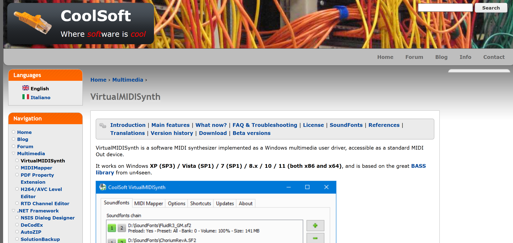

打开官网之后，你可能会疑惑：这里并没有一个瞩目的下载按钮，那么在哪里下载呢？在最上方你能够找到一个导航栏。点击导航栏里的“Download”，即可跳转到网页中与下载相关的内容。


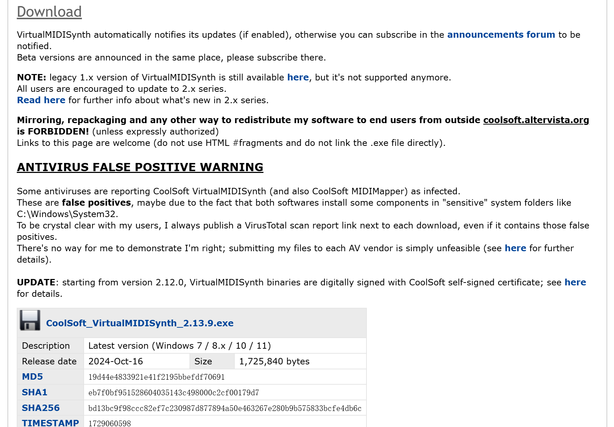

再往下拉一拉就能看到几个推荐的版本的下载，一般是三个，从上到下分别是最新最热版本、先前的版本、能在旧版本设备（Windows
XP/Vista）上安装的版本。你只需要点击它们的蓝色名字（例如：蓝色的“CoolSoft_VirtualMIDISynth_2.13.9.exe”）就会跳转到自动下载页面，开始下载。如果等了一会还是没自动开始下载，请点击页面上蓝色的“click
here”。

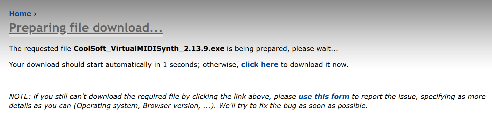

如果你再稍微往下拉一点，还能看到“Beta
versions”的内容。点击页面上蓝色的“Announcements
forum”就会进入到论坛，在论坛中可以看到各种各样有关coolsoft的讨论，也可以查找各种各样的历史版本，还能参与测试版的测试（但需要注册）。

接下来是软件的安装。在exe下载好后双击打开。首先会显示一个选择安装语言的小窗口，一般情况下语言都会默认选择为“中文（简体）”，也可以选择其他的安装语言。选择好后点击“OK”，进入安装程序。

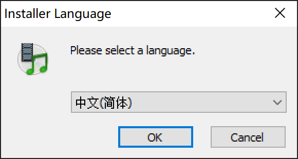

点击两次“下一步”后来到安装目录设置环节，在这里你可以随意设置coolsoft的安装位置。默认位置为C:\Program
Files\VirtualMIDISynth，如果你喜欢，可以安装到D盘、E盘或者其他什么地方。设置好后点击“下一步”就会进行安装。如果有“关闭锁定MIDI驱动的活动进程”之类的提示，可以右键关闭相关的进程，或是手动关闭。在关闭所有占用进程后，“继续”按钮会变为“安装”，就可以进行安装了。

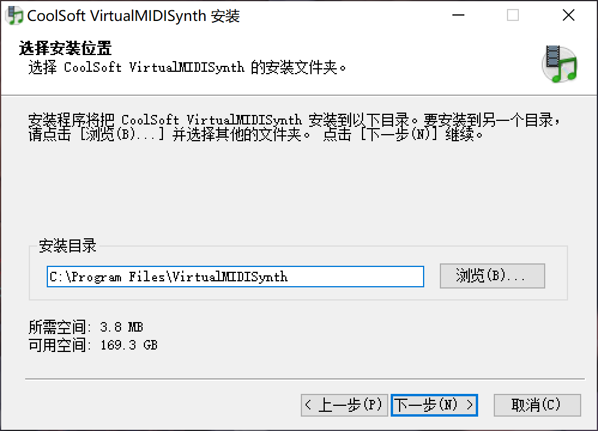

接下来是软件配置。右键菜单栏右下角的coolsoft图标，点击“设置”进入coolsoft的配置界面。一般来说需要配置的内容是“音色库”和“设置”这两项。

首先是音色库。你可以将音色库文件拖入到“音色库链”窗口中来让coolsoft加载音色库，也可以点击右侧绿色的“+”来添加。右侧绿色的“-”可以将音色库从“音色库链”列表中移除。右侧绿色的笔形状按钮则会进入“编辑音色库属性”界面，可以对选中的音色库进行一些修改，譬如修改它的音量（一些音色库音量会很大）。该界面其他内容的使用方法待补充。

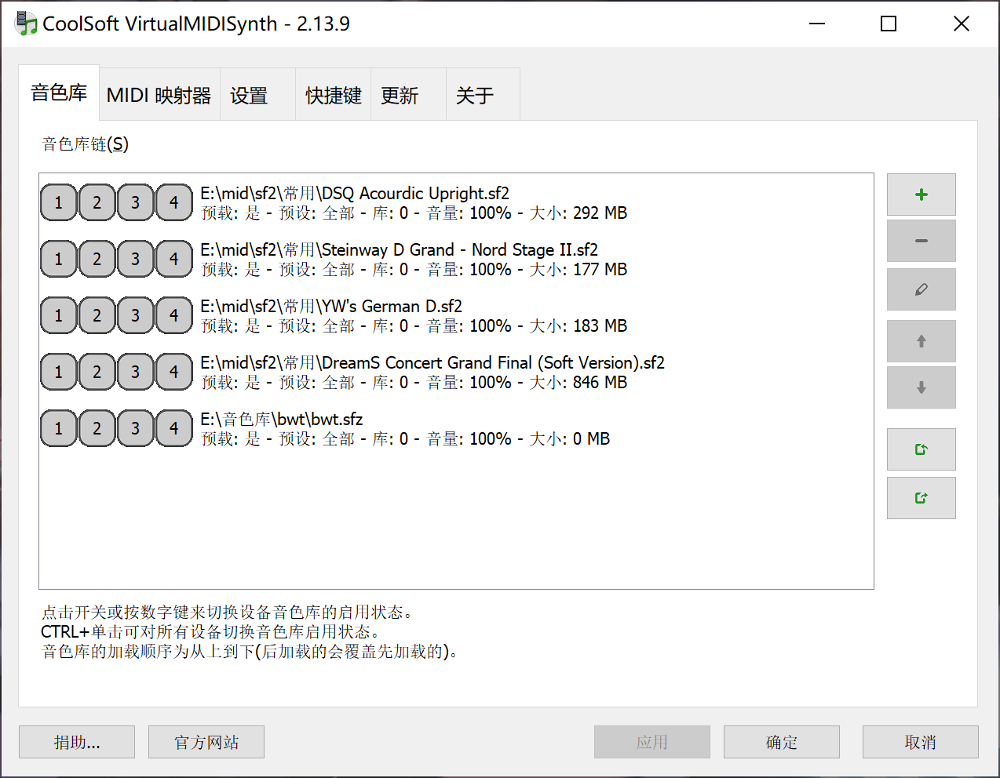

“↑”和“↓”两个按钮可以调整音色库在“音色库链”列表中的顺序。

如果你加载了音色库，现在你可能会注意到音色库前面有一些“1”“2”这样的数字按钮，它们是什么意思呢？其实是coolsoft的音频通道。如果你给音色库点亮了前面的1，那么它就会从“VirtualMIDISynth
\#1”输出，其他同理。

coolsoft最多支持4个通道。你可以给每个通道都单独设置一个音色库（给四个音色库分别点亮1234），也可以给四个通道全部设置成一个音色库（一个音色库前面的1234全部点亮）。那么在这种情况下，会使用哪一个音色库？会使用下面的那个。当然，还是不建议这么干。

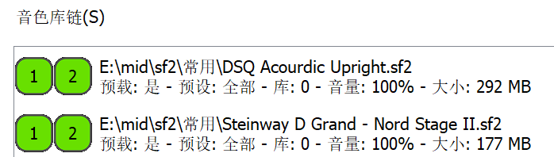

来到设置界面。其他内容可以不用调整（至于它们有什么用可以之后补充），比较需要注意的内容是“设备数量”和“最大复音数”。

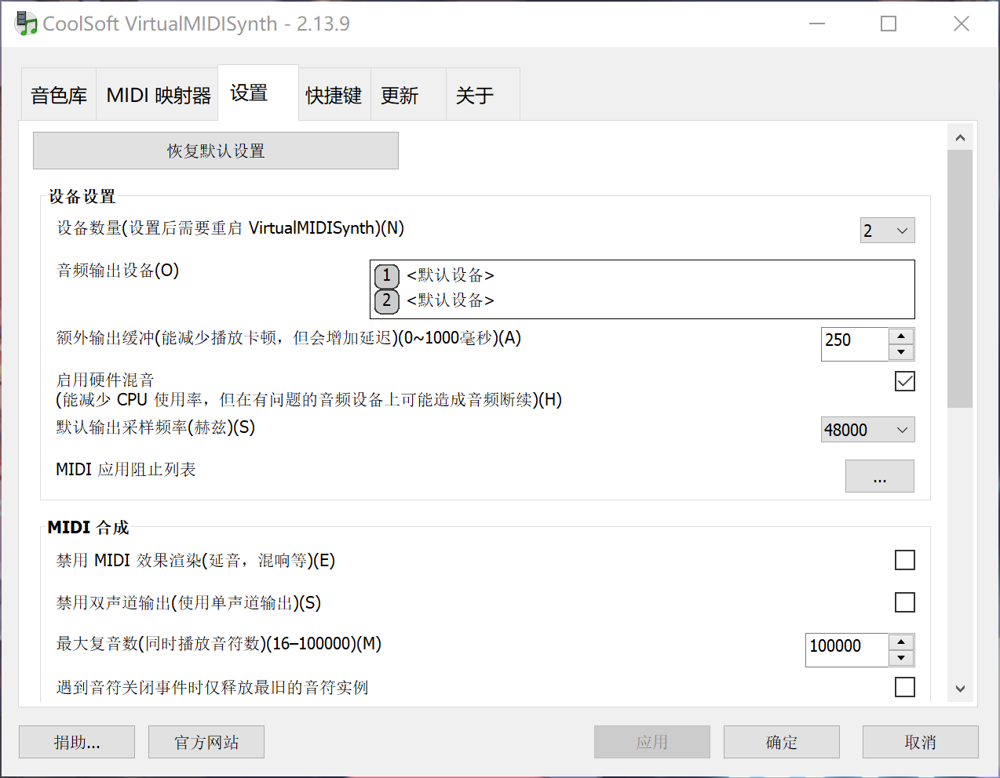

前面提到了coolsoft最多支持4个通道，设备数量可以选择1~4个，我个人喜欢2个，可以根据需要设置数量。设置了设备数量后，在“音色库”界面里，音色库前面的数字按钮就会对应地增加或减少。最大复音数一般直接拉满到100000（你们blacker还真是）。在配置好之后务必记得点击右下角的“应用”（会应用设置但不关闭界面）或“确定”（会应用设置并关闭界面）。这样一来coolsoft就基本配置完成了！

# 2 黑乐谱软件的使用

现在我们开始学习如何使用这些软件。

大家好，我是笔者Kerbinator。以下介绍黑乐谱各类软件的使用，按照环境搭建（波表）、制作播放（MIDI编辑、MIDI播放），音视频渲染（视频渲染，音频转换）的流程，依次进行介绍。

其余的为剩余的圈内常用软件，包括音色库制作，超大型MIDI处理，音符画辅助软件，非绝对必须，但建议使用，能显著提高在黑乐谱方面的创作与欣赏体验。

首先提醒一点，电脑的键鼠与软件优势可以极大地提高黑乐谱制作的效率，所以如果有条件一定要使用一台电脑进行黑乐谱制作，实在不行再用手机搭建黑乐谱制作环境。

以及，虽然名义上称为“黑乐谱”，但实际上黑乐谱一般都不用五线谱创作，因为五线谱处理巨量音符的效率非常低！一般而言，黑乐谱适合于直接的MIDI编辑。

## 2.1 常用波表软件

下面列出常用的波表软件。

### 2.1.1 OmniMIDI

由国际黑乐谱界著名开发者Riccardo
Loi（其圈名为KaleidonKep99）作为高性能波表开发，为BASSMIDI的魔改版本，前身是Keppy's
Synthesizer。

使用方法如下：

**1.List Editor（即为主界面）**

右侧的图标是容易看懂的，点击+可以添加新的音色库，支持.sf2与.sfz格式的文件（后者必须将采样文件夹放在正确的位置，单sfz文件加载会不能出声）。下面的文件将覆盖上面的，即如果上下两个文件拥有相同的preset，则下面的那个发声。默认的List为Shared
List，会随着你的操作实时更新。删除音色库后播放会立即无声；添加音色库后如reload选项开启则可能过几秒才会重新出声，OmniMIDI允许在播放中途变更音色库。

sfz在加载时会弹出一个选项，里面des bank是bank号，des.
preset是preset号。默认的钢琴音色的bank和preset都是0。一般可以des.
bank填0，des. preset填几个数字。

勾选上面的Import specific bank/preset from SoundFont file and assign it
manually则会在导入sf2时也展示导入sfz的选项框。这样导入的sf2，每次只能导入一个音色。

**2.Settings**

每次改动后点击右下角Apply才可以生效。

Change engine提供音频输出方式的选择，一般默认使用Windows Audio Session
API（WASAPI）即可。.wav
mode将会在你设定的一个文件夹里生成.wav文件，同时你的播放将会没有声音。

Change output's bit depth, maximum voices allowed and maximum rendering
time中，bit depth在WASAPI模式下不可修改，.wav mode下可以修改。

Driver voice
limit提供1-100,000复音数。但是据实测，即便5GHz的CPU加上最高性能的MMIDI播放器（可以视为发挥OmniMIDI绝对性能极限）依然是无法承受4000+复音数的核打击的，还是会漏音。对于高性能电脑最高推荐到2000左右，低性能电脑推荐500左右（因此用MMIDI播放亿以上级别的毁乐谱一定会有严重漏音，这个无法避免；但500对轻黑乐谱一般容易承受）。Maximum
rendering
time为允许电脑使用的最大CPU占用率（注意OmniMIDI最多占用4核，因此还是看单核性能），其中特殊的是设置为0%即为不限制，默认为75。

Change engine's buffer/latency settings中，Output sample
rate为输出采样率，最高384000，一般48000或者44100即可。

Change engine's DSP
settings中，第一项允许使用sinc（不是正弦，是辛格差值，coolsoft翻译有错误）插值提高音质。第二项允许midi
cc控制器的使用，对于播放带有midi
cc的黑乐谱必须勾选此选项。第三项勾选后强制单声道渲染。

右下角的volume可以直接拖拽旋钮调节，默认100为满，决定被声卡硬件限幅处理之前（如声卡有此功能）的输出音量。一般而言，声卡会实时执行强制限幅，对于音量太大的midi会导致音频没有爆音但被深度压缩成冰砖，如果发生这种问题可以调小，对于毁乐谱可以调到10这样的很低的数值，从而就可以降低限幅计算的程度。

Synthesizer Settings:

Change how the events should be parsed中第七项ignore notes in between
two velocity
values里面填1-2可以大幅度增加对毁乐谱的性能（对“干净”音符画这将阻止音符画音符被OmniMIDI解析和播放，从而大幅度减轻音频处理压力）。

波表补丁（WinMM Patch）：

由于Windows10（从Win8开始）移除了对MIDI的内部映射支持，在Win10上播放大型黑乐谱的性能相较于Win7会有急剧下降。波表补丁将可以补偿这些问题。

可通过OmniMIDI波表补丁解决此问题，在Extensions的Windows Multimedia
Wrapper里面提供winMM补丁选项。一般选择上面的Standard performance
improvement patch (BM)，可以提供绕过Win10的限制直接调用OmniMIDI的办法。

注1：对于拥有OmniMIDI原生支持的软件（如MMIDI系列，Kiva等），请勿重复打补丁，对性能没有帮助，甚至可能会略微下降。

注2：该补丁的副作用是，对于这些软件，如果有可选波表的选项，在使用上面的(BM)补丁以后，将只有OmniMIDI一个选项可用。

注3：即便使用Win7系统，使用补丁之后性能也会有明显的提升。

### 2.1.2 Coolsoft VirtualMIDISynth

VirtualMIDISynth是一款由Coolsoft开发的波表软件。其性能上限不及Omnimidi，但在2.11版本更新后，最多支持4个独立Port进行MIDI输出。这样做的好处在于，真正实现了对独立CC通道的扩展，由原来的15通道（除去ch.10鼓组通道）扩展到60通道，大大提高了CC控制器的多样性。此外，VMS可以挂载至多4个独立的音色库，这直接提高了很多黑乐谱作品的表现力，也让音色的选择更多样化。

该软件的基本配置方法在1.2.2已经随着下载和安装完成了讲解，如果忘记了的话，可以跳转回去重新阅读。

### 2.1.3 Microsoft GS Wavetable Synth（MSGS）

MSGS即所谓的微软波表，Windows自带的系统波表。没有设置界面，采用GM.dls（网上有与其实质上相同的MicrosoftGS.sf2）作为音源。

性能很差，支持复音数仅有128（甚至不足以良好的表现轻黑乐谱），且卡顿严重。使用的GM.dls某种程度上提供了一种老式黑乐谱的感觉，但在黑乐谱新时代的眼光看来，其钢琴音色质量并不算好。

每一个读过本书或来过黑乐谱界的新人，都应立即放弃使用MSGS，改用高性能的Coolsoft
VirtualMIDISynth或OmniMIDI。对于系统的mediaplayer，或者东方正作红魔乡支持MIDI版的情况，请使用Coolsoft
MIDIMapper将系统默认的波表映射转移到高性能波表上。

### 2.1.4 BASSMIDI

BassMIDI实际上并不是波表本身，而是目前已知几乎所有波表的基础（除了MSGS，FluidSynth和OmniConverter的Xsynth（不成熟）以外）。Coolsoft
VirtualMIDISynth，OmniMIDI等均为基于BASSMIDI制作的波表软件。另外，部分DAW集成的MIDI编辑功能也都是基于BASSMIDI实现的（e.g.
Reaper）。此外，不同版本的BASSMIDI之间听感具有细微差异。

## 2.2 强大的MIDI编辑软件

黑乐谱制作的主要过程，就是MIDI文件的制作，具有最高的重要性。在早期，MIDI文件基本代表了制作的整个流程（做完后若是轻黑乐谱则只需录制一遍即可发布），占制作时间的99%以上。现在，随着后期的重要性提升，音频混音、视频特效制作等的进步，时间占比有所降低，但仍然较高。

### 2.2.1 Domino

Domino是目前中国黑乐谱界最常用的MIDI制作软件。具有方便、高精度、拥有较为传统的菜单栏（易懂性高于DAW）、国人汉化支持、效率较高的优点。截止到2022年以后，约90%的中国黑乐谱作者均使用Domino进行黑乐谱创作。

目前最新版本为v1.45（dev009beta开发版），支持64位，可以用于处理几乎无限大小的MIDI。其加载比约为8~10（内存大小除以MIDI大小），在1.44及以下无64位版本的时代，若不打4GB
patch最多支持3千万音符，打了最多支持7~9千万音符（9千万音符必须卸除波表方可实现）。在老版本中，值得一提的是v1.43的汉化版，存在已久，适合上手。

其主要的缺点在于对导入和导出MIDI的严格限制。Domino对导入的MIDI中的文件错误基本没有容忍能力，如FL11/12导出的一个音轨包含多个通道的MIDI就会在导入时报错，需要通过SynthFont修复（下述）。

关于Domino的详细教程，将会在第三章予以说明，即黑乐谱的制作流程。

### 2.2.2 Cubase/Nuendo/Reaper\*

较为传统的线性DAW。需要强调的是，此类软件的MIDI编辑性能通常弱于Domino，尽管其编辑逻辑是大致相同的。比如，Cubase和Nuendo对于鼠标输入MIDI非常不友好，由于操作非常繁琐且不能自由更改键位，其编辑效率远低于Domino。而且，这二者的性能占用很高，并且ASIO驱动在Cubase和Nuendo当中只能以独占模式工作，在操作，性能优化以及音频预览等方面，均不适合现今黑乐谱的编辑。

Reaper较为特殊，由于软件本身体积小，又得益于其独有的修改鼠标修饰键的功能，可以更改鼠标行为来大大提高工作效率，实际使用时请根据个人操作习惯进行设置（注：Reaper的默认操作逻辑非常反人类，和DAW以及Domino都有不一样的点，不过据笔者（IMT11D）测试，实际上Reaper的MIDI编辑效率在一众DAW当中非常高。按照Domino的操作习惯进行设置，其上限是显著高于Domino的）。

本教程将在第八和第九章节继续介绍Reaper。

### 2.2.3 FL Studio

一种新型的非线性DAW，在当下已经成为最流行的电子音乐制作软件之一（另一个是Ableton
Live）。在黑乐谱中，其制作意义在目前更加偏向于音符画制作。FL对于编辑音符画最大的优势在于其非线性编辑逻辑，可以直接在轨道窗口粘贴Pattern来代替繁琐的复制粘贴工作，同时可以保留特定音符画样式，非常适合大型黑乐谱的音符画制作。（代表作：The
Nuker系列，其中TN4使用FL的Echo Notes重叠了六次音符画，但不建议这样做！）

FL
Studio非常不推荐导入MIDI，导入效率极低，推荐仅用于导出MIDI。同样，也不推荐将MIDI就地渲染为音频（混音情形），其效率显著低于其他DAW。

对于交流音乐状况的情形，值得注意的是FL比Domino的八度标记要高一个。如Domino的A0就是FL中的A1，因此值得注意。

### 2.2.4 SynthFont

一个小型的DAW，可以挂载DLL形式的VST插件。但Synthfont界面较为混乱，因此不推荐使用。

SynthFont的特殊意义在于，SynthFont可以修复由于FL Studio
11/12用于制作MIDI而发生的导出混乱（由于FL是非线性DAW且FL11/12导出逻辑不良导致的）。即Domino报错的“一个音轨包含多个通道
停止读取”。

修复方法非常简单，将待修复MIDI导入SynthFont，出现“Multiple Channels in
One
Track”问“Split”的时候直接一路点击Yes，则软件会在导入的时候将音轨错误自动修复。修复之后，直接利用“保存”MIDI功能将其导出为MIDI文件（可命名为\[原文件名\]-SyF.mid），随后即可正常导入Domino。

### 2.2.5 Wavetone

Wavetone其实是个辅助扒谱的软件。其使用方法为拖入原曲音频后对照音高直接画音符。需要注意，它的MIDI编辑效率非常低下且性能不佳，不建议作为黑化软件使用，仅用于无法耳扒情境下的基础扒谱工作。

## 2.3 MIDI播放软件

MIDI播放软件用于播放MIDI文件为音视频流，通常用于欣赏黑乐谱MIDI。且在渲染器出现之前的古老年代，对MIDI播放软件的播放过程进行录制是制作黑乐谱视频的唯一途径（对大型MIDI可能需要采取减速录制等手段），而目前MIDI播放软件主要用于快捷预览和欣赏黑乐谱作品，出视频已经采用渲染+后期的方式，当然，如果配置足够，录制仍然是很快捷的出视频方式。

### 2.3.1 Piano From Above（PFA）

Piano From
Above，简称PFA，是圈内最常用于黑乐谱播放的软件，且后来国际黑乐谱界大部分的高性能播放/视频渲染软件均基于该风格。

其优点在于干净简洁的瀑布流展示，且在较早期的MIDI播放器中具有较高的性能与128键支持，因而非常流行，成为合录采用的标准播放器。

标准PFA采用白键宽于黑键的底部宽度（而非琴键根部的等宽宽度）作为音符条的宽度，从而白键宽于黑键，但对音符画影响不大，若黑白键均使用或全部使用白键，则音符画可以覆盖全屏，形成清晰的图案。

PFA默认情况下显示88键，如果播放128键的MIDI请将show 88 keys改为show song
keys即可（但其实这不是强制128，只会显示到你的MIDI用到的最大音符范围。如果比如说你的mid只用到了105个键，那么只会显示105个。因此你需要在整个MIDI里面包含一个128键砸琴或在MIDI开头结尾处在制作时在最低和最高（C0和G9）处各点一个音符，以使得PFA一直显示128键）。

另外，你可以通过操作Config文件来修改PFA默认显示的音频范围，只需要将FirstNote和LastNote分别设置为0和127即可。

PFA的画面中，音符条存在质感，从左向右逐渐变暗，使得音符条的质感类似于半圆形的哑光表面；音符条周围有一层非常薄的深色边框，标志出这个音符的范围（如对于一串柱形的同音连按，若没有边界，则你会无法判断它是一个音符还是一串音符。因此，PFA存在所谓“黑音符”情况，这个指的就是由于音符密度太大（音符太短）造成音符条本身的高度低于音符条边框的高度，使得音符条塌缩为一个对应颜色的深色方块，大量这样的黑音符叠起来就成为了所谓“黑块”，在千万级以上的黑乐谱中非常常见，通常看见黑音符就意味着很高的音符密度（以及音符总量）。

### 2.3.2 MIDITrail

MIDITrail是一种二维/三维的视频播放器。

其优点在于支持三维琴键键盘，支持PitchBend（弯音轮）的显示，且自带一个音符数统计、BPM、小节数的底部信息栏。

MIDITrail支持以下模式：

Piano
Roll，2D版本，类似横过来的PFA，但MIDITrail显示的音符是等宽度（无论黑键白键）且没有间隙和边框的。当音符受到弯音轮控制时，受控音符会在钢琴上自行滑动。尽管可以转动视角，但Piano
Roll的音符总是二维的。

Piano Roll
3D，为3D版本。可以转动视角；音符显示区为一个在钢琴前面的长方形，不同的音轨对应不同的前后位置（即垂直于钢琴的方向上）。Piano
Roll 3D的一个优点是可以防止“眼扒”即基于瀑布流的反向工程（因为Piano Roll
3D里面由于透视，音符条已经不在对应琴键的正上方，所以只能大致预判同一音轨内音符的相对音高，找不到音符位置），在原创曲展示的时候可以拿来防御。当音符受到弯音轮控制时，受控音符会在钢琴上滑动，与Piano
Roll 2D相同。

Piano Roll
Rain，为半3D视角。其钢琴类似现实中看到的钢琴除去琴体只留下键盘，然后有一屏伪3D音符从上方瀑布式下落，下落到琴键上就发声。这个“半3D”的意思有两个，第一个，黑键会比白键稍微偏后，第二个，不同音轨之间前后也会稍微错开（但，不会超过半个黑键的长度）。

Piano Roll Rain
3D，为全3D视角。其钢琴类似管风琴只留键盘，默认有16排键，每一排键对应一个音轨。在此模式里，从port
B开始，键会在后面落下，就落不到默认的钢琴上面了（比如王女14.9
Million一直用到port
F那种情况，这些音轨的瀑布流会跑到很远的后方去）。当通道受到弯音轮控制时，这个通道对应的钢琴会整体开始移动，并带动上面的音符条一起移动。

Piano Roll Ring，仅限最新版，即将Piano
Roll（2D）卷起来卷成筒，并加入透视得到此结果。MIDI是二维的。

MIDITrail支持设置ViewPoint，支持3个已保存的ViewPoint点。设置ViewPoint模式下，鼠标会消失，然后可以通过移动鼠标转动视角。如果需要精确的视角数字，请编辑ini文件实现之。

MIDITrail默认支持128键，但通过修改其ini配置文件可以做到令其只显示88键等。Piano
Roll Rain
3D中的显示键盘排数也可以通过配置文件进行修改，比如少于16轨道的不需要那么多键盘，就可以削减。

如需拉伸音符长度，则只需要在Quarter Note Length里面填写400%即可。

MIDITrail支持最多6个port，因此这是为数不多的带有多port支持的播放器。可以利用Coolsoft
VirtualMIDISynth
2代的4个port播放IMT11D等人制作的需要多port才可以正常播放的CC大量使用的MIDI。

但MIDITrail本身并不能很好的显示多个Port的音符。除了A
Port以外的音符都会在琴键后面叠加显示，然而这些音符下方没有琴键。

### 2.3.3 VanBasco’s Karaoke Player（VBKP）

VBKP是一个较早期的MIDI播放软件，其特征为16排抽象为点的钢琴琴键，白键在上，黑键在白键中间的下方，整体实际上就是一排一排钢琴的琴键位置。

因此它具有一个类似像素显示屏的质感，可以利用这一点以与PFA不同的方式来“显示”画面（可以是任意的，相当于像素，而非只能是一张下落的“织物”，但VBKP的音符画与PFA不兼容因此不常用）。国内最为著名的例子即为Zumn的Bad
Apple!! feat.nomico in
VBKP（本人的独立版，2015黑乐谱黑色祭的16个VBKP拼接版）。

值得注意的是，VBKP的音符画逻辑与PFA等完全不兼容，且在瀑布流模式下非常不直观，基本只能靠生成。如果不是编程技术向，请不要试图制作此类MIDI。

## 2.4 好用的视频渲染软件

视频渲染软件是用于将MIDI转化为瀑布流视频的软件，对于大型和超大型MIDI，视频渲染软件可以消除卡顿，减低对于极高配电脑的要求，甚至将无法避免卡顿的超大型MIDI所必须的减速录制变成只需要挂机的渲染，大大节省了工作量。

### 2.4.1 Zenith

Zenith是最常用的视频渲染软件，分为1代（较早期，现在基本已经不再使用，没有Scripted功能）和2代，由澳大利亚人Arduano使用C#编写（因此需要.net支持），并有国人TBL进行魔改制作的Zenith
2
EX（颜色逻辑混乱，如轻黑乐谱有特别指定音轨颜色的需求请使用原版2代）。以下的叙述默认以Zenith的2代为准。

Zenith2提供以下风格：Original，Flat，PFA++，MIDITrail++，NoteCounter，Textured，Scripted。其对应的风格分别为：扁平的类PFA风格，更加扁平的PFA风格，原始PFA风格，MIDITrail风格，音符计数器（一般覆盖在主视频的右上角或左上角，等等），材质包（可以任意修改材质，基于类似PFA的风格，不需要编程能力），Scripted（最大程度的自定义，甚至可以代替部分简易的AE渲染，可以用现成的脚本，也可以使用C#自行编写）。

Zenith通过命令行启动。首先要加载各个Modules，之后加载KDMAPI（因此必须安装OmniMIDI，只能使用此波表），而且Zenith预览也不支持多port的MIDI），之后出现软件主界面。Zenith提供一个预览功能。不能后退，只能快进，放完立即退出。值得注意的是，在Windows
10 21H2以上（不含）条件下，Zenith
2代会在播放1次之后（无论预览还是渲染）再启动播放流的时候立即卡死，之后只能强行结束命令行重启软件，对预览造成很大影响（已知Win10
LTSC 2021无此问题）。这是一个已知的恶性bug。

对于渲染，Zenith需要ffmpeg的协助进行渲染，需要系统变量中存在ffmpeg，或者更简单地，将ffmpeg放在Zenith主目录下，即可直接使用。特别提醒，Zenith是渲染器，不是播放器；使用Zenith制作视频，请点击渲染按钮并使用ffmpeg渲染，而不是使用录屏软件去录制Zenith预览！

下面介绍Zenith当中几个常见的主题。

1.  Original和PFA++

画风方面，Original相对于PFA去除了音符条的质感，直接用纯色填充音符条，但有暗色的边框，以及钢琴的白键也绘制了边界；Flat相当于完全扁平的PFA模式，相对于Original去除了音符边框和白键边界，极为简洁，但不能分辨出连续按下的同音，也不能识别黑音符。

主要参数如下：

Note
Range：音符范围。0-127适用于128键（占满整个MIDI通常键数）的MIDI；88键标准制作的黑乐谱，其范围为21-108；如Bosendorfer的97键（一般用得少，C0-C8），范围为12-108。中央C为60。

Piano
Height：即为钢琴键盘占整个键盘的高度。黑键与白键的高度比值是固定的，不可更改；对于横屏视频，128键，15%左右的键盘高度是最好的；对于88键，需要适当提高一下，到20%左右为宜，可让黑白键本身的长细比基本合理。

2.  MIDITrail++

MIDITrail++实际上相较于MIDITrail本身有得有失，并没有完全依照MIDITrail的逻辑。主要的损失是无法显示Pitch
Bend Motion，而好处是可以显示MIDITrail做不到的“一板音符”（开启3D
notes，开启Vertical Notes的效果），这提升了整体质感。

### 2.4.2 QQS

QQS是由国内的Qishipai，Tweak，TBL等人开发的一款注重效率的简洁风格MIDI渲染器，支持命令行执行（包括手机，对于手机用户的福利）。

效率极高，渲染Bad Apple 5357
Million以现代较高性能的CPU可在一天以内完成，非常迅速（相比之下，UMP大约需要1个月左右）。

没有计数器功能，超大型MIDI的计数器建议使用CJCMCG添加。

### 2.4.3 Ultralight MIDI Player

Ultralight MIDI
Player（UMP）是由日本的PipiraMine使用Java开发的一款视频渲染/黑乐谱播放两用软件，作为渲染器，优点在于自带一个简易的报幕（屏幕中央的白条，显示MIDI文件名），以及右上角的计数器信息（不会出现音符数变成负数的bug）。支持UMP格式的材质包，但不支持Zenith
Scripted那样的高度自定义的风格。

警告：在Windows 10中，该软件在Java 8下运行的速度是Java
16的八倍。由于Windows 11封杀旧版Java，需要使用特殊方法指定UMP使用Java
8工作。

注：UMP对极端高能抗性不好，如Bad Apple 5357
Million的中炮（大约28亿音符，占了总音符数一半左右）。能量极高的MIDI建议使用QQS。

另外，早期版本的UMP作为播放器使用时，不会读取除了力度以外的任何事件，而后的v1.6版本更新才使得UMP具备了解析MIDI
Control Change事件的能力。**（需要测试）**

## 2.5 常用的音频渲染软件

音频渲染软件用于将MIDI渲染为音频（生料）。由于黑乐谱本质是一种音乐，因此音频渲染软件非常重要，直接关系到成品音频的风格与质量。

不同的软件有不同的算法逻辑，以及风格特点，下面将对这些风格进行逐一介绍。

### 2.5.1 Keppy’s MIDI Converter

Keppy’s MIDI Converter，简称KMC，是圈内常用的非实时风格音频渲染软件。

其特色为“电锯音”，即在无波表或模拟随机化的情形下，高频音符音头按下的频率会形成一个与该音符音高明显不同（且无关，只取决于音头敲击频率）的音。

缺点：对复音数抵抗能力很弱，随着复音数的提高，转换速度会不成比例的急剧减慢。开启100000复音数可能让渲染速度减低到几万分之一。且高能过后，KMC很难恢复转换速度，会一直很慢，爬不起来。

KMC拥有“实时模拟”功能（Real-Time
Simulation，默认Standard），但似乎用处不大。

KMC右下角有edit
soundfonts按钮，之后可以添加音色库，和OmniMIDI类似，sfz导入直接就在大钢琴的预设位置，方便黑乐谱的转换。在里面嵌套了一个小按钮，里面有enable
VST
effects，里面有8个槽位可以添加VST效果，但有一个内置的Loudmax（默认为红字off，勾选后变为绿字on），平时主要利用这个。

Loudmax的意义在于，由于KMC是转换不存在声卡硬件限幅，故使用这样的一个基于软件的限幅，可以防止导出音频爆音，但！到了现在，无论任何情况都不建议开启Loudmax，建议32位浮点导出进行后期限幅处理，因为audition等软件均支持“强制限幅”功能，后期强制限幅是可控的。

备注：KMC的loudmax施加顺序是，先施加loudmax，再施加volume%的设置！因此，开了loudmax实际上就完全不可控，大型黑乐谱必被压成冰砖<sup>\[1\]</sup>。比如，你原本的音量峰值是1200%，强制限幅后是100%的冰砖，如果你volume
10%，那么最后会出来一个最大音量为10%（-20db）的小音量冰砖；但如果导出音频后，audition内-20db处理，之后强制限幅，那么你将会得到一个120%最大音量转换出来的不那么冰砖的音频，才是有效的。

1.  冰砖意思是在频谱检视界面上看到的，把0db以下填满的情形就可称之为冰砖。

### 2.5.2 VirtualMIDISynth MIDI Converter

这不是一个单独的软件，是VirtualMIDISynth波表的附带功能。

对于轻黑乐谱，其最大的优点在于转换效果与播放效果几乎完全一致，且对于1亿音符以下的黑乐谱，其转换效率可以显著高于KMC。

最高支持复音数10万，复音数和音色库均在VirtualMIDISynth主程序中设置，使用port
\#1的配置进行转换。

主要的缺点：

1）Coolsoft转换器的进程为实时优先级，挂在后台可能造成鼠标卡顿等问题，并不是很适合静默渲染，较为适合过夜挂机。

2）只能使用单线程转换（然而其实比4线程的KMC要快，所以实际上不是问题）。

3）虽然VirtualMIDISynth的2代本体支持4个ports，但转换仅能使用port
\#1的配置，因此不能直接用于多port的MIDI的音频制作（如IMT11D的部分MIDI等，只能逐个port转换后合并音频，一般做后期混音直接拆分音轨逐条输出后大规模后期合成。）

### 2.5.3 OmniConverter

革命性的真·新时代黑乐谱音频转换器，由Keppy和Arduano出品。

其特征为支持拆分音轨转换，首次让十亿级别的黑乐谱有了发出真声的可能性，可以轻易的支持上亿的总理论最大复音数。对于千万级别的黑乐谱，更是可以做到在当前的高端消费级CPU（如5GHz的R9）上几分钟转好的程度。

其“实时模拟”模式支持两个参数：fps和instability，从而让这个模式拥有了很大的可调性。这个“实时模拟”的意思就是模拟波表实时播放的CPU的~10ms的随机延迟。经过测试，3%-5%就可以将高频音符的音头频率音（即“电锯音”）消除一半左右，所以我个人推荐240和30%（这已经足以消除电锯音并且让高密度的高频音符变得饱满），若instability过大则可能造成音轨之间很不整齐的情况，导致音频听感变得松散。

最新版的Omniconverter已经初步支持包含多个Port的MIDI的直接转换，不过该功能尚不完善，因此还需等待后续更新。目前Omniconverter自6月后暂时停止更新，最新版本为1.0.0
r104 Pre-Release版。

### 2.5.4 转换和直接录制的区别（必读）

**需要注意的是，转换出的音频和直接录制的音频有很大差异，尤其体现在响度控制以及Attack
Time效果（CC072）的处理上，转换出来的音频对比VMS/Omnimidi软件解码的实时音频有很大的杂音，并且听感上会有一种很明显的锯齿感和粗糙感，这一点尤其需要注意。（可能是由于对Note
off处理方法有区别导致的？）**

**一般情况下，为了保证弦乐效果，最理想的音频制作方法就是分轨或分组（把职能相近的音轨放在一起）录制后在Audition或者其他DAW里进行分轨混音。**

**另外，如果进行直接录制后分轨混音，由于CPU本身延迟随机性的存在，不可能做到完美对齐，如果介意的话也可以用上文提到的Omniconverter的实时模拟方法来分轨转换再进行混音。**

## 2.6 音符画辅助软件

可用于辅助音符画的创作，主要对于异形音符画创作帮助很大。

当然，在黑乐谱的历史中曾经短暂承担过不太光彩的角色，即2016黑乐谱黑色祭当时用电音作为仅有的音符部分（因此不符合黑乐谱定义）然后凑数的行为。

### 2.6.1 Image2Midi

简称I2M，顾名思义，即将图形转化为音符画，支持宽度为128像素的位图。

就目前用途状况而言，非常适合添加水印等情形（文字音符画）。

值得注意的是，黑乐谱（PFA类下落式瀑布流的，非VBKP类型）音符画的纵向精度（取决于PPQ）远高于横向精度（最大只有128），因此，对于转换精度不够的问题，可以先将待转换位图纵向拉长若干倍，转换成MIDI后再压缩回去。

## 2.7 超大型MIDI必备软件

虽然目前国内黑乐谱很少出现十位数音符数的黑乐谱，但如果有的话，这些软件还是很有必要学会如何使用的。

### 2.7.1 MMIDI

由Sono出品，目前综合性能最高的MIDI播放器，低配（尤其低内存）电脑绝对福音。推荐将其作为MIDI文件的默认打开方式，以避免点击大型MIDI的时候打开卡死。

最大的优点：极高性能，而且内存加载比为1:1，简而言之，只要除去Windows系统占用后你的可用内存大于MIDI大小，你就能打开！

相应的缺点：MMIDI对于虚拟内存基本没有任何容忍能力。只要调用到虚拟内存，就会出现严重卡顿问题。

MMIDI界面极其简洁，简洁到几乎可以称之为什么都没有的程度。软件体积非常小（只有数十KB），连图标都没有（Windows默认程序图标），直接使用C语言写成。

MMIDI有多个分支，常用的主要是mmvis，mmvis-dfb，以及MPGL。

mmvis：控制台版本。所有的“音符”其实都是文字（没想到吧，而且这些文字是可以跟dos窗口一样选中的），也因此这个窗口本质不是图形窗口，无法使用bandicam“游戏录制”等DX或GL接口录制，如果必须录制，则只建议使用窗口区域录制。右下角有两个数字，一大一小，其中小的数字即为音符数，当进度走完的时候大数字的大小约为小数字的10倍（但由于播放完成后窗口会立即闪退，所以如果不是区域录屏会看不见最终音符数）

和PFA类播放器不同，mmvis的显示方式是这样的：当一个音符note
on（被按下）的时候，该音符从顶部出现；当一个音符note
off（抬起）的时候，该音符条脱离顶部开始整体下落。这和PFA播放器音符条触及钢琴时发声略有区别（实际上是对应了从屏幕顶部下落到底部的时间差），可以认为是没有前摇。

mmvis打开软件后会立即弹出一个打开文件窗口让你选择MIDI文件（或者经由MIDI作为默认文件打开方式打开），加载完成后就会立即开始播放，播放完成后就会立即退出，没有任何多余的时间。

建议将控制台版本的mmvis作为MIDI文件的默认打开方式。

MMVis-dfb：类PFA风格的播放器（其实from below就是from
above的反义词，剩下的自行体会吧）打开后会显示“Ctrl+O Open
File”，按下快捷键会弹出打开窗口。这就是类似PFA的界面和一个大大的PAUSED。如果你感觉里面的字体十分劣质，那就对了，因为这些字体全都是硬编码到程序里的，根本就没有字体文件。

以及，该播放器在面对高能和大量重叠音符的时候可能会出现一个bug：接近钢琴的地方，部分音符条提前消失。以及，面对大量单一高密度音符（如When
ooo 000 isn’t
home）时，软件会严重减速。卡顿度可以从左上角的renderlag看出，数字越大卡顿越严重，而闲置（几乎没有音符）时renderlag为一个较小的负值。

注意：需要同一文件夹下有OpenTK.dll方可运行，否则会收到作者的警告弹窗。

注意2：部分Win11和10电脑里面会报错long message not
available，如果出现这个错误，那么很不幸，你的电脑将无法运行MMVis-dfb，开始播放就会直接闪退。

MPGL：性能最高的版本。这个版本分为两代，初代MPGL是满饱和度的16色色块，没有钢琴键盘，显示类似mmvis（命令行版）但是图形是真正由GL渲染的（不是文本）。二代MPGL为钢琴键盘+类PFA的材质（但和PFA的材质不同，该材质看起来像是反光的，泛白）。

二代MPGL有一个Sono提供的“ooo 000
edition”，需要使用Sono提供的代码复制到DEV-C++（或者其他IDE里面），编译运行，随后打开该文件，并确保你的系统可以调用ffmpeg，随后将通过Rawvideo管道渲染一个720p的视频出来。效率极高，远超几乎所有的渲染器，但音符长度、播放风格等全部不可调。

MPGL的原始分辨率为720p，且初代MPGL不能最大化。

**警告：所有Sono系列的播放器均不支持后退！只能往前播放或往前快进跳过几秒，如果想要后退则只能重新打开。类似Zenith的预览模式。**

### 2.7.2 CJC Toolbox

由国人CJC（花抄抄大爷，现网名超盐酸钠）开发的巨型MIDI处理工具。包括三个子软件：

1.  CJCAMM：优质的Merge类软件，一个为巨型MIDI工程开发的拼合工具，特点是快速高效与便利，支持少量自定义调整，譬如删除或转移事件、更改分辨率（PPQ）、整理Conductor轨道、手动调整拼合位置等此外。附带了一些小功能：删除低力度音符的反黑功能，和读取单个MIDI的音符数等基本信息。

    CJCAMM的拼合方式是直接堆叠轨道，会导致音轨数量激增，并且某些旧版本导出的MIDI极容易出错，推荐使用最新版CJC
    Toolbox Reborn内含的版本1.6.1.0。

2.  CJCMCG：简单的计数君生成器，用于在黑乐谱视频里显示实时变化的MIDI信息，功能与Zenith的NoteCounter模块基本重合。CJC计数器的优点是采用了自研的natsulang语言描述生成样式，支持自定义表达式和比Zenith更丰富的变量；并且导出结果是已经附带透明度通道的mov视频，避免了新手使用Zenith不懂导出透明度通道的悲剧。缺点是不支持抗锯齿，不支持预览视频内字号，并且作者自己准备的预设也没展示出natsulang的花样玩法，仍然等待有心之人开发。

3.  CJCOR：高质量的MIDI音符去重器。Overlap
    Remover可以是一种用于减轻巨型MIDI渲染压力的工具。大型和超大型MIDI通常有互相重叠遮挡的音符画，导致渲染压力远大于画面显示效果。在渲染视频前，使用OR软件处理MIDI，软件会整理出被渲染器保留在最上层的音符，清除被掩盖的音符。大型MIDI经过此类处理后，音符数量一般会减少30%-90%，相当于将渲染速度提高了数倍，且画面效果与直接渲染相比相差无几。CJCOR同时提供了高音质模式，去重时优先保留力度更高的音符。

    需要注意的是，高音质模式无法阻止高力度音符本身互相重叠时被去除。如果一个MIDI含有大量内容重复的旋律齐奏，那么无论是CJCOR的高音质模式，还是SAFOR的SOR模式，都不能保证去重后旋律完好如初。

### 2.7.3 Kiva

基于部分预渲染的高性能播放器。

优点：基本不会卡顿。在高性能播放器中支持后退。

拥有特殊的88-128键动态转换机制，当检测到MIDI在88键范围内的时候键盘显示范围为88键，超出时变换为128键。

对于特意为此优化的MIDI而言，这样可以提供在前面的平静段（88键）和后面的高潮段（持续占用128键）都拥有良好的视觉效果。但缺点也很明显，如果MIDI不是刻意为此优化可能出现画面不断变大变小导致看起来抽风的情况，建议关闭此功能。（此功能可以用视频“做”出来，只需使用pr关键帧即可。）

Kiva可以选择采用Pre-Render和WinMM的方式来呈现音频。使用WinMM模式时，默认启用当前正在使用的波表（VMS或者Omnimidi）。音频为实时渲染。使用Pre-Render模式则会在播放时渲染音频。

Pre-Render模式下，需要手动选择音色库并规定Voices总数（可视作Polyphony，取值范围为0-5000）。通常来说，更高的Voices总数代表更多的细节以及更好的音频质量。但由于Kiva本身性能优化不佳，不建议在超大型黑乐谱上使用过高的Voices值，因为这会极大程度上拖慢音频渲染过程，并有很大概率使音频在播放时卡顿。一般而言，建议将Voices值设定在2500-3000左右。

缺点：Kiva拥有巨大的内存加载比（占用通常超过内存的8倍，而且随着MIDI大小的增加，占用会达到13倍甚至20倍以上，从而造成内存需求爆炸性的增长），因此对电脑配置中的内存容量要求非常高。在打开大型黑乐谱之前，请三思，并估计好你的内存。

可以使用大量固态硬盘缓存，但是这样非常伤硬盘，因此极为不建议。（用MMIDI它不香吗.mp4）

### 2.7.4 PFA Viz

由Khang制作的PFA优化版。

主要改动有：

1.  由原版的单线程改进为多线程，且默认调用KDMAPI，极大提升了PFA抵御高密度音符冲击的能力。

2.  大幅优化MIDI加载效率，秒开千万音符再也不是梦。

3.  取消了PFA必须的library，直接提供打开文件的窗口选项，打开后直接准备播放。

4.  偏好设置内添加了更多样的自定义设置，颜色主题默认关联原版PFA。

右上角有VQ Capacity，借此可以区分Viz与原版PFA。

注：禁止使用PFA Viz冒充原版PFA参与合录。

## 2.8 音色库制作软件

音色库制作软件用于制作音色库（.sf2）文件。黑乐谱界内部，由于对音质的追求产生了矛盾：普通的全乐器音色库的钢琴质量通常不佳，VSTi太卡而且其内部共鸣计算对黑乐谱实际上可能会画蛇添足。因此，通常黑乐谱界会对一批特定的采样（可以来源于高档VSTi，也可以来自于三角钢琴或立式钢琴的录制）进行打包，将其封装为音色库文件。

.sfz文件通常不需要特殊软件制作，直接将采样（.wav格式，对于需要压缩体积的情形也可使用.ogg，但不会减少音色库带来的预加载内存占用）全部放入一个文件夹，用相应的语法将采样和效果都定义在文本文件中并将后缀改为.sfz即可生效。

### 2.8.1 Polyphone

Polyphone是圈内最常用的黑乐谱音色库编辑软件。分为两代版本，Polyphone
1.x和2.x，其中1.x版本最高为1.9，目前最新版本为v2.5.1。2代是类似浏览器的UI，1.9则是较为常规的软件UI。其优点主要是支持批量操作，对于制作音色库可以大幅度提高效率（降低操作量）。

其详细操作将会在第六章进行介绍，此处不再展开。

### 2.8.2 Viena

其实际能力高于Polyphone。可以打开和编辑.dls文件（即微软波表使用的音色库格式，但因为微软波表性能很差故用处不大）。

但由于不支持批量复制粘贴的编辑操作，且音色库编辑使用的重复操作数非常高，会造成大量人工操作，因此不推荐使用。

其详细操作将会在第六章进行介绍，此处不再展开。

# 3 黑乐谱MIDI制作：音频部分

黑乐谱制作当中，音频部分是最重要也是相对最耗费时间的部分（超大型黑乐谱除外）。特别是随着黑乐谱的不断发展，在轻黑乐谱逐渐成为主流，以及音频表现效果不断进步的背景下，明确一些音频部分编写的基本要领是必须的。在这一部分中，本教程会以图文形式详细介绍具体的操作流程。

## 3.1 音频制作基础

通常，音频制作对于设备没有过多的需求。考虑到社区内绝大多数用户都使用Domino制作黑乐谱，本篇教程的演示将全部使用Domino完成。当然，你可以使用其他DAW来完成编排工作，其操作原理大同小异，这里更多地是为初学者明确相关概念。

### 3.1.1 认识钢琴卷帘

黑乐谱的编写，也就是MIDI编辑，首先需要认识钢琴卷帘。

一般而言，钢琴卷帘长这样：（注：为了防止排版有问题我横向放置了，实际视图是逆时针旋转90°的）

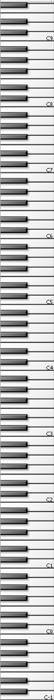

这里标注了MIDI的音符范围，即C-1到G9。不同于钢琴的88键（A0-C8），MIDI总共有128键。在播放器和渲染器中，这个键盘是横向放置的。

一般而言，常见的视频渲染软件都是默认展示全部128键的，不过仍有部分软件需要更改默认设置（默认为88键，比如原版PFA，Synthesia以及Embers）。

下面是钢琴窗视图：

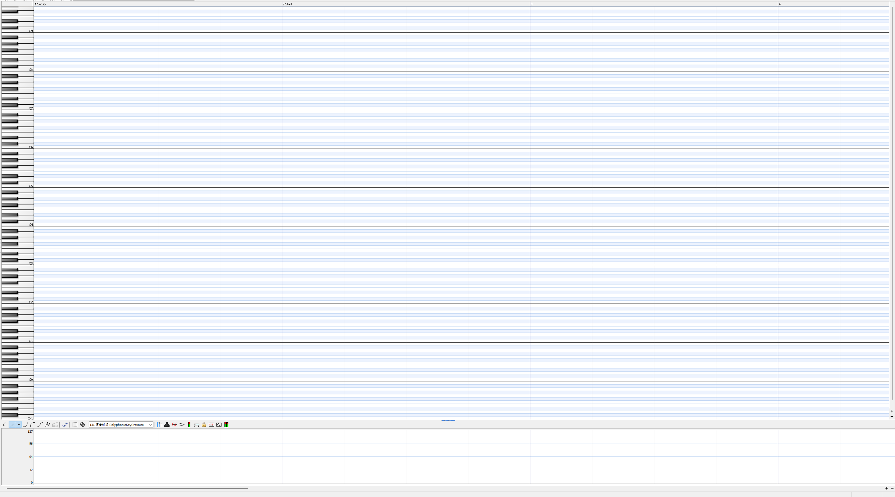

钢琴窗视图分为两个部分。上面，也就是主要部分，用于音符的编辑。下面则是控制力度以及CC事件的部分，也可统称为事件图形。关于力度控制以及CC控制器的使用将在后面做详细介绍。

在Domino的钢琴卷帘视图当中，可以点击屏幕右侧的“+”“-”标志来放大或缩小钢琴卷帘的单键宽度。使用滚轮可将钢琴卷帘上下滚动（如果没有缩放到使钢琴卷帘全部显示出来的话）。

此外，按住“Ctrl”键并使用鼠标滚轮上下滚动将会在音轨之间（上一轨道或者下一轨道）滚动切换。此时播放位置和视觉焦点不会改变，你可以通过这个方式快捷查看不同音轨在同一位置的要素。

按住鼠标中键，可对钢琴窗视图进行手型拖拽。

### 3.1.2 认识总轨和演奏监视器

**这两个界面可以通过两个方式调取：**

对于总轨界面，按下键盘上的“Tab”键即可在单个轨道钢琴窗总轨界面之间切换。对于混音台界面，按下“Shift+Tab”即可切换。注意：切换界面时，默认返回到当前选中的单轨界面，如果需要更改选中轨道，再次回到总轨界面即可。

你也可以通过Domino上方的快捷栏来更改当前视图。

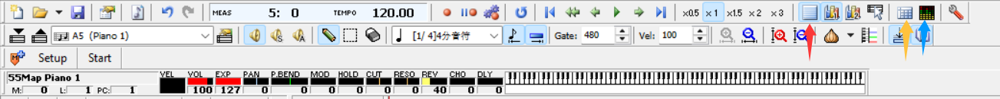

红色箭头所指，代表你当前处于单轨操作界面。按下橙色箭头所指按钮即可切换到总轨界面，按下蓝色箭头所指的按钮即可来到混音台界面。

哦！顺带一提，这个界面的样式可以修改。目前我所展示的是原始界面，后续图中展示的界面可能会和上图有一定的区别。不过，它们的功能没有差异，因此只需要按照图文指示进行操作就可以了。

接下来来到总轨界面，用来检视工程的整体情况。

总轨界面长这样：


单击左侧音轨即可切换选中的轨道。单击音轨右侧的小喇叭图标可以静音特定轨道，再次单击即可切换为正常模式。右键单击特定轨道的小喇叭图标即可使该轨道独奏（其余轨道不发声），再次右键单击即取消独奏，所有轨道发声。无论何种情况下，对任意一轨道双击右键切换静音状态，即可解除所有轨道的静音模式，此时所有轨道发声。

和单轨钢琴窗界面一样，按住中键可以手型拖拽总轨界面。

总轨界面没有画笔工具（喂，这根本没法画音符吧），仅能使用框选和橡皮擦工具。

左键拖拽可框选多个轨道的要素。（或批量删除要素，如果当前使用的是橡皮擦工具的话）注意，框选工具在总轨界面默认会选中所有事件。这包括速度标记，注释，音符，MIDI
CC等任何在事件栏中可见的事件。（稍后作详细介绍）

对于框选的框框本身，框选后它会留在原地，可以单击右键对选中区域编辑，也可以左键按住框框本体进行移动。按住Ctrl键并拖拽选框会在移动选框后复制全部选中的要素。框选工具的一些操作规则也适用于单轨钢琴窗界面，这将在MIDI编辑部分再次提及。

此外，你可以一次性选择多个轨道。选择轨道时，按住Ctrl键并左键单击即可选取多个轨道，按住Shift并左键单击即可选取一定范围内的所有轨道。

接下来介绍演奏监视器界面。它长这样：

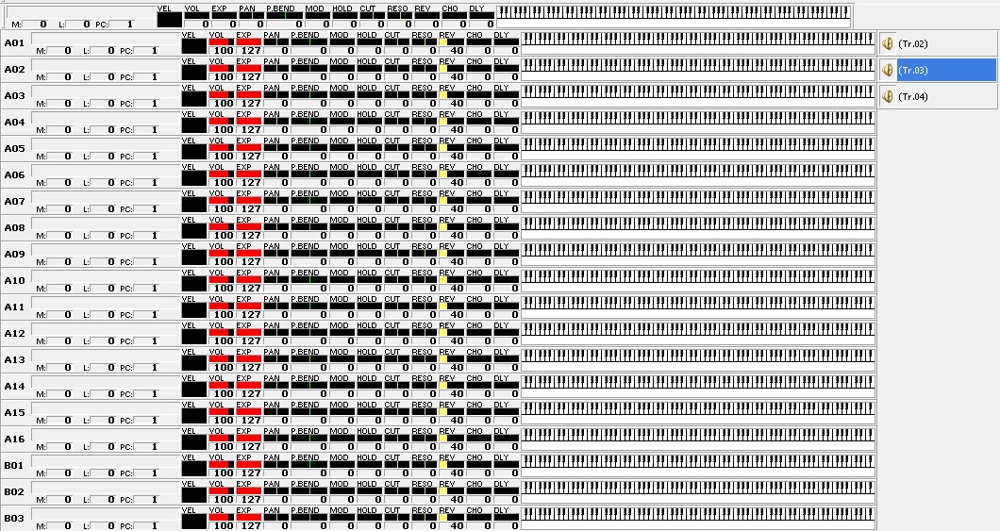

这个界面其实在操作层面上没有什么功能，更多的是为了检查CC控制器是否冲突（之后介绍）和轨道所处通道的。它可以比较直观地反映一些轨道的自动化参数，其界面非常像VBKP的播放界面。

左侧的“A-XX”“B-XX”代表了当前轨道的端口号和通道编号。端口按字母顺序从A-P排列，共16个端口；通道按数字顺序1-16排列，其中10通道默认为鼓组通道，其读取规则和编辑方法和普通的乐器通道有差异，一般情况下默认不使用（插一嘴，其实你可以通过CC259来规定该通道是旋律还是鼓组）。对于初学者而言，为了避免MIDI本身出现问题，在不涉及鼓组编辑的情况下，都应该避免10号通道的使用。

右侧的“（Tr. 01）”“（Tr.
02）”等代表特定一个轨道所使用的通道以及端口。（Conductor轨道在本视图中不显示，之后会对Conductor展开介绍）。

### 3.1.3 绘制，删除音符，量化

编辑MIDI是Domino的强项。核心工具有三个：画笔工具，框选工具，橡皮擦工具。

首先介绍画笔工具。画笔工具，顾名思义，用来放置或删除音符。

画笔工具在操作层面上非常易于理解。左键单击即可放置音符，就像这样：

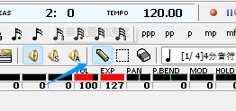

蓝色箭头所指就是画笔工具，选上它，在钢琴窗里面点几下，恭喜你！第一个音符在Domino里面降生了！好耶！

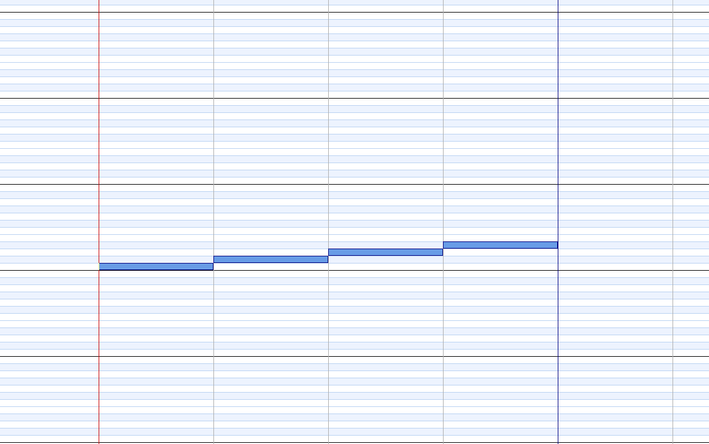

“主播主播，你的左键单击固然很厉害，但还是太吃容错了，有没有不用切换橡皮擦就能删掉音符的办法？”

有的，兄弟，有的，只需要在你要删除音符的位置双击左键......

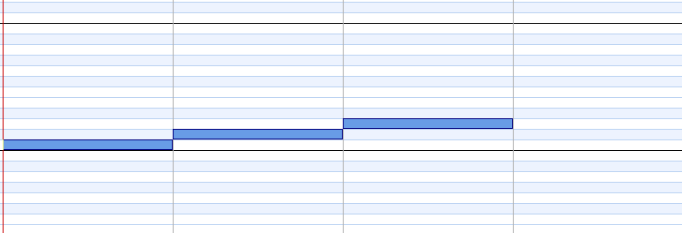

诶！它消失了！

“道理我都懂，但是音符为什么都一样长呢？”

别急嘛，只需要抓住音符的尾巴或者脑袋，轻轻拖拽......

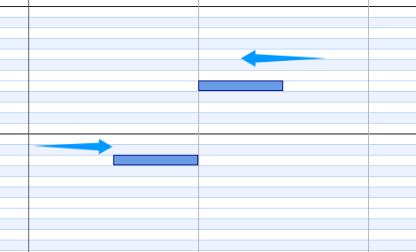

恭喜你学会了控制音符长度！

画笔工具还有一个小技巧：你可以在放下音符时拖拽它来改变它所处的位置。

“诶不对啊，为什么你的音符这么整齐？我的点出来怎么是这样的？”

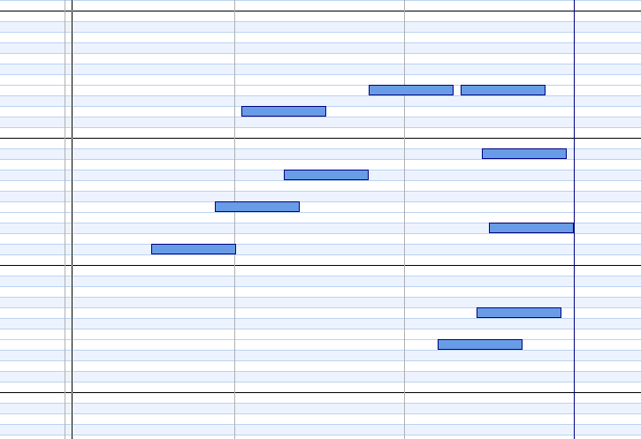

看来你忘了一个至关重要的东西：量化！

轻轻敲一下它：

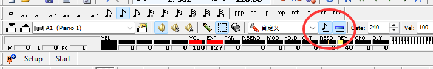

把这两个都打开，就能让音符变整齐了！

你也可以通过这两个按钮左边的选项框来设置量化程度。

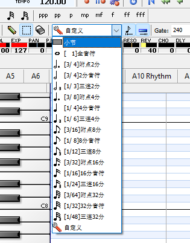

量化程度是指音符对齐的最小单位。比如，如果将其设置为全音符，那么所有点击放置的音符长度都只能以整个小节为单位，而且每个音符能且仅能处在小节线上。

出于实际操作的便携性和普适性，一般不使用附点音符进行对齐。

选择“自定义”选项，会弹出这样的窗口：

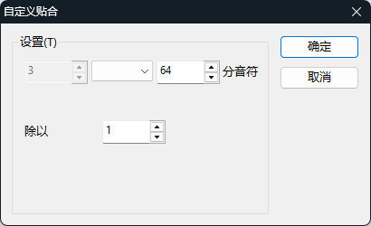

这里提供了更灵活的量化选项。一般而言，如果需要快速输入128分音符，推荐使用该功能。在实际操作中，左图列表中的基础量化预设是足够的，不需要花费时间进行额外调整（因为音符长度可以批量修改，此外手动精修的工作量并不大，而三连音部分也不需要在“自定义贴合”窗口中设置）。

“诶你刚才提到了批量修改？”

“啊这个啊，这个可有的解释了，也是Domino**最强大的**功能之一。你先随便写一小段出来，我听听怎么回事。”

“写好了，你听听！”

？？？？？

“咋了？”

“你没发现你的MIDI没有声音么？”

“啊？”

“你才知道啊！（悲）”

### 3.1.4 音源定义文件，MIDI输出设备以及波表环境配置

好了好了不闹了，继续。

首先，按F12进入“首选项界面”（也可以点击蓝色箭头所指的图标）。

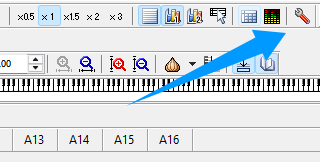

首选项界面打开是这样子的：

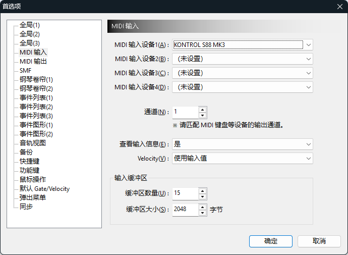

这一部分是MIDI输入部分。一般情况下，黑乐谱的制作不需要使用外置MIDI输入设备。（两个原因，一是普遍这类设备价格不美丽，二是你都写黑乐谱了为啥还要费劲自己弹琴awa）不过，如果需要使用，下拉MIDI输入设备栏，选择你的外置设备即可。其余设置可保持默认。

下面将首先介绍最重要的MIDI输出部分。

进入“MIDI输出”选项：

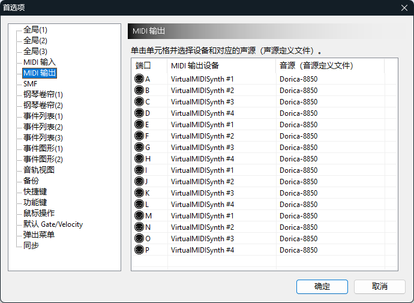

如图所示，这是适用于需要多个Port的情况（**这张图你之后还会用到**）。如果只需要一个Port，将A到P的所有Port全部设定为同样的MIDI输出设备即可。

MIDI输出设备，也就是波表，可以选择VirtualMIDISynth或者Omnimidi（再三强调，不要使用MSGS），音源（音源定义文件）一栏打开Roland文件夹，选择SC-88Pro或者SC-8850。这里笔者推荐使用汉化过后的Dorica-8850。

音源定义文件本身直接定义了CC编号和实际效果的的关系。有些时候，不同的音源定义文件可能在CC编号上有差异（举个例子，SC-8850当中Pitchbend事件的CC编号为130，而GM
Level 2当中则是134而非130）。

完成以上步骤后，波表就成功的挂载到了Domino上。此时，如果波表加载了音色库，MIDI就会正确发声。如果尚未加载音色，打开波表主界面，从文件夹中拖入音色库文件（sf2或者sfz）并勾选启用即可。

**这里需要说明一个重要事项：波表不能加载大于4GiB的音色库，尝试加载则会直接卡死并有概率造成不可逆的崩溃死循环（不能通过强制重启软件，也不能通过重启电脑解决），只能强制卸载波表本体并重新安装。为了避免不必要的麻烦，请注意导入的音色库体积。**

最后，在正式开始黑乐谱制作之前，请修改以下设置（以VirtualMIDISynth举例）：

√将设备数调整为4（可选，仅VMS可用，需重启波表）；

√检查当前是否使用了正确的音频设备，并确保音频设备正常工作；

√将额外输出缓冲调整到0~50；

√调整采样率为48000Hz；

√启用硬件混音；

√将最大复音数调整到1500（参考值，标准为音频部分直接播放不卡顿）；

√使用正弦差值采样混音代替线性插值（如果CPU占用率过高，可以关闭）；

√解除CPU最大使用率限制（设为0即可）；

√调整默认GS/XG
MIDI效果参考值，启用Reverb和Chorus效果，并将Reverb和Chorus的最大值设定为127。

**完成以上步骤，恭喜你完成了黑乐谱的基本音频环境设置！**

**Domino，启动！**

“诶刚才是不是已经启动了？”

“那你别管.jpg”

## 3.2 MIDI编辑

欢迎来到MIDI编辑板块。从这一部分开始，你将正式开始编写你的第一个MIDI。**提示：这部分内容是基础中的基础，如果你有信心独立探索并完成的话，可以跳过你认为不需要阅读的内容。**

在开始MIDI编辑之前，我需要先讲清楚MIDI文件的一些基本特性，以及一些基本参数的修改和一些前期准备工作的流程。

首先，来到屏幕左上角，打开“文件属性”选项（蓝色箭头所指）。

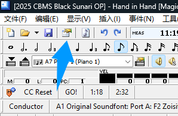

打开后的界面长这样：

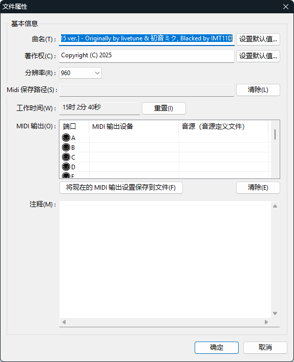

首先，曲名和著作权一栏可以自由输入（但尽量不要输入特殊字符，如果你不想让曲名变成乱码的话）。著作权一栏默认字符如上图所示，曲名为空白。

分辨率，也称PPQ或PPQN（它大名叫Pulse Per Quarter
Note）。这个值的具体含义是指，把一个四分音符分为若干份，规定MIDI信号的最小单位。这个最小单位我们把它称作Tick。规定1
Tick为MIDI文件中容许的最小时值。PPQ值越大，代表MIDI越精细。但相应的也会增加处理时的卡顿程度。

Domino当中默认的分辨率为480，也就是一个四分音符的长度为480
Tick。常见DAW，比如FL
Studio当中的PPQ值，默认为96。Domino当中可修改的分辨率最高为1920。

需要特别说明一点，如果有制作超大型黑乐谱的需求，请一律将MIDI分辨率调到1920。更高的PPQ值可以通过修改器实现，但过高的PPQ值不仅容易造成卡顿，还会影响长音符的表现效果（Domino默认音符长度**最高**为65536
Tick。比如，如果PPQ为32768，那么能够允许的最长音符仅有2拍，而这是不合理的）。因此，除非有特殊需求，否则**在任何情况下都强烈不建议用修改器将PPQ调整到过高的数值**，Domino默认提供的数值是足够的。

**注意！请在开始任何编辑工作前检查MIDI的分辨率！此外，只要编写工作开始，不要以任何形式修改MIDI本身的分辨率，这极有可能造成工程损坏或内容丢失！无论如何，请不要这样做！**

MIDI保存路径默认为空。默认情况下，按下Ctrl+S键进行保存时，软件会询问保存路径。这一栏可自行设置，也可空置。

工作时间代表你爆肝了多久。不多做解释。

MIDI输出部分留空。

**注释部分在MIDI当中不会保存，仅在Domino工程文件（.dms格式）当中可见。**

保存工程时默认使用.dms格式，如果需要保存MIDI，点击“文件”选项，选择导出MIDI即可。覆盖导出MIDI将在原路径覆盖原有MIDI进行导出。

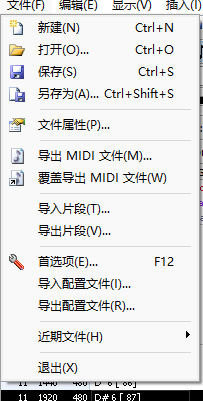

这样，你的准备工作就做完了。现在开始MIDI编辑。

### 3.2.1 MIDI编辑基本操作方法

还记得我们刚才提到的三个重要的工具：画笔工具，框选工具，橡皮擦工具吗？

我们先从这三者说起，之后再在它们的基础上拓展更多实用工具。

在3.1当中你应当学会了画笔工具的基本使用方法（忘了的话记得回去复习）。这次，我们从框选工具入手。

回到工具栏，点击“选择”工具：

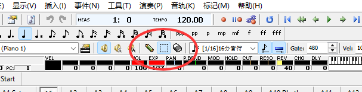

选择工具默认为矩形选择。这时，回到钢琴窗界面，将你画好的音符框选：

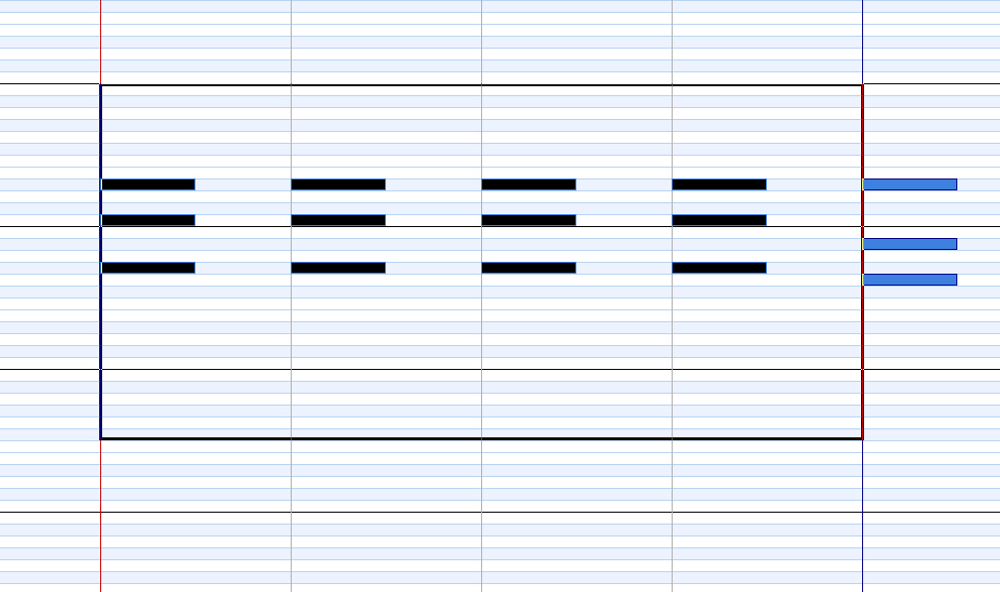

大功告成！上图选择了一个小节的四个和弦。

框选工具和画笔工具绘制音符一样，也会受量化程度的影响。框选工具会根据你所选择的量化程度进行水平方向的自动对齐。竖直方向的音高都是固定的，因此没有也不需要对齐功能，只需要在拖动选择工具的时候注意起点和终点即可。

框选完成后，鼠标将变为四向箭头的样式，在选框内部按住左键，即可对框选对象进行手型拖拽。同样，拖拽时的选框也会受量化影响。

左键进行框选时，或按住左键拖拽选框时，按住Ctrl键即可解除量化限制。

按住Ctrl键可允许同时框选多个区域，这些区域之间可相互重合。当存在选框时，按住Ctrl键并拖拽选框会复制框内全部音符，并将对象复制到拖拽完成的位置。

你可以对选项框单击右键，展开菜单如下：

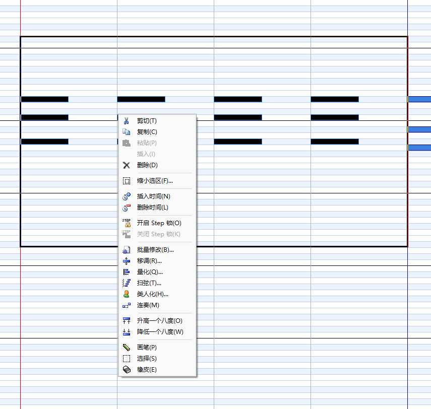

接下来介绍橡皮擦工具。

橡皮擦工具在工具栏中处在选择工具的右侧（见上一页图）。点击即可。

橡皮擦工具的操作逻辑和框选工具非常相似。和框选工具一样，橡皮擦工具也会受量化的影响。左键进行框选时，按住Ctrl键即可解除量化限制。使用时，左键框选需要擦除的部分，松开左键后即可完成擦除操作。

一般而言，由于框选工具比橡皮擦工具更加灵活（因为你完全可以在框选之后按下Delete键进行删除操作，不需要手动切换橡皮擦，而且橡皮擦有更高的误操作概率），橡皮擦工具的使用频率很低。对于黑乐谱的创作而言，尤其是不涉及旋律部分或者CC曲线的创作，框选工具的使用率是远高于画笔工具的。

“诶，你刚才是不是忘了告诉我这个是什么？”

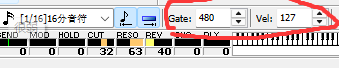

“哦！对！画笔工具还有一个重要的功能！图中的两个参数规定了你点击放置的音符的默认长度和默认力度。你可以手动修改它们的值，也可以在画笔工具中右键任何一个音符来复制它的长度和力度属性，作为左键单击绘制音符的默认属性。此外，默认的音符长度和力度也会随着上一个绘制或编辑的音符而改变。比如，你改变了一个音符的长度，那么下一个你左键单击放下去的音符，会**继承**上一个音符经过修改后的长度，也会继承那个音符的力度。这个操作逻辑和其他DAW有明显区别。”

### 3.2.2 编辑MIDI的实用工具

了解完三个基本的操作工具，接下来，我们要首先了解框选之后的右键菜单。以下介绍的所有工具都可以在上面这张图中找到，阅读这一段时，不妨打开Domino并跟随操作哦！

**首先，介绍第一个工具：批量修改。**

在选项框内点击右键，选择或按下键盘B键进入“批量修改”窗口。

批量修改窗口长这样：

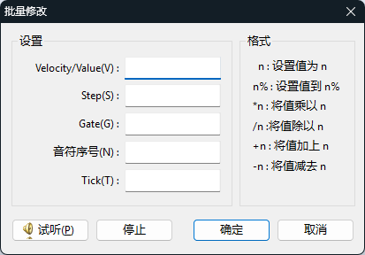

非常好理解，对吧？

啊，也不太对，你得先明白这几个英文单词说的都是什么。

第一个，Velocity/Value。这个代表力度**（不是速度！也不是取值！）**，通俗点解释就是音符的强弱。当然，和直接调整音符的音量有明显的区别（后续还会提到）。在Domino当中，力度的取值范围为1-127间的整数值。

第二个Step代表时值。不过这个时值并不等同于传统音乐上的时值。Step参数只表示和后一个音之间相差的时值，而不是音符长度所表示的时值。

第三个Gate代表音符长度。音符长度对应乐谱中实际的音符时值和MIDI本身的PPQ有关，比如，PPQ为480的MIDI当中，Gate为240的一个音符就是一个八分音符。

第四个音符序号代表音高。这里的音高描述分为两个部分：标准音高记法+中括号内的音符序号。

第五个Tick代表音符的起始位置。每一小节的Tick数为：小节内总拍数\*PPQ。

批量修改窗口中的所有数值都可以在事件栏当中找到。接下来，我们来看一下事件栏的样式：

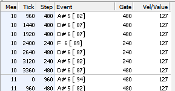

事件栏描述了每一个音符事件以及CC事件的各项属性（当然这个事件栏的截图当中并不包含任何CC事件）。除了上述提到的参数以外，事件栏还使用了Mea（也就是Measurement的缩写）代表小节数。在Event栏目中可以找到音高及其对应的序号。

示例使用的MIDI的PPQ为960。

这样一组音符在轨道视图中是这样的：

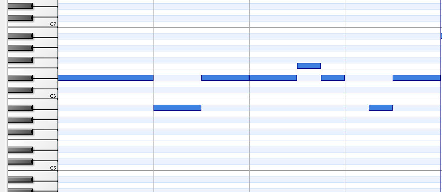

在上一页的批量修改界面中，不难发现在窗口右侧写出了一些基本函数的格式。你可以对Velocity/Value，Step，Gate，音符序号以及Tick进行加减乘除运算。

需要特别注意，Domino仅能在批量修改界面支持单次运算。比如，你不可以设置诸如n\*0.5+23这样的函数，Domino只会计算n\*0.5而不会计算后续的+23。

（这也能解释为什么Domino并不能上下翻转音符，因为你不可以让音符序号先做乘法再做加法，也就是\*(-1)+128。）

**接下来介绍移调工具。**右键选项框，按下R或点击选择“移调”即可。

移调工具界面如下：

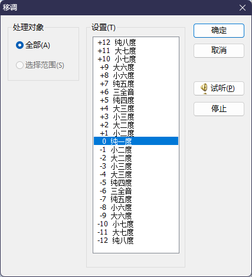

左侧的数值代表相较于原先的片段向上或向下移动了几个半音（+为向上，-为向下）。右侧描述了移调后的音符与原先的音程关系。

**（提示：如果不理解什么是音程，可以自行搜索相关音乐基础知识。本教程的远期规划中是明确包含这一部分的，不过由于笔者本人太忙，编写教程的工作稍有仓促，因此这里不再展开叙述，还请见谅。）**

**下面介绍量化工具。**量化工具DAW里面是一个非常实用的功能。虽然在黑乐谱的编写过程中，一般不会出现大面积使用量化的情况，但导入某些不使用Domino制作的MIDI时，使用量化来修复微小的音符偏移是非常高效的。

量化工具的界面如下图所示。右键选项框，按下Q或点击选择“量化”即可。

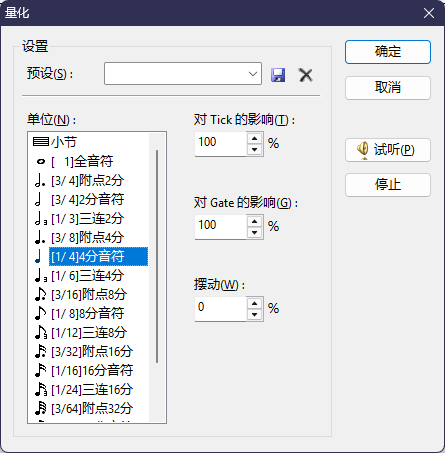

先来看左侧的单位。这表示量化精度，也就是量化之后音符对齐的单位。比如，设定量化单位为16分音符，那么量化之后的音符在演奏时的最小时值就是16分音符。

接下来看右侧三个参数。对Tick的影响代表微调音符演奏开始的位置，也就是，对音符左端点进行量化的程度。相应的，对Gate的影响代表音符长度，也就是对音符右端点进行量化的程度。

通常而言，我们使用量化工具是为了让音符在演奏时不产生偏移，因此一般来说我们会100%量化Tick。而Gate只改变音符长度，如果音符本身在演奏时是对齐的，在特定情况下可以不量化Gate。至于摆动工具，一般情况下不使用。实际处理中一般使用“类人化”工具来完成。

**接下来介绍扫弦工具。**右键选项框按下T或点击选择即可进入扫弦界面。一般情况下我们用扫弦工具配合CC来模拟吉他的质感。当然，单独使用扫弦工具也是常见的处理方法。通常用于批量处理柱式和弦。

扫弦工具界面如下：

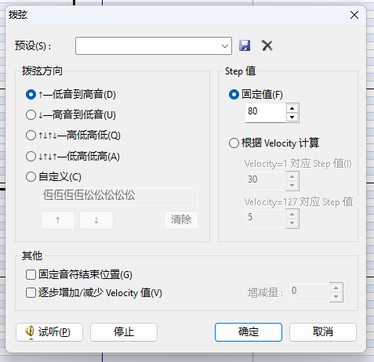

拨弦方向向上代表选中的音符从低到高依次快速演奏，反之则代表从高到低依次快速演奏。你可以选择交替拨弦方向，也可以通过自定义工具（点击↑和↓按钮就可以设定，虽然在文本框中它们显示的是乱码）自行设定拨弦方向。

Step值代表扫弦音符音头之间相差的Tick数量。你可以理解为，Step设定的越小，扫弦的速度越快。你也可以选择根据Velocity计算，根据音符实际的Velocity值设定扫弦的Step。

这个功能设定的Step是一个区间，也就是在力度1-127的时候，设定一个对应的Step区间，使得扫弦快慢随着音符力度增加而变化。

此外，你可以选择固定音符结束位置，避免扫弦后的音尾出现无法对齐的情况，也可以选择逐步增加或减少扫弦音符的力度值。实际使用时，这些功能都可以灵活运用。

**接下来介绍类人化工具。**右键选项框按下H或点击选择即可进入类人化界面。类人化工具一般用于需要非固定节奏的段落，或者在音符画制作中人为地制造随机效果来完成手动操作不便的部分。

类人化工具界面如下：

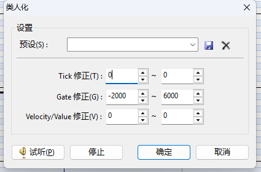

Tick修正代表音头相较于原先位置偏移的范围。Gate修正代表音尾的偏移范围。Velocity/Value修正代表音符力度的偏移范围。这三者很好理解，也就是，自行设定数值区间，为选中的音符的这三个参数施加随机的偏移。这在部分段落中非常有用，比如当一个轨道独奏的时候，你可以增加Gate以及Velocity/Value修正来使其演奏更加自然。

**需要特别注意，“~”两侧的修正值如果都是正值或负值，那么只会施加向上或向下的偏移！如果你希望修正值同时存在增值或减值，请在左侧选项框中输入负值，在右侧选项框中输入正值。**

**接下来是连奏工具。**右键选项框并按下M或点击选择即可设定连奏。连奏工具**<u>没有独立界面</u>**，它的功能非常简单，也就是把选框内的音符首尾相连，使其在演奏时是连贯而非间断的。对于主旋律而言，连奏是常用的处理方法。

**最后，增高/降低八度。**顾名思义。你可以右键选项框，按下O/W或点击选择即可完成操作。

### 3.2.3 其他MIDI编辑工具

除了上述工具之外，还有很多其他的工具可以使用。

首先，我们将目光聚焦到主界面的菜单栏，按下Alt+N或点击“事件”进入事件工具选择界面。界面如下所示：

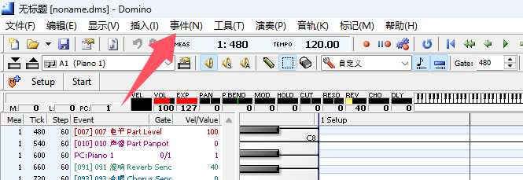

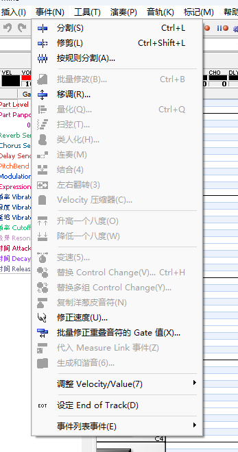

我们先介绍最顶部的三个工具：**分割，修剪，按规则分割。**

**首先是分割。分割的操作方法不同于直接框选。**分割工具的实现效果是，将选项框内外的连续部分一分为二。你可以简单理解为，假设选项框选中了一个音符的一部分，那么使用分割工具就是将这个音符以选项框边界为分割点将其一分为二。

但是，分割工具判定操作对象的方法比较抽象，一般而言，若选中两个音符在选项框内的长度是等长（等时值）的，那么会操作右侧的音符而不是左侧的音符。否则，以时值较短的音符为操作对象。因为其判定方法不易理解，一般情况下不会使用。

接下来是修剪工具。修剪工具会修剪选项框内的**非高亮音符**，并将这些音符的音尾截止于选项框范围外。不过该功能可以被熟练的画笔使用代替，因此使用优先级并不高。

按规则裁剪，很重要的功能。界面如下：

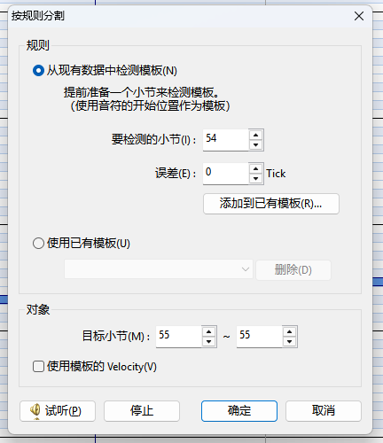

“要检测的小节”表示当前播放进度所处的小节，误差为检测开始位置偏移的Tick。目标小节就是需要进行分割的目标区间。检测模板的实际意义是检测当前小节的节奏型。

这个功能在刷音符或者你需要提高音符密度的时候，是个很有用的功能。比如，你在一个空闲的小节里放上目标密度（意思是你想要的密度，比如64分或者256分音符）的高频音符。假设你希望把一段不太整齐不太规则的长音切成Gate都是1的音符，那么框选你希望修改的段落，检测高频音符所在的小节，它就会按照那个小节的节奏来分割音符。

像刚才那样的话，你就可以让一段普通的旋律直接转变为高频音符。这对于弦乐或者震音的编写是很有帮助的，就不需要手动修改Gate然后大量的复制粘贴了。因为很多情况下旋律并不是整齐的，节奏型会有不太规则的变化，对于直接复制粘贴不是一个很友好的情景，熟练使用这个功能可以很大程度上节省这种不必要的操作。

**接下来是变速功能。**变速功能是黑乐谱制作中非常实用的功能。在市面上的DAW当中这一功能也被叫做伸缩。其效果就是将选区内音符进行伸缩。

变速界面如下图所示。

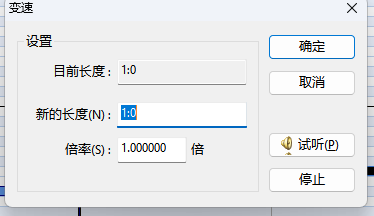

“目前长度”代表框选的选区长度。“新的长度”代表变速后的目标长度。二者单位皆为“小节:Ticks”。倍率，很好理解，也就是变速后选区内音符总长度相较于原先长度的比值。如下图所示的一段音符变速之后会变成这样：

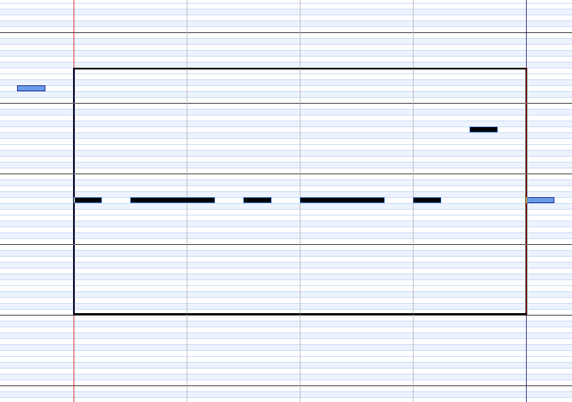

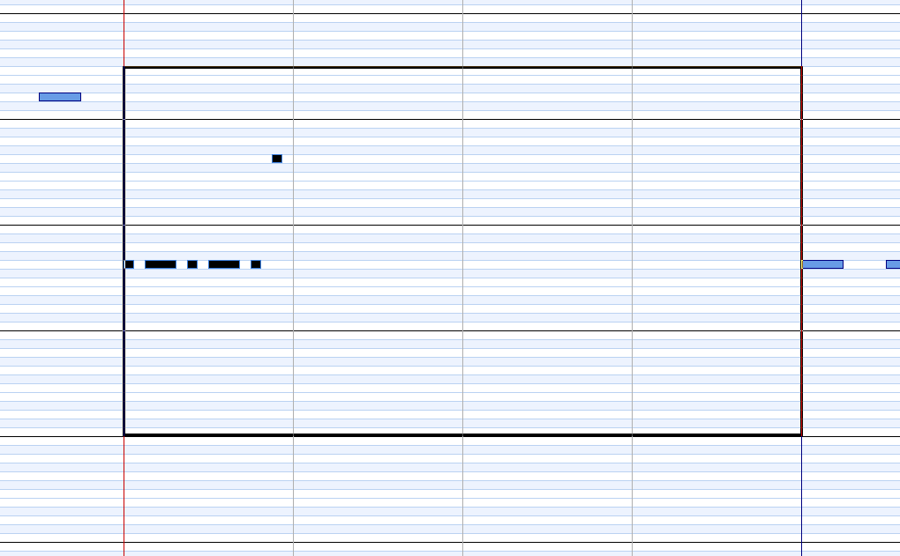

不难发现音符演奏的速度是原先的4倍。在变速界面中设定的倍率就是0.25倍。变速界面中设定倍率等于演奏倍速的倒数。

试着直接设定变速的目标Tick值，看看会发生什么？是的，你不光可以设定倍率，也可以直接设定变速后的目标长度。对于一些除不尽的倍数（比如三连音，五连音，七连音），这个方法可以用来规避微小的误差。在连续音符，琶音，华彩片段，以及音符画的制作当中，变速是刚需的。我们将在之后的章节中继续用到这个工具。

好，变速功能一会再好好玩，我们先来看**左右翻转功能。**

左右翻转功能没有界面，选择“事件”栏目，或者用Alt+N就可以发现它，点按选项或按下“3”可以直接完成操作。

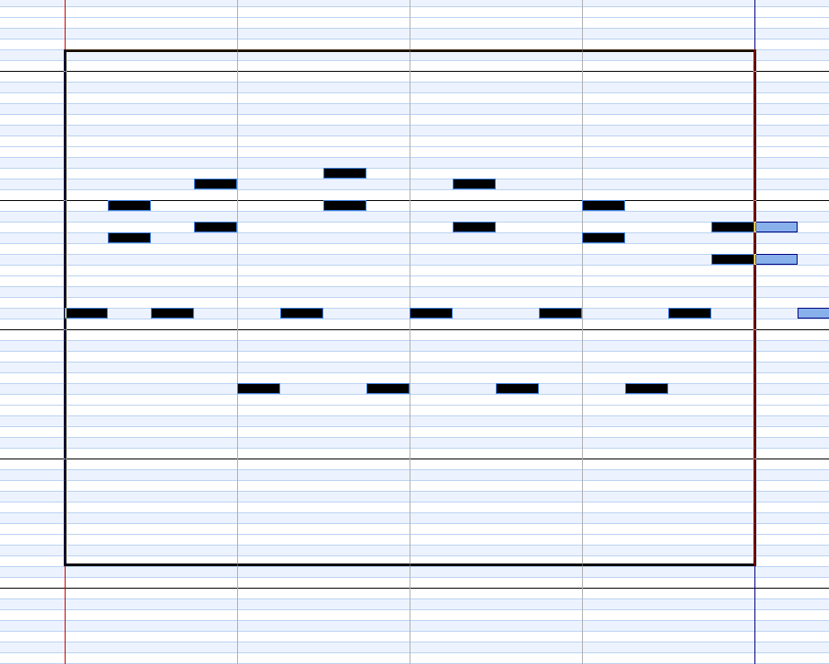

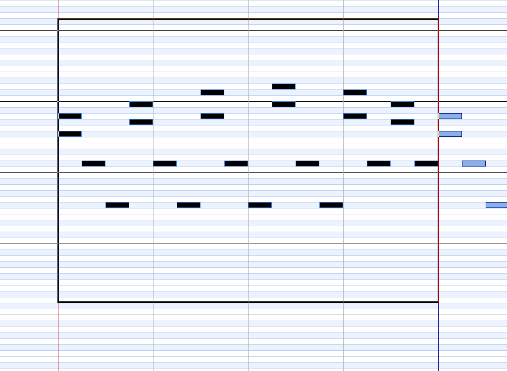

如图所示，选框内的音符被左右翻转了。

需要特别注意一点：左右翻转的操作对象是选项框选择的**<u>整个</u>**区间，这意味着，如果你需要进行**<u>严格意义上</u>**的左右翻转，必须**对齐**区间，也就是，选区必须**包括且仅包括**你希望翻转的音符，**不能**在起始和终止位置留有任何形式的冗余或者空白。

其余的功能，诸如Velocity压缩器，替换Control
Change等将在之后的章节继续介绍。

**我们把目光聚焦到Conductor轨道。**

### 3.2.4 Conductor轨道的使用教程

Conductor轨道是MIDI不可缺少的一部分。在DAW里面也可以称作总线，而Domino里一般我们称呼它为控制轨道。

**控制轨道的行为特征以及使用方法和常规的轨道有明显区别。**

Conductor轨道***不能***放置音符（试试看！）。一般来说，Conductor轨道最常存储的事件类型是速度（Tempo）信息。当然，拍号，调性，标记，注释，歌词，EoT（End
of Track）等辅助信息也会在Conductor轨道体现。我们一个一个来介绍。

**首先是Tempo。**这代表了工程演奏的速度。Tempo的单位按照BPM（Beats Per
Minute）来计算，也就是，每分钟多少拍。

如果要设定拍速，在Conductor轨道界面，在上方菜单栏中选择“插入”或按下Alt+I，点击“Tempo”选项或按下T即可在当前播放条所处的位置插入一个Tempo值。当然，也可以在事件图形（将在稍后介绍）中用画笔工具来绘制Tempo曲线。

你可以通过在事件栏中双击某个单个Tempo事件来修改它的数值，进入修改界面后可以修改Tempo值和它的基准音符。一般情况下，默认基准音符是四分音符，也就是通常意义上（4/4拍）的一拍。

在Domino当中，Tempo的数值上限是512（由于计数精度的影响，实际显示可能是512.007），一般而言，在实际工程当中这个数值是足够使用的。不过，你可以通过在事件栏中修改Tempo的Gate来突破这个数值上限。Tempo默认按照4分音符，也就是4/4拍下的1拍作为速度的基准。**修改Gate值意味着修改速度本身的基础时值。**比如，将在PPQN为960的情况下将Gate设定为1920，就是以2分音符为基准。此时，如果设定Tempo为150，那么换算到4/4拍下的实际工程速度是300，是默认状况下的2倍。

在不涉及音符画的MIDI制作过程中，一般不会用这种操作方法。实际编曲当中，无论是从工程管理的整洁度和易读性，还是从整体播放的流畅程度和可操作性来讲，**任何情况下都不建议对Tempo值进行<u>无实际意义</u>的加减乘除。**

**接下来介绍拍号***（如果你认得五线谱的话可以不看这部分）***。**

**拍号的具体意义是：以X分音符为基准，每小节Y拍。在五线谱中，单位在下，拍数在上；书面描述时，拍数在前，单位在后。比如，6/8拍代表以八分音符为基准，每小节6拍。前文提到的4/4拍则代表以四分音符为基准，每小节4拍。**

补充说明：X分音符可理解为将一个4/4拍下的小节分成几份。例如全音符为4拍，二分音符为2拍，四分音符为1拍，八分音符则是半拍。此外，对于音符的具体时值还有附点和连音等具体规则。不过这一般是出现在五线谱的写法，由于黑乐谱是直接的MIDI编辑而不是准确严谨地用五线谱等记谱法来制作的，实际运用中会更加灵活。比如，附点反映在MIDI当中就是将原有的音符时值×1.5，而三连音则是把三个等长的音符缩短到一拍或半拍内。因为MIDI编辑只要求演奏准确而不规定明确的书写方法，实际操作中并不需要过多纠结相关理论。

默认情况下，空白工程的初始状态下是4/4拍的。如果要设定拍号，在Conductor轨道界面，在上方菜单栏中选择“插入”或按下Alt+I，点击“Time
Signature”选项或按下B即可在当前播放条所处的位置插入一个拍号事件。和插入Tempo的方法基本一致。

**需要注意，更改拍子的基准时值不能更改当前Tempo的基准音符。比如，如果你在MIDI的某个位置将原有的4/4拍变为6/8拍，那么原来的Tempo值还是按照四分音符为基准而非八分音符为基准。**

关于调性，它在MIDI编辑（尤其是黑乐谱）中没有实质性的作用，这里不做过多的解释。在需要展示五线谱的环节，可能需要确定当前位置的歌曲调性。其余情况下可不特意设定。当然，如果作为初学者，或者音乐基础较为薄弱，扒谱较为困难的情况下，可以用这个工具配合其他的辅助工具（之后介绍）来初步寻找和弦。不过，你依然有Wavetone等软件作为更好的选择。

**接下来是标记，也叫做Mark。**标记的插入方法和之前不太一样。

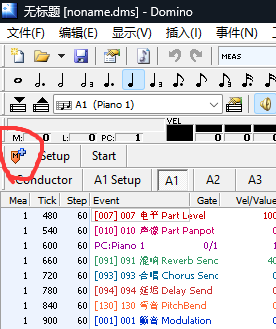

在这里点击就能在当前位置插入标记。插入标记后会弹出窗口，你可以在窗口内的文本框中输入标记的文本内容。

你可能注意到图示中的Setup和Start了，没错，它们是SC-8850当中MIDI初始化（将在3.3.1中介绍）的一部分，是在A1
Setup轨道中自带的两个事件。**标记是可交互的。点击标记栏目当中的标记即可跳转到标记所处的位置。**

**注释，歌词。**这两个选项对实际编辑几乎没有任何作用，这里不过多介绍。它们的插入方法和插入Tempo以及拍号（Time
Signature不同）很接近，唯一的区别就是不同的选项（对应Lyrics和Comments，也可以按下L或者M来插入）。

此外，在“插入”栏目中还有很多选项，例如Cue Point，Measure
Link，Formula等选项。我将在3.3.2当中简要介绍这些工具的用法。

你可能注意到了在这个栏目中出现了Program Change，Control Change，System
Exclusive等较为复杂的东西，我将在第九章继续介绍这些。它们是不同于常规MIDI编辑的一套独立系统。

**最后，介绍EoT（End of
Track）。**EoT事件规定了MIDI在哪个位置结束。如果MIDI没有EoT事件或EoT事件不在恰当位置上，它的最终长度会出问题（比如，在播放器中，如果你发现你的MIDI文件的时长变成了几十分钟，一般就是缺少EoT事件导致的）。一般情况下，在整个MIDI的最后一个音符结束演奏的时刻（或在这之后1-2个小节），我们插入EoT事件来确保整个MIDI结束演奏。

插入EoT事件的操作方法和插入Tempo以及拍号（Time
Signature）不同，你需要在“事件”栏目当中找到它（或者按下Alt+N），点击“设定End
of Track”或按下D即可。它将在播放进度条位置设定一个End of
Track。每个MIDI文件有且只能有一个End of
Track事件。这标志着整个文件演奏结束。

总的来说，一般情况下使用Conductor轨道都是为了更改速度和拍号，掌握这两个工具对于初学者来说是必要的。本章的最后，我们来看一看**事件图形！**

### 3.2.5 事件图形

事件图形的位置如图所示：

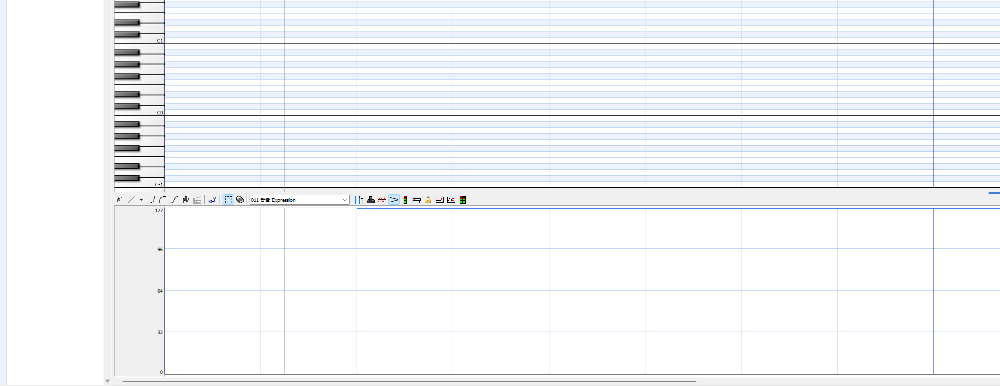

**事件图形描述了当前轨道的某一类型事件在图表中随时间变化的情况。你可以通俗理解为，在实际演奏中一系列事件会怎样变化。如果你熟悉DAW的话，你也可以理解他是轨道自动化控制的一部分。**

一般来说，事件图形这个界面是**默认打开**的。

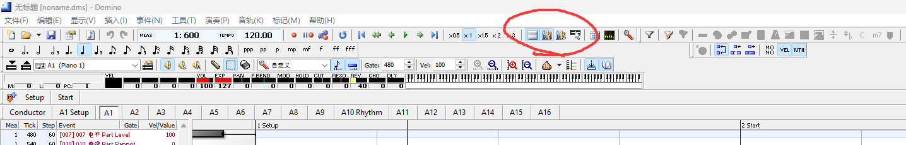

你可以在这里切换事件图形的开关状态。默认状态下只有事件图形1是打开的，如果你的屏幕够大（认真的哦！），可以试试同时开启两个事件图形，分别控制两个不同类型的事件，让你的编辑变得更高效。

事件图形是很多效果器的基础。它非常强大，原生支持使用画笔，框选，和橡皮擦等基础工具，也同样支持右键后进行更多编辑操作（如批量修改，类人化等）。

接下来，我们来详细演示一下事件图形的具体用法。

事件图形当中可以充分利用画笔工具，比如某个同学写了一段音符，被某热心大佬提醒没有力度上的起伏，缺少感情的流动，于是他用画笔工具对下面的MIDI施加了一点魔法，就像这样——

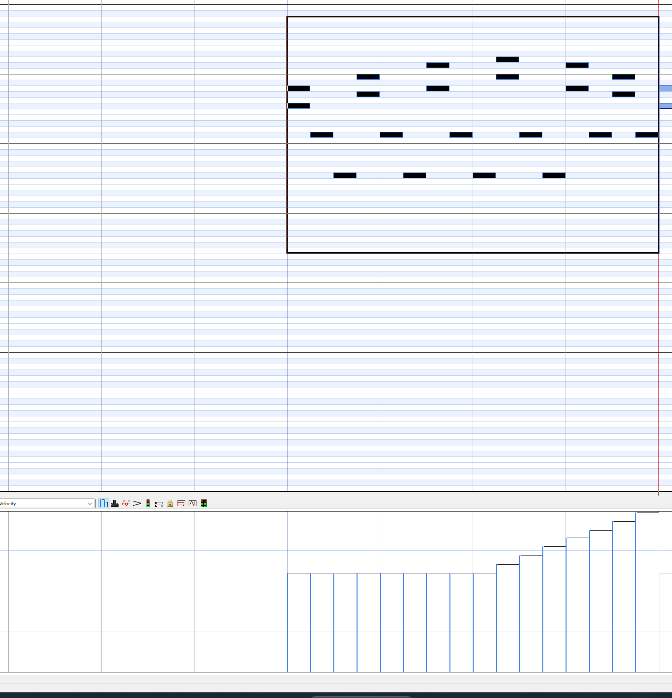

看，一段音符有了渐强的力度变化。

你也许注意到这些音符的力度增幅一致性非常强，这是因为：

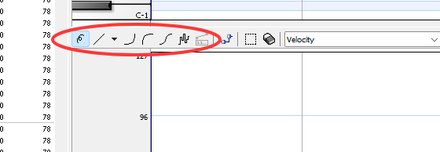

这些代表预设的曲线。刚才的实例当中使用的就是**直线**的预设。

这些预设从左到右依次为：自由绘制，直线，凹曲线，凸曲线，S形，随机，以及自定义曲线。自定义曲线需要利用函数来进行更细化的调整。

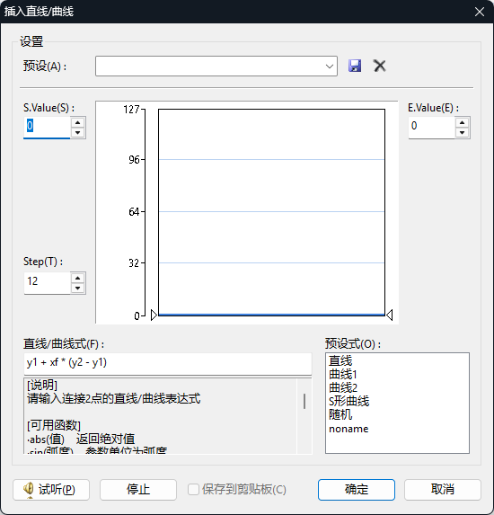

**本栏目的可用函数，预定义变量，示例函数，以及笔者自己和来自其他作者制作的预设函数，将在附录当中补充；请参见附加内容10.1。**

直线选项旁边的箭头当中包括两个重要选项：**“间隔设定”和“只在音符前”。**一般而言我们不需要考虑曲线绘制是在音符前还是音符后，这里只解释间隔设定。

间隔设定界面如图所示。

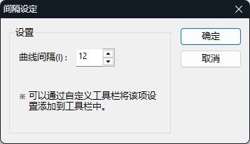

间隔设定代表绘制曲线当中产生的所有事件（在事件栏中显示）的Step值。你可以理解为，曲线的精细程度，或者事件处理的密集程度。Step值越低代表一段曲线所包含的事件数量越多，在实际播放当中会更加平滑自然，代价是更消耗性能。通常来说，对于大型黑乐谱，特别是大规模使用CC控制器的黑乐谱，不建议将间隔设定地过小，避免在实际播放时产生不必要的卡顿。

一般而言，24或者48的曲线间隔是够用的。当然，如果需要精细的调整曲线，也可以设定更低的值，但笔者**不建议**将该值设定为1，特别是对于Tempo事件。**再次强调，不要盲目追求精度，适合，够用，得体即可。**


红圈的右侧按钮是“切换锚点”功能，用于显示/隐藏事件的控制点。也就是，在事件有取值的位置显示一个可以自由拖拽和修剪的控制点，便于精细调整，一般用于控制力度以及部分CC事件的微调。

它的右侧就是快速切换框选工具和橡皮擦工具的按键，不多做解释。

你也许注意到右侧有一个可以下拉的选项栏。是的，你会在下一章也用到它。它代表了当前你所编辑的事件类型。在这张图中，Velocity代表音符力度，你也可以下拉选择其他的事件类型。在完整的SC-8850音源定义下，这个栏目包含的可用事件类型**非常非常多**，本篇教程不太可能一一介绍，但在下一章的部分当中，我们会首先接触到CC控制器事件。

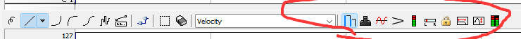

喏，最右侧的这些就是我们最常用的几种CC控制器了。

不过，由于本章节主要介绍基础内容，在这里我们先不介绍他们。如果你已经掌握了上述的所有基础内容的话，恭喜你已经具备了初步独立制作MIDI的能力。好，那么我们稍事休息，**进阶教程见！**

## 3.3 Domino进阶操作方法

欢迎来到进阶教程。在本章中你将学习如何进行MIDI初始化，在基础教程中涉及但并未详细介绍的一些工具，以及，最重要的，CC控制器。

受限于MIDI本身的框架，如果你接触过DAW的话，这部分可能对你来说会显得有些低效和老土。不过，由于我们的教程是在Domino中演示的，所以接下来我依然会用Domino来告诉你如何使用这些工具来增强黑乐谱本身的表现力。

那么，正式开始。

### 3.3.1 MIDI初始化

你也许注意到，只要加载了音源定义文件，在MIDI的开头部分都会有一堆看上去没有什么用的事件，可真的是这样吗？

不是的，正相反，它们很重要。它们的最大作用就是定义了多数要用到的控制器，以及少数不需要编辑但必要的事件在MIDI开始时的初始值。

MIDI初始化在事件栏中是这样体现的：

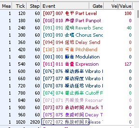

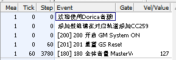

你应该清楚我们会大量使用这些控制器，但它们的参数为什么需要初始化呢？**在这里，我们需要首先知晓一个Domino的特性：<span class="mark">Domino默认情况下不具备遍历除了音符事件和Conductor轨道内的独有事件以外任何事件的能力！</span>**意思是，默认状态下Domino执行其他类型事件的唯一方法就是在播放的时刻开始后，在事件栏中检测到事件的值有变动。换言之，Domino通过自动化控制（例如绘制包络线或者在某一位置设定某一特定值）来改变上述事件以外的参数，强制依赖起始播放后的外部输入（事件栏内检测到并重新赋值）。

**如果这样依然不好理解的话，我们举一个例子。**比如，你想让某一个音符做出类似滑音的效果，在这个音符接近结尾的地方你使用了Pitchbend，直到下一个音开始的时候你重置了Pitchbend为0（你可以认为这两个音是连奏的，首尾相接），也就是弯音轮事件。假设，你反应灵敏，在弯音轮作用到一半的时候**突然暂停播放**，然后从后续的某个位置（**越过**Pitchbend=0的重置位置）跳转后开始播放，你会发现：**播放结束前最后一个的Pitchbend值，保留到了第二次播放开始的时候。它不会进行重置！**这样的演奏效果是**灾难性的**。如果你希望在你跳转进度条进行播放的位置的Pitchbend事件回到初始值0，就***必须***在对应轨道的跳转位置上设定一个Pitchbend=0的事件进行重置。

**目前，市面上的DAW都具备遍历自动化事件的能力。尽管Domino的架构非常古老，但Domino实际上具备遍历自动化的功能，只不过它默认情况下是不打开的。我们需要在菜单栏的“演奏”界面，找到选项“自动同步MIDI设备状态”来让Domino进行遍历。**

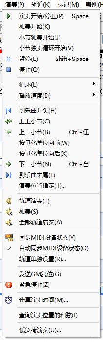

**在标准的MIDI编辑逻辑里，MIDI
CC（控制变更）通常是以离散事件的形式存在的。比如，你在某个时间点插入一个CC11（表情）事件，把它设成80。那么当播放指针走到这个位置时，音源的音量就会被定格在80。你想在下一小节让音量变成120，就必须在下一小节再插入一个新的CC11事件，并赋值为120。这整个流程就是，依赖事件的触发进行更改。你需要手动放置事件，而且一旦播放指针跳过了某个事件，如果没有新的CC事件来接替，音源的内部状态就停在旧值上，。**

**而这个功能的作用就是实现“能够遍历，不需要手动重置再赋值”，也是这个功能的精髓。核心在于“状态同步”，意思是持续地监测和同步硬件的内部状态，而不只是被动地等待你插入事件。当你开启这个功能（无论是手动触发还是让它自动运行），Domino会主动去读取当前播放位置下，所有控制器应有的数值状态，然后将这个状态作为当前值，通过MIDI协议发送给音源。**

**这带来的体验变化是决定性的。这样MIDI
CC就可以不依赖离散的赋值，而依赖连续的曲线进行控制。可以想象一下，用画笔在钢琴卷帘的控制器栏里画出一条连续的曲线，功能就像是把你在控制器面板上画出的曲线，在播放时自动遍历了一遍，确保每一个时间点上的所有CC值都是正确的。这就像你调好了一个旋钮，然后Domino会在播放过程中持续告诉你：“现在就是这个值，保持住，或者跟着曲线走”，无需你再为每一小段变化去手动插入、复制或重置事件。**

**这个功能在处理黑乐谱这种音符密度极高、需要同时对多个MIDI通道进行精细控制的工程时，优势非常明显。在大型工程中，经常需要同步几十上百个控制器的状态变化。如果没有自动同步，每当你修改一个控制器参数，你可能要手动去工程里找到所有相关的事件点进行修改，或者担心播放中途某个通道的状态被意外卡住。而有了自动同步，你就可以像操作VST自动化一样，专注于你想要的变化曲线，而不需要去处理那些繁琐的状态更新或者哪些事件忘记了重置，也能确保播放时的状态始终与你编辑的曲线一致，不会出现因为事件遗漏或位置错误而导致的参数状态混乱。**

**我们不妨再深入些。**

在MIDI制作和DAW操作中，有两个经常被提及但容易混淆的概念：“自动同步MIDI状态”和“遍历自动化”。它们指向的是同一类操作，但不是一个侧重点。

首先解释自动同步MIDI状态。这个说法通常出现在MIDI设备与DAW之间的通信上下文中。它指的是DAW与外部MIDI设备（如硬件合成器、MIDI控制器或软件音源）之间保持参数一致的机制。

具体来说，当你在DAW中调整了一个MIDI控制器的数值（例如音量CC7、声像CC10或调制轮CC1），DAW会生成一条相应的MIDI
CC信息，并通过MIDI协议发送给目标设备，使设备的参数与DAW中的设定值保持一致。反过来，当你在外部MIDI控制器上推动推杆或旋转旋钮时，硬件发出的MIDI
CC信息也会被DAW接收，并更新轨道中对应的参数状态。

这个过程是实时且双向的，目的是保证DAW的逻辑状态与设备（硬音源）的物理状态始终同步。当这个同步过程被自动化，即DAW在播放过程中按时间线自动发送MIDI
CC信息，而不需要用户手动操，就形成了所谓的自动化。

遍历自动化这个说法在黑乐谱制作和中大型MIDI工程中更常见，它描述的是另一种操作逻辑。核心含义是：在播放过程中，DAW系统地对所有轨道或所有MIDI控制器的状态进行扫描、记录和应用。具体来说，当你在自动化录制模式下（如Write或Touch模式）播放工程，并调整了某个参数，DAW会自动记录下你调整的时刻和数值。播放结束后，这些记录被保存为自动化曲线，并在后续播放中自动应用。

但在某些工作流中，遍历指的是更主动的行为。例如，当你导入一个MIDI文件后，DAW会自动扫描该文件中所有的MIDI控制器信息（包括音量、声像、表情、调制等），并将其状态更新到当前工程中，确保导入的MIDI文件在播放时保留了原始的控制器信息。这个过程实际上是在"遍历"MIDI文件的所有通道和所有事件，自动识别并同步其状态。

另一个常见场景是：当你调整了某个MIDI控制器的默认值后，DAW会遍历工程中的所有MIDI片段，将所有片段中该控制器的状态统一更新为新值。例如，将工程中所有轨道的默认音量从100调整为110，DAW会遍历所有片段，找到并修改音量信息的位置。

自动同步MIDI状态更侧重于DAW与设备之间的一致性，强调状态的对齐。而遍历自动化更侧重于对已有数据的系统扫描和批量更新，强调操作的覆盖范围。两者在实际工程中经常同时出现。DAW在播放时会自动同步MIDI状态，同时在同步过程中不断遍历并应用已记录的自动化数据。

对于黑乐谱工程而言，自动同步与遍历自动化意味着：当你的MIDI文件中包含了大量的控制器信息（例如不同段落的音量变化、声像移动、表情曲线等），DAW能够在播放时精确复现这些变化，并在导入、编辑和导出过程中保持所有控制信息的完整性和一致性。

这个逻辑同样适用于现代常规音乐的制作。MIDI CC的自动化和VST
Parameter的自动化在目标上高度一致，都是让参数随时间变化。但在底层实现上，两者有着本质区别。MIDI
CC是MIDI协议的一部分，它是一套标准化的事件类型，定义在MIDI规范中，用于控制外部硬件或软件音源的基础参数。而VST
Parameter则是DAW与VST插件之间的通信协议，属于VST引擎的范畴，专门用于控制插件内部暴露出来的任何参数。两者由不同的通道传输，遵循不同的规范，在分辨率、路由方式和自动化机制上都有差异。

一个最直观的区别在于分辨率。MIDI
CC标准协议的分辨率是7-bit，只有128个步进值，虽然可以通过NRPN或14-bit
CC扩展来提高精度，但前提是设备和插件必须支持。而VST自动化使用的是DAW内部的自动化系统，通常以32-bit浮点或64-bit浮点精度传输，可以实现近乎平滑无级的变化，特别适合需要细腻动态的参数的自动化。这意味着如果需要对一个滤波器的截止频率进行非常细微的扫频，通过VST自动化得到的包络通常要比用MIDI
CC控制更加平滑。

在路由方式上，MIDI
CC通常是被记录在MIDI片段内部，作为音符事件的一部分与MIDI数据一起回放。而VST
Parameter的自动化则是通过DAW的轨道自动化系统来处理的，它独立于MIDI片段，通常以轨道上（或者对象上）的自动化包络线的形式存在。VST3的某些实现中，MIDI
CC甚至需要通过插件框架来映射为特定的VST参数，再由DAW进行自动化处理，因此即使参数值相同，进入插件的路径也不一样。

那么哪些是不能遍历呢？“不能遍历”可以分为几种情况。

第一种是功能权限根本不允许。典型例子是Wavelab这类母带软件，它在设计上就是按音频片段（Clip）为单位进行处理的，插件的自动化功能被限制在片段效果器层面。用户无法对轨道效果器或输出总线效果器（如母带限制器）的插件参数进行自动化控制，导致无法在一个工程内实现“不同段落使用不同的限制器释放时间”这种需求，用户不得不将分段处理后的音频片段拼接起来，或者把工程导回到其他DAW完成自动化再导回。这是因为Wavelab长期专注于母带处理的工作流程，缺乏轨道层面的自动化系统。

第二种是技术实现上的例外。比如某些插件参数的数量超过了VST/AU/AAX规范对可自动化参数数量的上限，开发者会预先从大量内部参数中挑选一部分映射到可供外部调用的参数列表里。如果某个你想自动化的冷门参数没有被加入这个映射列表，它就无法被DAW的自动化系统识别和控制，即使它在插件界面里是一个可以转动的旋钮。

第三种是受限于软件或硬件本身的兼容性问题。比如在某些操作系统或特定版本的DAW中，当插件添加了MIDI端口或使用了特定运行模式后，其自身参数可能就无法被DAW识别为可自动化项目，即使插件的GUI界面仍然可以调整这些参数。这通常属于宿主软件与插件之间的握手问题，而非逻辑上的限制。有时DAW会因为工程中的自动化点异常，导致某些MIDI
CC（如常用的调制轮CC1）的自动化回放失效，或者自动化包络线本身不随播放进度更新，这也属于特定的bug而非通用的规则，但都意味着在特定条件下无法进行正常的自动化遍历和控制。

最后一种情况是“不适合遍历”，更多的是一种工程原则上的建议。比如合成器的“复音数（Polyphony）”这类参数，它在运行时改变可能会导致声音引擎出现不可预知的爆音或逻辑错误，因此许多插件开发者会主动将其从可自动化参数列表中排除，或者设计上只能在非播放状态下调整该参数。MIDI
Learn和VST
Parameter虽然都可以实现控制，但各自的优劣决定了适用场景，一般来说快速变化的细腻参数更适合VST自动化，而更依赖MIDI规范的实时演奏型控制则更适合MIDI
CC，两者并非完全等价和可互换的。

说回正题，当我们的MIDI需要大面积的使用CC事件的时候，手动去重置每一个控制器的参数是非常麻烦且耗时的。不过我们也有在特定位置直接添加轨道初始化的方法。轨道初始化的添加方式是：**在菜单栏内选择“插入”，或按下Alt+I，单击“轨道初始化”或按下A键即可进入轨道初始化选择界面。**

界面样式如图所示：

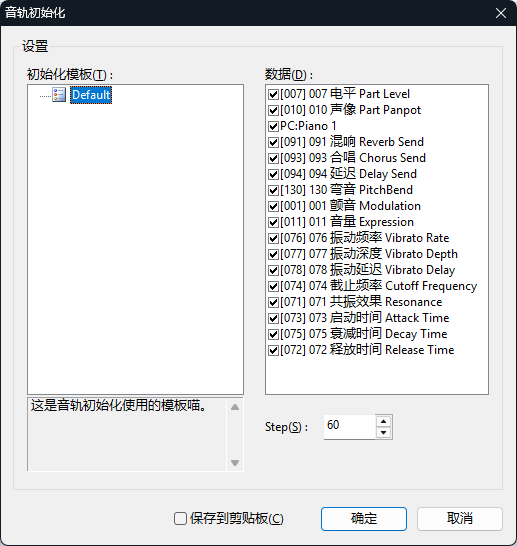

点按“确定”即可在当前音轨的进度条位置添加初始化内容。初始化的参数是右侧勾选上的参数。Step值代表每个初始化赋值事件相隔的Tick数量，一般而言可以保持默认值60，如果你不希望在总轨界面看到初始化的参数，也可以设定为0，请根据自己的偏好和操作习惯进行设置。

不难发现这张图中勾选的参数和上图当中轨道初始化的参数类型是完全一致的。此时，我们在同一音轨的第二小节起始位置添加轨道初始化，事件列表随后就会这样显示：

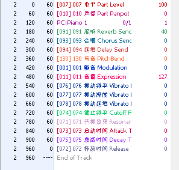

你看，简单，易如反掌！

当然，轨道初始化并不是万能的。如果你使用了上图所示之外的参数类型，那么你依然需要在必要的位置手动重置，不能以来轨道初始化；但轨道初始化这个功能对于常用的CC参数来说确实是非常高效的。

### 3.3.2 不常用工具介绍

在3.2当中我们讲解了一部分常用工具的使用。接下来我们来简单了解一下一些不常用的工具具体起到什么样的作用。

这里我需要明确一点，Domino功能繁多，笔者不可能特别细致地介绍每一种功能，因此我只会讲之前涉及到但是暂未介绍的功能在这里做一个基础的解释。

首先先从“插入”界面当中的功能说起。以下功能都在“插入”列表中，直接点击即可。

**第一个，Comment。**这个代表注释。没有任何特别的作用，它允许你在当前位置添加一段文本内容，仅此而已。

**第二个，Lyrics。**早期MIDI音乐中确实会用到这个，但在黑乐谱的制作中，它和上面提到的Comments一样，除了允许输入文本以外，没有任何实际意义。

**第三个是Cue
Point，提示点。**它是一种特殊的MIDI系统信息，用于在MIDI数据流中插入文本标记，主要功能是向播放设备或表演者提供非音频的定时提示、指令或元数据。它属于SysEx信息中的一种，但遵循MIDI
Show Control（MSC）或MIDI Machine
Control（MMC）等规范，具备一定的通用性。一般在现场表演中（特别是DJ）会用到这个，不过，在黑乐谱的制作范畴内，没有任何用处。

**第四个，Formula。**Formula实际上是一种变量的定义工具。它允许你讲一个特定的表达式定义为某一个变量名。

**Formula的输入方式是：“（变量名）=（表达式）”。类似编程中赋值的做法。**

规则方面，首先，变量名只能是英文和数字，而且不分大小写。其次，当Formula事件被演奏时，变量被赋值，并且在执行之后，在所有音轨被用作Control
Change事件的Gate或Value，或是在Conductor轨道被用于Tempo事件的Value。

需要注意，当你在一个音轨定义了一个变量后，其会在所有音轨可用，且当同名变量已经在别的音轨定义过时，它会覆盖那个变量，也就是，最后执行的Formula事件将会覆盖先前执行的，具有同名变量的Formula事件。

Formula事件支持输入函数，并具有预定义变量。它公式部分的用法和事件图形的有一定相似之处。你可以查询附录2来进一步了解它的用法。

**最后一个是Measure
Link。**它在黑乐谱当中一样没有什么实际作用，不过，在DAW当中，它是一种将编辑行为或参数自动对齐并锁定到项目时间轴（基于小节和拍子）的功能。
它确保操作严格遵守音乐节拍网格，可以用于实现精准节奏编辑和自动化。

另外还有在后续乐理当中会涉及的Scale（音阶）和Chord（和弦）两个工具。这两个界面可以它们的界面如图所示：

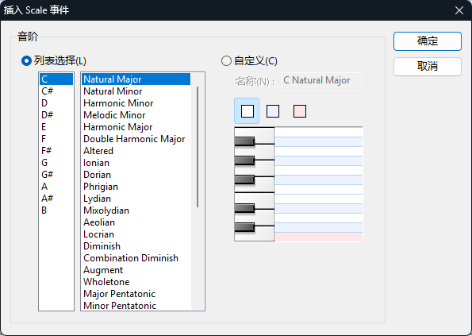

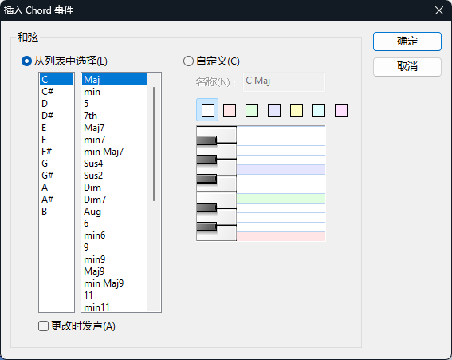

左侧代表调号。Scale当中右侧代表音阶模式（比如自然大调，和声小调，Dorian调式，Lydian调式等等），Chord当中右侧代表和弦模式（大三和弦，小三和弦，七和弦等等）。我们会在后续的“生成和谐音”部分使用到Scale，但这两者其实在黑乐谱的制作中作用微乎其微（因为黑乐谱的制作并不需要非常硬核扎实的乐理）。

“插入”栏目中的功能基本就介绍完了。更多的功能将在远期规划中继续书写。你可以在第九章找到它们。

接下来看“事件”栏目。之前介绍过的，这里就不展开介绍了，我们先来看第一个，也就是**Velocity压缩器**。当然，如果你熟悉VST插件里的压缩器的话，这一部分对你来说理解起来应该不会非常困难。

**Velocity压缩器的打开方式是，点按“事件”栏目或按下Alt+N，点击“Velocity压缩器”或按下C键即可进入界面。**界面内容如图所示：

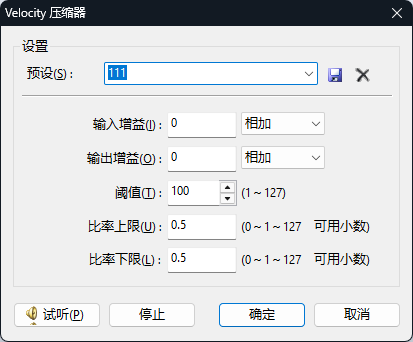

**输入增益和输出增益代表输入/输出的力度值在原有基础上的变化。增益本身具有加算和乘算两种模式。**你可以在文本框右侧下拉选择相加还是相乘。

**阈值代表向上/向下压缩力度的分界点。**比如，这里的阈值是100，那么100以下的力度会被向上抬升，而100以下的力度会被向下减少。

**比率上限和比率下限代表向上/向下压缩的压缩比。**

上面枯燥的讲解可能不是非常清楚，所以我来举一个例子。这张图里我们设定上下限都是0.5，那么，按照100为阈值分别进行向上和向下的压缩，会同比地压缩选区内音符力度和阈值的差值。比如，如果选区内有80力度的音符，阈值为100，设定压缩比为0.5，那么使用Velocity压缩器的情况下，原有的力度会变成90。如果调整输入增益为10呢？很简单，输入力度由80变为90，阈值和压缩比都不变，那么输入80+10=90后，再进行压缩，力度就会变为95。

在现代DAW当中，你可以通过直接拖拽或伸缩多个音符力度条来灵活调整Velocity。Domino的这种压缩Velocity的方式并不完全简洁易懂，但也是一个在微调或需要精细力度变化场合下的重要补充。

**下面来看“修正速度”。点击选择或Alt+N后按下U即可。**

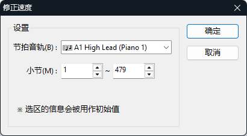

**使用该工具对选区内要素有以下限制：选区不能是Conductor轨道的内容，且该选区的时间范围内不能有任何Tempo变化。**该工具会自动帮你设定一个合适的速度，适合于Rubato（散板）或者实录的MIDI片段微调速度，但一般情况下由于我们会在工程开始之前就定好特定段落内的Tempo值，这个工具用处不大。

接下来我们来试着**批量修复重叠音符的Gate值。**

有些时候从外部导入的MIDI会出现重叠音符，由于Domino对MIDI内部的音符错误几乎没有容忍度，所以可能会出现非常不利于编辑和检查的情况。我们的确有这样的工具来快捷修复这样的问题。依然是在“事件”栏目，**点击选择或Alt+N后按下X即可。**

**界面如图所示：**

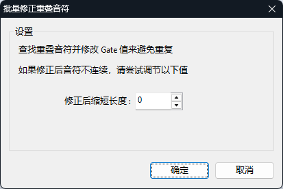

同样的，你需要先用框选工具来选择一段音符之后再使用该工具。默认情况下使用该工具之后会把音符变为连奏（legato）的状态。你也可以设定修正后缩短一定长度（按Tick计）来避免修正后音符出现不连续的情况。通常，如果是自主编写的话，可以不使用这个工具，**重叠音符在Domino当中默认情况下是不允许出现的，因此你无法通过常规手段得到大量的重叠音符。**我们会在稍后，也就是讲解Domino设置（3.3.13）时，扩充重叠音符的内容。

后面的“带入Measure Link”事件，因为Measure
Link本身作用不大，在这里不展开叙述。不过我们可以来看看“生成和谐音”能做到什么。

直接在“事件”栏目中点击或按下Alt+N，再按下6即可进入该界面，如图所示：

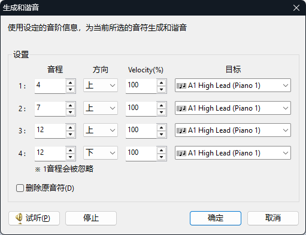

生成和谐音时必须在该位置的Conductor轨道中包含音阶（Scale）信息。Domino会根据设定的调号和该界面中的参数来生成对应的和谐音。生成的音符按音程计算，可以选择和谐音在基准音上方或下方生成，最多能够为一个单音生成4个和谐音。Velocity一栏中会指定生成的和谐音力度。“目标”栏目代表生成的和谐音所处的轨道，默认状态为当前视图所选择的轨道，你也可以为其指定到你想指定的任意轨道当中，便于编辑或拆解声部。

最后的话，我们把目光聚焦到“演奏”栏目。你也可以按下Alt+P来进入该栏目浏览下属的功能。我们只需要介绍几个就好。

第一个，MIDI静音（Panic），Alt+P后按下Z键即可，紧急停止演奏，可以在严重卡顿的时候使用。

第二个，低负荷演奏。Alt+P后按下U即可打开界面。界面样式如下：

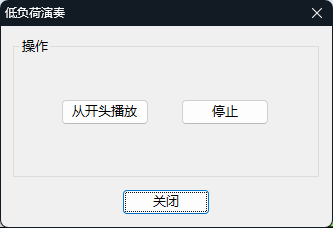

该功能只能支持从开头播放或直接停止。停止后再次播放也会从开头播放。一般地，如果你需要直接录制某条或某几条音轨，可以开启该功能来最大程度上减小卡顿和渲染压力。

总的来说，不常用但特定情况下有用处的功能就暂时介绍到这里。接下来我们来看一个名叫“洋葱皮”的工具。

### 3.3.3 洋葱皮，音阶/和弦显示

洋葱皮，确实是值得拿出来单开一节的工具。

这个工具从名字上来说非常令人费解，听起来也很老土。但，它在实际编曲和创作当中可以有效提高效率，辅助我们平衡各个音轨之间的内容。它可以让我们的操作变得有的放矢，更加合理，高效。更准确的讲，洋葱皮工具在DAW中是一种用于辅助音频剪辑和编排的功能。它借鉴了传统动画制作中“洋葱皮”技术的概念，允许你在编辑当前片段时，半透明地显示前后相邻的片段内容，从而实现更流畅的编辑和过渡。

洋葱皮工具可以在这里切换开关状态：

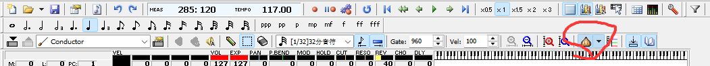

下拉箭头可以看到以下几个选项：

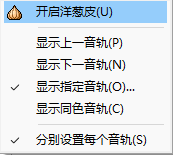

前面两个选项就是字面意思。最后的“分别设置每个音轨”代表当前的洋葱皮设置只会作用于当前选中的轨道而不是所有轨道。

点击显示指定轨道后会进入如下界面：

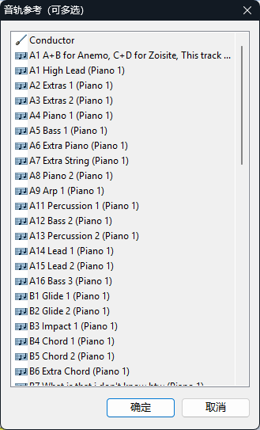

你可以直接点击某条音轨来选择洋葱皮要显示的轨道。选中一条音轨并按住Shift+Pg
Up/Pg
Down或Shift+↑/↓方向键就可以选择多条轨道了。按住Ctrl并点击可以选择指定轨道（可多选），Ctrl+Shift+指定轨道可以一次性选择最上方和最下方及其之间的所有轨道。

由于洋葱皮在Conductor轨道也可以正常使用，因此，笔者建议在Conductor轨道上设置开启显示所有其他轨道。这里我们全部开启，你就可以在Conductor里面看到所有轨道的音符了，就像这样：

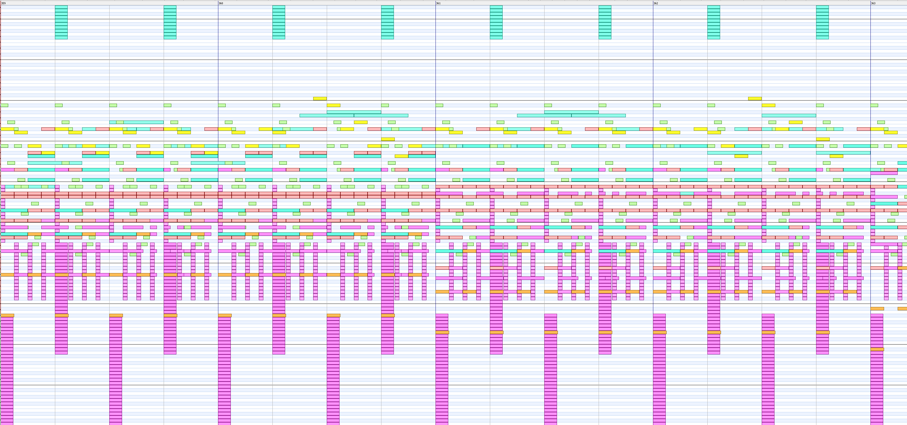

看，非常直观。

这些花花绿绿的音符到底来自哪条音轨呢？这就需要我们在音轨视图中开启音轨列表面板了。在菜单栏中选择显示或按下Alt+V，点击“音轨列表面板”或按下A键即可。在当前轨道的音符（Conductor没有）会以**正蓝色**显示，而其他轨道的音符会以彩色显示。所对应的颜色和面板中显示的颜色是一致的。

音轨列表面板的样式如图所示：

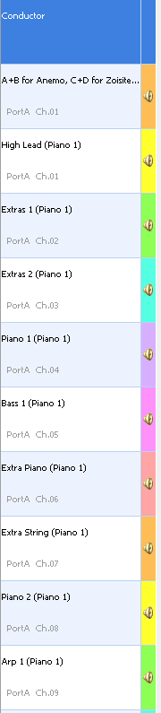

你可能会想到，如果你的音轨很多，由于Domino默认的颜色数量不太够用，可能会出现两个没有关系的音轨用了同一个颜色的情况。不过，我们也有办法来真正指定某些音轨的洋葱皮颜色。**在该面板中，你可以直接右键对应音轨，选择洋葱皮颜色。**

**笔者建议将职能相近的音轨（比如两个音轨都负责Bass）分配同样的颜色。这样你在洋葱皮视图当中就会更清晰的分辨音符来自哪个音轨或哪个声部。**

**这样说，洋葱皮界面中的“显示同色音轨”是不是就非常有用了？试试看！**

接下来我们再来介绍一个和它非常接近的工具。你应该记得我们之前提到了Scale和Chord（音阶和和弦）这两个概念。如果我们想让它们在音轨上或者在钢琴卷帘当中显示出来，或者根据Conductor中的事件实时变化呢？现在我们来点击**这个**：

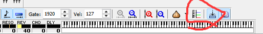

之后就会进入如下界面：

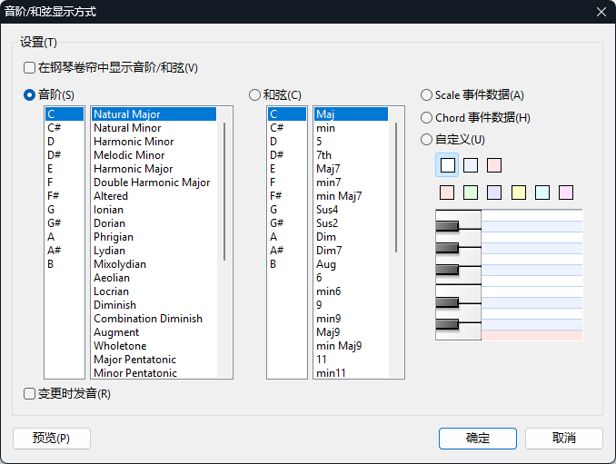

这一个界面实际上包含了之前Scale和Chord的界面内容。

在钢琴卷帘中显示音阶/和弦，就是将右侧那张缩略图的内容显示在当前的钢琴卷帘当中。如果你要显示音阶，那么你需要指定音阶的起始音和音阶模式。如果是显示和弦，需要指定和弦的基准音与和弦模式。勾选“Scale事件数据”和“Chord事件数据”可以让该功能读取Conductor当中设定的Scale和Chord事件，实时改变显示的音阶或和弦***（这两个事件在Domino中支持遍历）***。同样，你可以为显示的音阶或和弦指定颜色。

这个功能对于初学者来说还是很有帮助的。在你熟练之后，你可以不使用这个工具来辅助你进行创作，但洋葱皮工具确实是可以陪伴你的整个黑乐谱制作流程的。总之，希望它们能够在MIDI编辑时给你实打实的帮助。

**接下来，我们将继续深入。我们将接触一个为音乐赋予色彩，甚至能够创造声音的新世界。准备好了吗？预备，出发！**

### 3.3.4 Control Change简介，控制器使用环境的配置，基础控制器的使用

现在，我们正式来谈一谈Control Change，也就是MIDI CC。

简单来说，Control Change就是MIDI界的“万能指令集”。

想象你在操作一台设备，它除了开关，还有好多遥控按钮。MIDI Control
Change就是这些按钮的编号和调节方式。在音乐世界里，这个设备本体就是你的合成器、音源或软件乐器。Control
Change让你能在曲子播放的过程中，远程并实时调节它的各种“旋钮”，而不仅仅只是按下琴键。它能改变曲子演奏中的几乎所有类型的参数，包括但不限于音量、声像、弯音轮、混响、和声、延迟、颤音、滤波、共振......

总之，这些效果器使得我们的音乐有了更丰富的成分，有了更好的表现力，并真正赋予了我们“创造声音”的能力。

为什么它很重要？如果没有它，MIDI音乐就会像机器人，以完全相同的音量进行着非常无趣且枯燥的演奏。有了它的存在，音乐就“活”了：小提琴的旋律可以有渐强渐弱（表情）；吉他声音可以从左边慢慢移动到右边（声像）；合成器的Lead可以加上酷炫的颤音（Modulation）；整个音乐可以沉浸在宽阔的空间感里（混响）。简单来说，Control
Change的使命就是给MIDI音乐注入情感，运动和空间感，让音乐富有生命力，不再死板苛刻。

随着技术的发展，现代音乐的效果器早已经不再局限于MIDI
CC。类似失真，调频，噪声，卷积混响，滤波，声码器，哇音等效果，我们早就有了更快捷而方便的方式去实现或者组合它们。MIDI
CC的发展，体现了时代的变迁，它奠定了上个世纪电子音乐的基础，而在如今的21世纪，它则逐渐隐没于历史的车辙后。

当然，严肃的说，MIDI CC是遵循着非常严格的技术标准和定义的（MIDI
1.0）。不过，我认为，这篇教程的主要目标应该是教会大家如何使用这些工具，况且，它的核心思想应该是以工程控制为导向而不是以逻辑和理论为导向。所以，我们并不需要完全了解它的技术原理。对于学习而不是研究为目的的阅读，过于繁重的理论负担是不必要的。因此关于这部分内容，我在这里就不展开赘述了。

不过了解这部分理论实际上对于音乐制作是有帮助的。在本章的选读章节以及后续的第九章和第十章阐述了这部分内容。如果有时间的话，可以试着自行接触更深层次的内容。

你也可以查阅本教程附录来获取额外内容。比如附录3的内容是MIDI
CC所遵循的技术标准，而附录4则是标准MIDI CC所对应的序号。

好的，那么在开始介绍MIDI CC之前，我们需要先回顾一下这张图：


这张图在3.1.4当中出现过一次，在这里我将默认你已经配置好了MIDI输出设备，现在我们来重点看一下音源定义文件这一个栏目。

这里我们先来看一下Domino自带的音源定义文件有哪些。

我们点开音源定义文件栏目：

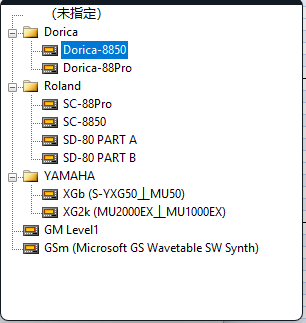

可能这么看上去会一头雾水，我简单来说明一下这张图。

Dorica这个文件夹下的Dorica-8850和Dorica-88Pro是由“节能降耗”汉化的Roland
SC-8850和Roland SC-88Pro音源定义文件。

Roland文件夹下，默认情况下就是上面提到的Roland SC-8850和Roland
SC-88Pro音源定义文件。SD-80可以去Domino的官网下载。*在本教程的第十章，我们会给大家讲解如何下载并导入音源定义文件，也会讲如何编辑音源定义文件。*

不过，既然你已经按照顺序读到这里了，我就简要做一个文字说明。**音源定义文件是XML格式，将你的XML文件复制到domino的文件夹目录里，找到Module文件夹，复制进去，就能在刚才的页面里找到你导入的音源定义文件了。**

YAMAHA栏目下，使用的音源是XG标准。默认状态下有XGb和XG2k。

GM Level1是GM（General MIDI）的标准音源定义文件。

此外也有使用GS标准的，由Microsoft开发的GSm音源定义文件（俗称MSGS）。由于这个音源定义文件的泛用性较差（并非字面意思，这里指的是，GSm音源定义文件相对于Roland
SC系列音源定义文件的参数有较大程度的不兼容性），并且与之配套的MSGS波表性能极为孱弱，**因此在黑乐谱制作中，对于任何初学者来说都应该避免使用MSGS波表以及GSm音源定义文件。**

**笔者在这里特别强调一点：不同的音源定义文件（XG，GM，GS标准）之间的常用参数会出现不兼容的情况。**因此，在编辑MIDI文件之前和打开MIDI文件之前，都需要**检查音源定义文件是否匹配**。一般来说，国内的黑乐谱，特别是使用CC的黑乐谱，普遍使用SC-8850或者SC-88Pro音源定义文件。如果不知道该如何选择，就选择SC-8850（或者汉化版的Dorica音源）。这个音源定义文件是Domino自带的最强大、全面、通用的音源定义文件。

**选择好音源定义文件之后，我们就可以开始接触并了解CC本身了。**

我们把目光拉回到这张图：


别着急，我们先来简单解释一下这些事件都是什么，以及他们起到什么作用。

**第一个，Part Level。中文名电平。初始值100，取值范围0-127。**

作用的话，很简单，用于控制音量，它的用途还是比较广泛的，比如，某些轨道在力度已经顶满的情况下还需要继续增强，就可以利用这个参数进一步增加音量。

**第二个，Part
Panpot。中文名声像。在SC-88Pro或者SC-8850的音源定义文件下，初始值0，取值范围-64~63*（XG和MSGS里定义Panpot的值域是0-127）*。**

声像的作用是调整声音的位置。正常情况下，立体声默认是居中的。当Panpot值为负数时，声音将会偏左，反之当Panpot值为正时，声音会偏右。它会改变声音的默认方位，在需要过渡，或者需要用多种CC效果器来设计音色的时候，Panpot能够起到令人眼前一亮的效果。

**第三个，Reverb Send。中文名混响。初始值40，取值范围0-127。**

混响的效果，简而言之，模拟声音在空间（如房间、大厅）中的反射，增加空间感、距离感和氛围。它让声音听起来不干瘪，变得丰满、自然、有层次。

**之后第四个，和声，也就是Chorus Send。初始值0，值域0-127。**

它通过复制原始声音并进行微调（音高、时间），产生多个相似声部同时发声的效果。让声音听起来更丰厚、温暖、有流动感，像多人合唱或多件乐器合奏，常用于消除合成乐器本身的单薄感。

**第五个，延迟，Delay Send。初始值0，值域0-127。**

延迟带来的影响，是制造清晰可辨的声音重复（回声），这些重复按固定时间间隔出现。它可以增加节奏感、层次感和空间宽度，是非常实用的效果。

**接下来是Modulation，也就是颤音。有些时候也被翻译为调制。初始值0，值域0-127。**

颤音的作用就是让声音“抖动”起来。举个例子，如果你希望用钢琴配合Attack
Time和高频音符来模拟弦乐的质感，适量添加颤音是一个很好的选择。

这里我们先跳过下面的Expression，先讲下面三个参数。你也许注意到了下面有序号为076，077，078的三个CC事件。它们需要和Modulation配合在一起使用。

**第一个是振动频率，也就是Vibrato Rate。初始值0，取值范围-64~63。**

很好理解，取值为负的时候颤音频率比初始状态慢，取值为正则加快颤音频率。

**之后是振动深度，Vibrato Depth。初始值0，取值范围-64~63。**

取值为负的时候振动程度更小，取值为正则加大颤音的作用效果。

**最后是Vibrato Delay，中文名振动延迟。初始值0，取值范围-64~63。**

取值的影响和刚才提到的振动频率和振动深度差不多。Modulation的作用是在音符演奏一定时间之后开始的，这个参数的主要作用就是调整Modulation开始作用的时机。

好的，回到Expression。**Expression的中文名是音量*（不要和Part
Level搞混哦！）*。初始值127，取值范围0-127。在一些场合，我们更习惯称呼他为表情（直译）。**

它的主要作用是用在弦乐或模拟弦乐的场合中，提供常规的力度调整无法替代的，较为细腻的抑扬顿挫。你可以通过Expression的快速跳变，产生类似“断音”的效果，或在音符开始一段时间后绘制曲线，人为削减音尾，亦或者在某些特定位置进行细微的音量调整。这些技巧在面向砸琴和鼓的细化处理当中是尤其实用的。

**下一个，截止频率，Cutoff Frequency。你可以理解为LPF（Low Pass
Filter，低通滤波器）。初始值0，取值范围-64~63。**

主要作用是控制允许通过滤波器的频率范围。调低截止频率会削弱或消除声音中的高频成分，使音色变得更暗淡、柔和或沉闷；调高则让更多高频通过，音色变得更明亮、尖锐或富有冲击力。

**接下来是Resonance，共鸣。初始值0，取值范围-64~63。**

主要作用是：通过提升滤波器截止频率附近的音量，让音色产生“峰点”或“啸叫感”，从而大幅改变音色的谐波特性和表现力。

在不同数值范围内，Resonance会产生不同的效果。当Resonance值较低时，声音会更加平滑自然（消除共振峰值）。随着参数值升高，Resonance会使得声音变得更加尖锐，富有金属感或类似鼻音的效果。而达到极高值时，会使得滤波器产生自激振荡，产生一个类似正弦波的纯音，即使音符本身和这个音高没有关系（这个凭空产生的峰值没有任何谐波）。

不难看出，这个效果器配合刚才提到的“截止频率”使用，是一种非常实用的处理方法。Resonance本身可以在滤波器截止频率点附近创建一个突出的共鸣峰，当截止频率移动时，共振峰也会随之移动，使扫频效果更具动态和戏剧性。此外，Resonance效果在现代电子音乐中扮演了重要角色。除了上面提到的，它还能突出旋律线，让声音在混音中更突出，带有穿透力；或者用于塑造人声或特殊音色，比如模仿元音特征或创造特殊音效。

**最后三个。我们可以合在一起来讲。它们在本质上控制的是同样的东西（稍后介绍）。**

**先来看Attack Time。译名起音。初始值0，取值范围-64~63。**

主要效果是控制音符从无声到达最大音量（或指定强度）所需的时间。当CC值低时，声音瞬时触发，适用于打击乐（如鼓、砸琴），产生干脆、有冲击力的听感；而当CC值高时，声音缓慢浮现，营造渐入、铺垫或“飘入”效果，常用于氛围铺底、弦乐背景或渐强的音效。它是塑造音头性格的关键。

**Decay Time，衰减。初始值0，取值范围-64~63。**

主要作用是控制声音从峰值电平下降到后续持续电平（Sustain
Level）的时长。CC为低值时，音头后迅速减弱至持续电平，形成陡峭的下降，适合弹拨类或瞬态明显的音色。而CC值升高后，会使得音头后缓慢减弱，制造更悠长的尾音过渡，常用于合成主音或延音类音色。它决定了音头后主体的“斜坡”形态。

**最后是Release Time，释音。初始值0，取值范围-64~63。**

主要作用是控制音符松开（Note
Off）后，声音从当前电平衰减至完全无声所需的时间。当CC值较小时，音符结束即停止，干净利落，适合节奏性、断奏音型。而当CC值较高时，音符结束后声音仍持续衰减，形成回响、拖尾或“渐隐”效果，用于创造连奏感和空间感。释音时间是决定音符“尾巴”长短的灵魂。

以上就是我们在MIDI初始化部分用到的CC。不过，我们常用的CC控制器不止这些。

我们现在先把目光拉回到上一章设计的“事件图形”：


第一个图标是Velocity。这个不是MIDI
CC，它的意思是音符力度。这里不多做解释。

第二个图标是Pitchbend。中文译名弯音轮。初始值0，取值范围-8192~8191。这是之前没有涉及到的事件类型。

**Pitchbend（弯音）不是一个标准的CC控制器。**它是一个独立的、高精度的**MIDI通道信息**，其核心效果是实时、平滑地改变音符的音高，实现滑音、颤音、微音程等富有表现力的演奏效果。它的主要作用在于两点：

首先是**动态音高偏移**。Pitchbend可以在演奏中连续地升高或降低一个或多个音符的音高，创造出平滑的滑音（Glide/Portamento）或音高波动效果；其次是**增强表现力，**它是模拟真实乐器（如吉他推弦、小提琴滑音、人声转调）和电子音乐音效（如声音扭曲、上升下落效果）的关键MIDI信息。

关于Pitchbend的技术特性，由于它过于复杂，我们将在后面做更细致的讲解。

按照图标顺序，下面的图标分别是Modulation，Expression，Part Level和Part
Panpot。这些参数在之前已经做过介绍了，这里就一笔带过了。

**接下来这个类似锁一样的图标是Hold。Hold的MIDI
CC编号是64，初始值0，取值范围0-127。**它是一个用于模拟钢琴延音踏板功能的控制器，其核心作用是：在MIDI音符结束后，仍让声音持续衰减，从而创造更连贯、饱满的连奏效果。

通常而言，Hold的作用效果在标准情况下是**不连续的**。也就是，它并非像真实的钢琴延音踏板一样，随着踩下的深度不同会有较为连续的效果变化。它在一般情况下**只有开和关两种状态**，取决于发送给它的值。

首先是发送64-127之间的值，此时会开启延音，所有正在发声的音符，以及之后触发的音符，其释音（Release）阶段都将被“悬停”。音符结束时不会立即开始衰减，而是继续按照乐器的包络或样本的自然衰减发声，直到收到关闭指令；另外一种就是发送0-63之间的值，这时关闭延音。所有音符恢复正常的释音行为，那些被“悬停”的音符开始进入释音衰减阶段。

这里我们可以做一个小结，即它主要影响的是释音（Release）阶段，而非音符本身的长度。即使MIDI音符事件（Note
On/Off）已经结束，声音依然因CC
64的开启而得以延续。另外，Hold和之前提到的Release
Time有一定区别：Release Time控制的是从音符结束到声音消失的衰减时长，而CC
64则是一个开关，它决定是否立即启动这个衰减过程。我们可以将两者配合使用，比如，Release
Time+延音踏板，能产生非常悠长、逐渐消散的尾音。

后面的两个图标是Cutoff
Frequency和Resonance。之前也已经介绍过他们的用法了，这里不展开解释。

最后的那一个比较特殊，**它的名称是Master
Volume。中文名全局音量。默认值127，取值范围0-127。**

发送值为0时，全局静音。发送值为127时为最大输出电平。之间的值是线性或对数变化的音量电平，多数情况下响应曲线符合人耳的听觉特性。它的作用效果和Part
Level以及Expression有一点相似，但在根本逻辑上有比较大的不同。

**请注意，Master Volume不是标准的MIDI
CC控制器*（尽管它在SC-8850定义下确实被分配了CC
180的编号）*。**它在Roland
SC-8850音源定义文件中的作用是：**用于调节设备的整体音频输出电平，即主音量控制。**具体体现在直接控制SC-8850定义下的最终模拟音频输出电平。**<u>它作用于所有通道和所有声部混合之后的总信号。</u>**

**技术层面上，它是一个系统独占控制器，在Roland
GS的音源架构中，通常被保留用于系统级别的全局控制，而不是乐器音色层面的控制。**

关于它的相关理论和技术内容，我们稍后再做详细解释。

现在，我们可以来看看这些控制器该怎么操作了。

### 3.3.5 常用控制器的简易操作手法

这一章里我们将会对MIDI
CC直接上手操作。不需要图片介绍，请你用你的耳朵来感受MIDI
CC对音符造成的显著或细微的效果。

第一部分，我们只需要了解几个常见控制器即可。即使到了VST一统天下的时代，这些控制器依然在起着举足轻重的作用。首先向大家说明两种控制MIDI
CC（以及虽然不会在这里讲，但是提一句的，你们之后会接触到的，VST
Parameter）的方法。第一种方法是固定值。在轨道开头（或者第一个音符开始演奏的位置）事件列表中添加单个MIDI
CC事件。第二种方法就是自动化。在事件图形栏目里绘制包络线（自动化曲线）来控制。

首先先说如何添加CC事件。**在菜单栏目点击“插入”或按下Alt+I，选择Control
Change（或按下C键）即可在当前轨道的播放进度条位置处插入一个空的CC事件。**

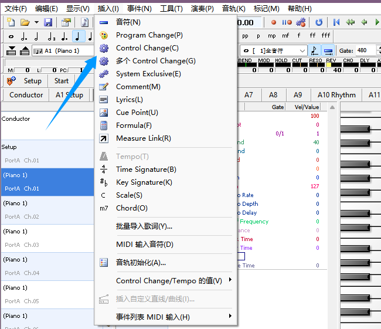

空的CC事件默认是CC128（这不是标准CC编号），在SC-8850音源定义下，CC128为休止符（Rest），没有任何实际用途，并且在导出MIDI文件后该类型的CC事件会被**直接删除**（通俗点说，这就是个占位符，最大的作用就是没有作用）。

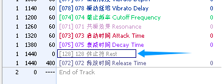

我们进入事件列表，双击刚才添加进去的事件，就可以更改事件类型与其赋值了。这个栏目叫做“事件属性”。它长这样：

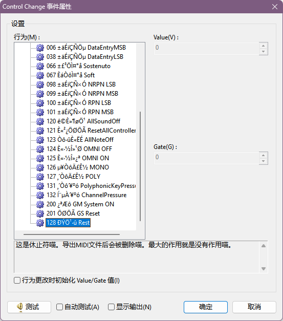

这里左侧的文字由于编码问题，显示的都是乱码。不过没关系，我们以乱码右侧的英文名称为准。我们在左侧的小窗口当中向上滚动滚轮之后，可以看到这样的文件夹结构：

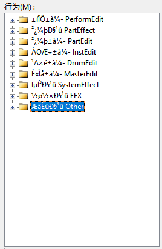

我们在整个音源定义文件中的所有类型的CC（包括SysEx以及EFX事件）都能在这里找到（它们非常非常多）。**另外，建议各位在开始学习这一部分内容之前先打开这个目录，手动检索并记忆一下常用CC的位置。**

回到上一张图。左侧的行为代表了当前指定该事件的MIDI
CC类型。右侧的Value代表当前事件设定的参数值（反映到MIDI
CC的真实作用）。Gate值对于MIDI
CC事件来说没有任何意义，忽略。底下的注释部分会描述当前所选择的MIDI
CC的实际用途。

事件图形里，当你选择其中一个具体的CC控制器之后，它就相当于自动化窗口，你可以用画笔工具来绘制曲线，让特定位置的MIDI
CC自动变化。这会体现在事件栏里，你会发现事件栏目里多了一堆东西。这些就是描述CC变化过程的直接证据。

如果你不想手动添加一个空的事件，想要直接在某一个位置初始化或者标记一个包络线的起点，也是可以的。我们利用事件图形左侧的小数字，点击他们可以直接在播放进度条的位置上生成这个值的对应CC事件。就像这样：

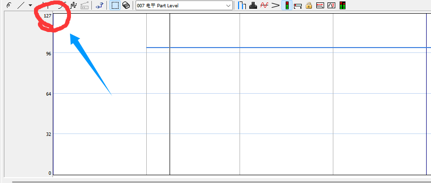

你可以在点击之后查看事件列表，对应位置此时会生成一个CC事件。你可以直接更改这个单一CC事件的值，也可以从这里开始着手进行自动化的绘制。

我们按照上一节的顺序讲解各个控制器的行为。

第一个，Part Level。在PartEdit里找到编号007的就是。

其实一句话就能概括，更改音量，默认值是100，没有任何多余的效果。试着用画笔工具在事件图形里画一条曲线，看看音量会怎么变化？还有个叫Expression的，编号011，看看这两个家伙怎么共同改变音量？

第二个，Part Panpot。PartEdit内找到编号010即可。

默认情况下它在中间，也在事件图形的中间，如果用画笔工具把他拉偏，听听看会怎样？声音是不是在左右耳来回跑动？

第三，发送效果，这三个干脆放在一起讲吧。也就是在PartEffect里找到编号为091/093/094的Reverb
Send，Chorus Send以及Delay Send。

Reverb默认值40，剩下两个默认0。改变它的值，看看混响是不是让声音更空旷，和声让声音更油润肥厚，延迟让声音有空间感？一定要仔细听哦！

第四个，Modulation，调制。

对，就那个，最顶上的。Perform Edit。点进去，选上Modulation。

Value范围提示是0-127。默认状态下是0。直接拉满然后放下一个音符听一听会是什么效果？

没错，音符在抖动！（当然，是音高的抖动。）

这代表Modulation默认调制的是Vibrato，也就是颤音，更通俗一点解释，就是音高周期性的微弱变化。关于Vibrato的CC，我们在刚才简要介绍了它的功能。你可以在之后动手试试更改他们的值，听听Modulation会有什么不同的效果。

接下来第五个，Cutoff
Frequency。在InstEdit里找到它。其实就是个低通滤波器，往0以上弄效果有限，试试把这个值拉到负数，看看音色是不是变暗了好多？

来到Resonance，也在InstEdit里。正区间内效果会很明显，听听看，有没有感觉有一个特定的频率上非常明显，非常抢耳朵？如果和Cutoff一起使用呢？试试看！

最后三个都在InstEdit里，先来试试Attack。只需要稍微来一点点正值就能把钢琴的音头干掉，你看，钢琴确实变成了一架风琴，对吗？Decay的话，改变声音衰减，不过用处不大，可以先不看它。试试Release，把它拉到负值，拉到足够低的时候，就能重现出你想要的日系Hi-Tech当中非常干脆利落的的钢琴音色，再试试把他拉大，声音是不是更绵长了？

踏板和弯音轮刚才介绍过了，不用费劲找，直接点图标就行。现在动手试试，看看踏板拉到127的时候是怎么让钢琴的声音一直延续下去的，或者再听听弯音轮的高低怎么扭曲琴弦？快去试试！

最后动一下主音量，直接拽到0，全体静音！或者，放在曲子末尾，让它缓慢下行，模仿上世纪流行乐的经典淡出？

### 3.3.6 不同控制器的搭配实例

其实刚才我们已经讲了一点点控制器的搭配了。不过真正能称之为绝配的效果器，一般都是有相近的特征，或者在作用上有不可分割的成分。

**首先不得不提到Part
Level和Expression。**这两个都改变音量，你可以试试用Expression来控制细微的情感变化，再用Part
Level调控整个轨道的音量。技术上，他们的音量实际上是个乘算的关系，也就不难推导出艺术上这一组控制器一个总体一个局部的作用了。

通俗点解释吧。Part
Level是水管总闸。它控制的是整个MIDI通道的基础输出电平。你把它拉低，这个通道里所有音符的整体音量都跟着降；你推高，整体就响起来。像一个全局的基准线，决定这个乐器在混音里“大概在哪个音量层次”待着。

Expression更类似微调旋钮。它在Part
Level设定好的总闸开度之内做精细的实时起伏。推高不会超过总闸的上限，拉低可以让声音慢慢淡下去，但永远不会比总闸更大声。像一个演奏家的呼吸和手腕，在音量上限之内做所有细腻的强弱变化。

这两个应用上的区别也很明显。前者是静态的、混音层面的、一次设定基本不动的东西。后者是动态的、演奏层面的、从头到尾都在动的东西。举个例子你就明白了：比如你录了一段弦乐，Part
Level定在100（上限留一点余量），然后你用Expression画一条起伏的曲线：乐句起头轻轻推起来，中间高潮推高，句尾慢慢收掉。这时候音量确实在变，但永远不会超过Part
Level设的100。如果你把Part
Level降到了60，那你Expression就算推到头，音量也只能到60，整个乐句被整体压暗了一层。

这俩其实也应该用在不同的地方。Part
Level的主场是调音台，不是演奏台。它应该出现在轨道初始化的时候，或者混音阶段调整各乐器平衡的时候。比如你的弦乐轨太响了盖住钢琴了，你就把弦乐的Part
Level从100拉到78，整体降一截。但一旦定下来，后面整首歌的自动化里基本不会再动它了，除非你想做段落性的整体音量切换，比如Bridge段落整体弱一层，那也可以用Part
Level做阶梯式的下降，但注意是阶梯不是曲线。

Expression的主场是演奏本身。它应该出现在每一个乐句里，模仿真实乐器的呼吸感。弦乐拉一弓，声音是从弱起到强再到收的弧线，这个弧线用Expression画出来。管乐的吐气、人声的句子起伏、吉他的拨弦轻重，通通可以用Expression来做。

很多人都会犯这个错误：直接用Part Level画动态起伏。

比如今天觉得这段小提琴不够响，推一把Part
Level；明天觉得那句太突出了，又拉一把Part Level。结果整首曲子里Part
Level上蹿下跳，到了混音阶段想整体调整弦乐音量时发现根本没法动，因为Part
Level里已经全是数据了，推子一拉整个表情曲线就毁了。正确的做法是：Part
Level只定一次，后面再也不碰。所有动态变化全交给Expression。
这样你在混音阶段想整体降弦乐音量，只需要把Part
Level的初始值从100改成80，所有Expression画的细腻起伏会等比缩放，一个动作搞定全局。

这里我们来讲几个情景，看看他们有什么参考用法。我们用无论是做黑乐谱还是做常规音乐都可以用这个思路，只是乐器的实现不一样。

场景一：弦乐群。

Part
Level先定在90左右（别满，给后期留余量）。然后Expression在弱的地方轻轻托着，渐强的地方慢慢推上去，强的地方推到接近90，结尾慢慢收下来。这样出来的弦乐是有呼吸的，像真人在拉。

场景二：人声主旋律。

Part
Level固定在一个让你在混音里听得清但不爆的位置，比如85。Expression跟着歌词的轻重音走，每个乐句的起音稍轻，核心字眼推一点，句尾收。副歌整体Expression比主歌高出一截，但注意别推到顶，留点余地给情绪最高点再冲一下。

场景三：长音Pad铺底。

Part
Level定中低位置，比如65，因为它不需要抢戏。Expression做非常缓慢的波浪起伏，像呼吸一样，每四小节一个小起落，让这个静止的长音听起来在活着而不是死气沉沉。

场景四：钢琴独奏。

这俩反而用得不多，因为钢琴通常靠力度（Velocity）就够表达表情了。但如果你用的是柔和的钢琴铺底，可以用Expression做整句的渐强渐弱，Part
Level仍然不动。

这时候可能有人要问了。Part Level定多少合适？

一般别超过100，给Expression留一个冲刺的空间。想一想，Part
Level如果定在127顶满了，那Expression到哪个位置都已经是最大声了，推到头和推到80没区别，等于Expression的变化余量被压缩没了。所以Part
Level在90到100之间是个好区间，这样CC
11从70推到110还有整整40个数值的空间可以做起伏。反过来，如果Expression定在70，那CC
11就算推到127，实际音量也只相当于Part
Level在70时的满值，整个乐器在混音里偏弱。除非你本来就是想要个背景音色，那没问题。一个靠谱的经验是：Part
Level不顶满，Expression在70到120之间活动。
这样既有表情空间，又不会顶爆，后期混音还有余量可以用推子补。

**再者是Cutoff
Frequency和Resonance。**这两个都算滤波器，区别在于一个负责切，一个负责扭。如果你有兴趣读一读有关信号处理的内容，就会发现滤波器和共振峰密不可分，截止频率处就是Resonance可以大放异彩的地方。Resonance数值小，切得干净利落；数值大，那个频点会发出“哇——呜——”的感觉，甚至会有自激振荡。试着找一找你想要的截止频率，不妨让Resonance在上面疯狂扭曲这一点的音色。

这两个控制器大概会呈现出四种风味。

两个都低的话，声音发闷，没有攻击性。适合用在低景铺底Pad和远距离环境音上。

Cutoff低，Resonance高，相当于在低频某个点鼓了一个包，类似鼻子不通气。一般用在科技感低音（Dubstep的Wobble
Bass）或者构建暗黑氛围。

Cutoff高，Resonance低，简而言之，明亮通透、直白、有穿透力。非常适合主音Lead、钢琴高音区、以及任何需要清晰度的音色。

如果都高的话，会很亮，很尖锐，很扎耳朵，非常有存在感。用法也很多样，比如Acid
Bass（303那种经典“滋滋”声）、Dubstep
Growl、Lead、过渡扫频（Sweep）高潮部分。不过要注意，最好别Resonance拉太高又推Cutoff，容易音箱的高频单元送走，也容易把听众的耳朵送走。

其实静态控制只是他们的一小部分，动态控制往往是电子乐的灵魂。Cutoff慢慢推高，相当于从暗到亮，像幕布拉开；Resonance同时跟着推高，越来越亮且越来越尖。Cutoff快速来回扫（LFO），做出的抖动效果多用于Dubstep
Wobble和Trance
Gate。或者，Cutoff推高但Resonance拉低，那种亮但不刺耳，干净有力的音色提供了高级的Tech
House质感。而反其道而行之，Cutoff拉低但Resonance极高，听起来很闷但有个尖锐的鼻音，不妨联想一下恐怖片音效和雷达声。

**接下来，试试Hold和Release。**Release拉负能让钢琴变干脆。但如果你在同一首曲子里，主歌用Release负值的短促钢琴做节奏型，副歌把Release推高变绵长，同时踩下踏板（CC
64=127）让它自然延音，你就能用同一个钢琴音源弹出两种完全不同的性格。短促的时候像在敲击，绵长的时候像在歌唱，不需要换音色，只需要自动化两条参数。反过来，如果你的Release已经拉到很负，这时候踩踏板其实效果不大，因为琴弦根本不延。所以这俩的搭配逻辑是Release决定“能延多久”，踏板决定“延不延”。Release不够长的时候，踏板踩了也没声音给你延。

**还有个组合拳，试试Expression联用Cutoff和Chorus。**Pad或者长音最怕一动不动，你可以在四小节里画一条Expression的波浪线（音量微微起伏），同时Cutoff跟着这个波浪线做反向运动：音量起来的时候Cutoff暗一点，音量下去的时候Cutoff亮一点，制造一种此消彼长的呼吸感。然后，在副歌段落把Chorus
Send从0推到40左右，那个原本有点单调的Pad会突然蓬松起来，变宽变厚。如果加Reverb的话也可以，不过在这个组合里不要动太多，因为Pad本身已经很长了，再加混响容易糊成一团。让它待在40的默认值就行。

**低音部分也有的玩，Expression可以联用Cutoff和Resonance。**Bass最怕两件事：太响盖住底鼓或者太平淡没有律动。你可以把CC
11用来做Bass的呼吸，比如每一拍的重音稍微推高一点，弱拍收一点，形成“嗡——嗡”的律动感，和底鼓（砸琴）的Kick错开峰值。同时Cutoff跟着乐句走，长音的时候微暗一点，短促的音符亮一点，让Bass游走。Resonance可以默认或者开一丢丢，不要让它发出难听的叫声，只要让Cutoff那个切点有一点点存在感就行。这样出来的Bass既有音量上的律动，又有音色上的明暗变化，比单纯靠Velocity控制力度要细腻得多。

**最后就是第一种情况的变体，加入Modulation。**这个是管乐和弦乐的黄金标准。你先用Part
Level把通道音量定在90，然后Expression画乐句的强弱起伏，例如每一句起音轻推、中间保持、句尾收回。同时Modulation在长音上微微推一点，让音高有一点周期性抖动，模仿演奏家的揉弦。注意这俩的配合时机：Expression先起来，Modulation后跟进。真实演奏中，演奏家是先给气（音量起来），再揉弦（颤音加入）。如果Modulation和Expression同时起，听起来反而假，因为太同步了。稍微错开那么一丁点，对味了。

我们刚才所提到的这六种用法实际上只是冰山一角。上一节所讲的这一堆参数其实可以分三类。第一类是音量，也就是Part
Level和Expression；第二类是空间，比如Panpot、Reverb、Delay、Chorus，用于定义声音在哪里或者周围有什么。第三是音色部分，Cutoff、Resonance、Attack、Release、Modulation，决定声音听起来像什么样。理想的搭配，大概遵循每一类各拿出一个的原则，让它们同时动起来。比如Expression推高，Panpot左移，同时Cutoff变暗再把Reverb推高，听起来就是声音从右边远处慢慢走过来、变亮、变近、同时环境感增强，这是一个声音移动起来，动态的的完整叙事。你单独动任何一个都只是一个效果，四个一起动就是一段情节。单个CC是调料，搭配起来才是菜。体积、位置、空间、音色、演奏法，这些维度只要同时动起来两个，声音就一定是富有变化而动听的。

### 3.3.7 控制器使用过程中的注意事项

好，这个问题问得特别到位。前面聊了那么多（或者你也试了很多）控制器的玩法，现在该聊聊别踩哪些坑了。控制器用不好就是灾难。

**第一条：Part Level和Expression别反着用。**

这是新手最常见的错误。Part
Level是用来定天花板的，Expression是用来在天花板下面跳舞的。但你经常能看到有人用Part
Level画强弱起伏，今天觉得这段不够响推一把，明天觉得那句太突出了拉一把，结果整首曲子里Part
Level上蹿下跳。

后果是什么？比如在DAW里，到了混音阶段，你想整体把弦乐音量降3dB，发现推子根本动不了，因为Part
Level里全是自动化数据，你一动推子，播放到下一个Part
Level事件就被拽回去了。你只能一条一条去修那些密密麻麻的Part
Level节点，修到怀疑人生。

正确做法：Part
Level只写一次，放在轨道开头，后面再也不碰。所有动态起伏全部交给CC 11。

**第二条：控制器不要顶满。**

不管是什么控制器，如果你不明确有顶满的需求，尽量别把数值拉到极值。Expression拉到127意味着表情推到顶了，后面再有情绪高潮就没地方去了，等于你把嗓门喊到最大，后面只能破音。

留一点余量。比如Expression最高到120左右，Modulation最高到115左右，Resonance最高到+50左右。这样你在混音或者实时演奏的时候，还有最后一口气可以冲。这跟混音和母带里留出动态余量是一个道理。

**第三条：发送效果（Reverb/Delay/Chorus）别三个都推高。**

你把Reverb推到80，Chorus推到70，Delay推到60，听起来好像很丰富，实际结果只有一个字——糊。声音像掉进了一锅粥里，音头、清晰度全没了。

这三个发送效果的工作分工非常明确：Reverb给声音加空间，让它有远近感；Delay给声音添加回声，让它有层次和节奏感；Chorus给声音加厚度，让它变宽变肥。三者选其一为主，另外两个为辅。比如人声部分或者主旋律，通常Reverb是主力（40-50），Delay给一点点（10-15）做厚度，Chorus可以不动。弦乐群，Chorus是主力（30-40），Reverb给一点（20-30）做空间，Delay基本不用。

**第四条：Resonance别过头。**

一个比喻——Resonance是灶台火，火大了会把菜烧糊。在DAW里，Resonance推太高，会在Cutoff那个切点产生一个极尖锐的峰，这个峰不仅刺耳，而且会吃掉周围其他频率的能量，让你的音色变得又尖又空。

还有一个更隐蔽的问题：高Resonance加上高Cutoff，在监听耳机里可能听着很爽，但到了手机喇叭和蓝牙音箱上，那个尖峰会被这些设备糟糕的高频响应放大，变成令人很不愉悦的刺耳声。别人听你的曲子第一反应就是“这啥玩意儿这么刺”。

Resonance保持在+48以内比较安全。超过这个值，你需要非常清楚地知道自己为什么要这么做。

**第五条：Attack和Release别过头。**

Attack拉一点点就可以干掉音头，让钢琴变风琴，这个效果本身没问题。但如果你所有音色都把Attack拉大，整首歌会没有任何冲击感，听起来软绵绵的像在棉花里走路。底鼓没了音头就不叫底鼓了。

Release拉到负值可以让钢琴变干脆，但别在需要延音的乐器上这么干。比如弦乐、Pad，你把Release拉太负，音符一结束声音立刻断掉，听起来像被掐了脖子，完全没有拉弓或者持续发声的感觉。

Attack和Release的调整原则是：根据乐器的角色来定。打击乐、钢琴、吉他这些需要音头的，Attack别动太多。长音铺底、弦乐这些需要连续感的，Release别拉太负。

**第六条：Modulation别一上来就推满。**

Modulation默认控制的是Vibrato（颤音），也就是音高的周期性抖动。你一上来就推到127，音符一响就“呜呜”地狂抖，听起来像在寒风中唱歌，又像故意捏着嗓子搞怪。真实乐器演奏中，颤音是慢慢加进去的。长音的前半段通常没有颤音或者极轻微，音持续到一半的时候颤音才逐渐加入，句尾可能加重。所以你画Modulation的时候，应该是一条缓慢爬升的曲线，而不是一个方波，要么0要么127，那叫开关，不叫表情。

**第七条：Panpot不要左右乱动。**

你把Panpot画一条正弦波，声音在左右耳之间来回跑，这个效果本身没问题，但它只适合特定场景或者某段过渡音效。如果整首歌的钢琴都在左右乱甩，用耳机听的听众会直接摘耳机。Panpot的自动化要有目的，或者有明确的空间移动叙事。别让它无规律地随机摆动。

**还有一个重要原则：低频乐器（Bass和Kick）永远在中间。别动它们的Panpot。低频没有方向性，左右乱摆只会让混音失去根基。**

**第八条：自动化曲线要尽可能平顺，不要跳变。**

你在画Expression或者Cutoff自动化的时候，如果节点之间是直线或者曲线过渡，声音变化是平滑的。但如果你画了一堆密集的、方向乱变的节点，控制器数值会在极短时间内上下跳跃，声音会出现卡顿感或者喘气感，尤其是Cutoff。数值一跳，音色就突然变亮又突然变暗，听起来像接触不良的收音机。

画控制器曲线的时候，保持节点的方向性和节奏感。一个乐句内，要么持续上升，要么持续下降，要么平滑波动，别在四拍里画十几个峰谷。控制器自动化也是演奏的一部分，它需要呼吸和逻辑。

**第九条：不要忘记复位。**

这是一个经常被忽略的问题。你在A段把Reverb推到了80做空间感，到了B段想回到正常的40，但你忘了写复位事件，结果B段的空间感还是80，整个混音的空间层次就乱了。

凡是做了控制器自动化，在段落切换的时候记得把数值复位。即使现代DAW都有遍历CC和VST
Parameter的功能，也要这样做。尤其是在轨道结尾，写一个把所有控制器归零或者回到默认值的事件，防止下一首曲子或者下一个循环播放的时候带着上一段的控制器数值。这跟弹钢琴松踏板是一个道理。不松踏板，下一个和弦就是糊的。

**最后一条：听，比看重要。**

最后一条，也是最根本的一条：不要用眼睛画控制器，用耳朵听。

很多人打开钢琴窗或者事件列表，盯着网格画一条完美的曲线，心里觉得“画得真漂亮”，结果播放出来完全不是那么回事。画得再好看的曲线，如果听上去不自然，就是废的。

画完一段控制器自动化，闭上眼睛听。听整体走向对不对，听细节有没有“跳”或者“卡”，第三遍听它和音乐的情绪是不是匹配。眼睛会骗你，耳朵不会。

**我们把这十条总结下来就是三个核心原则：**

**分工明确，保留余地，听感优先。**

### 3.3.8 不常用控制器（选读）

前面我们说的这些主要都是常用控制器。在SC8850里还有很多控制器是不常用的，下面我们稍微了解一下就行。

你可以在刚才包含全部CC控制器的界面内找到这些。这些平时不常用所以不用刻意记住他们平常待在什么地方，现找现用就行了。

**第一个：Bank Select（CC 0 + CC 32），音色库切换的钥匙。**

这俩是成套用的。CC 0是高位（MSB），CC 32是低位（LSB）。SC-8850里，CC
0通常固定为某个值，而CC
32决定了你调用哪个音色库。在这个情境下他们有以下对照关系：

CC 32 = 0（00H）——面板当前选择的音色库。

CC 32 = 1（01H）：SC-55 兼容音色库。

CC 32 = 2（02H）：SC-88 音色库。

CC 32 = 3（03H）：SC-88 Pro 音色库。

CC 32 = 4（04H）：SC-8850 原生音色库。

这个设计的用意是什么？兼容老文件。你拿一首当年给SC-88编的MIDI放到SC-8850上播，只要文件头里带了Bank
Select信息，SC-8850就知道“该用SC-88那套音色映射”，出来的声音和当年一模一样。这是一种向下兼容的逻辑。

**第二个：Portamento Time（CC 5），滑音速度旋钮。**

这个控制器单独用没效果，它需要和CC 65（Portamento开关）配合。CC
5的数值决定滑过去要多久，数值越小滑得越快（0就是瞬移，等于没滑），数值越大滑得越慢、越黏糊。比如你把CC
5设在80，然后打开CC
65，从C4弹到E4，你会听到音高像拉橡皮筋一样慢慢地抻过去，而不是跳过去。电子乐里的Bass滑奏和Synth
Lead的过渡句，全靠这个。

**第三个：Data Entry（CC 6 + CC 38），RPN/NRPN数值写入器。**

这俩是数值搬运工。CC 6（高位）和CC 38（低位）负责把数值写进去。CC 6和CC
38的区别在于精度：CC 6粗调，CC
38细调。合起来是14位精度（0-16383），比普通CC的7位精度（0-127）好得多。

**第四个：RPN组合（CC 100 + 101），参数选择器。CC 100是RPN
LSB（低位），CC 101**是RPN
MSB（高位）。这俩组合起来选中的是标准RPN参数，由MIDI协会统一规定，所有兼容设备都认。

三个最常用的RPN编号：

RPN 0（CC 101=0, CC 100=0）：Pitch Bend Range，弯音范围。

RPN 1（CC 101=0, CC 100=1）：Channel Fine
Tune，通道精细调音（单位是音分）。

RPN 2（CC 101=0, CC 100=2）：Channel Coarse
Tune，通道粗调音（单位是半音）。

不常用的还有：

RPN 5（CC 101=0, CC 100=5）：Modulation Depth
Range（调制深度范围，也叫颤音幅度）。

另外，CC 100和CC 101在值为127时，都代表禁用。

具体用法是，选好RPN编号之后，用CC 6 + CC 38写入具体数值。

注意一个坑：**RPN是模态的**。你选中了一个RPN之后，所有后续的CC 6 + CC
38数据都会作用于这个参数，直到你重新选另一个RPN或者发一个RPN Null（CC
101=127, CC 100=127）来解除锁定。如果忘了解除，后面想用CC
6控制别的参数就全乱套了。

**第五个：NRPN组合（CC 98 + 99），厂商私有参数选择器。**

CC 99是NRPN MSB（高位），CC 98是NRPN
LSB（低位）。这俩和RPN那套逻辑一样，区别在于NRPN是厂商自定义的私有领地。Roland、Yamaha、Korg各自定义各自的NRPN映射，互相不通用。

选中NRPN之后，同样用CC 6 + CC
38来写入数值。GS音源里大量高级参数（比如各声部的滤波器、包络、LFO深度）都是通过NRPN来控制的。

**第六个：All Sounds Off（CC 120），急停按钮。**

收到这个控制器的瞬间，当前通道所有正在发声的音符立刻静音，不留任何尾音，混响和延迟的尾巴也被一刀切掉。它就是紧急情况下的物理刹车。现场演出的时候如果某个通道出了状况，发一个CC
120就能让它立刻静音。

**第七个：Reset All Controllers（CC 121），一键复位。**

这是比CC 120更温和的复位。它把所有控制器的数值恢复到默认状态：Pitch
Bend回中（0）、Modulation归零（0）、Expression回满（127）、Hold
1松开（0）、Portamento关闭（0）、Panpot回中（64）、RPN和NRPN的状态也回到初始。

注意一个细节：RPN和NRPN的当前编号不会被复位。意思是如果你之前选中了某个RPN参数，发CC
121之后这个选中状态仍然保持，后续的CC
6数据还会继续写进那个参数。这个问题很容易被忽略，很多人发了CC
121之后以为全部清空了，结果CC 6还在偷偷改着弯音范围。

**第八个：All Notes Off（CC 123），正常关音符。**

和CC 120的区别在哪？CC 120是强制静音，CC
123是正常关音符。音符会正常走完Release阶段，如果Hold（延音踏板）还踩着，这些音符会继续被延长，不会被强行掐断。这个设计很人性化，你只想停下演奏但不想砍掉回声就用CC
123；你想立刻静音就用CC 120。

**第九个：Mono/Poly（CC 126 + 127），单音、复音切换。**

CC
126（Mono）：切换到单音模式。同一时间只能响一个音，后弹的音会切断前一个音。适合模拟管乐和Bass滑奏。

CC 127（Poly）：切换回复音模式。正常的多指和弦，手指按几个键就响几个音。

切换之后还会附带一个All Notes Off的效果，清空当前所有发声的音符。

**第十个：Portamento Control（CC 84），指定滑音的起点。**

这个控制器和CC 5 + CC
65的玩法不一样。它不是开关也不是速度，而是从哪个音开始滑。用法是：先发一个CC
84，数值指定一个MIDI音符编号（比如C4=60），然后你再弹另一个音（比如E4=64），发声器会从C4平滑地滑到E4。

这个东西在吉他滑弦和电子音效里特别常用，因为它让你能精确控制从哪滑到哪，而不是从上一个弹的音开始滑。

**最后是SC8850的专属，也就是Master Volume（CC 180）。**

CC
180在SC-8850里控制的是整个设备的总输出音量，也就是硬件面板上的总音量旋钮。它和CC
7（通道音量）的区别在于，CC
7控制的是单个通道的音量，16个通道各管各的；而CC
180控制的是所有通道加起来的总输出。

它默认值是127（最大）。如果你想做整首歌的渐弱淡出，用CC
180画一条从127缓慢降到0的曲线，效果比单独拉某个轨道的CC
7要整齐干净，因为所有通道包括混响延迟的尾巴都会同步收掉。

**这些东西也可以串起来用。**

**第一个例子：弦乐表情精细化。**用CC
73把Attack往正拧一点（音头变软），CC 72往正拧一点（Release变长），CC
78往正拧到中高位置（颤音延时加入），CC
77往正拧一些（颤音深度增加）。出来的弦乐是“起音柔和、尾巴绵长、先直后抖”的感觉，接近真实弦乐的揉弦效果。

**第二个例子：电子乐滑音。**先用CC 101 + CC 100选中RPN
0（弯音范围），用CC 6 + CC 38写入12（半音）。然后用CC 5把Portamento
Time设在70-90之间，CC 65打开滑音开关，最后用CC
84指定起始音，弹目标音。声音会从指定音平滑地滑到目标音，滑一个完整的八度。

**第三个例子：段落切换。**在一段演奏结束后，发CC 123关掉音符，发CC
121复位所有控制器，再用CC 100 + CC 101发送RPN
Null解除RPN锁定。三个事件连发，轨道状态被彻底归零，下一段从干干净净的状态开始。

**常规的CC几乎次次出场，但是当你的确需要这些特种工具登场的时候，最好知道他们各自的作用。**

### 3.3.9 控制器相关理论、事实与特征（选读）

前面我们已经简单介绍过一部分控制器了，接下来让我们详细了解一下这些控制器的事实与特征。

**<u>这段没有图片，只有文字叙述。如果你认为本节的内容对你的实际操作帮助不大的话，可以在之后的学习中继续阅读。对于初学者而言，下面的内容留给大家选读。</u>**

现在，我们开始***较为硬核***的理论教学。在这一节当中，我们将要详细了解之前提到的控制器在理论方面所起到的具体效果。和刚才我们介绍这些MIDI
CC的顺序相同，我们一个一个来说。**我将用精确但并不完全易懂的语言来讲解，不过不用担心，你完全可以随时停下来仔细阅读，慢慢理解，并查阅相关资料。希望这些内容能够帮助你更好的了解MIDI
CC。**

**首先，我们把Part Level（CC#007）和Expression（CC#011）放在一起来说。**

这两个参数的控制属于演奏表情控制层，与音符开关、音高这些“刚性”信息分离，实现了音乐表达中音量和强度的精细化与艺术化管理。

**Part
Level和Expression的主要作用都在于塑造音乐动态与情感。**不同点是，Part
Level代表**宏观动态结构**，相当于乐谱中的力度记号。它设定了一个声部或通道的基准音量水平，用于平衡不同乐器声部之间的比例，或实现乐段之间的整体强弱对比，属于结构性且相对静态的音量设定；而Expression则相当于演奏中的**气息控制**（例如弦乐的运弓压力、管乐的气息、人声的胸腔支撑等要素）。它用于控制音符或乐句内部的连续动态变化，如渐强、渐弱、颤音时的微弱起伏、抒情乐句的推动。它是线性的、连续变化的。

这二者在工程管理方面，为我们提供了以下几个优点。其一是对混音的非破坏性处理：在MIDI制作中，Part
Level和Expression允许用户在混音阶段自由调整音量和表情，而无需修改原始音符数据或重新录制。这分离了“演奏”和“混音”阶段；其二是自动化的基础：它们是DAW中自动化曲线的数据来源。录制CC变化就等于录制了自动化，实现了对虚拟乐器或硬件音源的动态遥控；其三在于多通道的音量平衡：在GM（General
MIDI）标准或多音色音源中，每个通道的Part
Level独立控制该通道乐器的音量，这是实现多乐器编曲内部平衡的核心。

CC7在GM标准中被明确定义为控制通道音量的控制器。它通常影响的是该通道音频信号的放大电平，发生在音源内部信号链的较后阶段（通常在效果器之前）。CC11在GM标准中同样被明确定义。其技术本质是一个乘法器或衰减器，通常作用于由CC7设定的基准音量之上。

**对于实际的最终输出电平，有以下关系：**

**<span class="mark"><u>（最终输出电平）∝（CC7的基准值）×（CC11的实时比例）</u></span>**

**其实际交互和调制逻辑是：CC11的调制“下游”于CC7。CC7设定了上限，CC11在这个上限内进行实时调制。这是一种经典的两级增益控制结构，兼顾了静态设置与动态调制。**

在行为方面，MIDI协议本身不提供CC7或CC11的默认值，这是因为音源或设备开机/重置时的音量状态是不确定的。因此，专业的MIDI文件或演奏系统，必须在开始播放前发送明确的CC7和CC11值来初始化状态，以确保可重复的听觉效果。另外，每个MIDI通道独立拥有一套CC7和CC11控制。这使得对16个通道的音量/表情控制相互独立。

如今，受限于7位分辨率（0-127）的精度限制，该效果对于需要绝对平滑的淡入淡出可能略显粗糙，尤其是在较慢的变化中可能出现较为明显的阶梯感。现代DAW和音源内部通常以更高分辨率处理。虽然MIDI传输本身受此限制，不过更高精度的NRPN或14位CC仍可被视为一种替代方案。

**Part Level和Expression的控制是对于Velocity控制和通道触后（Channel
Pressure）的一种补充和完善。**力度控制的是单次离散音符击发强度，通常与音符的起音瞬态（Attack）亮度和强度绑定。它对于每个音符是独立的，而Part
Level和Expression是持续的“维持”强度，控制音符延音（Sustain）部分的整体电平变化，作用于通道内的所有音符。通道触后也是持续性的压力信号，但它通常被映射到其他参数（如颤音深度或滤波器），用途更自由。CC11则是专为音量动态设计的标准控制器。

**总的来说，CC7和CC11完成了“结构层”和“乐句线条层”的情绪控制，是力度在“音符个体层”的控制补充。它具有非破坏性和可逆性，支持随时更改，随时还原，不影响底层音符数据。另外，此类数据是时间序列数据，其变化曲线就是音乐情感起伏的最直观反映，你可以这样理解：绘制曲线就是画出音乐的呼吸与节奏。**

在现代DAW中，这两个参数的使用可以更加自由。虽然标准定义是音量，但在合成器或高级音源中，借助MIDI
Learn功能，你完全可以将其重新映射到其他参数（如滤波器截止频率），从而将“力度”概念扩展到“音色亮度”的控制。但在实际编曲时，遵循标准定义是保证工程可交换性和易读性的关键。

**接下来我们来说Part Panpot（CC#010）。**

**准确地说，Part
Panpot的根本逻辑是空间声场的一维映射。**声像是控制单声道声音信号在立体声或多声道声场中左右方位的参数。CC10就是将这一空间控制能力参数化、实时化的标准接口。它允许作者在数据层面**直接定义**一个声音在虚拟声学空间中的水平位置。CC10控制的是一个平衡电位器。它并不创造真正的双耳时间差或频谱线索，而是通过改变左右声道的相对电平来模拟方位感。这是一种振幅差定位法。

在MIDI标准中MIDI音符本身不含空间信息，CC10为每个独立的MIDI通道（Part）赋予了最基本的空间属性，将一系列单声道声音源分配到立体声场中的不同位置，从而构建出有宽度、有层次的虚拟舞台。此外，合理地设置CC10能够有效避免不同声部在频谱上打架，通过将频率相近的乐器（如两把吉他、钢琴与竖琴）在声像上左右分开，可以有效提高混音的清晰度和分离度。

在现代音乐的创作当中，我们多数情况下需要为不同类型，不同职责的乐器分配不同的声像位置。**一般而言，中心定位通常分配给低音声部（打击乐，Bass）、Vocal、Solo乐器，突出其重要性和稳定性。两侧定位则更多分配给和声声部、铺垫性乐器（如弦乐和Pad）、节奏吉他等，营造包裹感和宽度，提升整体的空间感。**

对于电子音乐的制作（黑乐谱严格意义上也属于电子音乐），Panpot的职责包括但不限于：**模拟物理运动、增强音乐律动感以及营造特殊氛围。**通过连续改变CC10值，可以模拟声音在空间中的移动轨迹，比如，模拟声音在左右音箱间穿梭（Auto-Pan效果）；或者对Hi-Hat和Percussion等元素进行有节奏的声像变化，创造出极具动感和能量的空间律动；你也可以试着随机化参数，用缓慢随机的声像漂移营造迷幻、空旷的氛围，或者利用快速和跳跃的变化制造紧张、不安或游戏化的听觉效果。

技术方面，CC10在GM（General
MIDI）标准中明确定义为控制通道声像的控制器。值范围是0-127。**它的标准映射是：0对应最左，信号完全送至左声道；64对应正中，信号等量送至左右声道；127对应最右，信号完全送至右声道。这里和我们之前提到的，在SC-8850下的定义有一定区别。事实上，任何MIDI实际发送的声像值都是0-127而不是-64~63。只不过，MIDI标准允许对该数值范围进行重映射。市面上的多数DAW都会将这个值重映射为-64~63，这样便于用户理解。**

另外，和CC7和CC11一样，MIDI规范不定义默认声像位置。因此，音源初始化或通道重置后，声像位置是未知的。一般情况下MIDI序列必须在播放前发送明确的CC10值（通常是64，即居中）以确保混音的一致性。同理，每个MIDI通道拥有独立的CC10控制。

CC10的效果最终取决于音源的实现。一个多采样乐器可能为不同音高录制了不同的立体声样本，CC10处理的是这个立体声样本的整体平衡。此外，CC10的影响通常发生在音源内部效果链（如Reverb和Chorus）之前，这意味着后续的效果声也会继承该声像位置。某些高级合成器或采样器（如Kontakt）提供独立的左声道输出和右声道输出控制，这允许进行更复杂的立体声场塑形，如单独调整一侧的亮度或音量。CC10则是一个更简单、更上游的全局平衡控制。

CC10本身和混响，延迟等空间效果有着密不可分的联系。从控制层级的角度进行讨论，CC10控制的是声音的直接声的“一级”位置。混响和延迟则是添加代表空间环境的反射声。通常先使用CC10确定直接声的清晰定位，再通过混响将这些定位好的声音“投射”到一个虚拟空间中。混响的预延迟、扩散等参数会与CC10共同作用，形成最终的空间感知。

需要注意，CC10的值没有绝对的物理意义（如“偏左30度”），其感知效果依赖于实际的房间声学情况，它只定义音乐内部各元素之间的相对空间关系。在混音时，CC10的设定更多地是一种混音决策的规划。它确定了各声部在立体声场中的初始位置，即使最终混音时可能会在DAW的调音台上进行更精细的调整。

总体而言，Panpot是针对声音位置在单一维度的连续和线性控制。这种简洁性是其广泛适用和标准化的基础。它可以平衡混音，避免掩蔽，创造清晰度；也可以模仿真实乐队的舞台布局（如交响乐团的乐器排布）；或利用自动化创造超现实的动态空间效果，直接体现其音乐性，成为音乐表达的一部分。

**<span class="mark">~~接下来欢迎“发送三兄贵”闪亮登场！~~</span>**

Reverb Send，Delay Send，Chorus
Send，发送式效果器的“刀枪炮”。在信号处理理论中，效果器（混响、合唱、延迟）通常通过发送式效果或插入式效果来应用。MIDI
CC控制的效果发送量，本质上是控制原始干声信号进入并行效果处理器的比例。

**既然是“发送式”，我们必须明确它们的三个核心要素：**

**<u>并行处理，总线共享，实时动态调制。</u>**

并行处理，简而言之，干声信号与效果声（湿声）并行存在且独立可控，保留干声的清晰度，同时叠加效果声的氛围感；总线共享体现在多个通道（Part）可以共享同一个效果处理器（如一个混响总线），这既节省资源，又能将所有声部置于同一虚拟空间，增强混音的整体性；实时动态调制在于发送量可以实时变化，为音乐表达增加了新的动态维度（例如，副歌时增大Reverb以拓宽空间感，主奏时增强Chorus以增加厚度）。

我们现在分别来介绍它们三个的具体功能。

**Reverb
Send用于模拟声音在物理空间中的反射与消散特性。其核心作用在于提供空间感与距离感**（发送量越大，通常感知到的声源距离越远，与其他要素的融合度也越高）**，将不同声像位置、不同音色的乐器置于同一声学环境中，避免声音“悬浮”或割裂，增强混音的整体性，以及，最重要的，增加氛围与纵深感，创造情感氛围。**

**Delay
Send用于模拟离散的、可分辨的回声。其核心作用是创造节奏与律动**（与歌曲速度同步的延迟可以创造复杂的节奏织体）**，对某些乐句或音符进行延迟发送，产生强调和呼应效果，以及填补空间并增强厚度。**例如，较短的延迟能增加厚实感；较长的延迟创造空旷、迷幻的回声轨迹。

Chorus Send的情况则会有所不同。它的作用有很多。

其一是**模拟多个声源**，通过细微的音高和延时调制，使单个音色听起来像多个声部在同时演奏，产生“合唱”或“齐奏”效果。

其二是**增加运动感与温暖感**，调制带来的周期性音高与振幅变化，为静态音色增加生动的脉动感和模拟电路的温暖感。

其三是**声场立体化**，通过将调制信号进行左右声道反相或不同相处理，能极大地拓宽声场，使声音听起来更宽，更厚实。

这三者在现代音乐制作中都是非常实用的动态平衡工具。通过实时调整发送量，可以在不同乐段动态地平衡干声与效果声的比例。例如，主歌部分降低Reverb以突出人声的亲切感和细节，Chorus部分提升混响以制造宏伟感和空间释放。从情绪表达的角度解释，效果发送量的自动化本身就是音乐叙事的一部分。比如，一个乐句从干声逐渐融入巨大混响的过程，可能表达的就是孤独感逐渐被空间吞没的意境。

GM（General MIDI）标准中，CC91（Reverb Send）与CC93（Chorus
Send）被明确定义用于控制发送到音源内置效果器的相应效果量。值范围0-127。然而，GM标准未明确定义Delay
Send的CC号，在实际应用中，CC94有时被约定俗成用于延迟/回声控制，不过这完全取决于音源厂商的实际定义。更高阶的控制需使用NRPN或SysEx事件。另外，这三个CC控制的是发送电平，而非效果器本身的参数（如混响时间和延迟反馈）。参数调整通常需要通过其他方式（面板控制、EFX、SysEx等）。

**CC91/93/94的绝对效果完全取决于音源的实现。其行为逻辑是：**

**音源内部有一个或多个效果总线（混响总线、合唱总线等）；每个MIDI通道有一个可调的发送电平旋钮，CC即控制这个虚拟旋钮；该通道的音频信号在经音量（CC7）和声像（CC10）控制后，一部分被“发送”到效果总线；效果总线处理所有通道发送来的信号，产生混合后的湿声，再与原始干声混合输出。**

输出信号具有两个独特的特点：其一是**湿声与干声信号并存**，即使发送量为0，干声信号仍然完整存在。这是发送式效果与插入式效果的根本区别。其二是**发送后定位与处理**，发送到效果器的信号，其声像位置通常继承自干声的声像（CC10）。然而，一些音源允许对效果返回进行独立的声像和电平控制，但这超出了标准CC的控制范围。

**与音量、声像一样，发送量没有定义层面的默认值。MIDI序列必须在开始时发送明确值以初始化状态。**

由于发送式效果器允许多个通道共享一个高质量的效果处理器，在早期硬件音源资源有限时至关重要，如今仍是高效的工作流程。所有通道发送到同一个混响总线，是将它们置于同一虚拟空间的最直接方式，保证了混音的空间统一性，避免了多个不同空间的混乱感。

**发送式效果器的行为方式和插入式效果器以及外部硬件或软件效果器截然不同。**插入式效果器的效果串行在通道信号链中，效果器完全处理该通道信号。MIDI标准没有为此类效果分配通用CC，控制更复杂。一般而言插入式效果用于改变音色本质（如失真、滤波器）。对于外部效果器，在现代DAW中，效果发送更常由调音台的辅助发送控制，其功能远比MIDI
CC强大和灵活（支持多级串联、自由路由、参数自动化等）。MIDI
CC91/93/94主要应用于音源内部的效果总线控制，尤其在需要高兼容性（如GM文件播放、硬件音源控制）的场景下。

**一言以蔽之，发送式效果器体现的是一种“间接控制”。**它们不直接改变声音本身，而是控制声音进入一个特定处理环境的量。这是一种二阶控制，效果最终由处理环境（效果器算法）决定。发送式效果器的控制是一种基于相对感知而非绝对定量的控制。简单来说，“发送量”与感知到的效果强度并非线性，它还受到通道干声音量、效果器参数设置、混音整体电平的交互影响。对于MIDI标准本身来说，它定义了控制“量”的CC，但未定义效果“质”的参数（比如混响时间和混响深度）。这确保了基本功能兼容，同时留给了OEM厂商扩展的空间，体现了MIDI协议在通用性和灵活性间的平衡。

**下面有请Modulation，Vibrato Rate/Depth/Delay上台展示。**

静态的音高和音色往往缺乏“生命力”，如果我们能够以周期性或可控性变化来调制音高，模拟真实乐器演奏技法（如弦乐的揉弦、管乐的气息波动）并创造动态的电子音色呢？

这组控制器正是为此而生，它们构成了一个完整的音高调制系统。

它们极大程度上延伸了情绪表达的可能性。首先，Vibrato模拟了弦乐的揉弦。这是最核心的音乐表现力之一。揉弦的速率、深度和触发延迟共同定义了演奏者的个人风格和情感强度。快揉弦表现紧张和激动，慢揉弦则表现忧伤和抒情，体现了Rate（速率）的作用；浅揉弦表现含蓄克制，深揉弦表现则强烈而戏剧化，这一切归功于Depth（深度）；如果要模拟真实乐手按音后，揉弦逐渐加入的自然过程，避免机械感，稳定音头，我们就要不可避免的引入Delay（延迟）。

**这一切的接口，在于调制轮，CC#001（Modulation）。在上面的例子中，它允许在音符持续期间动态地“推入”或“退出”揉弦，实现极强的人性化表达。**

**在DAW领域，调制轮可以几乎被用于调制任何东西。**它可以创造律动与脉动，例如将低频振荡器（LFO）通过调制轮路由到音高，创造出规则或不规则的音高脉动，这是合成器音色（如PWM
Pad、Wobble Bass、Growl
Bass）的基石。另外，调制轮本身就是一个宏控制器，它可以同时或选择性地控制多个参数（如音高、滤波器、振幅），这允许演奏者用一个动作（推动调制轮）来触发一个复杂的音色变化“套件”。

**技术层面上，CC1是GM标准中唯一明确定义的调制控制器。取值范围0-127。它是一个连续实时控制源，本身不产生效果，其效果完全取决于音源内部的路由配置。调制轮调制的参数可以是非标准化的，像是颤音的速率、深度、延迟在GM标准中就没有被分配统一的CC号。它们是注册参数，必须通过NRPN或RPN进行控制。这是MIDI协议中标准控制器与扩展参数的典型区分。**在绝大多数合成器和音源中，CC1**默认**被映射为控制连接至音高的LFO深度，即颤音深度。而在现代合成器中，CC1可被自由分配到任何调制目标（Filter、FM、Phase、WT
Pos等）。但其作为“主调制源”的象征意义和默认行为已根深蒂固。

层级控制的思想在Modulation和Vibrato的协作中有充分体现。实时演奏层是CC1调制轮，供演奏者实时操作；音色预制/编程层主要在于颤音速率、深度、延迟（通过NRPN/RPN或面板控制）。这些是音色设计师在创建音色时设定的基础值或范围。Modulation的核心交互逻辑在于，演奏者通过CC1在音色设计师设定的深度范围内进行实时调节。例如，音色预设了一个“中等深度”的颤音，演奏者可以用调制轮从“无颤音”（调制轮在下）平滑过渡到“最大预设深度”（调制轮在上）。

**概括地说，这组控制器充分体现了电子音乐中“状态”与“控制”分离、“预制”与“实时”分离的设计思想。**速率、深度、延迟等参数定义了调制引擎的“状态”或“配置”；调制轮则提供了对这个引擎输出强度的“实时控制”。另外，它将合成器中的核心概念，也就是低频振荡器（LFO）的关键参数进行了外部控制接口的标准化映射。比如，Rate可以表示为LFO的频率；Depth则是LFO的输出增益，Delay代表LFO的触发延迟，而最终用于控制的CC1可以表示对LFO输出的实时衰减或增强。这样的控制逻辑使得MIDI能够从外部精确地调整音源内部的这个核心模块。

**接下来，轮到Cutoff Frequency和Resonance了。**

**其实，你完全可以将它们统称为“滤波器”（Filter）。它是对声音频谱成分进行选择性衰减或增强的工具。Cutoff
Frequency和Resonance共同构成了对滤波器行为的精确控制。它们的作用主要在于对频谱的塑形与动态演变。或者，从物理的角度解释，这两个参数的核心功能是模拟声学现象。**

比如，模仿共鸣腔效应，共振峰滤波器可以模拟管乐器、人声的共振峰结构，用于塑造特定音色性格；也可以模拟声源材质，通过不同的截止斜率（以dB/oct计，通常设定为6的整数倍）和共振设置，可以模仿不同材质物体的振动特性；或者模拟距离衰减，类似高频随距离衰减的物理现象可以通过低通滤波器截止频率的降低来模拟。

它们在音色设计中也具备很多功能。改变这两个CC的发送值会产生迥异的效果。高截止频率允许更多高频通过，使得声音明亮、尖锐、有穿透力；而低截止频率衰减高频成分，声音变得温暖、柔和、沉闷。中等共振增强截止频率附近的谐波，让声音有弹性；高共振时截止频率附近产生谐振峰值，产生具有金属质感的哨音，随着共振继续升高，达到自振荡阈值，这时滤波器自身产生正弦波，成为音源本身。

除此之外，滤波器还可以做出扫频效果。你可以试着实时改变截止频率，创造出经典的“哇音”，或者让其与LFO或包络线结合，创造有节奏的音色明暗变化。你也可以将滤波器截止频率与振幅包络联动，使音色在起音时明亮，衰减时变暗，极大增强音色的自然感和动态性。

技术层面，虽然CC74被建议为Cutoff
Frequency，但并非GM标准强制规定。更精确的控制通常通过NRPN实现。通常，CC当中NRPN
MSB=01H和LSB=20H代表滤波器截止频率，而NRPN
MSB=01H和LSB=21H代表滤波器共振。这些是GM2标准的建议内容。

之前，我们有提到过Cutoff
Frequency的具体用法：调低截止频率会削弱或消除声音中的高频成分，使音色变得更暗淡、柔和或沉闷；调高则让更多高频通过，音色变得更明亮、尖锐或富有冲击力。这和低通滤波器（LPF）的用法非常接近。

***那么，有一定音乐（尤其是电子音乐）制作经验的朋友们可能看出问题了：那我缺的这块高通滤波器（HPF）谁来给我补啊？***

在标准的MIDI
CC定义当中，**没有专门为高通滤波器定义的独立CC号**。主要原因是，MIDI
1.0规范在设计时，主要模拟了当时（80年代早期）主流模拟合成器的控制面板。当时低通滤波器（例如Roland
TB-303、Moog合成器上的梯形滤波器）是音色塑造的绝对核心，因此CC
74被专门、明确地分配给了**低通滤波器**的截止频率。

虽然高通滤波器没有标准CC号，但在现代合成器和软件乐器中，高通滤波器的截止频率除了直接在DAW当中使用VST配合自动化实现，也可以通过以下方式控制：

**制造商自定义CC号**：很多设备或插件会自定义一个CC号来控制高通截止频率（CC
29、CC
73或其他），取决于具体乐器，没有统一标准；**NRPN或RPN**：更高精度的控制通常通过NRPN来实现，可以自由地为任何参数（包括高通滤波）分配控制；**MIDI学习**：现代DAW和插件几乎都支持“MIDI
Learn”功能，允许用户手动将任何物理旋钮或推子（发送任何CC号）映射到插件界面的高通滤波器旋钮上；**SysEx（System
Exclusive）信息**：一些高级参数可能通过系统专属信息来控制。

笔者曾经尝试通过修改音源定义文件来实现HPF效果，并未成功，经大量试验后，已证实BASSMIDI（包括VirtualMIDISynth和OmniMIDI）本身不能实现HPF效果。主要原因是BASS_MIDI_StreamSetFilter函数当中，指定的BASS_MIDI_FILTER_HIGHPASS
=
2（也就是类型2代表高通滤波器）理论存在但实际未实现。类型1为低通滤波器，这个已经在CC74当中实现，而类型3的带通滤波器（Band
Pass Filter, BPF）和类型4的陷波滤波器（Notch Filter,
NF）都没有在这个函数中实现。

一般而言，如果要定义HPF作为一个CC（包括其NRPN变体），在MIDI波表本身具备识别能力的情况下，可以通过在音源定义文件中令NRPN
MSB=01H LSB=22H、NRPN MSB=01H LSB=23H或NRPN MSB=01H
LSB=5FH来实现，随后为其分配CC编号即可。

在物理意义上，截止频率的映射方式可以按如下方式描述：

**<span class="mark">指数映射：CC值 ∝
log_2（频率）</span>**或者**<span class="mark">线性映射：CC值 ∝
频率</span>**

前者的映射方式符合人耳感知，后者因高频区域的精度过低，一般不会使用。

共振的表示方式则更为复杂。

基础单位一：Q值（品质因数），这是一个**无量纲**单位，公式为**<span class="mark">Q=fc/∆f</span>**。

基础单位二：dB（增益），代表截止频率处的增益值

**<span class="mark">映射方式：CC 0，Q=0.5（最小）；CC
127，Q=10+，可能产生自激振荡</span>**

事实上，滤波器本身的行为方式会和多种其他类型的效果器和发声要素进行互动。比如，如果我们从控制层级的角度理解，截止频率和共振通常是复杂调制系统的目标。调制源规定调制量并读取滤波器参数，通过包络发生器（ADSR或AHDSR）的动态音色变化，进而读取LFO，产生周期性扫频效果。根据当前力度（Velocity）影响亮度，之后根据触后和调制轮的参数进行实时演奏控制。附加的，还可以通过音频输入（滤波器跟随）实现侧链效果。

在数字化实现而非模拟实现的角度上，我们需要额外考量三个因素。高共振设置下，数字滤波器可能产生数值溢出或非线性失真，这时需要特殊的稳定化算法（如引入Limiter或者直接进行标准化）；我们还需要保证零延迟反馈，避免现代数字滤波器设计所使用的ZDF架构出现相位问题。另外，高共振设置可能产生超出奈奎斯特频率（Nyquist
Frequency）的镜像频率，需要过采样处理。

现代DAW的信号链当中，滤波器的串联方式会对最终声音的实现效果产生很大的影响。典型信号链顺序是：音源→滤波器失真/饱和调制效果（Chorus和Phase）→时间效果（Delay/Reverb）。**关键的区别在于，滤波器在失真前或后。**如果滤波器在失真前，失真效果作用于滤波后的频谱；而滤波器在失真后，滤波器就会作用于已富含谐波的信号。

模拟滤波器和数字滤波器在理论模型上有根本区别。模拟滤波器的第一种主要类型是状态变量滤波器。它可同时输出LPF、HPF、BPF，截止频率和共振的统一控制。另一种则是梯形滤波器，以温暖的饱和特性著称，共振有独特的过载特性。最后是多模滤波器，它可通过开关切换类型，但截止和共振控制保持不变。与之相对应的，除了模拟建模滤波器（使用零延迟反馈等复杂算法精确模拟模拟滤波器的非线性特性）以外，数字滤波器也会采用双二阶滤波器。采样点计算方式如下：

**<span class="mark">y\[n\] = (b0\*x\[n\] + b1\*x\[n-1\] +
b2\*x\[n-2\] - a1\*y\[n-1\] - a2\*y\[n-2\]) / a0</span>**

其中系数b0, b1, b2, a0, a1, a2由截止频率和共振计算得出。

除此之外，在数字化实现当中我们还需要考虑频率映射曲线，它需要符合等响曲线（Fletcher-Munson曲线）；还需要将共振感知归一化，使得在不同截止频率下，相同的Q值产生相似的听觉效果；最后是保证参数平滑，避免参数突变产生噪声。

现代音乐领域中，除了解决以上的技术问题，我们在艺术化的处理当中也会大量用到这两个参数。举个例子，Synth
Bass使用低截止频率搭配中等共振，制作出厚实有弹性的低音；Lead通常使用中等截止频率和高共振，附加自动化的包络调制，创造出有攻击性和歌唱性的主奏音色。对于Pad，Chord，Pluck等背景音色，我们可以用缓慢的LFO调制截止频率产生呼吸感、运动感，维持整个歌曲的律动和中频的饱满。打击乐有时也会使用此类参数来重塑音色。底鼓在处理中一般会使用HPF切掉超低频，搭配LPF控制丰满度；军鼓通常使用BPF突出中频打击感，Hi-hat则会用HPF切掉低频嗡嗡声，避免浪费低频能量。

总之，截止频率和共振控制是MIDI协议为访问声音合成的核心频谱塑形模块而设计的接口。其核心理论价值体现在几个方面。其一是频谱操作的抽象化，比如将复杂的傅里叶频谱操作简化为两个直观的连续参数；其二是动态控制的分离，这允许演奏者或音序器独立于音符事件控制音色演变；其三在于它所提供的物理模型接口，为模拟真实声学现象（共鸣、材质、距离）提供了控制维度；其四是简化了复杂的非线性系统，将滤波器复杂的非线性行为封装为可预测的线性控制。

它们不仅是技术参数，更是音色的亮度调节器，动态表现的引擎，以及真实感模拟的关键。在现代音乐制作中，尽管MIDI标准本身对这些控制器的定义不够完善，但它们在实践中已成为音色动态控制的事实标准。

**不过这里我需要补充一点关于滤波器的注意事项：滤波器一定会影响相位。存在只改变相位不改变频响的全通滤波器，但是不存在严格意义上（数学上的）只改变频率成分不改变相位的滤波器。**

**原因在于线性时不变（LTI）系统的数学本质。对于LTI系统，其频域特性由传递函数决定。对于一个因果的、稳定的LTI系统，其传递函数的实部与虚部（或幅频与相频）之间存在这么一个关系：**

``` math
\mathbf{H(j\omega) = |H(j\omega)| \cdot}\mathbf{e}^{\mathbf{j\phi(\omega)}}
```

**这个公式告诉我们一件事：对于任何一个线性时不变（LTI）系统，幅频响应**$`\mathbf{|H(j\omega)|}`$**和相频响应**$`\mathbf{\phi(\omega)}`$**是同一枚硬币的两面，无法分离。你只要动手改变了幅频（比如用低通滤波器切掉了高频），系统就必然要附带一个对应的相频响应（即相位偏移）来维持自身的因果性和稳定性。**

**这背后的数学根源是希尔伯特变换。对于一个因果且稳定的最小相位系统，幅频响应的对数与相频响应之间存在明确的积分变换关系。翻译成人话就是，你想切掉哪段频率，就得接受在那段频率附近产生的相位扭曲，没得商量。**

相位偏移本身听不见，但它会产生两个显著且可闻的后果：

**其一是瞬态模糊（音头变肉）。**

这是最要命的影响。低频成分（比如底鼓的冲击波）通过滤波器时产生的相位延迟，比高频成分（比如鼓皮的噼啪声）通过时更大，不同频率到达你的耳朵的时间被拉开了。结果就是，原本应该同时到达的那一下“啪”的冲击音头，被滤波器拉伸成了一小段分散的能量。你会感觉到音头变肉了、变软了、没那么干脆了。这就是为什么你在InstEdit里把Cutoff往负数方向拉，或者在VST插件里大范围动滤波器的Attack和Release参数时，会感觉到音色发生了显著变化。

**其二是低频松软。**

在低音区域，相位偏移的影响更直接。原本应该对齐的基频和谐波，因为相位被扭曲，叠加时不再完全同相，低频的能量被部分抵消。你会觉得Bass松了，像泄了气的皮球，失去了那种紧实、有冲击力的感觉。

**既然滤波器必然带相位偏移，那EQ（均衡器）本质上也逃不掉这个物理约束。但在实际产品中，针对这个代价的处理方式完全不同。**

模拟硬件EQ用的是实实在在的电子元件（电容和电感），它们的电路特性天然产生相位偏移，无法消除。模拟工程师只能在电路设计和元件选型上做取舍，追求更陡峭的滤波斜率，就会得到更大的相位偏移；想要相位偏移小一点，斜率就得变缓。你听到的那种温暖、饱满、有质感的模拟味，本质上有一部分就是相位偏移带来的染色。

数字软件EQ则在算法层面做了文章。它通过数学手段，把滤波器的相位响应分成了两种截然不同的类型：

最小相位（Minimum
Phase），这就是数字领域里对模拟硬件的直接复刻。幅频改变的同时，相位偏移最小化（但无法归零）。它的声音特点是快、准、狠，适合做精准的频段切除和动态处理。

线性相位（Linear
Phase），这是一种用时间换相位的算法。它通过预延迟（Latency）整个信号，确保所有频率成分经过滤波器时相位延迟相同，从而在数学上做到不扭曲波形。代价是CPU消耗巨大，且会产生明显的预振铃（Pre-Ringing），也就是在瞬态音头到来之前，先出现一个小幅度的高频振动。听感上，线性相位EQ听起来更干净、透明，但有时会感觉不够硬朗或有点假（数字味）。

**那么，为什么是这样呢？**

**整个推导的根基是因果性：一个物理上可实现的滤波器，它的输出不能先于输入发生。**

你发给它一个冲激信号（一个极短的电平脉冲），它内部电路的响应（音色的改变）必须在这个脉冲到达之后才能开始，不能在这个脉冲到达之前就提前预知并发出反应。这个输出不能超前于输入的要求，在数学上严格等价于滤波器传递函数的实部与虚部满足希尔伯特变换关系。这个关系一旦成立，幅频响应和相频响应就被绑定在一起了。你只要改变了幅频（切掉某些频段的电平），相频就会跟着变，没有只改其中一个的自由度。

**你现在可能会问：那前面说的线性相位EQ是怎么回事？它不是说能做到相位不扭曲吗？答案是，线性相位EQ并没有打破“幅频改变必带相位偏移”物理定律，它只是把相位偏移的形式从“各频率相位偏移量不同”变成“各频率相位偏移量相同”。**

线性相位滤波器的相位响应是一条经过原点的直线，也就是：

``` math
\mathbf{\phi(\omega) = -}\mathbf{t}_{\mathbf{d}}\mathbf{\cdot \omega}
```

其中$`\mathbf{t}_{\mathbf{d}}`$为常数，是固定的延迟时间。

说人话就是，所有频率成分经过这个滤波器时，相位延迟的时间完全相同。因为各个频率的相位偏移量是$`\mathbf{\omega}`$的线性函数，所以所有频率在时间轴上的位移是一致的，只是整体往后平移了一个固定的时间量$`\mathbf{t}_{\mathbf{d}}`$。

**这就引出了一个关键问题：线性相位EQ是靠牺牲实时性换来的。**它需要引入一个固定的群延迟（Latency），把整个信号往后囤一段时间，让所有频率成分能在同一个出发时间之后再被处理。在实时演奏场景（比如你弹键盘）中，这个延迟会产生明显的“声音跟不上动作”的问题，所以在DAW里它通常只用于混音阶段，不用在演奏阶段。

那么全通滤波器或者Disperser这种东西是怎么来的呢？

很简单，全通滤波器的传递函数长这样：

``` math
\mathbf{H(s) =}\frac{\mathbf{s -}\mathbf{\omega}_{\mathbf{c}}}{\mathbf{s +}\mathbf{\omega}_{\mathbf{c}}}
```

它幅频响应值恒为$`\mathbf{|H(\omega)| = 1}`$。

相频响应为$`\mathbf{\phi(\omega) = - 2}\mathbf{\arctan}\left( \frac{\mathbf{\omega}}{\mathbf{\omega}_{\mathbf{c}}} \right)`$。

你看，幅频不动，相频在动。低频成分几乎不偏移，高频成分被扭了一个角度，越高的频率扭得越狠，最终趋向于-180°的极限。

这东西在硬件里就是一个简单的电路结构（比如一个电容加一个运放），在数字世界里就是几条延迟线和反馈的组合。它本身不改变你听到的频率成分，但改变了各频率成分到达耳朵的先后顺序。用起来的效果就是，在乐器轨道上串一个全通滤波器，你会感觉到声音的质感变了，但说不清到底哪里变了，因为它没切任何频段，只是把高频成分往后拖了一点点。

**Disperser不是一种滤波器类型，而是一种效果器产品的名字（Kilohearts开发的Disperser，不过国人做了一款开源和免费的，可以去B站和Github找到）。它的核心原理就是用一系列全通滤波器串联，把相位偏移的效果从“一点点”变成“很明显”。**

具体来说，它做了三件事。第一是多级级联，把好几个全通滤波器串在一起，每一级都在不同频率点上拧一下相位，累积效果被放大。第二是允许用户自定义一个特定的相位响应曲线，让某些频段被拖得特别狠（比如低频被延迟了几十毫秒），而其他频段几乎不动。第三是幅频完全不改变，它从设计目标上就放弃了切频，只为制造瞬态被打散的效果。

你在合成器的Bass或者Kick上挂一个Disperser，会听到音头原本那一下的冲击感被扩散开了，变成一段持续能量。对于一些过于硬的采样（比如电子鼓的瞬态太锐利），Disperser能让它变软、变肥、变弹，而且不改变它的音调。但也有风险：如果你想保留瞬态的冲击力，挂Disperser可能会让整个节奏听起来软绵绵的。

**接下来，我们来看包络曲线（AHDSR）。**

**它们实际上包含了5个参数：Attack Hold Decay Sustain Release。**

**包络曲线不是控制声音的内容（如音高、谐波），而是控制声音的时间形态。简而言之，它定义了声音从“不存在”到“存在”再到“不存在”的完整周期中振幅或参数随时间变化的轨迹。现实世界的声音都有自然的起振、持续和衰减过程。AHDSR最初就是为模拟钢琴、管风琴等乐器的自然包络而设计的。**

对于乐器来说，包络曲线可以模拟声音激发的方式。打击乐器具有极短的Attack，快速的Decay，一般情况下无Sustain（鼓）；弓弦乐器则有较慢的Attack，持续的Sustain，一集较长的Release（如小提琴）；拨弦乐器一般拥有快速的Attack，明显的Decay，和一定的Sustain（如吉他，Bass）。

在感知作用方面，包络曲线起到的效果主要分为三点。第一，对于音头的辨识。比如，钢琴的瞬间起音对比弦乐的缓慢进入，它们起奏的前50ms决定了我们对音色的第一印象。第二，乐音持续的部分代表动态表情。通过包络变化模拟演奏力度变化，使得采样具有不同的色彩。第三是空间感知线索。比如，快速的Attack常被感知为“近”，而慢速的Attack被感知为“远”（声音需要时间传播）。

在音乐表达上，包络曲线起到的作用可以分为以下几个维度。其一是连奏和断奏的控制，比如说，长Release使音符平滑过渡，适合连奏；而短Release让音符清晰分离，适合断奏。其二是动态对比的听感，在同一音色内，用不同力度的触发，就能获得不同的包络响应。其三是节奏的增强，与节奏同步的包络调制（如侧链压缩）能够创造脉动感和呼吸感。

**在技术上，我们可以通过图像来直观地理解包络曲线。**

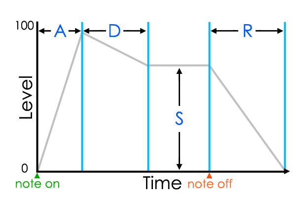

这张图非常生动形象的解释了ADSR（注意没有H，也就是Hold）曲线在电平上的变化。

参数方面，我们有如下定义：

A - Attack Time: 从0到最大振幅所需时间

H - Hold Time: 在衰减前保持峰值电平的时间（途中未显示）

D - Decay Time: 从最大振幅衰减到Sustain电平的时间

S - Sustain Level: 持续按住音符期间的稳定电平（不是时间！）

R - Release Time: 松开音符后从Sustain电平衰减到0的时间

有时我们也会接触到DAHDSR（在Attack之前增加Delay）和ADBDR（双衰减包络）这两种变体。另外，在现代数字合成器中，我们还有多段包络（如6段、8段包络）提供更复杂的形状控制，以及循环包络（循环Attack-Decay）阶段来创造重复的振幅变化。

**与滤波器类似，关于包络曲线的各类参数都没有直接的标准CC。**一般来说，我们通过NRPN/RPN控制（GM2定义了相关NRPN）：

Attack Time: NRPN (01H, 63H)

Decay Time: NRPN (01H, 64H)

Release Time: NRPN (01H, 66H)

Hold通过CC64（GM标准定义）来控制，Sustain Level通常通过其他方式控制。

**在现代合成器中，包络不仅可以控制振幅，还可以控制滤波器截止频率（实现动态的亮度变化），音高（音头滑音效果），以及脉宽（PWM动态变化）或任何其他连续参数。**

包络曲线的主要特征是时间感知的非线性。由于人耳对时间变化的感知接近对数尺度，因此在控制方式与参数的映射上，我们可以很自然地分成两类：

（线性控制）**<span class="mark">线性映射：CC值 ∝ 时间（ms）</span>**

（对数控制）**<span class="mark">感知映射：CC值 ∝ ln（时间）</span>**

包络曲线的各个参数实际上都具有其时间范围。

Attack: 0.1ms - 10s

Decay: 1ms - 20s

Release: 1ms - 30s

包络曲线各部分的形状也很重要。不仅仅是时间，曲线的形状也决定了声音的性格。**比如，改变Attack的曲线类型会造成以下几种可供参考的效果：**

线性：机械感，合成器的感觉

指数：自然感，类似原声乐器

对数：快速起音然后缓慢达到峰值

S型：平滑进入，用于避免“咔嗒”声

**而改变Decay和Release的曲线也会造成不同的效果：**

凸曲线：快速衰减然后变慢（更自然）

凹曲线：缓慢衰减然后变快（用于特殊效果）

线性：颗粒感或电子感

合成器中，包络曲线还可以与力度进行交互。比如，你可以制作力度敏感包络，使Attack/Decay或Sustain的电平随力度变化。力度大时Attack更短，Sustain更高；而力度小时Attack更长，Sustain更低。另外，包络曲线也可以有重触发（Retrigger或Retrig）行为。单触发模式下，音符持续期间，新音符触发不重启包络；多触发模式下，每个音符都重新开始包络循环。另外还有连奏模式，也就是只有在没有活动音符时新触发才重启包络。

可见，包络曲线本身是相当灵活的。不过这并不意味着在数字化的实现下，我们使用相关参数的时候完全没有限制。比如，由于采样精度问题，极短的Attack
Time在低采样率下可能出现量化台阶。对于无缝循环需求，特别是持续采样，需要确保Attack、Decay、Sustain的过渡是平滑的。另外，我们还需要对CPU效率进行考量，因为每个活动音符都需要独立的包络生成器计算。由于包络曲线本身的用法很多，在这里笔者就不讲述如何实际使用了。总的来说，从理论角度看，包络曲线（AHDSR）是声音时间形态的完整描述语言。而体现在声音设计中，包络线直接决定了声音**变化**的特征。

**下面我们来解析弯音轮。Pitchbend是一个高分辨率、双向、弹簧回中的连续控制器，Pitchbend
Range代表弯音的范围，类似缩放因子或增益系数。二者共同构成了一个基础的，完整的音高调制系统。**

Pitchbend的最大作用有两点。其一是弥补离散音阶的限制，MIDI音符是12平均律的离散音高，而Pitchbend提供了连续的、无级的音高变化，填补了半音之间的空隙。其二是模拟自然音高滑移，真实乐器演奏中存在的滑音、抹音、颤音尾音等连续音高变化，都可以通过Pitchbend模拟。

Pitchbend也允许微分音的表达。它允许演奏小于半音的微分音（如1/4音、1/6音），这在现代音乐中至关重要。它也可以用于处理音头表情，比如模拟弦乐的滑音进入，管乐的嘴唇控制或人声的转音。另外它也可以处理音尾，通过音符结束时的音高下落或上扬来增加终止感。

**从理论角度分析，Pitchbend是MIDI
1.0中唯一使用14位分辨率的控制器（MSB+LSB）。它的数据格式如下（虽然你也可以在附录当中找到这部分内容）：**

**Pitchbend LSB: 0xE0 + channel（低7位）、Pitchbend MSB: 0xE0 +
channel（高7位）**

**合成值：MSB + LSB（0-16383）**

弯音轮的中间值为8192。另外，物理弯音轮通常有弹簧自动回中，这是暂时性调制的经典范例。

Pitchbend
Range的作用在于量程的定义。它定义了弯音量的物理意义。如果没有Range，Pitchbend的数值只是抽象的相对值。示例如下：

Range = ±2半音时：Pitchbend值8192→12288 = +1半音

Range = ±12半音时：Pitchbend值8192→12288 = +6半音

在实际的MIDI编辑中，我们要确保同一MIDI通道内不同音色对Pitchbend有一致的响应范围。另外，在实际的演奏场合，对于不同的乐器，我们需要设定不同的Pitchbend
Range。管弦乐通常使用±2半音，模拟自然滑音范围；吉他要用到±12半音或更多来更好地模拟推弦和滑奏；合成器，特别是Lead，要用到±24半音或更大的范围来创造大幅音高效果；而对于打击乐或固定音高的乐器则会禁用弯音。**确定弯音范围的根本原则只有一个：将物理弯音轮行程映射到音乐上有意义的音程范围。**

控制架构上，Pitchbend
Range通常由两层控制：第一层是音色层，这部分是音色设计师设定的默认范围（存储在音色中），第二层就是实时控制层，可以用RPN/NRPN实时改变，由演奏者或音序器在演奏中动态修改。

从MIDI的标准定义来看，Pitchbend消息是标准MIDI消息，属于通道语音消息，状态字0xE0-0xEF。而Pitchbend
Range不是标准CC，通过RPN控制。实现方法如下。

**<span class="mark">标准RPN编号有“RPN MSB = 0x00”和“RPN LSB =
0x00”</span>**

**<span class="mark">用以定义弯音灵敏度（Pitchbend
Sensitivity）。</span>**

数据格式则分为两部分。

**<span class="mark">第一部分是MSB（CC6）数据，代表半音数（比如0x02代表±2半音）；</span>**

**<span class="mark">第二部分是LSB（CC38）数据，代表音分数（0x00代表0音分）。</span>**

**例如：设置±3半音50音分：**

**<span class="mark">RPN MSB=0, LSB=0, Data MSB=3, Data LSB=50</span>**

Pitchbend的绝对分辨率为16384个值，中心值8192（14位），而有效分辨率依赖Range。Range在数据上与物理意义上的分辨率可以通过如下方式转换：

**<span class="mark">分辨率（音分）= (Range_in_cents × 100) /
8192</span>**

我们可以有如下示例计算：

**<span class="mark">Range = ±2半音（±200音分）：分辨率 = 200/8192 ≈
0.024音分</span>**

**<span class="mark">Range = ±12半音（±1200音分）：分辨率 = 1200/8192 ≈
0.146音分</span>**

一般而言，由于人耳最小可辨音差约5-10音分，Range带来的精度损失可以忽略不计。

随着现代合成器的发展，一些更高级的理论模型也被提出。第一种是双轴Pitchbend，它允许用户在音高上下弯曲的同时用另一个参数改变弯曲速度和曲线形状。第二种是微分Pitchbend范围，也就是在不同音区设置不同Range，使低音区范围小，高音区范围大这样的配置成为可能。这样做会使得弯音更符合弦乐器物理特性。第三种是Pitchbend到其他参数的映射，比如将弯音同时调制滤波器、振幅等。

Pitchbend除了弯音本身，也是一种物理建模中的精确对应。在物理建模合成中，Pitchbend能够对应真实物理参数。比如，对于弦乐的建模，我们可以让Pitchbend代表弦的张力变化（指板的按压），而其范围代表弦的弹性极限。而管乐在建模时，Pitchbend可以充当嘴唇压力或气息速度，其范围代表超吹阈值。同理，对于人声的处理，也有将Pitchbend指代为声带张力的做法，这时弯音范围代表自然转音能力。

在时间维度上，Pitchbend不仅是空间（音高）控制，也隐含时间控制。慢速弯音一般是表情性滑音，而快速弯音可作为效果性跳音。另外，在部分场合下弯音速率可作为独立参数，也就是，控制音高变化的速度曲线。

MIDI 2.0标准当中，弯音轮得到了大幅度的加强。首先是Per-Note
Pitchbend机制，允许你为每个音符设定独立弯音，突破通道限制。另外是float
pitchbend_value，这个函数在-1~+1连续，利用32位浮点数实现更高精度的弯音轮。另外，Pitchbend在MIDI
2.0标准中能够定义响应曲线（线性，对数，指数，自定义），获得更高的灵活性。

Pitchbend和Range的设计有很多闪光点。首先，二者的分离就是一种非常优秀的设计。演奏者可以用弯音值定义其即时意图，同时可以用弯音范围定义音色的物理特性。这种分离允许用户用同一演奏手法适应不同音色，用同一音色适应不同演奏风格，实时动态调整音乐表现。其次，在早期的实际设计中，14位分辨率的选择通常被认为是一种工程与感知的妥协。不过，16384的分辨率，在±12半音范围内，精度达到了0.15音分，已经远超人耳极限。另外，这一组控制器完美体现了交互隐喻的普适性。物理上弯音轮的“推拉”“自动复位”本身就非常符合直觉。类似于拉橡皮筋然后释放，或者按弹簧后松开。另外，这一操作方式和弦乐的推弦复位非常接近，便于快速上手。

从理论角度看，Pitchbend和Pitchbend
Range构成了MIDI系统中最为精密的音高控制系统。它们在离散的数字音乐世界中提供了宝贵的连续性控制维度，又通过14位分辨率展示了在有限数据带宽下实现高精度控制的可能性。现场演奏中，弹簧回中的设计创造了独特的交互体验，而Range参数实现了演奏意图与音色特性干净利落的分离。

另外SC8850当中其实还有CC 141和CC 142。他们本质上是CC 6，CC 38，CC
100和CC
101共同作用的，用于精调和粗调音轨的整体音高。导出的时候他们会变为原始形态，也就是刚才那四个控制器组合出来的样子。

**来到Hold。不是之前在包络曲线中出现的，而是作为延音踏板的Hold。**

**其实这部分我想和另外两个踏板一起讲：Sostenuto和Soft。对应CC编号67和66。**

学过钢琴的朋友们应该对它们都比较熟悉，我们现在从数字控制的角度来理解。**简单来说，这三个控制器共同处理音符衰减过程的时间控制，但各自代表不同的衰减干预策略。它们本质上是对音符自然衰减过程的三种不同的人工干预模式。**

**首先来说Hold。**它的物理原型是钢琴右踏板，工作原理非常简单，抬起所有制音器，允许琴弦自由振动。这时音符完全自然衰减，不受阻尼影响。**在MIDI中，CC64是一个二进制状态控制器。小于64则关闭，音符正常衰减；大于等于64则开启，音符无限持续直到踏板释放。**

**Hold影响通道内所有音符，无论何时触发，它对于通道的影响是全局性的。因此，它不具备通道内的选择性，无法区分不同声部、不同时间触发的音符。此外，它的动作具有时间叠加性，即，踏板期间的所有音符衰减时钟被暂停，直至踏板完全松开。**

我们也可以从信号处理角度来理解。传统钢琴模型当中，琴弦振动之后受制音器阻尼的影响，声音衰减，这时CC64控制的就是制音器是否接触。数字合成模型中，振荡器产生声音，经过振幅包络，Note-off后到达Release阶段。CC64的开关决定Release时钟是否被覆盖。在音乐理论上这的确是有意义的，延音踏板保证了和声连续性，有了它，和声就可以在进行中保持共同的音了。另外它还可以填充声场，在稀疏织体中创造持续的背景层。另外，它也是一种机械辅助，允许我们真正在物理上实现连奏（尽管legato也被解释为演奏技术）。

**接下来我们来说Sostenuto，CC#066。**它其实全名应该叫**选择性延音踏板**，严格的说，它是一种基于状态依赖的选择性记忆，代表了一种条件性状态控制系统。

**它的算法逻辑是这样的：踏板按下时记录当前正在发声的音符集合；踏板保持期间集合中的音符无限延音；新触发的音符正常衰减，不受影响；最后踏板释放，集合中的音符开始正常衰减。**

CC66其实在一些音乐风格中是必要的。对于复调音乐来说，可以用CC66进行如下处理：主题声部A使用CC66进行延音，与之相对的B声部正常衰减，作为自由声部的C也自由衰减。不难发现，CC66允许声部之间独立的时间处理。这也意味着CC66和CC64在根本上有明显的不同。CC64的作用范围是全局性的，而CC66的作用范围是选择性的；另外CC64是真正意义上的实时作用的效果器，CC66则是一种状态记忆。此外CC64不能区分音符，所有音符都会受作用，而CC66可根据踏板前后对音符进行状态分组；最后CC64只有开关两种状态，而CC66可以跟踪音符状态。

**最后是Soft，也就是CC#067。物理原型为钢琴的弱音踏板。**事实上，三角钢琴和立式钢琴对于这个效果的实现方式不太一样。三角钢琴的弱音效果也叫Una
Corda，原理在于键盘整体右移，锤头只敲击2根弦（正常状态下是3根）。这时，音量减小，音色变暗，并且触感会有明显变化。立式钢琴则是踩下踏板后在锤头与琴弦间插入毛毡，主要效果是音量减小，音色明显变闷。

**一般来说，多数VST音源厂商会实现多层次模拟，把Soft本身作为连续控制而不是只有开关两种状态的工具。这一过程会同时体现音量，音色，触感的变化。在数字化的处理中，CC67将这两种物理模型简化为单一的振幅衰减控制。其实际物理效果主要在于三个方面：音量减小（特别是音头），音色变化，触感变化。MIDI内对这个效果进行了简化，通常只体现音量的减小。**

事实上，从Hold到Sostenuto再到Soft，体现的是从全局到选择性再到参数化，连续化的演变。基于状态的控制和实时控制会完美互补，而连续控制则会让整个音乐线条更加细腻自然。这三个控制器控制的是音符“衰减”的状态。在实际工程当中，最多用到Hold，而Sostenuto和Soft很少在黑乐谱的编写中使用。

**最后我们稍微讲一点关于多乐器的内容，涉及到CC
259。**这个东西的行为不是标准MIDI
CC里有的，用来设置当前Channel（音轨）是普通乐器还是鼓。默认为0，代表普通乐器，1和2都代表鼓，指向两套不同的鼓组。CC
260的行为和刚才提到的CC 126 + CC
127是一样的，只是你不需要单独控制两个CC。

### 3.3.10 EFX，SysEx事件

这里实际上离黑乐谱非常远了，但是我们可以从这里一窥电子音乐的起点。他们算得上是上个时代的遗珠，在如今高速发展的技术下默默消失在我们的工程当中。前面我们聊了那么多控制器的玩法和门道，CC
7、CC 11、CC 71、CC 74，甚至RPN、NRPN、CC
180——这些都是MIDI协议里控制器层面的东西。它们每一个都对应一个明确的旋钮、推子或者踏板动作，你画一条曲线，它就响应一条曲线。但SC-8850还有两层更深的东西，藏在控制器够不着的地方——那就是SysEx和EFX。

**我们先说SysEx。**

标准MIDI协议里，0到127号控制器是公用频道，规定了哪些编号管什么功能，大家都遵守。但音乐设备厂商总有自己独家的功能——比如Roland的GS音源里有自己特色的音色编辑参数、效果器细节调整、系统设置等。这些功能在标准控制器的列表里根本找不到位置。于是MIDI协议预留了一个叫系统专属信息（System
Exclusive
Message）的接口，简称SysEx。它的设计思路很直接：厂商想发什么数据就发什么数据，MIDI协议只负责打包运输，不负责解释内容。
只要数据包的开头带上一段厂商ID（比如Roland的ID是41），兼容设备就知道这是发给我的，然后按照自己的内部逻辑去解析后面跟着的那一串数据字节。

这在当时是一个极其重要的设计，它使得MIDI不再是一个固定功能的协议，而是一个可持续扩展的协议。厂商可以在不修改MIDI标准的前提下，为自己的设备增加新功能，并通过SysEx来实现远程控制。你用MIDI音序器给SC-8850发送一条SysEx指令，相当于隔着一条MIDI线在拧它面板上根本不存在的旋钮——那些旋钮只在它的内部寄存器里，物理面板上没有，但通过SysEx一样能拧。

SC-8850的MIDI实现文档里SysEx部分占了相当大的篇幅。你可以通过SysEx做这些事：

切换音色库映射（SC-55/88/88Pro/8850模式）。

调整每个通道的EFX路由和具体参数。

修改系统设置（比如主调音、MIDI时钟源等）。

批量写入或读取用户记忆区的全部数据。

其中最后一条，批量数据转储（Bulk
Dump）是一个很实用的功能，你可以把SC-8850当前所有的音色参数、效果器设置、混音台状态全部打包成一条SysEx数据保存到电脑上，下次用的时候直接发回去，机器就完全恢复到你上次工作的状态，不需要重新拧一遍所有旋钮。

**再说EFX。**

SC-8850的效果器体系分两层：一层是全局的混响（Reverb）和合唱（Chorus），通过CC
91和CC 93来控制发送量；另一层就是EFX，全称叫插入效果（Insertion
Effect）。

混响和合唱是公共设施，所有通道共用，你只能控制每个通道往里面发送多少信号。但EFX是专属定制的。你可以为每一个通道单独分配一种EFX类型，然后这个通道的声音就会完全经过这个效果器处理，再送到总线上。

EFX模块里内置了64种效果类型，覆盖了各种常见的处理手段：失真（Distortion）、过载（Overdrive）、哇音（Wah）、相位（Phaser）、镶边（Flanger）、旋转扬声器（Rotary
Speaker）、延迟（Delay）、回声（Echo）、以及很多种组合效果。

这意味着你可以把第1通道的钢琴挂一个镶边让它变得飘忽，第2通道的电吉他挂一个失真让它变得咆哮，第3通道的弦乐挂一个旋转扬声器让它模拟出Leslie箱体的声场旋转感。每一个通道都有自己的专属效果链。

但这一切都离不开SysEx。和CC控制器不同，EFX的开关、类型切换、参数调整，都没有对应的标准控制器编号。你要控制EFX，只能通过发送SysEx指令。启用EFX需要一条SysEx，选择类型需要一条SysEx，调整失真度参数需要另一条SysEx。这也是EFX在今天不再常用的原因之一，操作起来需要查阅MIDI实现文档，逐字节构造指令，远不如在软件里拖拽一个插件来得直接。

在90年代，SysEx和EFX是高端音源的标志。Roland、Yamaha、Korg的旗舰音源都大量使用SysEx来实现深度控制，EFX更是SC-8850相对于SC-88Pro的重要升级点。你用音序器软件编好一首曲子，在关键段落通过SysEx实时切换EFX类型，让吉他从清音突然变成失真。这在当时是高级制作技巧。

但今天的情况完全不同了。DAW里的插件格式（VST、AU）提供了更加直观的图形界面，你不再需要翻阅厚厚的MIDI实现文档去查十六进制字节码；效果器可以无限加载，每个轨道串十几个插件都不会让CPU吃紧；自动化包络可以精确控制插件的每一个旋钮，不需要通过SysEx绕一大圈。

SysEx和EFX代表的是一种被硬件限制催生出来的创造力。在CPU性能有限且内存昂贵的年代，工程师们通过精巧的协议设计和硬件架构，在一块芯片里塞进了尽可能多的可能性。今天我们用着更强大的工具，可以做更复杂、更精细的声音处理，但那种“通过一串十六进制数字唤醒硬件潜能”的感觉，已经随着那一代硬件一起慢慢退出了主流视野。

其实从上个世纪，包括现在的角度来说，SysEx在设计上和实际的工程应用上都是十分强大的，不过它仍然有几个短板。

第一，SysEx没有标准编号，完全由厂商定义。你给SC-8850发一条SysEx，它听得懂；发给另一台MIDI设备，如果厂商ID不匹配或者型号ID不对，那条指令会被直接忽略。这也意味着不同品牌设备的SysEx指令完全不通用。

第二，SysEx在音序器里回放的时候，是透传的。它的主要作用是让音序器能远程控制硬件音源的状态，并在回放时确保音源处于正确的设置下。但它本身不产生音符，也不影响正在发声的音符的实时表情——它控制的是音源的状态，而不是演奏。

第三，SysEx的数据量可以很大。一条Bulk
Dump指令可能包含几百甚至上千个字节，这会占用MIDI线缆的带宽（MIDI的传输速率是31.25
kbps，不快）。在实时演奏中频繁发送大量SysEx数据，可能会造成MIDI数据拥堵，影响音符和CC的响应。所以SysEx通常用在曲子的开头，用来初始化音源状态，而不是在演奏过程中频繁发送。

第四，SysEx没有撤销功能。你把数据写进了SC-8850的内存，它就生效了。如果写错了地址或者写入了错误的数据，音源可能会出现意料之外的行为（比如某个通道不出声或者效果器发出奇怪的声音）。这时候需要发送正确的数据来覆盖，或者发送GS
Reset指令（在Domino的SC8850音源定义文件下是CC
201）把音源重置到默认状态。

第五，在今天的DAW工作流中，SysEx的出场机会越来越少。大多数硬音源已经被软音源替代，而软件音源的参数通常通过VST和AU的自动化接口来控制，比SysEx直观得多。假设，你是在硬件时代过来的老资历，SysEx对你来说是工具箱里的一把旧扳手；如果你是从DAW时代入门的，你可能一辈子都不会主动写一条SysEx指令，就相当于在让你在Python和Java以及C++满天飞的年代，用汇编和纸笔人肉古法编程。

不过呢，理解SysEx仍然是值得的。它代表了一种设计哲学：在协议层面预留扩展空间，让厂商可以在不破坏标准的前提下自由创新。今天我们在DAW里用的很多高级功能，如果追溯到硬件时代，底层实现方式往往都绕不开SysEx的思路，只是被图形界面包装得更友好罢了。

### 3.3.11 配置包含多个Port的MIDI环境

**这一节很简单。各种意义上。**

前面你学会了怎么调一个通道的音量、以及怎么给一个通道挂EFX、甚至是怎么用SysEx远程控制一台SC-8850。但现实中的编曲很少只有一个通道。你会有钢琴、贝斯、弦乐、鼓、Pad，甚至更多。它们各自占用一个MIDI通道，共享同一根MIDI线缆，同时工作，互不干扰。可是如果你的通道不够用了，怎么办呢？

在MIDI协议的设计中，Channel（通道）是最基本的单位。一条MIDI线缆上可以同时传输16个通道的数据，每个通道独立对应一个声部或一件乐器。通道编号1到16被编码在每条MIDI消息的状态字节中，占4个
bit，这就是16个通道在硬件层面的根本原因，不是人为规定，是二进制位数的物理限制。

但16个通道够用吗？如果你只做一首简单的钢琴曲，1个通道就够。如果你做一首16轨的管弦乐，16个通道刚好够。但如果你要同时控制多台硬件音源呢？如果你要在黑乐谱工程里同时跑好几十个CC自动化轨道呢？远远不够。

于是Port（端口）的概念就出现了。Port是比Channel高一级的容器，每一个Port都是一个独立的16通道MIDI子系统。多个Port并联使用，就能成倍扩展通道总数。2个Port就是32通道，4个是64通道，8个呢？128通道。

打个比方，Channel是车道，Port是公路。一条公路（Port）上最多只能并排跑16条车道（Channel）。如果你需要更多车道，就只能修更多的公路（增加Port）。每条公路上的车道编号都是从1到16，但一号公路的第3车道和二号公路的第3车道是完全独立的两个目的地。

从物理角度看，在90年代的多Port
MIDI接口设备中，每个Port都对应一个物理的5针DIN插座，你需要用MIDI线缆把每个Port分别连接到不同的音源设备上。到了USB-MIDI
时代，多个Port被整合进一根USB线缆里传输，但在软件层面，它们仍然被识别为独立的Port，每个Port仍然包含16个通道。

比如当你把MIDI数据发往“Port 2 - Channel
5”时，MIDI协议会为这条消息标注“这是Port
2的数据”，同时状态字节里写上Channel 5的编号。接收端的驱动会把Port
2的数据路由到对应的物理或虚拟输出，而目标音源从自己的MIDI输入接口收到数据后，读取通道编号5，就知道“这条消息是发给我的第5个声部的”。

**一句话总结：Port 决定去哪根线，Channel决定到线里的哪个接收端。**

上面说的是理论。现在来看这些抽象概念在软件里长什么样，以及它们和真实设备之间的对应关系。

我们先区分两类Port——硬件MIDI接口的物理Port和虚拟MIDI设备的软件Port。

硬件MIDI接口：如果一块MIDI接口卡上有4个MIDI
OUT插座，那么每个插座都对应系统中一个独立的Port。Port 1对应OUT
1的物理插孔，Port 2对应OUT 2的物理插孔，依此类推。你用MIDI线缆把Port
1连接到一台SC-8850的 MIDI IN，把Port 2连接到另一台SC-8850的MIDI
IN，DAW发往Port 1的MIDI数据会到达第一台，发往Port
2的数据会到达第二台。两台设备各自独立工作，互不干扰。

虚拟MIDI设备：以VirtualMIDISynth为例。VirtualMIDISynth是一个软件 MIDI
合成器，它在Windows系统中将自己注册为标准的MIDI输出设备。当你在配置面板中将设备数量从1改为4后，Windows系统中会出现4个独立的
MIDI 输出设备入口，也就是VirtualMIDISynth
\#1到#4。它们在软件层面各自独立运行，每个都可以独立加载不同的音色库，独立调整音量，独立处理自己的16个通道。从Domino的角度来看，它们是4个可供选择的独立Port。

**你可以把虚拟MIDI设备理解为“软件化的硬件音源”。它不具备物理实体，但行为逻辑与硬件音源完全一致。接收某个Port的MIDI数据，按照通道号分发到内部的16个声部，使用指定的音色库发声。**

**直接看MIDI环境配置，核心就是一个逻辑：一个Port在物理上意味着一根独立的MIDI线缆，每根线缆上跑16个通道。你的MIDI接口如果有4个Port（Port
1到Port
4），那就相当于在电脑后面插了4根MIDI线，每根线连着一台能接收16个通道的音源，四根线加在一起就是64个通道。DAW里真正在做的就是这个对应关系的映射：软件里的MIDI轨指定了输出到哪个Port的哪个Channel，硬件那边按这个地址接收数据。这个映射关系是所有MIDI路由的基础。**

现在我们把上述理论落实到Domino的具体操作层面。在Domino的环境配置界面（按
F12
打开）中，MIDI-OUT栏目的A到P就是16个可用的Port。这里的A对应第一个MIDI输出设备，B对应第二个，C对应第三个，D对应第四个，依次类推，最大支持到16个Port。

当VirtualMIDISynth将设备数设置为4后，系统中会出现VirtualMIDISynth
\#1、#2、#3、#4这四个输出设备。Domino的Port A需要选择#1，Port
B选择#2，Port C选择#3，Port D选择#4。这就是所谓的ABCD对应1 2 3
4。不是名字相同，而是顺序相同：第一个MIDI输出设备对应Domino的第一个Port（A），第二个输出设备对应第二个Port（B），依此类推。

配置完成后，你在Domino的MIDI轨中，就可以选择具体的输出目标了。每一个MIDI轨都可以独立选择Port和Channel。Port
A下可选Channel 1到16，Port B下同样可选Channel 1到16，4个Port
加起来一共64个独立通道。

如果你只需要使用16个通道，配置一个Port
A就足够了。如果你的工程确实需要更多通道，再启用Port
B到D。Domino允许你只配置需要用到的Port，用不到的可以保持默认设置。

在Domino中，选择完MIDI输出设备之后，还需要做一件额外的事情：给每个Port加载一个音源定义文件。

不过这里要注意一件事情。如果你在 Port A 加载了SC-8850定义文件，但在Port
B加载了SC-88Pro定义文件，那么发往Port A和Port
B的控制器数据会被Domino按照不同的映射表来解释。这会影响事件列表的显示方式，但它不影响MIDI数据本身，数据仍然是CC
71、CC
74这些编号，改变的只是Domino如何向用户展示这些数据。音源定义文件本质上是供人阅读的，不是供设备解析的。

对于黑乐谱或大量使用SC-8850专属控制器的工程，建议所有Port统一使用SC-8850定义文件。

最后一步，不要忘了保存配置，Domino会在下次启动的时候记住这些设置。

如果你配置完成了，应该会和之前所见到的一张图片完全一致：


这样就完成了。

***那么，代价是什么？***

第一，端口选择会影响MIDI文件的通用兼容性。如果你把Port
A到D分别分配给VirtualMIDISynth
\#1到#4，这个MIDI文件在大多数普通播放器（如Windows Media
Player、PFA、Kiva等）上播放时，只能响应Port A的数据，Port
B到D的数据会被直接忽略。多Port配置是为了制作服务的，不是为了播放服务的。如果需要导出通用的单Port兼容文件，应把所有轨道都分配到一个Port上。

第二，Roland
SC-8850与SC-88Pro的音源定义差异。CC编号71到78在SC-88Pro和SC-8850中具有不同的含义。SC-88Pro的71是泛音（Harmonic
Content），73是起音时间（Attack
Time），而SC-8850将71到78全部定义为相对值调整型的控制器。如果你用SC-88Pro的定义文件打开了SC-8850生成的MIDI工程，Port
A下CC
71到78这些参数可能全部被错误解释，导致声音异常。实际使用中，强烈建议全程使用SC-8850定义文件，除非有明确的兼容性需求。

第三，部分Port设置成同一设备是可行的。Domino允许你把Port A和Port
B都设置为VirtualMIDISynth
\#1。这在逻辑上没有问题，两个Port的数据会流向同一个合成器。但
VirtualMIDISynth \#1内部只有 16 个通道，从Port A和Port
B发来的数据会混合在一起到达这16个通道，可能造成数据拥塞或通道冲突，又因为控制器是作用于通道而不是轨道的，实际使用时可能会干扰CC的正常工作。如果确实需要更多通道，应该让每个Port对应独立的设备。

第四，SysEx在多Port环境中的路由行为。当你在某个Port上发送SysEx指令时，这条指令只会被发送到该Port对应的输出设备上。如果你想让所有4个Port的VirtualMIDISynth都接收到同一份SysEx设置，你需要分别在4个Port上各发送一次，或者使用支持广播功能的发送机制。大部分DAW和Domino不支持一键群发SysEx到所有Port的功能。

### 3.3.12 关于多乐器和Program Change

**在MIDI的世界里，乐器这个概念和现实世界不太一样。现实中的一件乐器就是一件乐器，一把吉他、一架钢琴、一把小提琴。但在MIDI里，一台音源设备内部包含了成百上千种乐器的采样，而选择使用哪一种乐器这个动作，就是通过Program
Change来实现的。**

Program
Change（程序变更）是一条MIDI指令，它的作用就是切换当前通道的音色。你给某个通道发送一条Program
Change消息，附带一个音色编号，这个通道随后发出的所有音符就会使用新选中的音色来发声。这和硬件合成器上按一个音色选择按钮的效果是一样的。每条Program
Change消息只能选择一个音色，而且它只影响当前通道——通道1切换到钢琴，通道2仍然可以是弦乐，两者互不干扰。这种每个通道独立选择音色的机制，是MIDI实现多乐器编曲的基础。

但是问题来了：一台音源设备里通常装着好几组不同的音色库（比如GM标准音色库、GS扩展音色库、用户自定义音色库），如果Program
Change只能选音色编号0到127，那最多只能访问128个音色。如果一台设备里有超过128个音色怎么办？

**答案是：Program Change不够用时，Bank Select来凑。**

在MIDI协议中，Program
Change的消息结构非常简洁，一个状态字节（CnH，n为通道号0-15）加一个数据字节（0-127）。数据字节直接对应音色编号，比如0可能是Acoustic
Piano，1可能是Bright Piano。

但一台SC-8850里装了超过1600种音色。如果只靠Program
Change的128个编号，只能覆盖其中很小的一部分。为了访问更多的音色，MIDI协议提供了Bank
Select（音色库选择）机制，由CC 0和CC 32两个控制器配合完成。CC
0（BankSelectMSB）是音色库编号的高位部分，CC
32（BankSelectLSB）是音色库编号的低位部分。这两个控制器合起来组成一个14位的音色库编号（0-16383）。发送Bank
Select之后，再发送Program
Change，音源就会从当前选中的音色库中取出对应编号的音色来使用。

以SC-8850为例，GM兼容音色库中的Program Change = 0对应Acoustic
Piano，而SC-8850原生音色库（BankSelectMSB = BankSelectLSB =
某个特定值）中的Program Change = 0对应的可能是另一种钢琴音色。Bank
Select决定了从哪个音色库里选，Program Change决定了选第几个。

通常情况下，BankSelect消息需要先于Program
Change发送，并且两者之间需要留有足够的时间间隔，确保音源有足够的时间完成音色库的切换。在密集的MIDI数据流中，如果Bank
Select和Program
Change之间插入的音符事件或其他控制器事件过多，可能导致音色切换响应不及时。

如果没有发送Bank Select就直接发送Program
Change，音源会使用当前已经激活的音色库，可能是上一次Bank
Select指定的库，也可能是设备默认的库。为了保证音色选择的确定性，规范的MIDI文件在每个轨道开头都会同时发送Bank
Select和Program Change。

Bank
Select的另一个使用场景是在同一个工程中切换不同厂商的音色映射标准。有些MIDI文件需要SC-8850上播放，同时兼容Yamaha
XG或GM标准，就可以在乐曲的不同段落或不同轨道上使用不同的Bank
Select值，让对应通道的音源切换到对应的音色映射模式。

在编曲实践中，多乐器通常有两种实现方式：

方式一：每个通道固定一种乐器。这是最常见的做法。通道1设置为钢琴，通道2设置为贝斯，通道3设置为弦乐，每个通道全程保持自己的音色不变。Program
Change只在乐曲开始的初始化阶段发送一次，之后就不再变动。

方式二：同一通道在不同段落切换乐器。比如在一首电子乐中，主歌部分通道4是Pad铺底，副歌部分同一个通道切换成Lead主音。这种用法需要在乐曲的特定位置插入Program
Change事件，让通道在运行过程中变身。Program
Change可以在任意时刻发送，音源会立即响应，但需要注意，切换音色时，该通道上正在发声的音符可能会被中断，或者音色切换后出现短暂的静音间隙。

在Domino中，Program
Change有两种输入方式：一种是直接在MIDI轨的属性栏中选择音色编号，Domino会自动在轨道开头生成对应的Program
Change事件；另一种是在事件列表中手动插入Program
Change事件，你可以精确控制它发生在哪一小节哪一拍。

当你使用多个Port时，每个Port内部都有16个通道，每个通道都可以独立接收Program
Change。这意味着：Port A-Channel 1可以设置为钢琴；Port A-Channel
2可以设置为Bass；Port B-Channel
1可以设置为弦乐（独立于PortA-Channel1）；Port B-Channel
2可以设置为管乐。每个通道的Program
Change状态是独立存储的，互不干扰。你可以在Port A-Channel 1上发送Program
Change切换钢琴音色，而Port B-Channel 1上的弦乐完全不受影响。

这带来的编曲自由度是巨大的：4个Port \* 16个通道 =
64个独立声部，每个声部都可以有自己的音色、音量、声像、效果器发送量。一台SC-8850本身就可以同时发出64种不同的乐器声音，前提是你有足够多的MIDI轨道来驱动它。

在Domino中，每个MIDI轨的输出目标可以精确到Port X-Channel Y，而Program
Change事件会附着在具体的轨道上。当这个轨道的数据被发送到目标Port和Channel时，Program
Change会在该通道上生效。

Domino的音源定义文件不仅仅是一个名称显示表，它还决定了Program
Change下拉菜单中的选项内容。当你加载了SC-8850的定义文件后，在MIDI轨的属性栏中点击Program
Change编号时，下拉菜单会显示音色名称列表——“0:Acoustic Piano”、“1:Bright
Piano”、“2:Electric
Grand”等等。当你选中一个名称，Domino会自动填入对应的Program
Change编号。如果加载的是SC-88Pro的定义文件，同样的编号0可能显示为不同的名称，因为两台设备的音色映射不完全一致。如果加载的是GM标准定义文件，编号0到127对应的是GM标准音色表。需要注意，音源定义文件不会改变发送出去的MIDI数据。Program
Change指令仍然是那个编号。它只改变Domino向用户展示这些编号的方式。无论你在界面上看到的是Acoustic
Piano还是钢琴，Domino发送出去的永远是同一个Program
Change数值。从这个意义上说，加载正确的音源定义文件能让你在操作时少翻说明书，但它对音源的最终发声结果没有任何影响。真正决定声音的是音源设备内部根据Program
Change编号查找到的那个音色。

**这里依然有一些注意事项：**

**第一，Program
Change不会自动重置。**当你在通道1上切换成钢琴之后，这个通道会一直保持在钢琴状态，直到你发送下一条Program
Change。如果你在乐曲中间切换了音色，在乐曲结尾最好发送一条Program
Change把通道恢复到初始状态，否则循环播放时音色会从中间状态开始。

**第二，Bank
Select的发送顺序有讲究。**正确的顺序是：BankSelectMSB到BankSelectLSB再到Program
Change。如果顺序颠倒，Program Change可能会在Bank
Select生效之前执行，导致选错音色库。在密集的MIDI流中，这三个控制器最好连续发送，之间不插入其他事件。

**第三，GM标准对Program
Change的约定。**在GM标准中，通道10被固定为打击乐通道，Program
Change在通道10上不会切换音色（打击乐音色由音符编号决定，而不是Program
Change）。在GS和XG标准中，可以通过Bank
Select将任意通道切换为打击乐模式。

**第四，切换音色时可能产生断音。**当你在一个通道上发送Program
Change时，音源需要卸载当前的音色采样并加载新的音色采样。这个过程需要时间，期间该通道正在发声的音符可能会被中断。在乐曲的关键段落（比如长音持续时）避免发送Program
Change，或者在切换之前先发送All Notes Off（CC123）。

**第五，Program Change没有撤销功能。**你发送了一条Program
Change，音色就变了。如果想回到之前的音色，你需要再次发送对应的Program
Change编号。没有退回上一个音色的指令。

**第六，多Port环境下Program Change的作用范围需要注意。**一条Program
Change指令只作用于发送它的那个Port上的那个Channel。如果你想让Port
A-Channel 1和Port B-Channel
1同时切换到同一个音色，你需要在两个Port上分别发送Program
Change，不能一次切换所有Port。如果你想批量发送到所有Port，需要使用SysEx或特殊的MIDI路由配置。

### 3.3.13 修改你的Domino视图，以及更改Domino设置

Domino的视图是可以修改的，有些时候你可以通过一些设置让自己的工作更加高效。现在我们来看一看有关Domino其他的设置内容。

我们打开设置界面，按下F12进入首选项，一个一个看。当然这里我们只讲重要的，不讲那些过于细枝末节的。

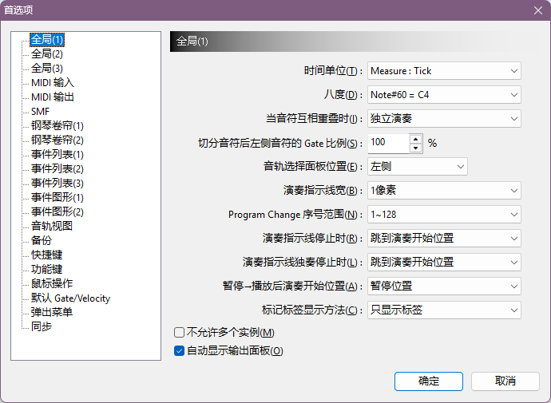

先来看全局设置。

时间单位可以选择“Measure : Tick”或者“Measure : Beat :
Tick”。区别在于是否显示拍子。八度的两个选项唯一的区别就是音符序号60对应C4还是C3。通常可保持默认。

音符互相重叠时，默认开独立演奏。

Program
Change序号范围通常默认是1-128而不是0-127。尽管MIDI底层协议上发送的一律都是0-127，但为了保证操作的便捷和直观，保持1-128是更好的，市面上多数软件默认也都是这么处理的。

演奏指示线建议保持默认设置，让它停在量化的位置上，比如某一拍的起点，不要随便停留。默认停止后跳到演奏开始的位置。

不要勾选“不允许多个实例”。

全局2和3里没有重要设置。

MIDI输入部分，鉴于黑乐谱不需要考虑（键盘鼠标操作），不做介绍。MIDI输出部分界面刚才已经展示过，设置完成即可，不需要额外考虑。

接下来看有关文件的SMF部分。

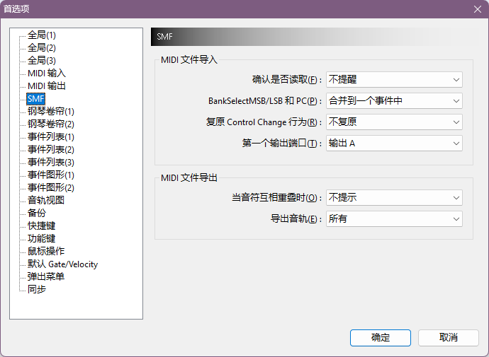

导入MIDI文件时，将“确认是否读取”关闭，不提醒，也就是不解析MIDI事件（过于费时间而且不解析不会有任何影响）。

如果想让事件栏变得整洁，可以把BankSelectMSB/LSB和Program Change合并。

默认情况下可以不复原Control Change行为。

导出MIDI文件时，一般情况下不要显示重叠音符，请关闭。同时，默认导出所有音轨。

钢琴卷帘、事件列表、事件图形部分请自行探索，根据个人使用习惯和字面含义进行个性化设置。

接下来看备份。

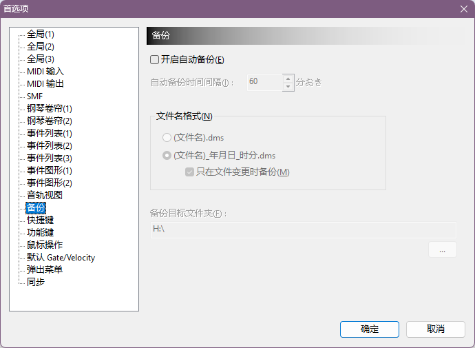

**自动备份是Domino崩溃时拯救工程的最后防线。但是！如果你正在做超大型MIDI，请务必关闭这个功能并在每一步操作之后手动保存，避免不必要的卡顿和崩溃！**

设置内的其余部分（快捷键，功能键，鼠标操作）都可以按照个人操作习惯进行设置，怎么方便怎么来。默认Gate/Velocity不用动，弹出菜单和同步栏目内不需要额外设置，保持默认即可。

下面我们来看看怎么改变Domino视图。

左上角菜单部分选择“显示”或按下Alt+V即可。

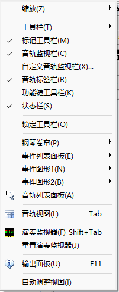

缩放，顾名思义。

上方第一个工具栏选项，请悬停鼠标后勾选右侧除了自定义以外的所有工具栏。

标记工具栏，音轨监视栏，音轨标签栏，状态栏建议都勾选上。

接下来看自定义音轨监视栏：

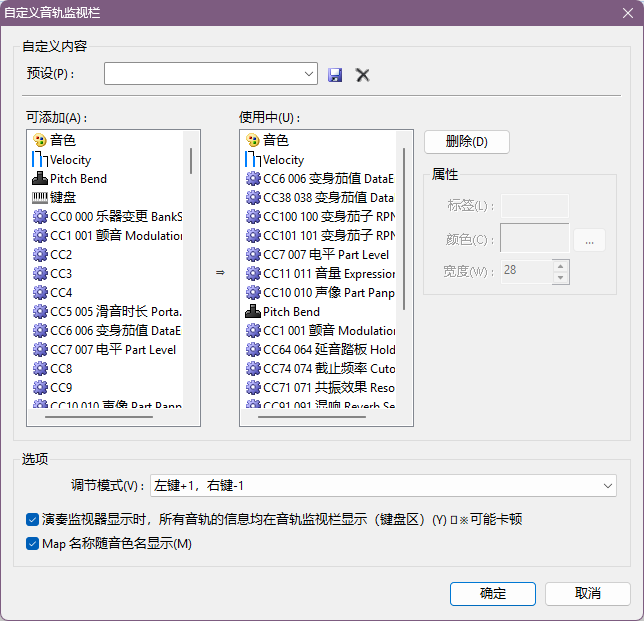

这里显示了你在音轨监视栏能够看到的CC种类。将你想要监视的CC事件从左侧拖到右侧即可完成添加。上图额外添加了CC
6、CC 38、CC 100和CC
101。单击右侧使用中的CC可以更改它的标签（显示的简称），颜色以及宽度。可以根据喜好自行设置。

剩余部分，根据自己喜好进行设置，默认状态下的Domino不需要过多更改视图设置。

**我们的第三章在这里就将结束。接下来，来到音符画的制作。关于如何作曲，如何编曲，如何扒谱，你可以寻找乐理教程或者根据自己的乐感进行自由发挥。第三章主要讲解Domino基本和进阶的操作方法，并没有讲解如何做一首曲子。好消息是，你已经掌握了工具的用法，接下来的难题就是如何创造。不过，放轻松！这将是你最能自由发挥的地方，请随心所欲吧！**

**而下面的第四章，你将直接感受黑乐谱最直接，最暴力，最令人沉醉的视觉魅力——音符画。准备好了吗？**

# 4 黑乐谱MIDI制作：音符画部分

欢迎来到第四章，黑乐谱的音符画部分。笔者IMT11D并不精通音符画制作，甚至可以说对于高质量音符画的制作几乎是一窍不通。所以，我们接下来把舞台交给——

## 4.1 规划中

（待补充）

### 4.1.1 规划中

（待补充）

### 4.1.2 规划中

（待补充）

### 4.1.3 规划中

（待补充）

### 4.1.4 规划中

（待补充）

### 4.1.5 规划中

（待补充）

## 4.2 规划中

### 4.2.1 规划中

### 4.2.2 规划中

### 4.2.3 规划中

### 4.2.4 规划中

## 4.3 规划中

### 4.3.1 规划中

### 4.3.2 规划中

### 4.3.3 规划中

### 4.3.4 规划中

### 4.3.5 规划中

# 5 黑乐谱视频制作

欢迎来到第五章，如何制作黑乐谱视频。在这里你已经完成了MIDI的制作，下面你需要完成两个最主要的工作：做出一份无卡，无损的音频，以及黑乐谱最重要的，视觉的呈现。音频和视频的制作是密不可分的，话不多说，正片开始。

## 5.1 音频制作流程

***<u>前情提要：这部分教程目前没有补上图片，我正在考虑在这一章补齐还是在第二章补齐。目前是纯文字状态，应该不影响阅读（？），但是实际操作的话还是不太够用，之后我会把图片补充上去。今天我已经把基础的文字框架搭好了，后续这里的文字部分还会继续完善。关于视频制作的进阶教程不属于近期规划内容，且第四章尚不确定是否使用Lumino进行制作，取决于Lumino开发进度以及实际应用能否达到预期（目前Lumino性能没问题但是编辑功能尚不完善），因此其余进阶内容保留远期规划。（IMT11D
2026.8.4备注）</u>***

首先我们来制作音频。

如果听过比较早期黑乐谱的话，初看到“制作音频”可能会有些疑惑：音频不是录制的时候自然产生的么，为什么还要费劲制作呢？

当然可以，但是......

**如果你的黑乐谱体量太大，严重卡顿呢？**

**如果你的回放效果受制于CPU性能呢？**

**如果你的音频全是爆音呢？**

**如果你需要好几个音色库的音频混在一起呢？**

**如果你需要严格的，准确无误的，可复现的特定效果呢？**

**如果你无法忍受CPU的随机延迟呢？**

**如果你的瞬态必须整齐一致呢？**

你看，直录音频会遇到各种各样的问题，不可控，也很难真正解决，换言之，达不到成品级别的质量。

好在我们有工具，能够把这种不可控的东西变为可控，我们先从最基本的讲起。

### 5.1.1 音频的转换和渲染

既然直录（内录或外录）存在诸多不可控因素，那么制作音频的核心思路就是：将MIDI事件通过音源库（或者采样库），在完全可控的DAW或专用渲染器中，离线计算或“渲染”成标准的波形文件（WAV）。这个过程的本质是数据回放而非声音拾取，保证了每次生成的结果完全一致，且不受实时CPU波动影响。

成品效果主要取决于两个要素：音源格式（sf2/sfz，或者直接用VST插件）和渲染方式（实时/离线）。下面分别讲解这两种最常见音源格式的转换流程。

首先来看最基础的，sf2转换音频。sf2是一种单一的、打包好的音色库文件。它将所有乐器的采样、循环点、包络参数等封装在一个文件中。转换流程相对简单直接。

这里需要准备一个兼容并能够读取sf2的软件。常见选择包括：Coolsoft
VitualMIDISynth MIDI转换器（安装Coolsoft波表自带）、Keppy’s MIDI
Converter、Omniconverter、以及各种DAW，比如FL
Studio（自带DirectWave或Fruity SoundFont
Player）、REAPER（以及绝大多数DAW，可以通过BASSMIDI
VSTi或者XSynth实现）。同时，准备好MIDI文件和选定的SF2文件（通用GS音源或专用钢琴音色库）。

**这里，无论你是否熟悉并使用过DAW，还是说单纯想要脱离老旧的传统技术结构，我都要先讲更先进的做法，这对于之后的音乐制作是有帮助的，因此我们首先在DAW内操作。**

**首先加载音源。**在DAW中，创建一个新的音频轨道或MIDI轨道（个别DAW不区分轨道类型，MIDI和音频都可以放置，比如FL
Studio），并在其效果器/乐器槽中插入sf2播放器插件（比如BASSMIDI
VSTi）。在该插件界面中，加载准备好的sf2文件。

**下面导入MIDI。**将MIDI文件直接拖拽到该轨道上或通过DAW的导入功能加载。此时DAW会将MIDI通道信息路由到sf2播放器对应的通道（注意sf2通常支持16通道，如果是多乐器，还需确保MIDI轨道通道号与音源内乐器分配一致）。

**接下来设置渲染（导出）参数。**这是转换的核心步骤，目的是生成WAV，不是实时监听。我们在DAW的导出设置中，务必选择“离线（Offline）”或“全速（Full
Speed）”渲染模式，而非“实时（Real-time）”。离线渲染不受音频接口缓冲区和CPU实时负载限制，可以彻底避免爆音和卡顿。对于母带完的音频，采样率与位深通常设置为44.1kHz/24bit或48kHz/24bit；**对于没有母带的初版音频（不添加任何效果，直接转换，没有加Limiter），导出的位深务必设置为32bit
float，防止爆音对音频的不可逆破坏。**

**渲染范围选择整个MIDI乐曲的长度，或自定义起止时间。**在混音选项中确保勾选效果器和乐器输出，并取消勾选任何可能施加额外限制的“母带处理”或“标准化”（除非明确需要）。

**现在，执行转换。**点击导出/渲染按钮。DAW会以远快于实时播放的速度（取决于CPU）进行计算，将MIDI事件逐帧转换为PCM音频数据并直接写入WAV文件。这个过程不经过声卡D/A转换，完全是数学运算。转换完成后，将WAV重新导入DAW或使用音频编辑器（如Audacity）查看波形，确认无削波（超过0dBFS）和无异常的空白静音段。如有问题，可调整SF2内各乐器的音量后再重新渲染。

使用sfz音源的转化流程和sf2大同小异。不同在于，sfz是一种基于文本描述（.sfz文件）的开放式采样格式，它不打包采样，而是通过指令指向外部独立的WAV/FLAC/AIFF采样文件。相比sf2，sfz支持更复杂的键位切换、力度分层、循环和效果器，音质上限更高，但转换流程也更讲究。

你需要一个包含.sfz文件和对应Samples（采样文件夹）的完整音色库（可以看一下下载下来的sfz音色库的文件结构）。注意，sfz文件中写的采样路径必须与您电脑上的实际存放位置相匹配（可使用相对路径或绝对路径，推荐相对路径，便于工程迁移）。

通常，sfz无法直接读取。需要专门的SFZ播放器插件，最主流的有：Sforzando（Plogue出品，免费，兼容性好，适合大多数sfz文件）；ARIA
Player（更专业，支持更多sfz扩展指令）；Kontakt（虽然不原生支持sfz，但可通过第三方转换工具，不推荐作为首选）。以及我们之前提到的BASSMIDI
VSTi（当然，还有Serum 2）。

首先，和刚才一样，加载SFZ文件。在播放器或者插件界面中，点击“Import”或“Load”，选择.sfz文件（而非采样文件）。播放器会解析该文本文件，根据其中的\<region\>、\<group\>指令和sample路径，将对应的采样加载到内存中，并建立映射关系（例如：力度1-40触发采样A，力度41-80触发采样B等）。

**重点来了：这里比加载sf2多的步骤在于指定MIDI分配规则与多通道输出。**sfz支持多通道和多个音色同时加载。如果MIDI需要多个乐器（如弦乐+木管+打击乐），可以在同一个sfz播放器中加载多个sfz文件，并分别指定MIDI通道（例如Ch1对应小提琴，Ch2对应长笛）。也可以为每个乐器单独插入一个sfz播放器实例（更简单，但消耗更多内存）。根据黑乐谱的复杂程度选择。

**比SF2更需注意的点在于关键渲染设置。**

这里有个东西叫预加载缓冲（Preload
buffer）：在sfz播放器设置中，降低预加载缓冲大小（如从默认的64KB降至16KB）可以节省内存，但会增加硬盘读取次数。对于离线渲染，建议使用较大的缓冲（256KB以上），因为离线渲染不要求实时性，大缓冲可以稳定数据流，防止渲染中断或产生微弱爆音（采样点间出现偶发间断点）。

采样插值（Interpolation）一律选择“最高质量（Best/High）”或“线性插值”。

另外注意，sfz自带混响、滤波等效果器。如果需要在WAV中直接生成带效果的音频，请在加载sfz时启用它们。如果打算后期单独处理，则务必在播放器界面中旁通（Bypass）所有效果器，只输出干声（纯净采样）。

渲染导出（同sf2的离线流程）：在DAW中执行离线导出，操作同sf2部分。关键区别在于sfz的离线渲染时间可能明显长于sf2，因为它涉及更多的采样文件读取和实时的音量包络、滤波器计算。请耐心等待，期间不要操作电脑，避免磁盘I/O冲突导致文件损坏。

如果想要进阶的话也可以试试多音色混音处理。假如你使用多个sfz播放器实例（例如每个乐器一个轨道），导出时可以选择分别导出每个轨道的独立WAV（分轨），或者将所有轨道汇总到一个立体声WAV（混音）。对于黑乐谱，强烈推荐先导出分轨WAV，然后在新的工程中统一进行混音和母带处理，这样能彻底解决瞬态整齐度和音量平衡问题，这也是可控性的核心体现。

这两种方案都是经济且效果好的方案，非要选择的话，有如下几个建议。

如果你的黑乐谱体量极大（上万音符）且音符密集：优先选择sf2，因其单一文件结构，内存占用少，渲染速度快，稳定性高。虽然音色可能不如sfz细腻，但干净、不出错是第一要务。

如果您追求极致的动态和音色真实感（如交响化黑乐谱）：选择SFZ，但务必在渲染前检查所有采样路径正确，并在离线渲染时关闭所有无关程序，以确保长时间计算不出错。

不过，无论使用哪种，转换产出的WAV都只是半成品。后续你还需要将这个WAV导入音频编辑软件进行响度调整、降噪（非必要）和最终裁剪，这才算完成整个音频制作。

当然了，这时候肯定会有人问了：“主播主播，你这个用DAW的方法固然好用，但是还是太费脑子太吃性能了，有没有简单又强势的大牌软件能用？”

有的兄弟，有的。我们可以把目光聚焦到一个非常契合黑乐谱制作需求，并且操作更加直接的工具上——CoolSoft
VirtualMIDISynth。

“这不是波表么？”

没错！它专门为MIDI播放和转换设计，并且自带一个集成式MIDI转换器（嘿！点击就送！），可以绕过复杂的DAW设置，直接将MIDI文件配合选定的SF2音色库，渲染成WAV、MP3或FLAC格式。操作流程可以概括为三个核心步骤：配置、转换、检查。

首先，下载并安装VirtualMIDISynth（详见教程第一章）。安装完成后，先为它指定一个SF2音色库文件。因为程序本身不包含音色，如果没有加载SF2，它将无法出声。

你可以通过以下两种方式打开配置界面：从Windows开始菜单中找到VirtualMIDISynth的程序，或者右键点击系统托盘（屏幕右下角）中VirtualMIDISynth的图标。在配置界面中，你可以将准备好的SF2文件（例如Timbres
Of Heaven）添加进来，并将其设置为默认音色库。

当音色库配置好后，就可以开始转换了。现在启动转换器，再次右键点击系统托盘里的VirtualMIDISynth图标，在弹出的菜单中选择“MIDI文件转换器”。然后选择输入与输出。在转换器界面中，首先选择您要转换的MID文件，然后指定您希望生成的WAV文件的保存位置和文件名。接着设置输出格式。对于黑乐谱制作，推荐选择WAV格式以获得无损的音频质量，方便后期处理。最后执行转换。点击“转换”（Convert）按钮，软件就会开始离线渲染，以极快的速度（不受实时播放限制）将MIDI数据合成为WAV文件。同样，这个过程完全不经过声卡，确保了结果的精确性和可复现性，完美解决了之前提到的CPU随机延迟和瞬态不整齐的问题。

转换完成后，我们就得到了一个高质量的WAV文件。你可以像之前提到的那样，把它导入到任何音频编辑器（如Audacity）中查看波形，确认没有削波或异常静音。这个WAV文件便是您进行后续混音和母带处理的坚实基础。使用VirtualMIDISynth的好处在于，它将“SF2音源加载”和“MIDI转WAV”这两个步骤无缝地集成在了一起，流程非常清晰，特别适合体量大、对稳定性要求极高的黑乐谱工程。

**但是对于超大型黑乐谱，情况没那么简单，我们需要更加强力的伙伴：来看Keppy's
MIDI Converter（KMC）的操作流程。**

KMC是一款免费、开源的工具。你可以从其官方GitHub仓库（KeppySoftware/KMC）获取最新版本。它提供安装版和便携版，便携版解压即用，非常方便。软件基于BASSMIDI库开发，这使得它能稳定处理海量音符，32位版支持高达5亿个音符，64位版则几乎没有上限。比起VitualMIDISynth自带的MIDI转换器，KMC是为黑乐谱这类重负载场景设计的专业户，在处理超大MIDI文件和音色管理上更具优势。核心流程同样是三步：配置、转换、检查，但每一步都有针对黑乐谱的特殊优化。

还是老规矩，加载MIDI文件。启动软件，你可以通过菜单栏Actions→Import
MIDIs导入，或者直接将MIDI文件拖拽到软件界面中。软件会清晰显示每个MIDI文件的轨道、长度等信息。加载音色库，点击菜单Actions→Open
Soundfonts/VSTs manager打开管理器。点击Import
soundfont(s)添加你的sf2或sfz文件。它支持同时加载多个音色库，并且会按列表从下到上的优先级进行合并，这让你能自由组合不同音色库中的乐器。

KMC还有几个核心设置，为黑乐谱量身定制。

第一是渲染模式，在菜单栏Options→Render
mode下，你可以选择“Standard”（标准）或“Realtime”（实时）模式。对于追求精确、可复现结果的黑乐谱，务必选择“Standard”模式，它会进行最精确的计算。

第二是复音数限制。黑乐谱最大的敌人就是丢音。点击Open
settings按钮，在“Audio settings”下找到“Maximum
voices”。将这个数值调至最大（最高可设为100,000），能有效避免因音符溢出导致的丢音和爆音问题。

第三是防削波神器（*吗？*），LoudMax。在VST管理器里可以启用自带的LoudMax插件，它能有效防止渲染时因音量过大产生的削波失真，为你的音频加上一道保（*zhang*）险（*ai*）。

一切就绪后，点击菜单Actions，选择Render to
WAV（或者MP3、OGG等格式）。选择保存位置后，软件就会开始离线渲染，生成你的音频文件。和之前一样，转换完成后，将生成的WAV文件导入Audacity等音频编辑器检查波形，确保没有削波或异常。至此，你就得到了一个高质量、可用于后续混音和母带处理的音频素材。

讲到这里你可能有一个疑惑就是为什么Loudmax要慎用，是啊，为什么？在KMC中看到LoudMax这个插件时，你可能会想：“它能防爆音，那岂不是有百利而无一害？”

**上当了！LoudMax本质上是一个“砖墙限制器”（Brickwall
Limiter），它的作用是牺牲动态范围来换取响度。**其核心算法包含两个处理阶段：向下压缩和增益补偿。在MIDI转WAV的渲染阶段，尤其是在黑乐谱这种音符极端密集，响度范围极大的音频场景下，滥用它会产生比爆音更严重的后果。

首先是互调失真。限制器的非线性处理会迫使输出信号在阈值处发生硬削波或软削波。当输入信号包含多个频率成分（黑乐谱的密集和弦和高频音符的共振）时，非线性放大将产生输入频率的和频与差频成分。这些新增频率分量并非乐音泛音序列的一部分，在频谱上表现为非谐波噪声基底。

另外是对于瞬态的毁灭性扭曲。限制器的增益衰减量取决于对输入信号包络的检测。其启动时间（Attack）和释放时间（Release）常数决定了增益变化的速度。对于音符起始时间极度密集的黑乐谱，前一个音符的增益衰减尚未完全释放时，下一个更强瞬态已经到达。这导致限制器持续处于增益衰减状态，使得原本具有明确冲击特性的打击乐音头和弦乐起振阶段被均匀压缩，瞬态波形的上升斜率被人为改变，表现为打击感的丧失。

第三是不可逆的信息丢失。动态范围，严格上是最大不失真电平与噪声底限之间的比值。限制器的阈值决定了压缩介入的电平位置。当阈值低于乐曲的真实峰值电平，所有超过阈值的信号分量其增益均被标准化至阈值电平。这一操作不可逆地丢弃了原始信号中高于阈值的幅度变化信息。

**需要特别指出的是：无论是否使用LoudMax，最终的硬削波（Hard
Clipping）始终是必须避免的底线。**硬削波定义为：当输出信号的采样值超出数字音频的量化上限（0
dBFS）时，超出部分的波形顶部被直接截断，形成平坦的截断区域。从数学角度看，这是一个非连续函数的瞬时截断，其在频域上会产生大量无穷延伸的高频谐波，这些谐波向下折叠（Aliasing）进入可听频带后，表现为持续的、不随乐音变化的噪声。硬削波一旦在渲染阶段写入WAV文件，即成为永久性损伤，后续任何处理均无法恢复被截断的波形信息。

是否使用LoudMax会导致硬削波的生成机制不同。不使用LoudMax时，若主输出增益（Master
Gain）设置过高，且输入信号峰值超过0
dBFS，渲染引擎直接输出超量程采样值，导致硬削波。使用LoudMax时，限制器将峰值电平压缩至阈值以下，再通过增益补偿提升整体电平。若补偿量过大，输出信号再次超过0
dBFS，同样会在输出级产生硬削波。即LoudMax本身不产生硬削波，但过度的增益补偿或者严重超限的峰值可以诱发硬削波。

不过，关于硬削波（Hard
Clipping）的所有论述，均基于定点（Fixed-point）数字音频格式，即16-bit整数、24-bit整数等。这些格式的量化上限为0
dBFS，超过该值的采样点无法被表示，必然发生截断。

**32位浮点格式（单精度浮点数）具有完全不同的数值表示体系。**其动态范围约为1528
dB，远超过任何音频硬件的物理动态范围。在32位浮点WAV文件中，采样值超过0
dBFS不会被截断，而是以合法的浮点数形式（例如+10.2 dBFS、+20.5
dBFS）正常存储。从数学上讲，只要不超过±3.4×10³⁸的数值极限，所有采样值均可精确表示，不产生任何硬削波。

这意味着两件事情。第一，在渲染阶段，若输出格式为32位浮点WAV，**即使主输出增益导致峰值超过0
dBFS，文件内部仍完好保存了完整的波形信息，未发生任何截断。**第二，硬削波的风险被推迟至后续处理环节。当该32位浮点文件被导入DAW、播放器或任何定点处理链路时，若该环节未进行电平衰减，其数模转换器（DAC）或定点输出级将面临超量程信号，此时硬削波才实际发生。

**因此，正确的技术操作是：若选择32位浮点作为渲染输出格式，则无需在转换阶段降低增益。**保持全电平输出，所有超过0
dBFS的峰值均被无损记录。在后续的混音或母带阶段，通过增益衰减将该信号的峰值拉回至0
dBFS以下，再最终定点化（Dithering +
Quantization）为24-bit或16-bit成品格式。这一过程在数学上是完全无损的，且不产生任何硬削波。

但需注意一些约束。并非所有音频播放器、视频编辑软件或硬件设备都支持32位浮点WAV文件。在确认目标播放链路支持前，该格式仅应作为中间格式使用，而非最终交付格式。另外32位浮点文件的体积约为24-bit整数的1.33倍，请根据存储和传输条件权衡。

上述所有副作用，互调失真、瞬态畸变、动态范围丢失，均建立在“LoudMax产生可闻劣化”这一前提上。**但即便我们假设LoudMax完全不产生任何非线性失真（理想化限制器），它在MIDI到WAV转换阶段的使用仍然是不合理的。**

**原因在于其信号链位置的根本性错误。**

我们刚才说过LoudMax是一种砖墙限制器，本身具备压缩动态和改变音量的功能，其合理应用场景是混音或母带阶段，即所有音色加载、音量平衡、声像定位、均衡调整等创作性决策均已完成后，作为最终输出前的电平控制手段。

而在MIDI到WAV的转换阶段，渲染引擎输出的信号是原始合成信号，尚未经过任何混音处理。此时直接在该信号上应用限制器，意味着限制器的决策（何时压缩、压缩多少）是基于未混音的原始电平做出的。该决策无法被后续的混音操作撤销或修正，因为限制器已经将高于阈值的幅度变化信息丢弃（无论输出格式是定点还是浮点）。

这里的关键在于，32位浮点格式只能记录数值，无法记录处理意图。即便输出为32位浮点WAV，超过0
dBFS的采样值虽被无损保存，但LoudMax施加的增益衰减量（Gain
Reduction）信息，即在哪些时间点衰减了多少dB，并未被记录。该信息在限制器的输出端已被融合为新的采样值，原始信号在此时间点上的未压缩状态已经丢失。换言之，32位浮点保护的是数值不溢出，不保护处理可逆。

因此，无论最终输出格式是定点还是浮点，在转换阶段使用LoudMax都构成不可逆的信息处理。而将不可逆的动态处理前置在混音之前，违反了音频工程的基本原则，即创作性操作（混音）先于终结性操作（限制）。

正确的流程应为：MIDI渲染→32位浮点WAV（保留全部动态余量）→混音（音量平衡、EQ、压缩、效果发送）→母带（包含限制器）→定点化输出（16/24-bit）。LoudMax在整个流程中唯一合理的位置是母带环节的最后一个插件，而不是在MIDI转换环节。

如果这部分没问题，我们可以继续推进到下一步，来看看音频的剪辑。

### 5.1.2 音频的剪辑

这部分很简单。当MIDI经过渲染生成WAV文件后，我们得到的是完整的、未经剪辑的音频流。但直接将它投入后续处理是不合适的，所以我们需要做如下几件事。

一个是静音段的裁切。转换WAV的过程会因为各种问题导致音频头尾部分出现无声段落（比如起始部分重置MIDI
CC或者末尾部分没有指定End of
Track），因此需要裁切掉这些影响后续剪辑的段落。这听上去有点多此一举，但这是最基础但最重要的剪辑操作。渲染引擎在写入WAV文件时，通常在文件开头添加一段空白用于缓冲初始化，在文件末尾也会因音色库的释放采样产生一段不必要的延音或环境噪声。

操作时，首先将渲染生成的WAV文件导入音频编辑器（推荐Audacity，免费且功能足够；或Adobe
Audition、REAPER以及任意一款DAW的音频编辑视图），查看波形显示。乐曲开始前的静音段表现为一条水平直线，振幅接近于零，通常在-90
dB以下。选中该静音段并删除。需要注意的是，某些音色库具有较长的衰减（延音），乐曲最后一个音符结束后可能仍有数十毫秒至数秒的可闻声音。需根据听觉判断，在音符自然衰减至低于环境噪声水平的位置进行切断。切断位置不应早于音符的可听衰减结束点，否则会造成音乐被腰斩的听感。文末同样删除多余的尾静音段。

关于精度的控制，剪辑操作必须保证零交叉点处切断。即在切断点位置，波形的振幅恰好为零或尽可能接近零。若在非零振幅处直接切断，会产生可闻的咔嗒声，原因是波形在该点处发生不连续的跳变。Audacity等编辑器通常提供寻找零交叉点功能，可在选中剪切边界时自动吸附至最近的零交叉点。

再者是多个分轨的时间对齐。如果按照此前建议导出了多个分轨WAV，每个乐器或每组乐器独立一轨，那么各轨道的起始时间可能存在细微差异。这种差异的来源包括SF2/SFZ音色库在不同通道上的采样加载延迟不同、不同乐器的起振时间常数不同，以及渲染引擎在不同渲染批次间的起始位置微小偏移。

操作时，将全部需要对齐的分轨WAV导入同一工程或编辑器中，放置在同一时间轴的对应轨道上。放大波形显示至采样级，找到各轨道第一个有效音符的起始瞬态，通常表现为波形的第一个明显的上升位置。以其中一轨（建议为打击乐，砸琴或钢琴等起振最明确的音色）为参考基准，测量其他轨道与基准之间的时差，单位通常为毫秒或采样点数量。将偏移的轨道整体向前或向后移动，使各分轨的第一个音符的起振起始点完全对齐。若所有分轨均在同一个渲染批次中导出，例如DAW一次渲染所有分轨，则偏移量通常固定，只需对齐一次即可。这里需要了解一个技术要点：时差若小于1毫秒，在44.1kHz采样率下对应约44个采样点（同理48khz就是48个整采样点），人耳几乎无法分辨，可忽略。若大于5毫秒，则会产生明显的回声或拍频效果，必须在剪辑阶段校正。

渲染得到的音频中可能包含偶发的、非乐音的噪声。这些噪声的来源包括音色库采样本身包含的底噪或瑕疵，尤其是老旧或压缩过的采样；渲染过程中因磁盘I/O冲突产生的采样点间断，表现为微弱的滴答声；以及MIDI中未察觉的控制器信息，如误写入的CC7音量突发变化。

处理方法如下：首先在波形显示中定位噪声出现的精确时间点。对于偶发的单次噪声，可通过放大波形至采样级观察该处的波形是否出现不规则突变。若噪声仅覆盖极短时间，小于5毫秒，且周围波形相对平稳，可使用编辑器的插值修复功能，如Audacity的修复特效，用噪声前后相邻采样点的时间插值替换该段。该操作本质上是对缺损段进行插值，在多数情况下可有效消除单次咔嗒声。若噪声持续时间较长或反复出现，插值修复无法使用，需回到MIDI阶段检查数据或更换音色库后重新渲染该段。

剪辑操作全部完成后，输出的素材应满足以下标准，方可进入混音阶段：对于多个分轨文件，起始时间的合格标准为所有分轨的第一音符起始瞬态对齐，偏差小于1毫秒，检验需要放大波形至采样级，目视检查。冗余静音的合格标准为开头和末尾无超过100毫秒（建议值）的连续零振幅段，检验方法为波形显示目视检查。异常噪声的合格标准为无偶发咔嗒声或持续的底噪突变，检验方法为监听级（其实用不上，只要不是外放，然后环境噪音不太大就行）耳机听测结合波形目视检查。另外，保证分轨文件与混音工程采样率一致，推荐48kHz+32bit浮点。

**特别注意，确保剪辑阶段所做的所有操作：裁切、对齐、噪声切除，均为非破坏性操作。在操作前，务必留一份原始渲染文件的完整备份，以便在操作失误时回退。**

**以上是音频剪辑的全部内容。与混音不同，剪辑不涉及任何音色、音量和空间效果的处理，纯粹是对时间轴和素材完整性的整理。它的目标是让进入混音阶段的素材干净且规整。我们将在后续章节中详细介绍混音。**

## 5.2 视频的制作和基础剪辑方法

我们来看视频制作。在音频制作完成之后，视频制作的第一步是使用MIDI渲染器将MIDI数据转化为可视化的动态画面。

早期的黑乐谱视频制作，普遍采用直接屏幕录制，或通过减速播放MIDI来降低负载再进行录制的方式。但这些方法存在根本性的缺陷：实时录制同时进行MIDI合成、画面渲染与视频编码，对CPU性能是极大考验，在黑乐谱音符极端密集的段落，极易产生丢帧和音画不同步的永久性损坏。而减速录制则会改变音符的物理下落速度与音频时长，后期修复成本极高，且视觉效果和音频效果都难以达到理想状态。

因此，我们必须采用一种能够保证成品绝对无卡顿、无损坏的方式来制作瀑布流视频本体。现代黑乐谱视频制作的核心思路，是使用专用的离线MIDI渲染器。这类工具将画面计算与编码过程分离，不受实时播放限制，可以精确无误地逐帧生成每一幅画面，并通过时间码锁定音画关系，从而从根源上杜绝了卡顿与不同步问题。

**下面将以功能强大的Zenith渲染器为例，讲解具体的操作流程。**

### 5.2.1 Zenith初步使用

Zenith是一款专为黑乐谱场景设计的渲染程序，其性能优化较为出色，内存占用中等，能够稳定处理音符数量极为庞大的MIDI文件，并且通过插件系统实现了高度可定制化的视觉效果。

首先，获取Zenith（在这里贴个链接：https://github.com/arduano/Zenith-MIDI/）。需要注意的是，该项目目前已停止更新，但现有稳定版本足以满足黑乐谱视频的制作需求。下载后解压缩即可运行，无需安装。

Zenith渲染视频依赖FFmpeg进行编码。你需要从FFmpeg官网获取对应Windows平台的版本，并将ffmpeg.exe可执行文件放置在Zenith程序所在的同一文件夹下。若缺失此文件，渲染功能将无法正常工作。

启动Zenith后，通过界面上的加载按钮或菜单选项导入需要渲染的MIDI文件。Zenith的核心功能通过插件系统实现，不同的渲染插件提供了差异化的视觉风格，你可以可根据黑乐谱的表现需求进行选择。

“PFA+”插件模拟经典的“Piano From
Above”视角，即音符自上而下垂直坠落，这是黑乐谱视频中最常见的呈现方式，能够清晰展示音符的密度与分布。“MidiTrail+”插件提供3D空间视角，支持盒子状音符、自定义光晕等进阶效果，视觉层次更为丰富。“Classic”插件是Zenith的基础渲染引擎，“Flat”则在Classic的基础上去除了阴影效果，呈现更为简洁的复古风格。“Note
Counter”用于在画面上叠加显示实时的统计信息，包括当前音符数、复音数、速度（BPM）、时间进度、小节数等数据，字体和字号均可自定义。“Textured”插件提供了最高程度的定制能力，允许用户使用自定义贴图改变音符外观，或叠加自定义的键盘覆盖图。

在Zenith界面中，你可以对渲染输出进行详细配置。视频分辨率可设置为1920\*1080（全高清）或其他自定义尺寸。帧率建议设置为60fps，如果GPU性能充裕的话，可以开启SSAA，以确保密集音符下落时的画面平滑流畅。音符的下落速度可根据需要选择基于音符原始速度（Tick-Based）或基于固定时间的模式（Time-Based）。一般对于黑乐谱来说，我们为了正确反映曲子的速度变化，通常默认使用Tick-Based模式。

Zenith渲染视频时，实际的编码工作由FFmpeg完成，因此理解关键的编码参数对于控制输出视频的画质与文件大小至关重要。码率决定了视频每秒钟的数据量，是影响画质和文件大小的核心因素。对于1080p分辨率、60fps的黑乐谱视频（画面包含大量快速运动的音符），建议码率设置在15Mbps至20Mbps之间，这个范围能在保证画质清晰、动态画面无明显马赛克的前提下，有效控制文件体积。如果最终用途是上传至B站或YouTube等视频平台，这些平台会进行二次转码，过高的码率在上传后会被压缩，意义不大；但过低的码率会导致细节大量丢失，音符边缘出现模糊和色块。

CRF是另一种控制画质的方式，它不指定固定的码率，而是指定一个“质量”目标，让编码器自动分配码率去维持这个质量。CRF值越小，画质越高，文件也越大。常见取值范围为0到51，其中18至28是常用区间。一般而言，最理想的做法是CRF=0，这是最能保证成品质量的出片方式。

注意：Zenith的渲染过程会占用较多的CPU资源，对于体量极大的黑乐谱工程，渲染时间可能较长，建议在系统空闲时段执行。若渲染过程中出现错误，应首先检查FFmpeg是否正确放置在程序目录下，并确认其版本与Zenith兼容。

完成设置后，选择导出视频。Zenith支持在渲染画面的同时内嵌音频，也支持输出包含透明通道（遮罩）的视频文件，后者便于在后期剪辑软件中进行更复杂的合成操作。

以上是Zenith渲染器的基本操作流程。接下来是视频剪辑部分。

### 5.2.2 在Adobe Premiere Pro中进行音画同步

使用Zenith渲染出视频画面后，需要将它与之前制作好的高质量音频文件在Premiere
Pro中合并，并确保两者完全同步。这一环节直接决定成品中音符的视觉落点与听觉发声是否精确对应。

启动Premiere
Pro，创建一个新的项目，将Zenith渲染出的视频文件和已经剪辑好的音频WAV文件导入到项目面板中。如果视频文件自带参考音轨，可以一并导入作为对齐参考；若视频不含音频，则仅导入视频画面文件和独立音频文件。

方法一：使用“合并剪辑”功能（适用于项目面板中预先同步）。此方法适合在将素材拖入时间线之前，先将音视频锁定为一个整体剪辑。

在项目面板中同时选中视频文件和音频文件，右键点击，选择“合并剪辑...”。在弹出的对话框中，将“同步点”选项设置为“音频”，Premiere
Pro会自动分析两者的波形并进行对齐。如果视频文件中没有可分析的音频波形，或者自动对齐失败，可以选择“入点”或“出点”选项，前提是在导入前已对素材手动标记了相同的入点时间码。点击确定后，Premiere
Pro会生成一个合并后的新剪辑，将其拖拽到时间线上即可使用。

方法二：使用“同步”功能（适用于时间线上微调）。如果素材已经拖拽到时间线上，且需要进行更精确的对齐，可以使用此方法。将视频和音频分别放置在时间线的不同轨道上，通过目视大致对齐到一个相近的位置。同时选中这两个剪辑，右键点击并选择“同步...”。在对话框中选择“音频”作为同步依据，Premiere
Pro会分析音频波形并自动将两个剪辑对齐。同步完成后，原先的素材片段会移动至精确对齐的位置。

手动对齐（备选方案）：当自动同步失败时，例如Zenith导出的视频文件不含任何音频参考信息，就需要手动对齐。具体操作步骤如下。

将视频轨道和音频轨道在时间线上上下相邻放置，便于对比。放大时间线至采样级或帧级精度，在音频轨道上找到一个特征明显、尖锐的起始点，例如打击乐的起振瞬态或乐曲的第一个强音。然后在视频轨道上找到对应时间点的画面帧，例如第一个音符恰好接触判定线的时刻。移动音频剪辑，使音频波形上的该瞬态点与视频画面上的该关键帧在时间轴上完全对齐。完成对齐后，建议将音视频轨道编组或使用同步锁定功能，避免后续编辑时误操作导致两者错位。同时保留一个未编组的备份，方便后续微调。

在60fps的帧率下，一帧的时间约为16.7毫秒。人耳对于音画不同步的敏感度通常在20毫秒以内较难察觉，但黑乐谱视频音符密集且视觉节奏感极强，建议将对齐精度控制在1帧以内。若偏差超过2帧，观众会明显感觉到音符的声音与画面的下落存在可感知的延迟或超前，破坏观赏体验。

以上是音画同步的完整操作流程。同步完成后进入下一阶段的剪辑与转场添加工作。

### 5.2.3 添加转场与基本剪辑

音画同步完成后，视频已经具备了完整的视听内容，但通常还需要进行最终的剪辑整理，以及在不同片段之间添加平滑的视觉过渡。

首先是裁剪与整理。在时间线上，使用剃刀工具（快捷键C）在需要剪切的位置点击，将视频和音频剪辑切断，删除开头和结尾多余的部分，确保视频的起始与结束点与音频完全一致。如果音频开头有预留的空白段落，视频部分也应保留对应的黑场或静态画面，避免画面突然出现。对于多段视频素材拼接而成的工程，应检查各片段衔接处的画面连续性，确保视觉上无跳跃感。

接下来添加转场。转场用于在两个视频片段之间创造平滑的视觉过渡，避免生硬的画面切换。在Premiere
Pro的效果面板中，找到“视频过渡”文件夹，其中包含多种转场类型。最常用的转场是“交叉溶解”，它使前一段画面逐渐淡出的同时后一段画面逐渐淡入，过渡自然，适用于大多数场景。在时间线上，将选中的转场效果拖拽到两个视频剪辑的衔接处即可。转场的持续时间可以在效果控件面板中调整，通常设置为0.5秒至1秒较为合适。对于黑乐谱视频，不建议使用过于花哨的转场效果，如翻页、缩放、旋转等，这些效果容易分散观众对音符视觉的注意力。保持转场的简洁克制，以交叉溶解为主，必要时在视频开头和结尾使用淡入淡出即可。

下面是动态关键帧与效果控制。在效果控件面板中，可以对视频剪辑的位置、缩放、旋转和不透明度等属性设置关键帧，实现简单的动态效果。例如，在视频开头将不透明度从0%渐变为100%，实现淡入；在结尾反向操作实现淡出。这些操作不依赖转场效果，提供了更精确的控制。

剪辑完成后，检查。将时间线播放头置于开头，完整播放一遍工程，检查以下事项：画面是否有跳帧或卡顿，音画是否保持同步，转场是否平滑自然，开头和结尾的淡入淡出是否连贯。确认无误后，即可进入导出阶段。

### 5.2.4 导出视频的技术标准

完成所有剪辑和转场添加后，最后一步是将时间线渲染导出为最终的视频文件。导出参数的选择直接决定成品的画质、音质、文件大小以及在不同平台上的播放兼容性。以下是一套适用于黑乐谱视频的通用技术标准。

格式与编码器方面，选择H.264（MP4封装）。H.264是当前兼容性最广泛的视频编码格式，几乎所有播放器、视频网站和移动设备均支持。MP4封装容器能够同时包含视频流和音频流，结构简单，适合网络传输和本地存档。若对画质有极致要求且不在乎文件体积，可选择H.265（HEVC）格式，其压缩效率比H.264更高，同等码率下画质更优，但编码耗时更长，且部分旧设备和播放器可能不支持解码。

视频参数设置方面，分辨率应与序列设置一致。对于黑乐谱视频，通常采用1920\*1080（1080p）或3840\*2160（4K）。若Zenith渲染时输出的是1080p，则导出时应保持相同分辨率，不应在Premiere
Pro中强行放大，否则画面会模糊。帧率应与序列设置一致。黑乐谱音符运动速度快，建议采用60fps（每秒60帧），以确保密集音符下落时的画面流畅度。若源素材为60fps，导出时不应降低至30fps或24fps，否则会造成画面卡顿感和运动模糊。像素长宽比保持为方形像素（1.0）。场序选择逐行扫描（Progressive），不采用隔行扫描。

Premiere
Pro的导出设置中提供了两种主要的码率控制方式：CBR（恒定比特率）和VBR（可变比特率）。VBR允许编码器在复杂画面（音符密集段落）分配更多数据，在简单画面（音符稀疏段落）分配较少数据，从而在同等文件大小下获得更好的整体画质。推荐选择VBR，2次编码（VBR
2
Pass）。2次编码会先对整个视频进行分析，再进行正式编码，能更合理地分配码率，画质优于1次编码，但耗时约增加一倍。

对于1080P+60fps的黑乐谱视频，建议的目标比特率设置为10 Mbps至20
Mbps，最大比特率设置为目标值的1.5至2倍，即15 Mbps至40
Mbps。若视频包含大量快速运动的音符，画面复杂度高，可选择靠近20
Mbps的目标值。若音符密度较低或画面相对静态，10
Mbps已足够。对于4K+60fps的视频，目标比特率应提升至35 Mbps至45
Mbps，最大比特率可设为50 Mbps至60
Mbps。若在Zenith渲染阶段已采用极高CRF值（如CRF
0）生成了画质无损的中间视频，则在Premiere
Pro导出时可采用稍高的码率以保留这些细节，避免二次编码造成画质损失。

关键帧间隔（GOP大小）决定了视频中完整帧出现的频率。对于黑乐谱视频，建议将关键帧间隔设置为帧率的两倍，即60fps下设置为120帧（2秒）。较短的间隔有利于精确剪辑和网络流媒体播放的随机访问，但会略微增加文件体积。

音频格式选择AAC（Advanced Audio
Coding），这是H.264视频中最常用的音频编码格式，兼容性好，压缩效率高。采样率应设置为48000
Hz，与前期音频制作阶段的采样率保持一致。若源音频为44100
Hz，也可保持原样导出，但48 kHz是视频制作的通用标准。音频比特率设置为320
kbps，足以保证高质量的立体声音频，不会成为整体音质的瓶颈。若对文件体积敏感，可降至256
kbps，但不建议低于192 kbps。声道设置为立体声（Stereo）。

当然，你也可以考虑封装PCM格式的音频。PCM是一种未经压缩的音频编码格式，它将模拟信号直接转换为数字信号，不经过任何有损压缩算法处理。在Premiere
Pro中，封装PCM音频通常意味着在导出设置中选择未压缩的音频格式，例如在MOV封装下选择“PCM”或“未压缩”作为音频编码器。PCM音频保留了完整的原始信号信息，不存在压缩算法引入的失真。对于黑乐谱这种音频结构极为复杂、动态范围宽广的素材，PCM能够准确呈现每一个采样点的原始数值，不会因压缩而损失高频细节或瞬态响应。此外，PCM音频在后期重新导入编辑软件进行二次处理时，不会因反复解码编码而累积音质损失，适合作为中间存档格式。

不过文件体积大是PCM最主要的限制。未压缩的48kHz+24bit立体声PCM音频的数据率为2304
kbps，一小时的音频文件体积约为1
GB。相比压缩后仅需几十MB的AAC编码，PCM会显著增加最终视频文件的总大小，影响存储和上传效率。兼容性方面，虽然主流视频播放器和编辑软件均支持PCM音频的MOV文件，但在网络视频平台（如B站、YouTube）上，上传包含PCM音频的视频通常会被平台转码压缩，PCM的优势在传输过程中荡然无存，但文件体积大的劣势依然存在。

对于黑乐谱视频制作，音频质量是核心要素之一。若目标是将成品视频作为最终交付物上传至网络平台，则无需封装PCM，应选择高码率AAC（320
kbps），在保证足够音质的前提下大幅压缩文件体积，便于上传和传播。不过，如果制作的视频是祭典（这一点对工作组成员适用）、用于本地存档、后续二次编辑，且存储空间充足，则可以封装PCM音频，以确保音频信号在进入下一环节前保持完全无损状态。在导出设置中，选择QuickTime（MOV）封装格式，音频编码器选择“未压缩”或“PCM”，采样率保持48kHz，位深度选择24bit即可。

确认所有参数无误后，点击导出按钮。Premiere
Pro会开始渲染输出，耗时取决于工程复杂度、导出时长和计算机性能。导出完成后，建议使用播放器（如VLC）完整播放一遍成品视频，检查以下项目：画面是否有异常色块或马赛克、运动场景是否平滑、音频是否完整且与画面保持同步、开头和结尾的淡入淡出是否连贯。同时可查看文件的媒体信息，确认实际码率、分辨率、帧率等参数与导出设置一致。确认无误后，即可将视频上传。

**至此，你完成了你的第一个黑乐谱视频，你的——第一个作品。**

**不过黑乐谱的世界远不止这些。**

**接下来，我们来看看怎么做音色库，去探访一下赋予黑乐谱声音灵魂的功臣。**

# 6 钢琴音色库制作

**在开始本章之前，有必要先明确一个定位：从这里开始，我们已经正式离开了基础教程的范畴。**

前五章中，我们学习了如何使用现成的工具和音源完成从MIDI到视频的完整制作流程，那些内容是每一位黑乐谱制作者都必须掌握的基础技能。而音色库制作则不同，它属于进阶领域，并非每一位制作者都必须掌握。你可以用现成的SGM或Timbres
Of Heaven完成出色的作品，而不必亲自录制一个采样或编写一行SFZ指令。

**那么，为什么还要学习它？**

因为它虽然不一定是必经之路，却的确是帮助你走向更广阔音乐世界的重要基础。当你不再满足于“能用”的音色，开始追求“专属”的音色时，当你发现现成音色库的某段频谱与你的混音工程始终无法融合时，当你想要为一个特定段落塑造一种现成音色库从未提供过的声音特质时，你就需要走进音色库制作的世界。它赋予你的不是某一个音色，而是创造任何音色的能力。

当然，我们必须正视一个现实：**本章所涉及的技术路线，在如今VST插件技术高度成熟的大环境下，正逐渐走向边缘化。**商业采样器（如Kontakt）和大量高品质的VST音源已经提供了远超SF2/SFZ的音质上限和操作便利性，专业音乐制作领域几乎已经完全转向了VST生态。

**但黑乐谱创作有其特殊性。**一方面，黑乐谱项目通常体量极大，动辄数十万甚至上百万个音符，而SF2/SFZ的轻量化特性使其在资源占用上远比大型VST音源友好。另一方面，黑乐谱创作多为非商业性质，很多人不具备购买商业音色库的经济条件，而SF2/SFZ生态中存在大量免费且可合法使用的音色库和采样素材。同时，SFZ的文本化编辑方式允许制作者精确控制每一个参数，实现某些VST音源中不易达到的极端效果。

我们需要通过这种低成本、灵活、便捷的方式来持续进行黑乐谱的创作。VST代表了技术的前沿，而SF2/SFZ代表了技术的平权和可及性。两者并不矛盾，只是不同场景下的不同选择。理解SF2/SFZ的制作逻辑，同样有助于深入理解采样器的工作机制，这些知识在VST领域同样适用。

同理，本章的目的**不是**要让你成为一名专业的音色库开发者，而是为你打开一扇门。你不必完全掌握每一项技术细节，但理解其基本原理和操作方法，将使你在面对音色问题时拥有更多的解决路径，而不是被现成工具所局限。

现在，让我们从钢琴音色库的制作开始。选择钢琴作为起点，是因为钢琴的声学结构相对简单明了，每个键对应一个音高，每个音高对应一组采样，映射关系清晰，适合作为理解音色库制作逻辑的入门案例。

那么，开始吧。

## 6.1 什么是音色库

在前面的章节中，我们使用了现成的SF2或SFZ音色库来完成MIDI到音频的转换。但现成的音色库，或者说，有些情况下，未必能完全满足你想要的制作需求，其采样质量、动态分层、音色特性不一定和你的口味，并且音色库本身并不能针对特定曲目进行优化。因此，掌握音色库的制作方法，能够让我们从“使用音色”到“调整音色”再到“创造音色”。

**音色库的本质是一组采样文件及其映射规则的集合。**采样文件记录了真实乐器在特定条件下发声的音频片段，而映射规则则决定了当MIDI事件触发时，哪些采样文件被播放、以何种方式播放、以及如何根据力度、音高等参数进行变化。

### 6.1.1 音色库的基本属性，格式

一个完整的音色库无论采用何种格式，都包含以下核心要素。

**采样文件。**它是音色库的基础素材。每个采样文件记录了乐器在特定音高、特定力度下发出的声音。对于钢琴音色库而言，通常不会对88个键每个键都单独采样，而是每隔几个键采样一次，中间的音高通过插值算法生成。同样，力度分层也采用类似的策略，通常录制3到10个力度层，中间力度通过音量包络和滤波器来模拟。

**映射表。**定义了采样文件与MIDI事件之间的对应关系。它规定了在什么音高范围内触发哪个采样文件、在什么力度范围内触发哪个力度层、以及采样的原始音高（根音）是多少。映射表的精确程度直接决定了音色库在演奏时的自然度。

**循环点。**用于延长采样文件的持续时长。真实乐器的采样在自然衰减至无声之前截断，若需要更长的持续音，需要在采样的稳态部分设置循环，使播放指针在循环起点和终点之间往复，形成持续的音流，直到音符结束指令到达。

**包络参数。**控制声音从触发到消亡整个过程中的音量变化曲线。标准的ADSR包络包含四个阶段：起振（Attack）、衰减（Decay）、保持（Sustain）、释音（Release）。起振决定了声音从触发到达最大音量的速度，衰减决定了从最大音量降至保持音量的速度，保持决定了在按键持续期间音量维持的水平，释音决定了松开按键后声音消退的速度。不同的包络参数组合能够塑造出截然不同的音色性格。

### 6.1.2 音色库的基本分类

**我们常见的音色库分为SF2和SFZ两种格式。**

它们存在根本性的结构差异。SF2是将所有采样数据和映射规则打包在单一文件中的封闭格式，加载速度快，整体性强，但修改和编辑需要专用工具。SFZ则是基于文本文件的开放式格式，采样文件独立存放，映射规则由纯文本指令描述，用户可以直接编辑文本文件来调整音色行为，灵活性远高于SF2，但文件管理相对复杂，需要维护采样文件和描述文件之间的路径对应关系。

同样，在制作音色库时，SF2和SFZ的工作流程有显著区别。SF2音色库的制作依赖图形界面工具，如Viena、Polyphone或Swami。用户通过可视化界面导入采样文件、拖拽分配音高范围、调整包络参数，操作直观，适合初学者和不熟悉文本编辑的用户。但SF2的编辑能力受限于工具本身的功能范围，某些精细控制可能无法实现。

SFZ音色库的制作则直接面对文本文件。用户可以使用任何纯文本编辑器打开.sfz文件，按照SFZ规范编写指令。

以下是一个最简单的SFZ示例，定义了一个采样文件在C4键上的映射：

\<region\> sample=piano_C4.wav key=72 lokey=68 hikey=76

这一行的含义是：当接收到MIDI音符编号68至76之间的音符时，播放piano_C4.wav这个采样文件，并将该采样的根音设置为72（C4）。通过不断添加更多的指令，可以逐步构建完整的音色映射表。

SFZ规范支持极为丰富的指令集，包括力度响应曲线、音高漂移、滤波器调制、效果发送等高级功能。这种文本化的编辑方式虽然学习曲线较陡，但一旦掌握，其灵活性和可编程性是SF2无法比拟的。

### 6.1.3 音色库通用基本制作流程

无论是SF2还是SFZ，音色库的制作都遵循相同的基本流程。

首先是采样录制或获取。用户可以通过高质量录音设备录制真实钢琴的每一个采样（这是一种成本极高的方式，除非你要制作商业级VST音源），也可以从现有的公开采样库中获取采样，或者通过VST插件（例如Kontakt或者FL
Keys）获取音频样本，甚至可以使用合成器生成合成钢琴音色。当然了，采样的质量直接决定音色库的最终上限。录制时需注意，对于钢琴这类力度响应敏感的乐器，通常需要录制多个力度层。例如录制p、mf、f、ff四个力度层次，每一层包含所有需要采样的音高。录制过程中不得调整录音增益，以确保各力度层之间的相对动态关系被真实保留。

其次是采样编辑。将录制的原始音频文件导入音频编辑器（如Audacity），进行标准化处理。主要操作包括：降噪，去除录音环境中的底噪和杂音；修剪，精确切除每个采样文件开头和结尾的静音段；标准化，将每个采样文件的峰值电平归一化至统一标准；设置循环点，对于需要延长的持续音，标记循环起始与结束位置。

然后是映射表编写。将编辑好的采样文件按照音高和力度分配到虚拟键盘的对应位置。对于SF2格式，此步骤在图形界面工具中通过拖拽操作完成，将一个采样文件拖动至指定的键位范围，并设置其根音（根音即该采样实际录制的原始音高）。对于SFZ格式，此步骤通过编写纯文本指令完成，每一条region指令定义了一个采样文件的触发条件。采样数量决定最终音色库的精度，采样越密集、分层越细致，音色过渡越自然，但文件体积也越大。

之后是参数调整。在完成基础映射后，需要为音色库添加调制参数。核心参数包括ADSR包络（Attack起振时间、Decay衰减时间、Sustain保持电平、Release释音时间），用于控制声音从触发到消失全过程的音量变化曲线；音高漂移，模拟真实乐器音高的细微不稳定性；滤波器调制，使音色在不同力度下呈现亮度变化，比如力度越大低通滤波截止频率越高，音色越明亮；以及效果器发送量，控制混响、合唱等空间效果的强度等。

最后是测试。将制作好的音色库加载到MIDI播放器或DAW中，进行全面的演奏测试。弹奏不同音高、不同力度的音符，检查是否存在映射空白（某键位无声）、音量不均（某采样电平异常）、循环点不自然（持续音出现可闻周期感）等问题。根据测试结果返回相应步骤进行修正。

### 6.1.4 音色库制作软件介绍

根据目标格式的不同，可以选择不同的软件工具。对于SF2格式的音色库制作，目前最主流的工具是Polyphone和Viena。两者功能定位相似，但操作逻辑和界面风格有显著差异。

Polyphone是目前最广泛使用的SF2音色库编辑工具，免费且开源，支持Windows、macOS和Linux三个平台。其功能覆盖了SF2音色库从创建到修改的完整流程，既可以新建空白音色库并从零构建，也可以导入现有的SF2文件进行编辑和优化。

Polyphone的界面设计以直观为核心。主窗口分为多个视图区域，左侧为音色库的层级结构树，按预设层、乐器层、采样层逐级展开；右侧为键盘映射图，用户可以通过拖拽操作将采样文件直接拖放到键盘图上，实现音高范围分配。在映射完成后，用户可以在参数面板中调整每个采样的根音、音高偏移、音量偏移、力度响应范围等属性，以及调整全局的ADSR包络参数和循环点位置。

Polyphone内置了采样编辑器，用户无需切换到外部音频编辑软件即可对采样文件进行基本的修剪和循环点标记。它还支持实时预览，用户可以在编辑过程中点击虚拟键盘或连接MIDI键盘试听当前修改的效果，无需反复保存和加载。

Polyphone的一个突出功能是其对SFZ格式的兼容性。它能够导入SFZ格式的音色库并将其转换为SF2，这为需要跨格式工作的用户提供了便利。但需要注意的是，SFZ规范中的某些高级指令在转换过程中可能丢失或简化，转换后的结果需仔细验证。

Viena是另一款专注于SF2音色库编辑的工具，由个人开发者维护，主要面向Windows平台。其功能与Polyphone高度重叠，但在操作逻辑上存在显著差异。

Viena的核心设计围绕拆分器表格展开。采样文件的管理、音高映射、力度分层、包络参数等所有属性均在表格视图中以行列形式展示和编辑。每个采样对应一行记录，每一列代表一个参数。这种设计使得参数调整更加精确.用户可以直接在数值字段中输入具体数字，而不依赖拖拽操作，适用于对参数精度要求较高的工作场景。

在Viena中，音色库的层级结构同样遵循预设+乐器+采样的三级划分，与SF2的底层数据结构严格对应。用户依次创建预设、向预设中添加乐器、再向乐器中添加采样文件，然后通过表格精确配置每个采样的根音、音高区间、力度区间、音量偏移和音调偏移等参数。循环点设置也在采样编辑面板中完成。

Viena的优势在于其参数控制的精确性和对SF2数据结构的清晰呈现。表格化的操作方式使得批量修改多个采样的参数更为高效。例如，用户可以一次选中多个采样行，同时修改它们的音量偏移或力度范围。但其界面相对老旧，且没有跨平台支持，新用户可能需要一定的适应时间。

前文介绍了SF2格式的主流编辑工具Polyphone和Viena。对于SFZ格式，其核心优势在于不依赖任何图形化软件即可完成编辑。SFZ文件本质上是纯文本文件，任何文本编辑器都可以打开、创建和修改。但纯文本编辑在处理包含数百个采样的大型工程时效率较低，因此也存在一些辅助工具。

SFZ格式的规范定义了一组操作码（opcode），其基本形式为“参数=取值”。例如之前提到的“sample=piano_C4.wav”定义了采样文件的路径，“key=72”定义了触发该采样的MIDI音符编号。操作码通过\<region\>、\<group\>、\<global\>等格式，形成从全局到分组的继承结构。在高层定义的参数会被低层自动继承，这大幅减少了重复代码量。

使用文本编辑器（如记事本、VS Code、Sublime
Text、Notepad++）可以直接编写这些指令。高级文本编辑器提供查找替换、正则表达式、语法高亮等功能，能够显著提升编辑效率。对于需要处理大量采样的工程，通过查找替换将换行符替换为空格，可将展开的多行格式压缩为紧凑的单行格式，使数十行代码缩减为数行，便于批处理和调试。

当然，图形化的辅助工具也是一种选择。SFZ
Designer是一款免费的视觉化采样映射工具，专为多力度分层和轮循采样设计。它提供可视化的键盘界面，用户可以通过拖拽操作调整键位范围和力度分割点，并辅助操作码输入。所有SFZ
1.0操作码均受支持，并可导出为完整的SFZ文件。其工作流程与SF2图形化工具类似，但专门针对SFZ格式的文本结构进行了适配，适合习惯可视化操作的用户。

Sampler
Arena是一款模块化采样工作站，支持将VSTi插件的音色自动采样为SFZ格式。用户加载任意VST3/VST2音源后点击开始，软件会自动触发每个琴键、捕捉多个力度层，并为每个采样文件命名，最终生成完整的SFZ音色包。它还内置了SFZ播放引擎用于导出前预览，并支持静音检测、自动循环点查找、结尾淡出等功能。

对于初学者，建议从纯文本编辑入手。比如，只包含一个采样文件的最简SFZ文件只需一行代码，这有助于理解其底层结构。当工程规模扩大至数十个采样后，可引入文本编辑器的查找替换和批量编辑功能。而对于需要处理数百个采样、多力度层、多键位分区的复杂工程，SFZ
Designer或Sampler
Arena这类图形化工具能大幅降低工作量。但即使使用图形工具，理解SFZ的文本结构和操作码含义仍然是必要的。这些工具本质上只是文本编写的可视化前端，导出后生成的仍是SFZ文本文件。

**接下来我们从最基本的开始做，打开你的Polyphone——**

**“停！你没有采样怎么做音色库呢？”**

**嘶——对，先去码头整点采样。**

**当然了如果你已经有现成的采样，或者暂时没有搞到能提供给你采样的工具，亦或是要修改现成的音色库的话，跳过下一章，直接去6.3吧。**

## 6.2 如何录制采样

我们刚才提到过，采样的质量直接决定音色库的最终品质上限。无论后续的映射表编写多么精确、包络参数调整多么考究，如果原始采样文件本身存在底噪过大、电平不均、相位偏移或循环点瑕疵，最终音色库的质量天花板就已经被限定。因此，采样录制是整个音色库制作流程中最应当投入精力的环节。

**采样的获取主要有两条路径：一是从现有软件音源中提取，二是通过录音设备从真实乐器或硬件音源中录制。两条路径各有优劣，适用于不同的场景和需求。**

首先是从现有软件音源中提取采样。软件音源（如Kontakt音色库、Pianoteq物理建模钢琴等）本身已经包含了高品质的采样数据或合成算法。通过其内置的导出功能或第三方工具，可以将每个音符、每个力度层的声音逐一声导出来，形成独立的WAV文件，再将这些文件重组为SF2或SFZ格式的音色库。

它的优势在于效率高且音质有保障。软件音源的声音已经经过了专业团队的录制和后期处理，底噪和音准问题已经解决。制作者只需要完成导出和重组的技术操作即可获得高质量的采样素材。不过，局限在于版权约束，大多数商业音色库的最终用户许可协议禁止提取采样*（注意，为了避免引发歧义我还是补充一下比较好。这里的提取采样是通过技术手段直接把录制的生料素材提取，不是后期加上效果进行录制）*用于其他用途，因此提取的采样原则上仅可用于个人学习和非公开发布的项目。

手动录制是制作完全原创音色库的唯一途径（注意是“完全原创”）。通过在消声环境中摆放麦克风，录制真实乐器（或硬件合成器）的每一个琴键、每一个力度层的声音，再将录音文件编辑为可用的采样素材。

这条路径的优势在于完全自主可控。音色的风格、录制的话筒摆位、演奏的触键方式均由制作者决定，不存在版权问题，且能够创造出独一无二的音色特征。但其挑战也是显著的。一套完整的钢琴音色库通常需要录制88个键，每个键录制3至10个力度层，合计264至880个采样片段。每个片段都需要精准的演奏控制、一致的录音电平和后期编辑，工作量庞大且对录音环境和技术有较高要求。自然，它对于我们这类DTM，或者说桌面制作人和独立制作人来说是完全不现实的，无论是经济成本还是时间成本上，性价比都很低。

不过，无论选择哪条路径，录制前都需要明确以下参数，以确保所有采样文件在后续流程中能够被正确拼接和使用。

其一，采样率决定了音频文件的时间分辨率，即每秒采集的样本数。44.1kHz是CD标准，48kHz是视频制作通用标准，96kHz及以上的高采样率虽然能记录更宽的频率范围，但文件体积成倍增加，且对于最终成品听感的提升在盲听测试中并不显著。对于黑乐谱制作，推荐使用48kHz，以兼顾音质和文件大小。

其二，位深度决定了音频文件的动态范围。16-bit提供约96dB的动态范围，24-bit提供约144dB。采样录制阶段应使用24-bit，为后期处理留出充分的动态余量。

其三，力度层数量决定了音色库的动态响应精度。对于钢琴音色库，最少需要1个采样力度层力度层越多，音色随力度变化的过渡越自然，但采样文件数量和录制工作量也随之线性增长。

在录制过程中，有几项原则必须遵守，否则采样文件将无法在后续流程中有效组合。

**恒定增益是首要原则。**在同一组采样录制过程中，录音系统的输入增益不得调整。这是为了保证各力度层之间的相对动态关系真实反映演奏力度的差异，而不是被增益变化所扭曲。如果录制途中调整了麦克风前置放大器的旋钮，那么轻力度和重力度之间的音量比例就被人为改变，后续的力度映射将失去物理依据。

**音准校准是另一项重要原则。**录制真实乐器，或者使用采样乐器之前，必须校准乐器的音准，确保每个键的实际音高与标准音高一致。如果某个键的音准存在偏差，映射表中虽然可以设置音高偏移参数来补偿，但这种补偿会引入额外的采样重采样运算，可能影响音质。

**如果，你确实有实际录制的需求，环境噪声控制同样不可忽视。**录制过程中应保持录音环境安静，避免在录制间隙产生不必要的操作声。后期降噪处理虽然能够去除部分底噪，但会不可避免地影响采样的高频细节和瞬态响应，因此降噪量应控制在必要的最小范围。

每个采样片段录制完成后，应进行快速的波形检查，确认无削波、无丢失、无异常噪声。如果在录制阶段发现问题，可以立即重录（不适用于批量导出情形），避免进入后期编辑阶段才发现素材不可用而导致大量返工。

以上是采样录制的通用原则和准备工作。后续各小节将分别针对不同的采样来源（Kontakt、Pianoteq、手动录制）和不同的操作环境（DAW、批量导出、文件管理）展开详细的操作步骤。

### 6.2.1 使用Kontakt和Samplerobot获取采样

Kontakt是行业标准的采样器平台，包含大量高品质音色库。从Kontakt音色库中提取采样用于自制SF2/SFZ音色库，是一种快速获取高质量素材的途径。但这一操作存在显著的技术和法律约束，需要首先予以明确。

绝大多数商业Kontakt音色库都采用了加密保护。这些音色库的采样文件被封装为.nkx或.nks格式的Monolith文件，并且进行了加密，使得用户无法直接提取其中的数字音频。这类音色库被称为“Kontakt
Player”音色库，来自商业开发者的付费产品，受版权保护。从这类音色库中提取采样，在技术上极为困难，在法律上通常也构成对最终用户许可协议的违反。因此，能够用于采样提取的Kontakt音色库主要有两类：一类是不加密的免费音色库，其采样文件以常规WAV或AIFF格式存储，制作者可以自由访问；另一类则是制作者自己使用Kontakt的采样器功能创建的音色库，采样文件属于制作者本人，不存在版权约束。对于加密的商业音色库，本节所述方法不适用，提取其中的采样可能构成侵权行为。

Kontakt的核心文件格式包括：.nki文件，包含单个乐器的映射和参数信息，可以内嵌采样（Monolith文件）；.nkb文件，包含多个乐器的组合（Bank格式）；.nkm文件，包含多个乐器组合成多轨配置（Multis格式）；.nkg文件，包含群组信息但无法单独加载。采样文件的存放方式也有两种：独立于nki文件之外，以常规WAV或AIFF格式存在；或封装为.nkx/.nks
Monolith文件内嵌在nki中。前者可直接访问采样文件，后者则需要经过提取或重采样流程。

对于未加密的Kontakt音色库（通常是免费或开源音色库），采样文件以独立WAV格式存在，可以通过以下流程获取采样。

在Kontakt中加载目标乐器。打开“Mapping
Editor”（映射编辑器），查看所有采样区域的键位和力度分布。如果只需要部分采样，可以在映射编辑器中定位所需采样区域，将其复制到一个新建的乐器中。保存该乐器时，选择“Save
with Samples”（带采样保存），并确保取消勾选"Compress
Samples”（压缩采样）选项，这样Kontakt会将所有采样以未压缩的WAV格式保存到指定文件夹中。完成保存后，采样文件即出现在指定的输出目录中，可以直接用于SF2/SFZ音色库的制作。

如果目标音色库是加密的商业库，无法直接导出采样，但制作者仍希望在个人学习或非商业项目中获取其音色，则可以通过“重采样”方式实现。这是一种录制回放而非解密的手段，不破坏音色库的加密结构。重采样的核心思路是让Kontakt播放目标音色库中的每个音符，同时通过音频接口或内部路由将音频信号录制下来，形成独立的WAV文件。具体操作流程如下。

首先，在Kontakt中加载目标音色库，确保所有内置效果器处于旁通状态，只输出干声。然后，准备一段MIDI序列，其中包含需要采样的所有音符。通常按照半音阶顺序排列，每个音符持续足够长的时间，音符之间留有一定的间隔。播放该MIDI序列，将Kontakt的输出信号录制为一整段长音频文件。录制时，输入信号峰值应控制在0dBFS以下，避免削波。最后，使用音频编辑器的静音检测分割功能，将长音频文件自动切割为独立采样文件。需要注意的是，重采样方式得到的采样经过了DA-AD转换链路，在理论上存在极细微的品质损失，但这种损失对于黑乐谱制作的用途而言通常可以忽略。工具方面，Samplerobot等专用采样软件可以自动化执行这一流程，加载VST音源并自动触发每个音符、捕捉多个力度层、最终导出为KMP或WAV文件。

从Kontakt提取采样时，除了采样文件本身，映射信息（即每个采样对应的键位和力度层）同样是制作SF2/SFZ音色库所必需的数据。如果通过“Save
with
Samples”方式导出，Kontakt会保留映射信息在.nki文件中，但SF2/SFZ无法直接读取.nki格式。此时需要手动记录或通过第三方转换工具（如Chicken
Systems
Translator）将映射信息转换为目标格式。如果通过重采样方式获取，则映射信息需要手动整理，根据MIDI序列的排列顺序确定每个采样文件的音高和力度。

无论采用哪种方式，导出的采样文件应统一采用WAV格式，采样率与位深度与目标音色库保持一致。建议采样率为48kHz，位深度为24-bit，为后续混音预留动态余量。文件命名应包含音高和力度层信息，例如C4_vel40.wav、F5_vel80.wav等，以便在映射表编写（音色库编写）阶段快速识别和分配。

**这里讲一下刚才提到的Samplerobot和Chicken Systems Translator。**

SampleRobot是一款专业的自动采样软件，其核心功能是将硬件或软件音源自动转换为多采样音色库，可直接用于SF2/SFZ/Kontakt等格式的导出。对于黑乐谱音色库制作而言，它能够大幅降低手动录制每个琴键和力度层的工作量。**不过，这并不是一个免费的软件。它是一款需要付费购买的专业采样工具（且价格不便宜，Pro版249欧元，Essentials版本119欧元，Multi-X版本129美元）。**

SampleRobot将采样流程整合为一个完整的自动化流程：发送MIDI音符、录制音频、修剪采样、查找循环点、映射到键盘、导出为目标格式。用户只需要设置好MIDI和音频连接，启动项目向导，软件就会自动完成剩余的繁重工作。

它大体架构是这样：一个项目（Project）对应一个乐器（如一架钢琴）；每个项目内可包含多个多采样层（Multi-Sample），每个层对应一种力度层或演奏技法（如p、mf、f、ff）；每个层内包含最多127个采样文件，分别映射到不同的琴键上。

SampleRobot可以直接对VST2插件进行采样（Pro版本通过内置的乐器宿主实现），因此可以加载Kontakt音色库，自动触发并录制每个音符的采样。对于加密的Kontakt音色库，这是提取采样进行重采样的有效途径，因为SampleRobot录制的是音频输出而非直接解密采样文件，不破坏音色库的加密结构。

此外，SampleRobot对Kontakt的导出有专门的优化。根据官方信息，Native
Instruments已向开发者提供了Kontakt
7中Lua脚本引擎的相关接口，用于自动化多采样导出流程。这使得从Kontakt提取采样并重组为SF2/SFZ音色库的工作流更加顺畅。

另外，SampleRobot支持导出多种采样器格式，包括SoundFont 2（SF2）、NI
Kontakt、Steinberg HALion、Apple EXS24、Reason
NN-XT等。这意味着制作者可以在SampleRobot中完成采样和映射后，直接导出为SF2文件，或导出为Kontakt格式后再进行转换。

Chicken Systems
Translator是一款专门用于音色库格式转换的软件工具，其核心功能是在不同采样器格式之间进行双向转换。在音色库制作的语境下，它主要扮演一个“翻译”角色，帮助将现有音色库或采样文件转换为目标格式。

Translator支持极为广泛的输入与输出格式，覆盖了主流软件和硬件采样器。

*支持的格式大致包括：*

*Native Instruments Kontakt (.nki, .nkm, .nkb)、Apple EXS24、Steinberg
HALion、MOTU MachFive、IK Multimedia SampleTank、UVI Falcon、Camel Audio
Alchemy等。*

*通用采样格式：SoundFont (.sf2)、SFZ、GigaStudio
(.gig)、Battery、ACIDized WAV、AIFF、MP3、REX等。*

*硬件采样器格式：Akai (S1000/S3000等)、Roland (S-700系列)、E-mu、Korg
(Triton/M3/Kronos)、Yamaha (Motif/Montage)、Ensoniq、Synclavier等。*

*磁盘镜像与CD-ROM格式：可读取并转换多种专有的采样CD-ROM格式。*

从操作逻辑上看，用户加载源文件后，可以通过右键菜单选择“Convert
As...”并指定目标格式来完成转换。软件也提供了灵活的映射选项，例如在转换大量单个采样文件时，可以设置为“All→One”，即自动将最多127个文件按顺序映射到整个键盘上，并允许用户指定音高范围（Lo
Key-Hi Key）。

在处理Kontakt音色时，Translator存在特定的限制。根据其官方说明，可以转换非加密的Kontakt
5及更低版本的.nki文件。对于Kontakt
6及以上的.nki文件，官方明确表示无法读取。如果音色文件引用了.nks或.nkx等加密采样文件，则被归类为加密状态，无法进行转换。商业音色库通常都采用加密保护，因此Translator对它们无效。官方声明，这是为了尊重开发者的版权保护意图，其转换引擎不能也不会破解这些加密格式。

对于加密的音色库，唯一工作方式是使用自动采样（AutoSampler）功能（如果产品内置）或第三方自动采样软件来重新录制音频，这在本质上与上一节提到的重采样方法一致。

不过，Translator是一个功能强大但需要一定学习成本的工具。在格式转换领域，Translator被认为是覆盖范围最广的工具之一，能够处理其他软件难以完成的转换任务。其Pro版本在GigaStudio等特定格式支持上具有独特性。当然，对于某些复杂的转换（例如从Kontakt到特定格式），结果可能不完美，例如出现音高偏移等问题，需要进行额外调整。

**另外，和Samplerobot一样，这也不是免费的软件。软件提供的演示版功能有限，无法进行实际转换，正版价格约为150美元。**

Chicken Systems
Translator更适合于在不同生态之间批量迁移音色库，例如将旧的硬件采样器音色转换为Kontakt或SF2格式，或反之。它对于黑乐谱音色库制作而言，当需要从某些支持的非加密格式（如EXS24、GigaStudio或老旧硬件格式）获取采样素材并转换为SF2/SFZ时，它是一个潜在的解决方案。但对于加密的商业Kontakt音色库，它与大多数同类工具一样，无法提供有效的转换支持。

**总的来说，在没有商业软件的加持下，最好的方式还是手动进行重采样并用Polyphone和Viena等软件进行后处理。**

### 6.2.2 使用Pianoteq获取采样

Pianoteq是一款基于**物理建模**的虚拟钢琴音源，其核心工作机制与基于采样的音源（如Kontakt音色库）有本质区别。采样音源通过回放预先录制的音频文件来发声，而Pianoteq通过物理模型实时计算声音的生成过程——琴弦振动、音板共振、琴腔反射等均通过数学方程模拟。这一特性使得从Pianoteq获取采样比从传统采样器中更加灵活可控。和Kontakt不同，Pianoteq不依赖任何采样文件，安装包仅约50MB，运行时内存占用不超过256MB，但其音质和演奏响应是上乘的。

在导出采样之前，用户可以自由调整各项物理参数，包括琴锤硬度（Hammer
Hardness）、音板材料、琴弦长度、共鸣强度、琴盖开合程度等。这些参数在传统采样音色库中通常是固定的，而在Pianoteq中可以在导出前任意调节，从而生成不同风格的采样素材。Pianoteq
Pro版本更进一步，支持对键盘上每个音符单独调整多达30项参数，包括Unison
Width（同度展开宽度）、Sympathetic Resonance（交感共鸣）、Hammer
Noise（琴锤噪音）、Key Release Noise（琴键释放噪音）等。

**理解主要物理参数对音色的影响有助于获得更符合需求的采样素材。我们举几个例子。**

琴锤硬度（Hammer
Hardness）影响音色的明亮度。硬度值越高，琴锤撞击琴弦时产生的泛音越丰富，音色越明亮；硬度值越低，音色越柔和圆润。琴盖位置（Lid
Position）影响空间感和高频响应。琴盖完全打开时，高频反射充分，空间感开阔；琴盖关闭时，音色变暗，直达声比例增加。该参数对最终采样的空间特征有显著影响。

交感共鸣（Sympathetic
Resonance）控制未按下的琴弦因其他发声琴弦的谐波激励而产生的共振。该值设置过高时，采样中会包含过多的环境反射声，影响后续混音时的清晰度；设置过低时，钢琴声会显得单薄干涩。建议在导出时保留适中的共鸣量，而非完全关闭。

踏板噪音（Pedal
Noise）控制踏板踩下和释放时的机械噪音。对于黑乐谱音色库，建议在导出时将其关闭或调至最低，因为踏板噪音属于表演性效果，应在混音阶段按需添加，而非写入采样文件本身。

Pianoteq支持将音频导出为WAV、FLAC和MP3三种格式。导出时，采样率可在44.1kHz、48kHz、96kHz等选项中设置。需要特别注意的是，Pianoteq的工作机制中存在“内部采样率”（Internal
Sample Rate）和“主机采样率”（Host Sample
Rate）两个独立概念。内部采样率决定了物理模型的计算精度，而主机采样率决定了与DAW或音频接口的通信频率。当两者不一致时，系统会进行实时重采样，这会增加CPU负载并可能引入轻微的混叠失真。因此，导出采样的最优策略是,将Pianoteq的内部采样率、主机采样率与目标导出采样率三者设置为相同的数值。如果最终音色库的目标采样率为48kHz，则所有相关设置都应统一为48kHz。Pianoteq
Standard版本的最高内部采样率为48kHz，Pro版本则支持高达192kHz。

Pianoteq内部以32位浮点格式处理音频。导出采样时，用户可以选择16-bit、24-bit或32-bit格式。对于音色库制作，建议选择24-bit或32-bit浮点，为后续的混音和电平调整预留充分的动态余量。若选择16bit，则动态范围仅为96dB，对于包含丰富力度层次的黑乐谱音色库而言可能不足。

获得采样的第一种方法是使用“导出采样”（Export
Samples）功能。Pianoteq内置了专门用于批量导出采样的功能。该功能位于菜单栏的“File”菜单下，名为“Export
Samples”。操作流程如下：在Pianoteq中加载目标钢琴模型，调整所有物理参数至满意的状态。打开导出采样对话框，设置导出范围——通常选择“All
Notes”，即导出全部88个琴键的采样。设置力度层数，通常为4至8层（如p、mp、mf、f、ff）。设置每个采样的持续时长。设置目标采样率和比特深度。确认后点击导出，Pianoteq会自动计算并生成所有采样文件。

注意，部分Pianoteq版本在导出完成后会自动生成一个与SFZ格式兼容的映射文件，将每个采样文件与对应的键位和力度层关联起来，可直接用于SFZ音色库制作，无需手动编写映射表。

第二种方法是通过命令行批量导出。Pianoteq提供了命令行接口，支持从终端或脚本直接调用其导出功能。命令行参数包括：--wav（指定输出WAV文件路径）、--rate（指定采样率）、--bit-depth（指定比特深度）、--normalize（启用音量标准化）、--mono（导出为单声道）、--midi（指定输入的MIDI文件路径）等。该方式适合需要批量处理多个MIDI文件或与外部脚本集成的自动化工作流。通过预先编写好包含所有音符的MIDI序列，可以为每个力度层分别生成一个独立的WAV文件，再使用音频编辑器的分割工具将其切分为单音采样。

第三种方法，手动录音与切割。如果不使用内置的批量导出功能或命令行方式，也可以采用手动录音的方法：。在Pianoteq中加载目标音色，播放包含所有音符的MIDI序列，同时将音频输出录制到DAW中，得到一整条长音频文件，再使用静音检测分割功能将其切分为独立的采样文件。这种方式效率较低，但在需要实时监听和调整参数时较为直接。

Pianoteq支持单声道和立体声两种导出模式。立体声采样保留了钢琴的宽度信息和空间感，但文件体积翻倍；单声道采样文件体积减半，且在后期混音时可以通过立体声扩展插件重建宽度。对于黑乐谱音色库，建议导出立体声采样，以保留Pianoteq物理建模的立体声场信息，但若工程规模极大、采样数量极多，可考虑单声道以节省存储空间。

与6.2.1所述的Kontakt提取采样相比，Pianoteq导出的采样在版权上更为自由，Pianoteq的最终用户许可协议明确允许用户将导出的采样用于个人音色库制作（商业用途需另行确认）。在音质方面，物理建模的Pianoteq与采样音源的声学特性不同，前者在长时值和变化音色表现上有优势，后者在音色真实感上更胜一筹，制作者可根据项目需求选择或组合使用。

**当然这里不得不提一件事情。Kontakt和Pianoteq都是付费软件，正经用是要花钱买的。**不过玩黑乐谱的大家也都知道，起步阶段确实有不少人用的是“学习版”——这里说的“学习版”就是那种能全功能运行但理论上不该白嫖的版本，网上搜一下基本都有。

讲这个不是要鼓励什么，而是现实如此。我们不能要求每个人都有充足的预算，但许多人又确实需要用到这些工具来做采样，所以这条路客观上存在。如果你只是自己玩玩、练练手、做个音色库自己用，用学习版来学习技术原理，说实话是很多人的真实路径。但有个底线要记住：不要用“学习版”做出来的东西去盈利，也别把提取出来的采样到处发。自己用、自己学，圈地自萌，基本没人管你。一旦涉及到公开发布音色库或者商业化，就必须回头买正版，这是规矩，不奇怪。

如果你不想碰学习版也可以。Pianoteq官方提供了免费试用版，虽然有几个键会静音、会定期响一下，但用来理解整个采样导出流程完全够用。Kontakt也有官方试用版，有时间限制，但足够你学完本章的操作。另外DecentSampler、SFZ文本编辑这些完全免费的工具也都能完成采样制作，不花钱一样能玩。

总之，工具怎么来的不是最关键的，关键是你要学会里面的技术和逻辑。至于用什么版本，自己心里有数就行。

### 6.2.3 使用DAW进行批量处理

从Kontakt或Pianoteq导出的原始采样文件，基本上都是未经过修剪的长音频片段，或者一整条包含所有音符的录音文件。如果一个个手动打开修剪、标准化、加淡入淡出，几十个几百个采样下来人就直接没了。所以这一步必须借助DAW的批处理功能来解放双手。

需要批量处理的场景主要有这么几种。一是你导出的是整条长音频。所有音符按顺序排成一整轨，需要自动切割成独立的采样文件。二是你导出了独立文件但每个文件的开头和结尾都有多余的静音段，需要统一修剪。三是所有文件的电平不统一，有的响有的轻，需要批量标准化到同一标准。四是所有文件都需要统一加上淡入淡出，以防止播放时产生爆音。只要你面对的是几十上百个采样文件，并且要对它们做同一件重复性操作，就应该用批处理，而不是手动一个一个来。

我们首先说Cubase和Nuendo的批处理。Cubase和Nuendo的批处理功能藏在菜单栏的“音频”下面，操作逻辑很简单：先把所有需要处理的采样文件导入工程，可以在同一轨上排开，也可以分散在不同轨，都无所谓。然后在音频池（Audio
Pool）里选中这些文件，打开批处理面板，按顺序添加你想执行的处理步骤，比如，先移除直流偏移再标准化再淡出。每个步骤都能调参数，设置好之后点执行，软件就会自动帮你把每个文件按顺序处理完并保存回去。如果你导出的是整条长音频，需要切分成独立采样，可以用Cubase的“事件分割”功能。把长音频拖到轨道上，根据静音段或瞬态检测自动切分，然后全选切分后的片段，用批处理统一渲染输出。

**这里给一个详细的操作方法。**先来做准备工作，导入采样文件。

来，开始。在Cubase/Nuendo中创建一个新的空白工程。将需要处理的采样文件导入工程。导入方式可以是直接将文件从文件夹拖拽到工程窗口，也可以使用菜单栏的“文件”→“导入”→“音频文件”。导入后，这些文件会出现在工程的时间线上，同时也会出现在“音频池”中。

对于从Kontakt或Pianoteq导出的独立采样文件，建议将它们按顺序排列在同一轨道上，便于统一选中和操作。如果导出的是整条长音频（所有音符连在一起），则只需导入这一个文件即可。

首先是针对独立文件的批处理。

当所有采样文件已经作为独立片段存在于工程中时，操作流程如下。

第一步，打开音频池。在菜单栏中找到“工程”→“音频池”（或使用快捷键Ctrl+Shift+P），音频池窗口会列出当前工程中所有导入的音频文件。

第二步，在音频池中选中需要处理的所有文件。可以按住Ctrl逐个点击选择，也可以按住Shift连续选择。

第三步，右键点击选中的文件，在弹出的菜单中选择“批处理”。此时会弹出批处理对话框。

第四步，在批处理对话框中添加需要执行的处理步骤。对话框左侧列出了所有可用的处理模块，包括DC偏移移除、标准化、淡入淡出、反向、静音检测、采样率转换等。选中需要的模块，点击“添加”按钮，该模块就会出现在右侧的处理链列表中。每个模块添加后都可以在下方参数区域调整具体数值。对于采样文件的批量处理，通常按以下顺序添加处理模块：先加DC偏移移除，再加标准化，最后加淡入淡出。添加顺序会影响处理结果，因为每个模块的输出会成为下一个模块的输入。

第五步，设置参数。标准化模块的参数为“最大峰值电平”，通常设置为-1.0或-3.0（以留出安全余量为准），单位是dBFS。淡入淡出模块的参数包括“淡入长度”和“淡出长度”，单位通常为毫秒，建议设置为1至5毫秒。DC偏移移除模块通常没有可调参数，直接使用即可。

第六步，点击“处理”按钮。Cubase/Nuendo会依次对选中的每个文件执行处理链中的所有步骤，并将处理后的波形直接替换工程中的对应片段。原始文件不会被覆盖，但工程中的片段会被更新为处理后的版本。如果需要对处理结果不满意，可以使用撤销功能回退。

如果从Kontakt或Pianoteq导出的是包含所有音符顺序排列的一整条长音频文件，需要先切割成独立片段，再执行批处理。

第一步，将长音频文件导入工程，放置在一轨上。

第二步，使用“事件分割”功能。选中该音频片段，在菜单栏中找到“音频”→“高级”→“检测静音”（或使用快捷键Ctrl+Shift+X）。在弹出的对话框中设置静音检测的阈值（Threshold）和最小静音时长（Minimum
Silence
Duration）。阈值决定了多小的音量被识别为静音，通常设置为-45dB至-60dB；最小静音时长决定了音符之间的间隔至少多长才算有效分割，通常设置为50至100毫秒。点击确定，Cubase会自动在静音段的位置将长音频切割为多个独立的音频片段。

第三步，在工程窗口中选中所有切割后的片段。如果它们排列在同一轨道上，可以直接框选；如果分散在不同轨道，需要逐个选中。

第四步，使用“音频池”中的批处理功能，对选中的片段执行标准化和淡入淡出处理，操作步骤与方法一相同。

还有另一种处理方式是在音频池中直接对文件执行静音修剪，而不需要先将文件拖到工程时间线上。在音频池中选中需要处理的文件，右键选择“批处理”，在批处理对话框中添加“修剪静音”模块。该模块会自动检测每个文件开头和结尾的静音段并将其删除。参数设置包括“起始静音阈值”和“结束静音阈值”，通常与检测静音的设置相同，阈值设为-60dB左右即可。执行处理后，每个文件的静音段被裁剪，其余部分保持不变。

批处理执行后，工程中的音频片段已经被更新为处理后的版本。但此时处理结果仅保存在工程文件中，原始的WAV文件并未被修改。如果需要将处理后的采样导出为独立的WAV文件，需要执行“渲染”或“导出”操作。

在音频池中选中处理后的文件，右键选择“导出”→“导出选中的音频文件”，设置导出路径、文件格式和命名规则，点击导出即可。也可以直接在工程时间线上选中所有片段，使用“文件”→“导出”→“音频缩混”功能，将每个片段单独导出为独立文件。

如果在批处理中遇到“处理失败”或“无法应用”的提示，通常是因为选中的文件中包含不可读取的格式，建议先将所有文件统一转换为WAV格式再进行批处理。另外，批处理模块的添加顺序如果搞反了（比如先淡入淡出再标准化），可能会导致淡入淡出被标准化放大，效果不符合预期，需要调整顺序重新执行。

批处理完成后，建议抽查几个处理后的采样文件，导入Audacity或其他音频编辑器查看波形，确认标准化电平和淡入淡出符合预期。如果发现某个参数设置不合理，撤销后调整参数重新处理即可。

REAPER做批处理的方式更灵活一些，主要有两条路。一条是“批处理转换器”（Batch
File
Converter），在文件菜单里能找到。直接把所有需要处理的音频文件拖进去，设置输出格式（WAV、采样率、位深度），然后在“处理”一栏里添加你想要的效果链（相比Cubase，REAPER的批处理允许你把任何效果链挂上去，不限于内置的那些处理），设置好输出路径，点转换，完事。

另一条路是“区域渲染”（Region
Render）。这适合处理从一整条长音频里切分采样的场景。先把长音频拖到轨道上，用REAPER的区域标记功能把每个音符的起止位置框出来，然后打开渲染对话框，在“渲染区域”里选择“区域”，再勾选“每个区域渲染为独立文件”，设置好命名规则（比如用“区域名称+轨道编号”来命名，也可以直接用通配符，如果你会的话），点渲染，REAPER就会自动把每个区域切分并输出为独立的WAV文件。

**下面是详细操作过程。**

与Cubase/Nuendo类似，首先需要将需要处理的采样文件整理到一个文件夹中。REAPER的批处理不要求先将文件导入工程，可以直接在文件系统层面进行处理，这是REAPER与Cubase在工作流程上的一个显著区别。

先讲第一种，批处理转换器（Batch File
Converter）。批处理转换器是REAPER最常用的批量处理工具，适用于对一批独立采样文件统一应用处理并输出为新文件。

第一步，打开批处理转换器。在菜单栏中找到“文件”→“批处理转换器”（或使用快捷键
Ctrl+Alt+Shift+C）。此时会弹出一个独立的对话框。

第二步，添加需要处理的文件。点击对话框中的“添加文件”按钮，在文件浏览器中选中所有需要处理的采样文件，点击打开。也可以通过拖拽方式直接将文件从文件夹拖入批处理转换器的文件列表中。

第三步，设置输出格式。在对话框的下半部分，“输出格式”区域中设置采样率（建议与源文件一致）、位深度（建议24bit）、通道数（立体声或单声道）以及输出文件格式（WAV）。如果源文件格式不统一，可以在这里统一转换为相同的格式。

第四步，添加处理效果。这是REAPER批处理的核心优势所在。在“处理”区域中，点击“添加”按钮，会弹出一个效果器列表。这里可以添加REAPER自带的JSFX效果器，也可以添加VST插件。对于采样文件的标准处理，通常需要添加的是“标准化”效果器和“淡入淡出”效果器。添加后，点击每个效果器可以打开其参数面板进行调节。标准化目标峰值通常设为-1.0dBFS或-3.0dBFS，淡入淡出时长设为1至5毫秒。

第五步，设置输出路径和命名规则。在“输出”区域中指定输出文件夹，并设置输出文件的命名规则。REAPER
提供了多种命名变量，例如\$filename（原文件名）、\$samplerate（采样率）、\$bitdepth（位深度）等，可以组合使用。通常保留原文件名即可。

第六步，点击“转换全部”按钮，REAPER会依次处理文件列表中的每个文件，按照处理链的顺序执行所有效果器，然后将处理后的文件保存到指定的输出文件夹中。原始文件不会被修改。

如果从Kontakt或Pianoteq导出的是包含所有音符的一整条长音频文件，需要先将它切分为独立的采样文件，这里就是第二种方法，此时需要使用区域渲染功能。

第一步，将长音频文件拖入REAPER工程中，放置在一轨上。

第二步，标记区域。在长音频波形上，找到每个音符的起始位置和结束位置。将播放头移动到第一个音符的起始位置，按Shift+M（或使用菜单栏“插入”→“标记区域”）插入一个区域标记。在弹出的对话框中给区域命名，建议使用音符名称（如C4、F5等）。然后移动到该音符的结束位置，再次按Shift+M插入区域结束点。重复此操作，为所有音符标记区域。这一步比较耗时，但也是切割精度最高的方式。如果音符之间的静音段足够明显，可以使用自动标记功能：选中音频片段，在菜单栏中找到“项目”→“区域/标记”→“从选区生成区域”，REAPER
会根据静音段自动生成区域。

第三步，打开渲染对话框。在菜单栏中找到“文件”→“渲染”（或使用快捷键Ctrl+Alt+R）。

第四步，设置渲染参数。在“渲染”对话框的“源”区域中，选择“区域”（Regions）。在“输出”区域中，选择“每个区域渲染为一个独立文件”。在“输出格式”区域中设置采样率、位深度和文件格式（建议WAV，48kHz，24bit）。在“文件名”区域中设置命名规则，例如使用“区域名称”作为文件名，REAPER会自动将每个区域的名称作为输出文件的名称。

第五步，点击“渲染N个文件”按钮，REAPER会自动将每个区域切割并导出为独立的WAV文件，同时可以在渲染过程中应用主控轨道的效果链（如果勾选了相关选项）。

第三种，使用“应用轨道效果”进行批次处理。如果采样文件已经导入到工程中并分布在不同的轨道上，且每个文件都位于独立的轨道中，可以使用“应用轨道效果”功能。

在每条轨道上插入需要的效果链（标准化、淡入淡出等），然后选中该轨道的音频片段，在菜单栏中找到“项目”→“应用轨道效果到片段”（或右键选择“应用轨道效果到新片段”），REAPER
会渲染该片段的处理结果并在轨道上生成一个新片段，原片段保留不变。结合
REAPER 的自定义动作（Custom
Action），可以将这一操作录制为宏，一次处理所有轨道。

REAPER
允许将批处理中使用的效果链保存为预设，以便后续复用。在批处理转换器的“处理”区域中，添加完所有效果器并调整好参数后，点击“保存处理链”按钮，给处理链命名并保存。下次处理同类采样文件时，直接加载该处理链即可，无需重新添加和调整每个效果器。

批处理转换器不会覆盖源文件，所有处理结果都输出到指定的输出文件夹，因此源文件始终保持原始状态，安全性较高。区域渲染则会按照渲染设置输出到项目文件夹或指定位置，同样不会修改原始音频文件。

对于采样文件的批处理，推荐如下处理链顺序：先移除直流偏移，再标准化，最后淡入淡出（可用JS效果器或使用REAPER的片段淡入淡出选项）。如果REAPER自带的淡入淡出JS效果器不够顺手，也可以在批处理转换器的“片段设置”中直接启用“自动淡入淡出”选项，设置淡入淡出时长。

如果在批处理转换器中添加了VST插件，注意该插件必须支持离线处理，不支持离线处理的插件在批处理中可能无法正常工作。另外，批处理转换器默认使用REAPER的当前音频设置，如果处理结果出现电平异常，检查REAPER的音频设置中的“主控轨道（总线）的硬件输出”是否包含了额外的增益。

最后，和所有批处理操作一样，建议先选择一两个文件试跑一次，确认参数无误后再全选执行，避免几百个文件处理完才发现参数设错了。

**不管你用哪个DAW，批处理里最常做的就这几件事：**

标准化（Normalize）是必须的。把所有采样的峰值电平统一到同一个标准，比如-1dBFS或-3dBFS。这样不同力度层之间、不同琴键之间的音量关系就不会因为导出时的电平差异而乱掉。但标准化有个前提：你的采样文件本身没有出现硬削波，否则标准化只是把已经削波的信号放大了而已。

淡出（Fade
Out）也是标配。在采样，结尾加个几毫秒的淡出，能有效防止播放时因为采样点不连续而产生的爆音。通常淡入淡出的时长在1到5毫秒之间就够用，太长会吃掉音符的起振或者衰减尾音。

DC偏移消除（DC Offset
Removal）看情况做。如果采样文件的波形中心不在零轴线上，说明有直流偏移，需要在批处理里勾掉。DC偏移会在音色库播放时引入不必要的低频噪声和轻微的偶次谐波，尤其是在大音量回放时比较明显。

批量处理之前，建议先拿一两个采样文件试跑一遍，确认参数没问题再全选执行。批量处理完成之后，导入Audacity看一眼，确认标准化电平符合预期、淡入淡出没有把起振削掉、文件没有被错误截断。如果抽查发现问题，马上回退到处理前的备份版本重新调整参数。

**最后说一句，批处理之前一定留一份原始文件的备份。批处理是不可逆的，软件点完“执行”就把原文件覆盖掉了，万一参数设错了连后悔的机会都没有。所以养成习惯，处理前先把原始采样文件夹复制一份存着，出事了还有得救。**

**下面是质检环节。我们打开Audacity。**

### 6.2.4 利用Audacity批量检查

采样文件在完成批处理之后，进入映射表编写之前，需要进行一次全面的质量检验。这一步的目的是确保每个采样文件都能够正常使用，不存在电平异常、底噪过大、文件损坏或命名错误等问题。如果跳过这一步，等到音色库已经制作完成才发现某个采样有瑕疵，返工成本会高出很多。

Audacity作为免费且功能完备的音频编辑器，非常适合用来做这种批量检查。虽然它不像专业DAW那样提供完善的批处理自动化，但其波形显示清晰、频谱分析直观、静音检测灵敏，对于检查采样文件来说已经足够。

检查的第一步是把所有采样文件加载到Audacity中。Audacity支持同时导入多个音频文件，但需要注意导入方式的差异会直接影响后续检查的效率。

在Audacity菜单栏中找到“文件”→“导入”→“音频”，在弹出的文件浏览器中框选所有需要检查的采样文件，点击打开。另一种更直接的方式是，在文件管理器中选中所有采样文件，直接拖拽到Audacity的波形显示区域。两种方式效果相同。

导入时Audacity会询问每个文件的导入方式，有两种选项：“打开为新的单条音轨”和“打开为新的多条音轨”。这里务必选择“打开为新的多条音轨”，每个采样文件会独立占一条轨道，而不是被首尾拼接在同一条轨道上。这样可以单独查看每个文件的波形，不会被前一个文件的内容干扰。

如果采样数量较多，Audacity可能会因为轨道过多而运行缓慢。此时可以分批导入，每批检查20至30个文件，检查完一批后关闭工程重新打开下一批。

导入完成后，Audacity的工程窗口中会显示所有采样文件的波形。每个文件独立占一条轨道，轨道名称会自动沿用原始文件名。如果文件名包含了音高和力度信息（如“C4_vel60.wav”），此时能直接在轨道标签上看到，便于后续对照。

**采样文件全部导入Audacity并分轨显示后，第一阶段进行的是波形视觉检查。**这一步不需要播放音频，仅通过观察波形的形态来判断文件是否存在明显问题。由于Audacity将所有轨道的波形同时显示在同一个窗口中，可以通过目视快速浏览所有文件，效率远高于逐个打开播放。

第一步，检查削波。削波是波形视觉检查中最容易发现的问题。当录音或导出时的电平超过了0dBFS，波形的顶部和底部会被截断，形成平坦的直线区域。正常的波形顶部和底部应是平滑的弧线，或带有细微的采样点起伏。如果观察到波形顶部被整齐地平切，形成一条水平直线，说明该采样已经发生了硬削波，需要在上一节提到的导出阶段调整增益，重新导出或重新录制。

在Audacity的波形显示中，削波通常表现为连续的、平坦的顶部或底部，而非正常的尖峰或圆润的波峰。对于包含多个采样文件的检查，可以快速浏览每条轨道的波形，标记出现削波的文件名，后续集中处理。

第二步检查直流偏移。直流偏移表现为波形整体向上或向下偏移，使得波形的中心线不在零轴（即波形显示区域的中间水平线）上。正常情况下，音频波形的正半周和负半周应大致对称，中心线应与零轴重合。如果波形整体偏向正半周或负半周，说明存在直流偏移。

直流偏移的危害在于它会在音色库播放时引入不必要的低频哼声，尤其在多个采样同时发声时，且这种低频成分会叠加并占用宝贵的动态余量。在Audacity中观察每条轨道，如果发现波形的中心明显偏离零轴，说明该采样存在直流偏移，需要在批处理阶段重新执行DC偏移移除操作。

第三是检查异常尖峰和空洞。异常尖峰是指波形中出现幅度远高于周围信号的不规则突起。这种尖峰可能由录音时的机械震动、电气干扰或导出过程中的数据错误引起。在波形显示中，异常尖峰表现为孤立的高幅度脉冲，其形状与其他音符的平滑起振有明显区别。空洞则指波形中出现不应存在的零振幅区域或幅度骤降区域。这可能是因为导出过程中发生了数据丢失或磁盘I/O错误，或者音频片段在切割时被错误地截断。在波形显示中，空洞表现为波形突然归零然后又恢复的断裂感。

对于这两种问题，Audacity的波形显示能够清晰地展示出来。如果在浏览过程中发现某个文件的波形形态明显异于同组中的其他文件（例如同样力度下其他文件波形饱满而该文件波形明显偏弱或缺失），应将该文件标记为异常，单独处理后重新检查。

第四是检查有效长度的一致性。如果是同一组采样（例如同一力度层内的所有键位），其有效声音长度应大致在同一量级。低音区采样的衰减时间较长，高音区较短，这是正常的物理规律。但同音区内的采样衰减时间不应存在显著差异。在波形显示中，可以通过观察每条轨道波形尾部的衰减形态来判断是否存在异常。如果某个采样的尾部在波形上明显短于相邻音高的采样（例如C4的尾部持续了2秒，而C#4的尾部只有0.5秒，且两者处于同一力度层），说明该采样可能在导出时被过早截断或循环点设置有误，需要重新检查。

**波形视觉检查只能发现明显的电平异常和截断问题，但无法揭示隐藏在信号内部的底噪、谐振或频率响应异常。这些问题需要通过频谱分析来检测。Audacity提供了两种频谱分析方式：频谱图视图和频谱分析面板，两者结合使用可以较为全面地评估采样文件的频域特性。现在，我们切换到频谱图视图，进入第二阶段。**

Audacity默认显示波形图，显示振幅随时间的变化。要查看频谱信息，需要将音轨的显示模式切换为频谱图。具体操作是：在每条音轨左侧的控制面板中，找到显示模式下拉菜单（默认显示“波形”），点击后选择“频谱图”。切换后，波形显示变为彩色的频谱图，横轴仍为时间，纵轴表示频率，颜色表示该频率点的能量强度，红色或亮色代表能量强，蓝色或暗色代表能量弱。

对于批量检查，不需要将所有轨道都切换为频谱图，这样会占用大量屏幕空间且不利于对比。更高效的做法是：在波形视觉检查中标记出可疑的文件，然后单独将可疑文件的轨道切换为频谱图进行详细分析，或者将可疑文件导出到新工程中逐一检查。

一项一项来。第一是底噪检查。底噪是频谱检查中最常关注的问题。正常的乐器采样，其频谱应呈现自然的分布，基频能量最强，泛音依次递减，高频区域逐渐衰减。如果频谱图上出现持续存在的、不随音符变化而变化的亮色水平条纹，说明采样中存在固定频率的噪声成分。这些水平条纹对应的频率通常为50Hz或60Hz（电源哼声）及其倍频，或录音环境中的风扇、空调等持续噪声。

检查方法是：在频谱图视图中，观察每个采样的起始段和衰减段。起始段是乐器的有效信号，频谱会随音符的音高变化而上下移动（基频和泛音的位置随音高变化）。衰减段是音符逐渐消失的过程，频谱能量整体减弱。如果在起始段和衰减段之间，频谱图上出现了位置固定不动的亮色条纹，无论音符的音高如何变化，该条纹始终在同一个频率位置出现，说明该频率处存在持续的底噪。底噪的能量如果明显低于有效信号40dB以上，在实际使用中通常不可闻，可以忽略；如果底噪的能量较高（在频谱图上呈亮色），则需要在批处理阶段进行降噪处理。

之后，检查异常的共振峰。有时候采样中会包含非乐音成分的异常共振峰。这些共振峰可能来自录音环境的房间模式、乐器的机械共鸣、或导出过程中的滤波伪影。在频谱图上，异常共振峰表现为某个频段的能量异常突出，且不随音符的音高变化而移动，或者移动方式不符合自然泛音序列的规律。如果发现某个采样在特定频段存在不自然的能量集中，而相邻音高的采样没有相同现象，说明该采样可能录制于有问题的位置或设置，需要重新录制或从其他音色库中替换。

第三检查高频响应。对于从Kontakt或Pianoteq导出的采样，高频响应通常由软件本身的算法决定，一般不存在问题。但如果是从真实乐器录制的采样，高频响应可能出现异常。在频谱图上，观察有效信号的最高频率延伸范围。钢琴采样的有效高频通常延伸至10kHz至15kHz，具体取决于琴型和录音设备。如果某个采样的高频截止频率明显低于同组其他采样（例如其他采样延伸到12kHz而该采样仅到6kHz就急剧衰减），说明该采样在录制或导出过程中存在高频损失，可能是麦克风摆位不当或导出格式设置错误，需要重新处理。

另外提示一点，刚才提到的削波在频谱上的表现并不是唯一的。波形视觉检查可以发现明显的硬削波，但对于轻度削波，波形上可能不易察觉，而频谱图能够更灵敏地显示其痕迹。轻度削波在频谱图上表现为高频区域出现大量非自然的谐波成分，这些谐波以极高的密度填充到20kHz以上的频段，形成一种噪底抬升的现象。正常的乐器采样在20kHz以上的频段能量极低或为零，如果频谱图上20kHz附近出现明显的不规则能量分布，说明信号可能在某个环节发生了轻度削波。

当然了，在实际操作中，不需要对每个采样文件都进行详细的频谱分析。更高效的流程是：先完成波形视觉检查，在波形检查中如果发现某个文件的波形形态、衰减时间或电平与其他文件存在差异，再将该文件单独进行频谱分析。如果文件数量很多，且所有文件在波形上表现一致，则频谱检查可以只抽检同组文件的10%到20%，例如随机抽取C3、F4、A5三个音高的采样，确认其频谱形态一致且无明显底噪即可。只有在抽检中发现异常时，才需要扩大检查范围至全部文件。这种策略能在保证质量控制的前提下大幅缩短检查时间。

**接下来，第三阶段，使用“修剪静音”功能进行反向检查。**

Audacity的静音检测功能不仅可以用于修剪采样文件的空白段，还可以反过来用于批量检查，也就是自动识别每个采样文件中是否存在异常的静音、过短的音频片段或未被裁剪的多余尾部。这一步骤能够快速筛选出导出或切割过程中出现问题的文件，避免它们混入音色库中。

Audacity的“修剪静音”功能位于“效果”菜单下，其作用是自动检测并删除音频中低于阈值水平的静音段。但在检查场景中，我们可以利用它的检测结果来反向标记异常文件。

操作方法是：将需要检查的采样文件所在的音轨全部选中（或全选整个工程），然后打开“效果”→“修剪静音”。在弹出的对话框中设置静音检测的阈值和最小静音时长。阈值通常设置为-45dB至-60dB。低于此电平的信号被视为静音。最小静音时长设置为100毫秒或更短。

点击确定后，Audacity会对每个音轨进行扫描，并报告检测到的静音段数量或直接执行修剪。在执行之前，Audacity通常会显示一个预览或提示信息。这时需要注意观察反馈信息：如果某个音轨被检测出“开头静音”或“结尾静音”，这是正常的，说明采样文件有空白段需要裁剪；但如果某个音轨被检测出“整段均为静音”，即整个文件的电平都在阈值以下，说明该采样文件是空文件或严重损坏，需要从音色库中剔除并重新导出。

这里我们可以通过“对比”功能检查电平是否过低。不过Audacity中没有直接的静音检测报告面板，因此另一种实用的检查方法是，在波形视图下，将显示模式切换为“波形（dB）”。在此模式下，波形的垂直刻度以分贝为单位显示，可以直观地看到每个采样文件的峰值电平是否合理。如果某个文件的波形在dB刻度下始终位于-45dB以下（即接近底部），说明该文件的电平明显过低。将其与同组其他文件对比，如果存在显著差异，说明该采样可能是在导出时因MIDI触发失败或音源无响应而产生了空文件或电平极低的无效文件。

我们也可以把手动识别异常短文件作为辅助和兜底。在波形视觉检查的过程中，可以同时留意每个采样文件的时间长度。Audacity的轨道标签区域会显示每个音轨的长度（格式为“分钟：秒”）。如果某个采样文件的有效声音持续时间明显短于同力度层的其他文件，例如同一力度层下，相邻音高的采样持续时间为2秒，而该文件仅持续0.5秒，说明该采样可能在导出时被过早截断，或者循环点位置设置错误导致播放提前结束。将该文件标记为异常，重新导出或重新设置循环点。

在检查过程中发现异常文件时，不妨在Audacity工程中标记出来以便后续处理。最简单的标记方法是：选中该音轨，使用“项目”→“添加标签”→“在选区位置添加标签”（或使用快捷键Ctrl+B），在弹出的标签框中输入标记内容，例如“削波”“电平过低”“长度异常”等。标签会显示在波形上方的时间标尺处，即使工程中混入了大量文件，也能快速定位到被标记的异常采样。另一种标记方法是直接修改该音轨的名称。双击轨道左侧控制面板中的音轨名称，在名称后面添加标记后缀，例如将“C4_vel60.wav”改为“C4_vel60.wav_CLIP”（这里CLIP后缀代表文件存在削波）。这样在导出检查报告或后续处理时能够快速识别。

所有检查完成后，被标记为异常的文件需要汇总到一个清单中。可以在Audacity工程中查看所有标签列表，也可以通过逐一浏览轨道名称来收集异常文件的列表。将这些异常文件集中到单独的文件夹中，统一重新导出或重新录制，然后再次执行检查流程，直至所有采样文件均通过检查。正常文件则可以进入下一阶段的映射表编写工作。

**第四阶段，文件属性一致性检查。**

波形和频谱检查关注的是音频内容本身的质量，而文件属性一致性检查关注的是采样文件作为数据文件的完整性和规范性。如果一批采样文件中的某个文件采用了不同的采样率、位深度或声道配置，在音色库加载时可能导致播放速度异常、音高偏移或声道错乱。因此，在进入映射表编写之前，必须确认所有采样文件的格式属性完全一致。

对于音色库制作，需要关注的文件属性主要有以下四项。

采样率决定了音频文件的时间分辨率。常见值有44100 Hz（CD标准）、48000
Hz（视频制作标准）、96000
Hz（高采样率）。在音色库中，所有采样文件必须采用相同的采样率。如果某个文件的采样率与其他文件不一致，在音色库播放时该采样会被重采样到目标采样率，重采样算法可能引入轻微的伪影或音高偏差，且在极端情况下可能触发播放器的重采样错误导致该音符无声或音高错误。

位深度决定了音频文件的动态范围。常见值有16bit、24bit、32bit浮点。所有采样文件应使用相同的位深度。如果某个文件的位深度与其他文件不同，音色库播放器在加载时通常会自动转换，但转换过程可能引入量化噪声或动态范围损失。建议统一使用24bit作为音色库采样格式（为了节省体积或者音色库体积很庞大的话，也可以选择16bit）。

声道数指音频文件的声道配置，常见值有单声道（Mono）和立体声（Stereo）。对于钢琴音色库，单声道采样和立体声采样各有优劣。单声道文件体积减半，且在混音阶段可以通过立体声扩展插件重建宽度；立体声采样保留了原始录音的空间信息，但文件体积翻倍。无论选择哪种声道配置，同一音色库中的所有采样文件必须保持一致。如果某个文件为单声道而其他文件为立体声，在音色库播放时可能会出现声像偏移或相位问题。

文件格式指音频文件的容器格式，常见有WAV、AIFF、FLAC等。WAV是最通用的格式，建议所有采样文件统一使用WAV格式（兼容性最好）。如果某个文件使用了其他格式（比如OGG或者FLAC），音色库播放器可能无法加载。

Audacity可以在“轨道控制面板”中直接查看每个音轨的采样率和位深度信息。每条轨道左侧的控制面板会显示该轨道的采样率（如“48000Hz”）和位深度（如“32bit
float”）。声道信息则通过波形的显示方式体现，立体声轨道在波形显示区域有上下两条波形（左声道和右声道），单声道轨道只有一条波形。通过扫描所有轨道的控制面板标签，可以快速发现采样率或位深度不一致的文件。

如果需要更详细的文件属性信息，可以使用Audacity的“文件”→“检查文件”功能。选中需要查看的文件所在的轨道，打开该功能，Audacity会显示该文件的完整元数据，包括采样率、位深度、声道数、编码格式、文件大小等。但此功能只能逐个文件查看，效率较低，适合用于抽查而非全量检查。

更高效的检查方式是使用文件管理器。对于包含数百个采样文件的大型音色库项目，在Audacity中逐个检查文件属性效率较低。在Windows文件管理器中，可以将查看模式切换为“详细信息”，然后右键点击列标题，选择“其他”，在弹出的窗口中勾选“位深度”“采样率”“声道数”等属性列。文件管理器会为每个WAV文件显示这些属性，所有文件一览无余。通过点击列标题排序，可以将属性异常的文件集中排列到顶部或底部，便于集中处理。

除了查看文件属性数值外，还有一种互补的检查方式：使用支持批量加载的播放器（如KMC或VirtualMIDISynth的预览功能）快速播放一组采样。如果某个采样在播放时出现音高明显不同于其命名音符的情况，例如名为“C4”的文件实际听起来与相邻的“B3”或“C#4”音高相同，说明该文件的采样率可能与其他文件不一致，导致播放器以错误的采样率进行回放。此时需要单独检查该文件的采样率属性并修正。

如果检查中发现部分文件的属性与其他文件不一致，有两种处理方式用于统一文件属性。

只是少数几个文件不一致的话，可以将这几个文件单独使用Audacity重新导出，打开文件，选择“文件”→“导出”→“导出为WAV”，在导出对话框中设置与主流一致的采样率、位深度和声道数，覆盖原文件。

如果大量文件属性不一致，说明导出时的设置本身就不统一，建议回到DAW或Kontakt，Pianoteq等源工具，重新统一设置所有文件的导出参数后重新批量导出，而不是在Audacity中逐个转换。前者是源头修正，后者是事后补救，源头修正更可靠。

**一般到这里就大功告成了，不过最后我还是想提一句，有个可选的第五阶段。**当采样文件数量非常庞大时，仅依靠在Audacity工程中目视检查和手动标记，容易遗漏问题，且难以形成可追溯的记录。如果希望更系统地记录检查结果，可以生成一份检查报告，列出每个采样文件的检查状态和存在的问题。

检查报告本质上是一份文档或表格，逐条记录每个采样文件的检查结果。内容通常包括文件名、采样率、位深度、声道数、峰值电平、有效时长以及是否存在异常。这份报告既可以用作当前项目的质量控制记录，也可以在后续环节出现问题时作为回溯的依据。当映射表（音色库）编写阶段发现某个采样映射后效果异常，可以对照检查报告确认该文件是否在检查时已被标记为异常，还是检查过程中被遗漏了。

如果不想使用额外的工具，可以手动生成检查报告。在Audacity中完成波形、频谱和文件属性检查后，将标记为异常的文件整理到一张清单中。清单内容包括文件名、异常类型（削波、底噪、电平过低、长度异常、采样率不一致等）以及初步处理建议（重新导出、降噪、重录等）。这份清单可以使用文本文件或表格软件保存，格式不限，目的是让信息可检索。

对于正常文件，不需要逐条记录，只需在报告中说明“检查通过文件数量为N个，异常文件如下”即可。

如果需要更系统的报告，可以使用Audacity的标签功能结合“导出标签”来生成结构化记录。在检查过程中，每发现一个异常文件就在该轨道上添加一个标签，标签内容写入异常类型。全部检查完成后，打开菜单“项目”→“标签”→“导出标签”，Audacity会将所有标签导出为一个文本文件，包含标签位置、标签名称和对应轨道信息。这个文本文件可以作为初步的异常文件报告。但这种方法仍需要手动将标签与文件名对应起来，对于百级以上的采样工程同样繁琐，并不比手动记录高效太多。

当然刚才提到的不一定是最实用的做法。对于黑乐谱音色库制作这类个人项目，生成正规化的检查报告并不是必需的。大部分情况下，只需要在波形视觉检查和频谱检查的过程中发现异常时直接原地修复。能当场处理的（如发现某个文件电平过低，可以立即从源文件重新导出并替换）当场解决，不能当场处理的先移出当前工程再集中处理，处理完后再补检一遍通过即可。

在补充检查中如果发现任何异常，重复上述流程。标记、修复、重新检查，直到当前批次的所有文件均通过检查。此时当前批次即可视为合格，进入下一阶段。唯一建议记录的是最终被剔除的无效采样文件的文件名及其剔除原因。例如“F5_vel80.wav-CLIP”备注上“波形顶部截断，重导三次仍如此，更换为F#5的采样做音高偏移补偿”。这份记录在后续映射表编写时可以作为参考，避免反复问自己“这个文件去哪了”或者“为什么导出音色库的音高不对”。

**到这里，利用Audacity进行批量检查的整个流程就走完了。**

回顾一下：先批量导入所有采样文件，然后通过波形视觉检查发现削波、直流偏移和异常尖峰；再通过频谱检查排查底噪和异常共振峰；接着用静音检测功能识别空文件或电平过低的采样；最后确认所有文件的采样率、位深度和声道数保持一致。

这一套流程看起来步骤不少，但实际操作起来并不复杂。波形视觉检查可以在几分钟内扫完几十个文件，频谱检查只针对可疑文件做抽检，文件属性检查在文件管理器里看一眼排序就完事了。真正需要花时间的是发现异常之后的重录或重新导出。所以检查的意义不在于检查本身，在于把问题挡在下一阶段之前。

完成这一步之后，你的采样文件应该是这样的：电平统一、无削波、无直流偏移、开头结尾干净、无异常底噪、所有文件格式一致。这时候它们才真正具备了进入音色库的条件。接下来就可以进入映射表的编写阶段了。

**接下来，打开你的Polyphone，导入采样，制作音色库的本体。**

## 6.3 如何Polyphone

费了好大劲我们终于可以开始写这一部分内容了。刚才那一章的内容不少，无论是图片还是文字都很值得仔细阅读（冷知识到目前为止图片我还没补）。

好在我们度过了难关，终于检查完了文件，终于准备好了你心仪的音色，终于准备好了各种物料，万事俱备，只欠开工！

那么我们先来介绍Polyphone，在Viena之前。至于为什么的话，那是因为笔者并不会用Viena（***~~什么？！不会用软件你写个p的教程~~***），不是因为Viena不好，只是它的操作逻辑不太适合新手（也不太适合老手，尽管我不知道也不想知道为什么有人会用这个且能把这玩意用顺手），所以我们慢慢来，先从简单的开始，饭要一口一口吃，对吧？

**行吧，先说什么是Polyphone。**

**Polyphone是一款免费且开源的SoundFont音色库编辑工具。它支持Windows、macOS和Linux三个主流操作系统，这意味着无论你使用什么平台，都可以在同样的工具下完成音色库的制作。**

用一句话概括它的核心功能：**Polyphone可以将你手中零散的WAV采样文件，组织成一个可以被MIDI播放器识别的SF2音色库。**它的工作流程并不复杂：导入采样文件，将它们分配到虚拟键盘的不同键位上，调整音高、音量、包络等参数，最后导出为.sf2文件。整个过程都在图形界面中完成，不需要编写任何代码。

在开始使用Polyphone之前，需要先理解它处理的是什么。我们再啰嗦一次：**SoundFont（即SF2格式）是一种将音频采样、乐器参数和映射规则打包在单一文件中的格式。一个SF2文件包含了音色库的全部信息，包括采样数据、每个采样对应的键位范围、力度响应曲线、音量包络等。当MIDI播放器加载SF2文件时，它根据MIDI事件中的音符编号和力度值，从音色库中查找对应的采样并播放。**

还记得我们之前说SF2格式在SoundFont规格中定义为四级结构：采样→乐器→预设→全局信息吗？是的！这四级结构是理解Polyphone操作逻辑的关键，后续的所有操作都围绕这四级结构展开。Polyphone的树形界面就是对这个结构的直接映射，左侧的面板按照“预设→乐器→采样”的层级依次展开，你在右侧进行的所有编辑都对应着修改这四级结构中某一层的参数。

具体来说，Polyphone能够做以下几件事：

**导入和导出多种格式。**除了标准的SF2，它还支持SF3（压缩版SoundFont）、SFZ（基于文本的开放式采样格式）和sfArk（一种压缩格式）的导入，导出则支持SF2、SF3和SFZ。这意味着你可以在不同格式之间迁移音色库。

**内置合成器与实时预览。**Polyphone自带了一个符合SF2
v2.04规格的合成器，可以直接通过虚拟键盘或外接MIDI键盘来试听当前编辑的音色。这个功能在调整参数时非常实用，可以即时听到修改的效果，而不需要每次保存后加载到外部播放器测试。

**自动识别与辅助工具。**Polyphone可以自动检测导入采样的根音（即采样录制的原始音高），并自动为采样设置循环点。它还提供了批量编辑工具，可以对多个采样同时调整参数，这在处理包含数百个采样的钢琴音色库时能节省大量时间。

**参数检查与错误提示。**在查看所有采样或乐器的列表时，Polyphone会标记出配置错误的地方，例如缺失参数、键位范围重叠或循环点设置不当等问题。这个功能对于排查音色库中的映射错误非常有帮助。

**关于许可协议，Polyphone采用GPL-3.0许可证发布，这意味着你可以免费使用、修改和分发它，只要你的派生作品同样保持开源。**

**可能你要问了，为什么从Polyphone开始呢？**

在刚才的导语中已经提过，选择Polyphone作为入门工具是因为它直观。它的操作逻辑贴近SF2格式的内在结构，左侧的面板展示了“预设→乐器→采样”的层级，你按顺序从上往下配置即可完成一个音色库。不像某些工具需要面对大量表格和数值输入，Polyphone在完成大多数常见操作时都可以通过拖拽和按钮点击来完成。先通过Polyphone理解音色库的组织方式，之后即使切换到其他工具，底层逻辑也是相通的。

**本节将按照实际制作流程逐步讲解在Polyphone中完成一个钢琴音色库的完整过程。从新建工程开始，到导入采样、分配键位、调整参数、最终导出为sf2文件，每一步都会覆盖到。你也可以用到Polyphone官方文档（不过是全英文的，实在不行的话试试网页翻译？https://www.polyphone.io/en/documentation/manual/）进行进一步学习。**

**需要提前说明的是，本节只讲Polyphone的操作方法，Viena会在下一节单独介绍。如果你觉得Polyphone已经够用了，完全可以跳过Viena那一节，正所谓工具只是手段，做出来的音色库好用才是目的。现在，打开Polyphone，我们开始。**

### 6.3.1 界面概览

在开始制作音色库之前，首先要熟悉Polyphone的界面布局和基本操作流程。双击桌面图标启动Polyphone后，你会看到它的主界面。这个界面可以大致分为几个区域，理解每个区域的功能是后续操作的基础。

启动Polyphone后，默认进入的是主页标签页。样式类似于许多音频软件的起始界面，主页布局清晰，主要包含以下几个部分。

左侧区域是操作入口。这里通常排列着几个主要按钮，包括“新音色库”（Create a
new SoundFont）、“打开音色库”（Open a
SoundFont）最常用到的就是这两个按钮。底部区域是信息展示区，会显示一些在线音色库的推荐或官方动态。这些内容对于学习制作音色库有一定参考价值，但并非核心功能。顶部区域则是全局菜单和标签页切换栏。通过这里，你可以在“主页”、“编辑器”（Editor）和“设置”（Settings）等不同视图之间切换。当你点击“新建音色库”或打开一个现有的SF2文件后，界面会自动切换到编辑器标签页。这个标签页才是制作音色库的主战场。

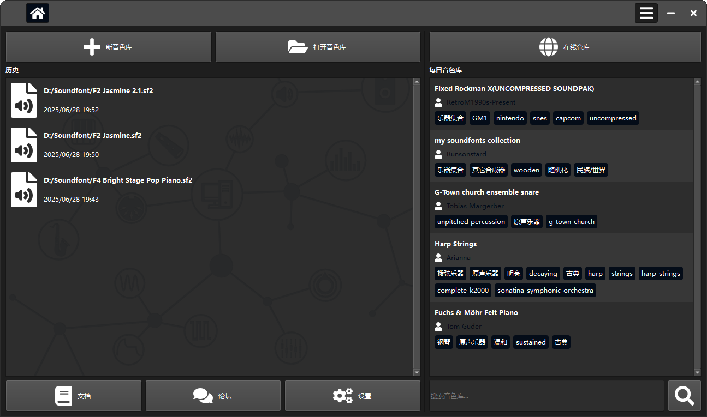

这里讲一下编辑器界面的功能区划分。主界面主要由三个区域构成：左侧的树状结构面板、右侧的编辑主区域，以及顶部的工具栏。左侧的树状结构面板是整个音色库的导航地图。它按照SF2格式的标准层级结构：通用信息、采样、乐器、预设，将音色库的所有内容组织为可展开的树形列表。你通过点击树状结构中的不同条目，来切换右侧编辑主区域所显示的内容。右侧的编辑主区域是实际工作的核心。它不是一个固定的界面，而是一个会根据你在树状结构中所选内容而变化的空间。当你选中“通用”时，这里会显示音色库的属性编辑框，供你填写标题、作者等元数据；当你选中一个采样文件时，这里会变成波形显示和编辑界面；当你选中一个乐器或预设时，这里会变成键位映射和参数调整界面。顶部的工具栏提供了一些全局操作按钮，包括保存、撤销、重做、搜索框以及播放预览控制等。工具栏的内容相对固定，不随树状结构的选择而改变。

开始制作音色库的第一步，通常是创建一个新的工程，或者打开一个已有的SF2文件进行修改。创建新工程有两种方式：在“主页”界面中，点击“新音色库”按钮，会立即生成一个空的SF2工程，此时界面切换到编辑器标签页，树状结构中仅有四个空的主标题：通用信息、采样、乐器、预设，没有任何实质内容；另一种方式是，如果你已经在其他标签页中，也可以通过菜单栏的“文件”→“新建”来创建。创建完成后，建议立即保存一次，指定保存位置和文件名，避免后续操作中因意外崩溃导致进度丢失。

打开现有文件同样有两种方式：在“主页”界面中，点击“打开音色库”按钮，在文件浏览器中定位并选择已有的.sf2文件，即可加载到Polyphone中并自动切换到编辑器标签页；也可以通过菜单栏的“文件”→“打开”实现相同功能。“打开最近的工程”功能可以快速加载近期编辑过的文件，适合在反复修改的场景下使用。

在编辑器界面的底部，有一个状态栏。当你在树状结构中选中某个元素时，状态栏会显示一些简短的摘要信息。例如，选中一个采样文件时，状态栏会显示该采样的采样率、位深度、声道数等基本信息；选中一个乐器时，会显示该乐器包含的分区数量；选中预设时，会显示其关联的库号和音色号。这些信息虽然简短，但可以在不进入详细编辑页面的情况下快速了解所选元素的基本属性，适合在浏览和检查时使用。

**至此，你已经对Polyphone的界面布局和启动流程有了整体印象。接下来的章节将依次深入讲解树状结构、工具栏和各个编辑页面的详细用法。**

### 6.3.2 熟悉树状结构（Tree）

当我们新建一个SF2音色库工程，或打开一个现有的SF2文件后，Polyphone的主界面会显示一个“音色库编辑器”（SoundFont
Editor）。这个编辑器的核心，是一个位于左侧的树状结构面板（Tree）。它就像音色库的导航图，展示了你正在编辑的SF2文件的所有内容。你在这个树状结构中选择什么，右侧主区域就会显示对应的编辑界面。这个树状结构之所以如此重要，是因为它直接反映了SF2格式的标准层级架构。一个SF2音色库从底层到顶层，严格遵循“采样→乐器→预设”的三级结构。Polyphone的树状结构完全对应这个体系，并在此基础上增加了一个“全局（General）”信息头。

下面我们按从上到下的顺序，来认识这个树状结构。

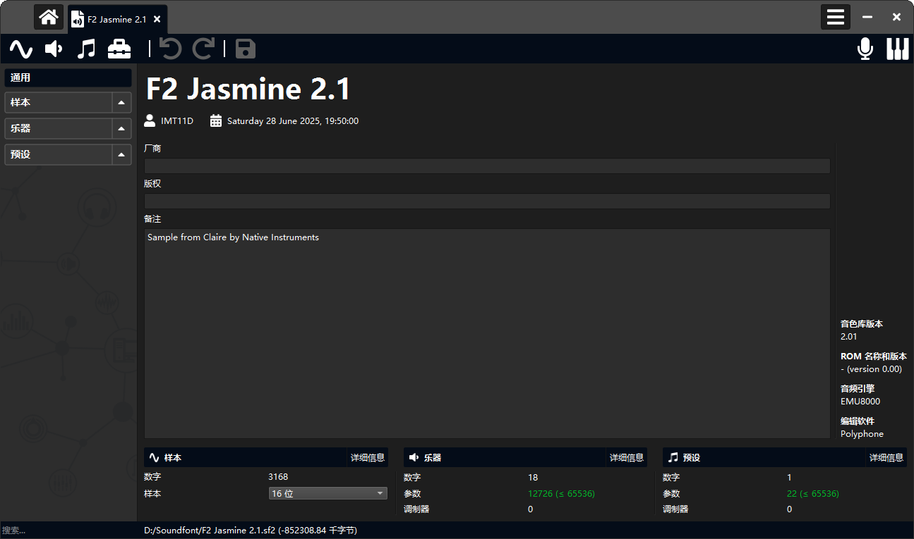

通用（General）。这是树状结构的第一个条目，代表整个音色库的属性信息。当你选中它时，右侧主区域会显示一个编辑页，你可以在其中填写音色库的标题（Title）、作者（Author）、版权信息（Copyright）等元数据
。这部分信息不会影响声音本身，但对音色库的管理和标注很有帮助。

样本（Samples）。这是树状结构的第二层，也是音色库最基础的“原料”层级
。它罗列了当前音色库中导入的所有音频采样文件（通常是WAV格式）。当你展开“Samples”标题，会看到一个个独立的采样文件名。点击任意一个采样，右侧主区域会显示该采样的波形图，供你进行精细的编辑，例如查看波形、设置循环点（Loop）或调整根音（Root
Key）。如果采样文件数量庞大，你可以使用树状结构上方的搜索栏快速筛选：输入关键词后，树状结构会只显示名称匹配的采样、以及使用该采样的乐器和预设，极大地方便了在大型工程中的查找定位。

乐器（Instruments）。这是树状结构的第三层，也是音色库的“加工”层级。你可以把乐器理解为一个“容器”，它将一个或多个采样（Samples）按照音高（Key）和力度（Velocity）范围组织起来。例如，一个名为“SteelStringGuitar”的乐器，里面可能包含了多个采样，分别映射到吉他不同琴弦的音高范围。当你展开“Instruments”标题，会看到你创建的所有乐器名称。点击一个乐器，右侧主区域就会出现该乐器的编辑界面，在这里你可以将采样拖拽到乐器中，并为每个乐器设定其触发的音高和力度范围。

预设（Presets）。这是树状结构的顶层，也是音色库的“成品”层级。预设是最终被MIDI播放器调用的“音色名称”。一个预设可以包含一个或多个乐器（Instruments）。在MIDI标准中，预设由“库号（Bank）”和“音色号（Program）”两个数字共同标识。当你展开“Presets”标题，会看到你创建的所有预设，例如“000:000
Grand Piano”、“000:001 Bright
Piano”。点击一个预设，右侧主区域会显示该预设的编辑界面，在这里你可以从“Instruments”列表中拖拽乐器进来，组合成一个完整的可演奏音色。

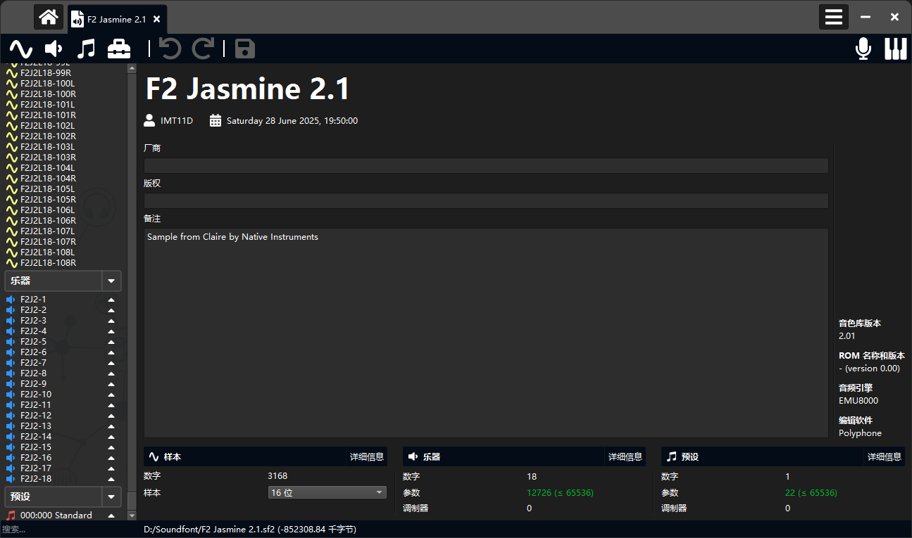

这个树状结构不仅是“导航”，更是核心的编辑工具。我们先简单了解一下它的操作逻辑，一步一步来。你可以直接在树状结构上进行多种操作：

拖拽：这是构建音色库最高效的方式。你可以将“Samples”下的一个或多个采样文件，直接拖拽到“Instruments”标题或某个乐器上。拖到“Instruments”标题上，Polyphone会自动为你创建一个新的乐器，并将这些采样放入其中；拖到某个已存在的乐器上，则是将采样添加到该乐器中作为新的分区。同理，你也可以将一个乐器拖拽到某个预设中，从而快速构建一个完整的音色预设。

复制粘贴：在树状结构中选中一个或多个元素，可以使用右键菜单或快捷键（Ctrl+C或者Ctrl+V）进行复制粘贴。这个功能在需要基于已有乐器和预设创建变体时非常高效，并且允许在不同音色库（不同标签页）之间进行复制。

搜索与筛选：如前所述，树状结构上方的搜索栏可以快速定位特定名称的采样、乐器或预设，并能智能显示相关联的上下游元素，极大地提升了管理大型音色库的效率。

**理解了这个树状结构，你就能够按图索骥，清晰地将复杂的SF2格式解构为三个可操作的层级，而后剩下的工作就是向这些层级中填入内容和调整参数。在下一节，我们将介绍上方的工具栏以及不同层级对应的编辑页面。**

### 6.3.3 工具栏

在熟悉了树状结构的层级关系之后，接下来需要了解的是如何使用界面上的工具来实际编辑这些层级中的内容。本节介绍编辑器界面中除树状结构以外的三个主要组成部分：工具栏、编辑页面和配置摘要。

我们先讲工具栏。工具栏位于菜单栏下方、编辑主区域的上方，是一排带有图标和文字的操作按钮。它的图标和工具箱很像。不过工具栏有一个行为比较特殊：它的可操作性随着你当前编辑的对象类型而改变。简而言之，你编辑采样，编辑乐器，编辑预设（也就是你当前在左侧菜单栏选中的对象）时，工具栏内的内容是不一样的，因此我们分别讲解。

**先来讲采样编辑的工具栏。**

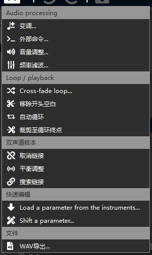

**变调，字面意思，以半音为单位（不过通常用不到，嗯）。**

外部命令，这个的话我稍微说一下——

外部命令（External
Command）在Polyphone官方手册和社区中有较清晰的说明。官方文档中确实提供了外部命令工具的使用方法，主要收录在Polyphone官网的“Sample
tools”章节。此外，官方论坛中也有人讨论过这个功能的使用方式，包括与其他音频编辑软件的配合问题。不过这个功能在实际使用中容易卡住，需要一些额外的解释。

外部命令工具允许用户在Polyphone界面内直接调用一个外部音频编辑软件（如Audacity、Sweep或SoX）来修改当前选中的采样文件，修改结果会自动保存回音色库中。它省去了“导出采样→在外部软件编辑→重新导入采样”的手动操作流程。这个功能适用于需要精细波形编辑的场景，例如降噪、去除杂音、精细调整音量、修剪采样等。外部命令可以处理单个采样，也可以同时处理多个选中的采样。

在Polyphone的菜单栏中，依次点击“工具”→“样本”→“外部命令”，打开外部命令对话框。在对话框的命令行输入框中，填写能够启动外部编辑软件的命令行指令。对于Windows系统，填写的是DOS命令；对于Linux或macOS，填写的是Shell命令。

填写完成后点击确定，Polyphone会执行以下步骤：首先将当前选中的采样文件导出为一个临时的.wav文件；然后运行你填写的命令行指令，启动外部编辑软件并加载该临时文件；此时可以在外部软件中对音频进行任意编辑操作。**编辑完成后，必须在外部软件中将修改后的文件保存回原路径并覆盖临时文件，然后关闭外部软件。**Polyphone检测到外部命令执行完毕后，会自动将修改后的采样重新导入到音色库中，替换原有的采样。

外部命令工具的工作机制有严格的前提条件：Polyphone导出的是一个临时.wav文件，最终也只认这个文件。如果在外部软件中将修改结果保存为新文件或保存到了其他位置，Polyphone无法识别，最终导入的还是未经修改的原始采样。

一个常见的坑点是Audacity。Audacity默认没有“保存”按钮，只有“导出音频”功能，而外部命令工具需要的是对临时文件执行“保存”操作。使用Audacity时，需要先通过“帮助”→“诊断”→“显示日志”查看当前打开的临时文件的实际路径，编辑完成后通过“文件”→“导出”→“导出为wav”，选择该路径覆盖原文件。有用户反馈使用Wavosaur作为外部编辑器时，无缝衔接效果更好，因为Wavosaur有直接的"保存"功能。

另外需要注意的是，某些音频编辑软件不支持保存循环点信息。如果采样文件中已经标记了循环点，在外部软件中保存后循环点可能丢失。因此建议先完成所有波形层面的编辑（降噪、裁剪、音量调整等），再回到Polyphone中设置循环点。

这里给一个示例用法。

对于Windows系统，假设Audacity安装在默认路径下，命令行内容一般为：

C:\Program Files\Audacity\Audacity.exe

如果使用SoX这类命令行工具，可以写成：

sox %f -3.0dB %f

**具体格式需查阅对应软件的文档。**

**接下来音量调整。**

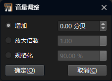

**在Polyphone中调整音量的入口有三个，对应三种不同的计算逻辑，分别是增益（dB）、放大倍数和规格化。一个一个说。**

**增益是以分贝为单位的绝对增减量。**在Polyphone的采样工具中，增益对应的是"音量增量设置"，即在原始电平的基础上，增加或减少指定的分贝数。输入正数表示整体提升音量，输入负数表示降低音量。分贝是对数单位，+6dB对应幅值翻倍，-6dB对应幅值减半。增益的优点在于调整量是固定的绝对差值，无论当前采样是-12dBFS还是-3dBFS，输入-3dB都会让每个文件精确地降低3dB，保持原有的相对响度关系不变。这使得增益适合用于对一批已经电平均匀的采样做统一的整体微调，或补偿采样在外部编辑器中因处理而引入的电平偏移。

**放大倍数直接在幅值上做乘法运算，是一种线性增益控制。**输入2表示将每个采样点的幅值乘以2，输入0.5表示乘以0.5。放大倍数与增益的数学关系是互相转换的——6dB增益约等于2倍幅值。放大倍数不依赖对数运算，直觉上更容易理解"把波形放大多少倍"，但由于人耳对响度的感知是对数的，放大倍数并不是一个线性的响度变化感知，2倍幅值并不等于人耳觉得响了2倍。放大倍数适合在需要对采样幅值做精确数学运算的场景，比如当你知道某个采样需要精确地衰减到原幅值的特定比例以匹配另一个采样组时。

**规格化与其他两个方式有本质区别，它不依赖当前值进行加法或乘法运算，而是对整个采样进行重新扫描并重新定义最大幅值。**规格化的参数是一个百分比，含义是将该采样的峰值幅值设置为允许最大电平的指定百分比。例如输入80%，Polyphone会找到该采样中绝对值最大的采样点，计算将其幅值缩放至满量程80%所需的增益系数，然后将整个波形乘以该系数。规格化操作会使得每个采样最终的峰值电平完全一致（都是相同的百分比），而不管原先的波形有多小。这意味着如果一批采样的原始电平不统一，规格化可以一次性将它们全部推到相同的峰值电平，从而消除因录音或导出时电平差异导致的音量跳跃。

这三个工具在实际使用中的定位差异很明显。规格化是最常见的批次处理方式，尤其适合将来自不同来源的采样统一到相近的响度水平，但它会改变采样原有的动态关系。原始电平较高的采样和原始电平较低的采样最终峰值相同，相对关系被抹平。增益和放大倍数则是在现有基础上做偏移或缩放，不会改变各采样之间原有的响度对比，适合在规格化之后做精细微调。

另外需要留意的是规格化的百分比取值。官方论坛中有人建议规格化设80%或85%较为安全，直接设100%可能会导致后续在合成器或播放器中出现额外的削波或其他问题。原因在于规格化到100%意味着采样峰值已经紧贴0dBFS，之后如果在乐器或预设层面施加任何正增益或滤波器提升，都会立即导致硬削波，而80%的规格化峰值约为-2dB左右，为后续的混音和调制留出了必要的余量。

**下面我们来看频率滤波。Polyphone中的频率滤波（Frequency
Filter）功能和均衡器（Equalizer）是两回事。它并不是那种常见的、可以精细调节频段增益的均衡器，而是一个更“硬核”的工具。简单说，均衡器是用来“调整”频率的，比如提升一些高频让它更亮，或衰减一点低频让它更干净。而Polyphone的频率滤波工具是用来“切除”频率的，它会以非常直接的方式，把你指定的频率范围从采样中完全移除。当你使用这个工具时，Polyphone会分析选中采样，并显示一个包含其所有频率成分的窗口。你可以用鼠标在这个窗口里划定一个“红色区域”，这个区域内的所有频率都会被毫不犹豫地删掉。**

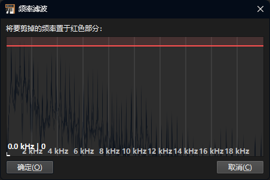

官方文档对这个工具的注释是：“这种滤波器不常见，因为它以‘生硬’的方式切断频率。这个工具在需要设计砖墙滤波器时可能会有用，但在大多数情况下，你可能更想使用均衡器。”
这个工具的用途非常明确，就是处理那些需要彻底清除的特定问题频率，比如消除某个非常顽固的、均衡器难以处理的特定频率噪声，或者为创造某种特殊的音效效果而完全移除某段频率成分。

它和之前提到的音量调整工具是并列关系，都位于“工具”菜单下的“样本工具”中。如果你只是想微调采样的音色，更温和的办法是使用乐器编辑界面中那个低通滤波器（Low-pass
filter），它会以一个更平滑的斜率（每倍频程12dB，等效于二阶LPF）衰减高频，而不是生硬地切除。

不得不提这个工具一个非常蠢的设计（设计这东西的人真的做过音乐么）：这个频率滤波的窗口是线性频率的，而不是对数频率的。众所周知，音高和频率的对应关系根本不是线性而是对数的，所以频率如果要正确反映音高的话，也应该用对数的尺度，而不是这种高频非常细致而低频极为粗糙的线性尺度。这就导致了在线性频率轴上，低频区域的显示被极度压缩，而高频区域却获得了过多的视觉空间。在调整滤波范围时，低频段几个半音的区别在视觉上几乎无法分辨，完全无法对应到具体的音符或音程。这可能是因为开发者在设计时没有考虑到乐器音色编辑的实际需求，或者只是套用了某类音频分析软件的通用显示逻辑。但无论如何，这个设计对音色库制作而言是不合格的。

**这个工具能用，但在实际工作中很难用。相比之下，我建议你完全不要用这个功能。如果真的需要对采样做频率切除，将采样导出到Audacity或其他具备专业频谱显示和均衡工具的音频编辑软件中操作，比在Polyphone里用这个线性频率窗口要可靠得多。**

**总之，不要用这个破烂。**

**接下来四个处理采样长度的工具我们放在一起讲（回顾一下本节最开始的那个菜单栏目的图片，包含了我们讲到的全部类型的效果）。**

Cross-fade
loop是用于处理循环点的工具。在音色库制作中，循环点决定了采样在持续播放时从哪个位置跳转到哪个位置。如果循环起始点和结束点处的波形不匹配，播放时就会产生可闻的咔嗒声或爆音。Cross-fade
loop的作用正是在循环起始段和结束段之间应用一段交叉淡化，使两个原本不连续的波形在几毫秒内平滑过渡，从而消除循环播放时的突兀感。这个工具的使用前提是采样中已经手动标记了循环起始点和结束点，没有设置循环点时该工具无法生效。在Polyphone
2.5版本中，Cross-fade
loop工具已经更新，不再依赖原有的近似循环位置，而是基于用户精确设置的循环点来独立运作，并且使用了更短的交叉淡化时长以减少对原始音色的影响。使用方法是先在波形图上为采样设置好循环起始点和结束点，然后选择该工具，在弹出的对话框中设置交叉淡化的持续时间，软件会自动计算并应用平滑过渡。

移除开头空白是一个很直观的功能。很多采样文件在录音或导出时，在乐器的实际发声之前会带有一段静音区，这可能是录音设备启动延迟造成的，也可能是导出时预留了缓冲时间。这段空白在音色库播放时只会造成不必要的延迟，并且占用存储空间。该工具会自动检测采样开头部分的静音段，并将其彻底删除，使有效声音从第一个起振点开始。在Polyphone的偏好设置中有一个选项可以开启“导入时自动移除开头空白”，每次导入采样时都会自动执行此操作，免去了手动处理的步骤。需要注意的是，如果采样本身带有非常微弱的起振音头，该工具可能无法完全识别，或者移除得不够彻底，导致仍有少量静音残留。在这种情况下可以手动调整静音检测的阈值参数，或者直接在波形图上手动裁剪。

自动循环是Polyphone中用于快速生成循环点的智能化工具。对于钢琴、弦乐等需要长时值持续音的音色，为每个采样手动寻找循环区域是一件极其耗时的工作。自动循环工具会分析采样波形，自动找到一段相对稳定的音频区域，并在此处生成循环起始点和结束点。该工具内置了交叉淡化逻辑，确保生成的循环点处能够平滑过渡。它生效的前提是采样中必须有一段超过一定时长（约0.25秒）的稳定音频区域可供检测。如果采样太短或音量持续衰减，工具可能会报错，此时需要用户手动指定循环区域或放弃循环。使用方法是选中采样后，从菜单栏选择“工具”→“样本”→“自动循环”，软件就会自动执行。如果生成的结果不理想，可以用Ctrl+Z撤销，然后手动在波形图上框选一个大致稳定的区域，再尝试一次自动循环。

裁剪至循环终点是一个用于清理采样文件末尾冗余数据的工具。当采样中设置了循环点之后，循环结束点后面通常还会剩余一段音频数据，可能是自然衰减的尾部，也可能是录音中残留的环境声。这些数据在播放循环音时不会被用到，因为播放指针会从循环起始点跳回，而不是继续向后播放，但剩余数据依然占用文件体积。该工具的作用就是直接删除循环结束点之后的所有音频数据，使采样在循环点处截断。在Polyphone的偏好设置中也有一个“裁剪以循环”的选项，开启后会在导入采样时自动执行此操作。“移除开头空白”和“裁剪至循环终点”配合使用，可以确保采样文件中只保留从有效起振到循环结束之间的必要数据，最大限度地压缩音色库的体积，同时避免无关数据干扰播放器的加载和播放逻辑。

**关于循环点的设置，我们放在一会，也就是采样的编辑界面进行详细介绍。这样你就可以用上我们刚才提到的这四个功能了。**

**下面我们接着看双声道样本的三个编辑功能。**

**在处理立体声采样时，Polyphone有自己的一套逻辑，与常见的音频编辑软件不太一样。它不会直接把一个立体声WAV文件当作一条包含左右声道的轨道来处理，而是把立体声拆成两条独立的单声道采样来管理。这其实是SF2格式的设计限制，这种格式本身就把立体声视为两个独立的单声道采样。**

理解了这一点，下面这三个工具就好懂了。

第一个是取消链接。在Polyphone里，一个立体声采样在导入后会自动变成两个独立的采样文件，通常以L和R后缀区分左右声道，并被标记为“已链接”状态。取消链接就是解除这种配对关系，把左右声道彻底变成两个互不相关的单声道采样。解除链接后，左右声道的采样就可以被独立修改、重新分配，甚至用于不同的乐器。至于什么时候需要这样做，通常是在音色库制作中遇到需要单独处理或重新配对一个声道的时候。

第二个是平衡调整。简而言之用于调整立体声采样中左右声道的相对响度。在SF2的立体声实现中，左右声道是两个独立的单声道采样，需要在乐器或预设层面通过声像（Pan）参数将其分配到左右位置。当两个声道被链接时，如果其中一个声道在采样编辑器中被修改（例如进行了增益调整或滤波器处理），且启用了立体声编辑同步功能，修改会自动应用到另一个声道。平衡调整可以用于补偿两个声道在录音或导出时产生的电平差异，或人为制造左右不对称的声场效果。但如果需要精确控制左右声道在立体声场中的位置，通常需要在乐器编辑器的参数面板中为左右两个声道分别设置声像值，而不是在采样层面调整。

第三个，搜索链接。它是一个用于在大型音色库工程中快速查找和恢复立体声配对关系的工具。当你解除了两个采样之间的链接，或者一个立体声采样的某一个声道被意外删除或重命名后，这个功能可以根据文件名或根音等信息，自动找到可能与当前采样配对的另一个声道采样，并建议恢复链接。它的作用是在立体声配对关系被打乱时，提供一个重新关联的途径。不过，在实际操作中，将左声道和右声道拖入同一个乐器分区，并分别设置合理的声像值，也是一种直接的立体声构建方式，可以不依赖于链接机制本身。

**最后三个，一鼓作气。**

Load a parameter from the
instruments。这个工具位于Polyphone的样本工具菜单中，它的作用是将一个已经存在于某个乐器中的参数值，批量应用到当前选中的采样文件上。在实际操作中，它的工作流程是：先在树状结构中选中一个乐器，该乐器中包含了若干已经配置好参数的采样分区，然后打开这个工具，它会列出该乐器中所有分区的参数（例如根音、音高偏移、音量偏移等），你可以从中选择一个参数，该工具会将其数值提取出来，并赋值给当前选中的采样文件。

这个功能适用于以下场景：当你已经在一个乐器中精调好了某组采样的参数，现在需要新建另一组采样并希望使用相同的一组参数设定，不必手动逐项抄写数值，直接通过该工具从已有的乐器中加载过来即可。需要注意的是，这个工具是从乐器读取参数并应用到采样，方向是单向的，不会反过来修改乐器中的任何数据。

Shift a
parameter是一个批量偏移工具，允许用户对当前选中的所有采样文件，同时修改某个特定参数的值。这个偏移可以是加减一个固定的数值，也可以是乘以一个系数，取决于参数类型。例如，选中一批采样后，使用该工具将它们的音高偏移参数统一增加100音分，或者将所有采样的音量偏移统一降低3dB。

这个工具的优势在于批量操作的效率。不需要逐个打开采样文件调整，直接在工具对话框中设定偏移量和作用范围，即可一次性完成对所有选中采样的参数调整。它适用于需要整体微调一批采样的音高、音量或声像等参数，且保持它们之间的相对差异不变的情况。比如当你发现一组钢琴采样整体偏高20音分时，使用此工具可以一次性修正。

导出wav是Polyphone中最基础也比较常用的功能之一，位于采样工具菜单中，用于将当前选中的采样文件导出为独立的wav文件。

与保存音色库不同，导出wav不保存任何SF2格式的元数据（如映射信息、循环点、包络参数等），只输出音频数据本身。使用方法是，选中一个或多个采样，打开该工具，在弹出的对话框中指定输出路径和文件命名规则，点击确定后，每个选中的采样都会被导出为一个独立的wav文件。如果需要导出原始版本，导出前应确保采样未经任何增益或滤波处理；如果需要导出处理后的版本，则应在工具中勾选“应用所有修改”之类的选项（如果有），确保当前采样中已应用的增益、滤波、循环点等修改被渲染到导出的wav文件中。如果仅需导出采样内容而不关心修改，则不需要额外勾选。该功能常用于将音色库中的采样提取出来以便在其他软件中使用，或为备份和存档目的导出采样文件。

**工具箱里关于采样的部分介绍完了，下面介绍乐器的工具箱。我们刚才说过了，编辑乐器而不是采样的时候，工具箱的内容是完全不一样的，所以我将接着依次介绍。**

**编辑乐器的时候，工具箱长这样（请记住这张图）：**

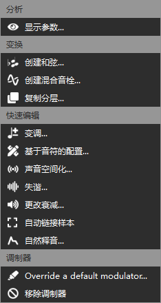

**第一个，显示参数。**

**其实这个功能就是个可视化分析工具，让你看看乐器里的某个参数（比如音量包络、滤波器截止频率）在键盘上是怎么分布的。**

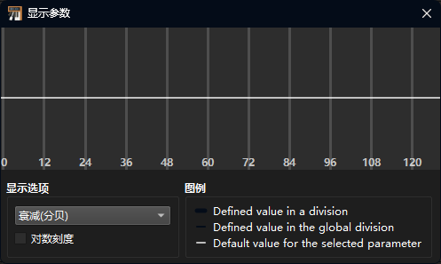

**点开下拉菜单之后有很多参数可以看（真的很多！），不过呢这个图不太适合排版，分门别类整理之后大概是这样的：**

基础参数：衰减 (分贝)、平衡 (-50:50)

校音与音阶：校音 (半音)、校音 (音分)、音阶调整

滤波器：Filter, cutoff (Hz)、Filter, resonance (dB)

音量包络（Volume Envelope）：音量包络延迟 (秒)、音量包络起音
(秒)、音量包络保持 (秒)、音量包络衰减 (秒)、音量包络延音
(分贝)、音量包络释音 (秒)

音量包络的键位调制：Key → Vol env hold (c)、Key → Vol env decay (c)

调制包络（Modulation Envelope）：调制包络延迟 (秒)、调制包络起音
(秒)、调制包络保持 (秒)、调制包络衰减 (秒)、调制包络延音
(%)、调制包络释音 (秒)

调制包络的调制目标与键位调制：Mod env → pitch (c)、Mod env → filter
(c)、Key → Mod env hold (c)、Key → Mod env decay (c)

调制LFO（Mod LFO）：Mod LFO delay (s)、Mod LFO freq (Hz)、Mod LFO →
pitch (c)、Mod LFO → filter (c)、Mod LFO → volume (dB)

颤音LFO（Vib LFO）：Vib LFO delay (s)、Vib LFO freq (Hz)、Vib LFO →
pitch (c)

其他：和声 (%)、混响 (%)

在Polyphone的乐器编辑器里，每个采样分区都有各种参数，比如音量偏移、音高偏移、滤波器截止频率、ADSR包络参数等等。这些参数在每个分区上可能是不同的，比如低音区和高音区的音量偏移可能不同，或者不同力度层的滤波器频率不同。

显示参数这个工具的作用就是把这些参数随键盘音高（或力度）变化的趋势画成一张图表，让你直观地看到这个参数在整个键盘范围内的分布情况。打开之后，你会看到一个坐标图，横轴是MIDI音符编号（0到127），纵轴是该参数的取值，图上会有一条曲线或散点，展示每个音符位置对应的参数值。图表的纵轴刻度是线性的，也提供对数刻度选项，但需要注意当参数值小于或等于0时对数刻度的处理方式。

这个工具本身只显示，不修改。它只是一个可视化分析功能，帮你快速发现参数分布是否合理，比如检查某个力度层的音量是不是在某几个键上突然跳变，或者滤波器的截止频率是不是在某个区域设置错了。如果发现问题，需要用其他工具（比如根据音符设置参数）去修正。

同理，官方文档提到这个工具和预设工具里的同名功能完全一样，并且它不支持多选操作，当你同时选中多个乐器时，该工具不可用。

官方文档里这东西长这样（我拿的原图）：

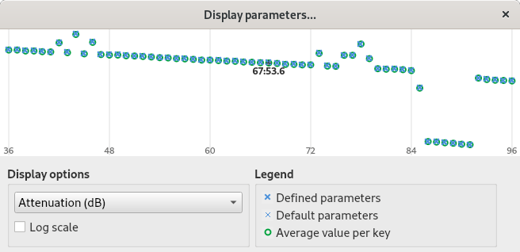

**对了，Log
Scale（对数尺度）并非在每一个参数上都能正常使用（会提示不能显示所有的值，比如某个参数涉及到负数，Log无法表示），一般的话我建议在涉及到频率的参数上开启这个选项。**

**继续。创建和弦、创建混合音栓、复制分层。**

创建和弦是基于当前选中的乐器，自动生成一个包含所有可能和弦的新乐器。它的工作方式是把原始乐器的采样按半音阶（例如每隔3个键）触发一遍，并将同时发声的音符录制下来，形成每个琴键对应一个完整和弦采样的新乐器。这个工具适合做合唱、Pad或者需要一键触发整个和弦的场景。使用时会要求填写新乐器的名称，并提供一些录制选项，比如是否启用自动循环、立体声录制等。需要注意的是，这个工具生成的采样是录制出来的，而不是简单地复制映射关系，所以它会创建一个全新的、包含独立采样的乐器。

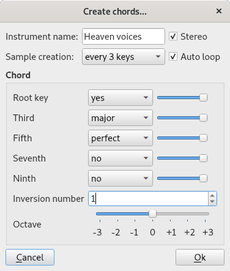

创建混合音栓是管风琴音色制作里的一个概念，Polyphone里对应的工具通常叫“为每个音符合并采样”（Merge
samples for each
note）。它的逻辑和创建和弦有些相似，但目的不同。混合音栓是把一个预设（Preset）里同时触发的多个乐器、多个采样的声音，在每一个琴键上合并成一个单独的采样。比如一个管风琴音栓组合里，按下一个键会同时触发好几个不同音高的管笛采样，这个工具就会把这些同时发声的采样录制并混合成一个单一的采样文件。这样做的结果是新预设里每个琴键只播放一个采样，而不是同时播放好几个，从而大幅降低
CPU
占用。它和创建和弦的区别在于，创建和弦是基于单个乐器生成和弦，混合音栓是基于整个预设做多音色合并。

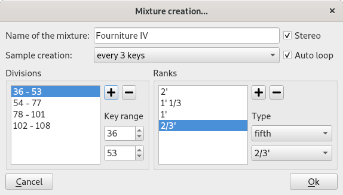

复制分层这个工具在Polyphone的官方文档里对应的名字是复制分区（Duplicate
divisions）。它的作用是把一个乐器里现有的分区（Division）按音高范围或力度范围拆开、复制成多个独立的分区。举个例子，如果一个采样原本覆盖了36到38这三个键（C2
到D2），复制分层之后，它会变成三个独立的分区：36到36、37到37、38到38，每个分区各自独立，可以单独调整参数。这个工具的意义在于给你更精细的控制粒度。原本一个分区覆盖三个键时，你只能对整个分区调音高偏移或音量；拆分之后，你可以给C2和D2设置不同的微调值。按力度范围复制也是同理，把一个大力度范围拆成多个小力度层，方便做更细致的力度响应曲线。

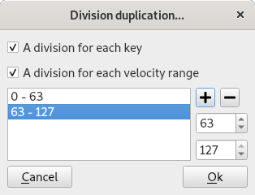

三者可以这样理解：创建和弦是生成新结构，混合音栓是合并多结构，复制分层是拆分现有结构。它们都属于乐器编辑层面用来快速重构音色库组织方式的工具，而不是直接修改声音本身的参数。

**变调这个工具，工作方式很直接。**你输入一个以半音为单位的偏移量，Polyphone就会对选中的采样文件进行重采样（resample）。比如输入+12，采样就会以两倍的速度播放，音高整体升高一个八度；输入-12，则以一半的速度播放，音高降低一个八度。这个过程是**破坏性**的，它会生成一段新的、物理上已经改变了的音频数据。

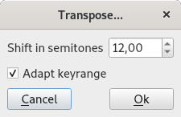

在Polyphone的语境里，它和音高微调（Tuning）或根音（Root
Key）是两码事。音高微调和根音是在乐器编辑层面做逻辑上的映射，采样数据本身不变，回放时由合成器实时计算变调。而变调工具是直接对音频文件本身下手，把一个C的采样文件硬生生重采样成D的频率，然后存回音色库里。所以它的适用场景很窄。通常是用在当你没有对应音高的采样，又不想在乐器层面通过调整根音或音高偏移来假装变调时。比如你手头只有C3的采样，但音色库需要C3和C#3两个采样，用这个工具把C3的采样重采样一次生成C#3的独立文件，就能绕开乐器层面的映射逻辑，让每个键都对应一个物理上独立存在的采样。

这么做的代价是，重采样会引入插值误差，尤其是在大幅度变调时，高频细节会损失，音质会变差。官方文档也提到，如果采样本身带有循环点，重采样后循环点的位置会变得不准确，因为循环点是基于整数采样点定义的，而重采样后的波形已经改变了，原来的循环点可能不再适合新的音频数据。另外，在Polyphone中，变调工具作用于乐器层面，会调整乐器的基音、微调以及音符范围，本质上是对整个乐器做移调，使其在键盘上的位置发生变化。

**基于音符的配置（Key-based
configuration）是乐器编辑中一个批量调整参数的工具，它的核心作用是把一个参数的修改曲线映射到整个键盘上，让参数随音符变化而自动变化。**这个工具允许你同时编辑一个乐器内所有分区（divisions）的某个参数。它的操作界面是一张图表，横轴代表MIDI音符编号，从0到127，纵轴代表参数的修改强度。图表左边第一个值对应音符0所在分区被应用的修改量，右边最后一个值对应音符127所在分区被应用的修改量。

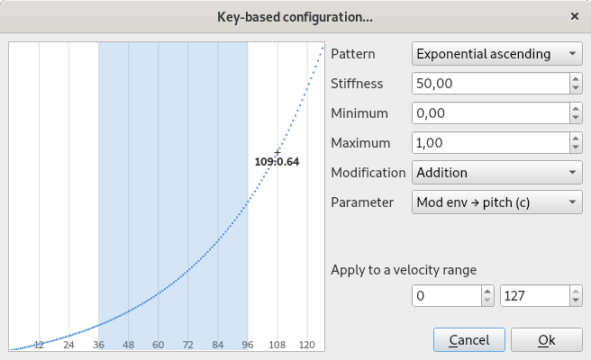

你可以通过几种方式编辑这条曲线：用鼠标手动绘制、套用线性规律、套用指数规律，或者用随机生成。如果选择线性或指数规律，在图表上左键点击定义起点，右键点击定义终点，中间的部分会自动按规律计算。

参数选择方面，你可以指定要修改哪个参数，比如调制包络到音高的深度、滤波截止频率等。修改类型有三种：加法（在原值基础上加上修改量）、乘法（原值乘以修改量）、替换（修改量直接替换原值）。这个工具还有一个实用选项，可以限定只对力度范围在特定区间内的分区生效。对于钢琴这类包含多个力度层的乐器，如果你只想调整某个力度层在高音区的滤波截止频率，而不影响其他力度层，就可以在工具中设置力度范围过滤，只让目标分区被修改。

它的适用场景包括，让滤波截止频率随音符升高而逐渐增大（模拟真实钢琴高音更亮的特点）、让释音时间随音符变化、或者对音高调制深度做非均匀的键盘映射。本质上，它是把逐分区手动调参数的工作，变成画一条曲线，软件自动分配到每个分区的批量操作。

**声音空间化这个工具，作用是根据音符在键盘上的位置，自动为它们分配声像（Panpot）位置。**简单说，就是让低音从左边出来，高音从右边出来，或者反过来，营造出钢琴这类乐器天然的宽度感。

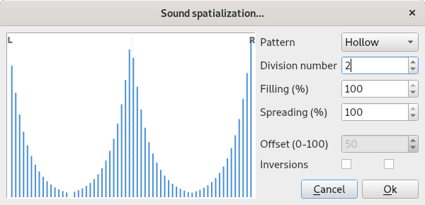

这个工具会在乐器层面生效，作用于选中乐器里所有的采样分区。打开后会看到一个图表，横轴对应键盘上的音符，纵轴代表声像位置（左到右）。图表里的竖条，每一条代表一个采样分区，条的长度和音符的高低相关。最左边代表声音完全来自左侧，最右边代表完全来自右侧。

工具提供了几种预设的模式可以直接套用：上升是高音在左、低音在右；下降是低音在左、高音在右，这是钢琴最常见的排列方式；凹陷是低音在两端、高音在中间；尖峰是高音在两端、低音在中间；随机则完全随机分配。

除了选模式，还有几个参数可以微调。重复次数控制图案在键盘上重复几轮。占据比例决定效果的强度，比如100%就是声像完全拉到两侧，50%则是在中间附近摆动。填充控制一个分区内部的声像分布是否均匀。当占据比例不是100%时，偏移可以整体左右移动声像的中心位置。

图表会随着参数调整实时更新，鼠标悬停在某条上时还会显示对应的音符编号和具体的声像值，方便你直观检查效果。这个工具同样可以在预设工具里找到，用法和乐器层面完全一样。

**失谐（Detune）这个工具，作用是有意地让乐器里每个音符的音高产生细微的偏差，从而在与其他完全音准的乐器同时发声时，产生一种波动或拍音效果。**

这种效果的本质是拍频现象。当两个频率非常接近的声音同时响起时，它们的波形会周期性地相互干涉，导致音量周期性地起伏，听起来就像声音在颤抖或波动（一个很大简单的例子就是钢琴的三根琴弦同时震动，会产生这种很独特的效果）。这个工具就是通过人为制造这种微小的音高偏差来触发这种效果。在Polyphone里，这个工具主要用来模拟弦乐、合唱类音色增加自然的厚度和轻微的失谐感。它有两个主要的调节参数。

第一个参数是基准拍频（Beats per second at key
60）。它定义了在键盘中央C（key=60）这个位置上，每秒产生多少次拍音。比如，设为2就意味着在C4上每秒会产生两次音量起伏。这个数值越大，失谐的程度就越深，波动感就越明显。

第二个参数是拍频变化率（Evolution）。它控制着拍频随着音高变化的速度。如果把这个值设为1，那么整个键盘上所有音符的拍频都是恒定不变的。如果设为大于1的数，那么越往高音区，拍频就越高（波动越快）；如果设为小于1的数，则越往低音区，拍频越高。官方文档提到，管风琴音色通常会把变化率保持在1，意味着整个键盘上的拍频是恒定的。

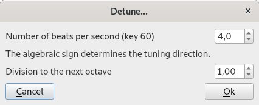

**需要注意的是，这个工具和之前提到的变调完全不同。**变调是直接对采样文件进行重采样，改变的是物理音高，而且会破坏循环点；而失谐是一种效果处理，它生成的是微小的音高偏移，目的是为了和其他音色叠加时产生干涉，不改变采样本身的基本音高属性。官方示例也展示了，将一个完全音准的乐器和它的失谐版本结合起来使用，就能听到明显的波动效果。

**更改衰减（Change
attenuations）这个工具，作用是批量调整选中乐器中所有分区的衰减值，但它的操作逻辑和直接手动改数值不太一样。**它首先会扫描你选中的乐器，找出其中所有分区里衰减值的最大值和最小值，然后给你一个机会，在不超出上下限的前提下，给所有分区的衰减值统一加上一个偏移量。官方文档给了一个例子：假设你选中的乐器里，衰减值最低的那个分区是16
dB，而你希望整个乐器的最小衰减值变成5
dB（也就是整体音量更大一些），那么工具就可以把所有分区的衰减值统一减少11
dB。

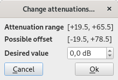

这个工具的关键在于不超出上下限。衰减值在SF2格式中不允许为负数，因为负数意味着放大信号。所以如果你输入的偏移量会导致某个分区的衰减值变成负数，工具会自动把它卡在零的位置，不会真的产生放大的效果。

在实际使用中，这个工具通常用来处理一批音量偏大的采样。比如你从某个音色库里提取了一组采样，它们都被归一化到了0
dB，播放时容易削波。这时候你可以选中相关乐器，用这个工具给所有分区统一增加6
dB的衰减，给每个采样留出6 dB的动态余量，避免同时触发多个音符时出现削波。

需要注意的是，这个工具修改的是乐器层面的衰减值。如果你在预设层面也设置了衰减，最终听到的音量是两者叠加的结果。另外，有用户反馈过这个工具在处理空值时的逻辑存在bug：它会把空白的衰减字段当作0
dB来参与计算，而实际上这些空白字段应该继承乐器的全局衰减值，这可能导致计算结果不符合预期。

**自动链接样本（Link all stereo
samples）这个工具，作用是根据文件名自动把左右声道的采样配对成一对。**它的逻辑非常直接：软件会检查你选中的所有采样文件，如果两个文件的命名只差最后一个字母，且分别是L和R，就自动把它们识别为同一个立体声采样的左声道和右声道。

举个例子，如果有一对采样叫bassoon45L和bassoon45R，这个工具就会把bassoon45L认作左声道，bassoon45R认作右声道，并将它们链接起来。链接之后，当这对采样被拖入乐器时，软件会自动为它们分配正确的声像位置，左声道在左、右声道在右，从而在立体声场中形成正确的宽度。如果软件设置里开启了立体声编辑，在乐器表格中编辑左声道的参数时，右声道会自动同步做相同的修改，不用手动分别调整。

这个工具最主要的应用场景是在导入一批立体声采样之后。因为SF2格式本身把立体声当作两个独立的单声道采样来处理，导入时左右声道通常是分开的。如果手动逐个配对，在采样数量多的时候会非常耗时。自动链接样本可以批量完成这件事。

但需要注意一个风险：这个工具是**严格按照文件名规则**来配对的（确实，这很蠢），只认只差最后一个字母L/R这一种命名方式。如果你的采样命名不是这个格式，比如把左右声道命名为Piano_C4_Left和Piano_C4_Right，工具就不会识别。更麻烦的是，它可能会误判，把两个本来没有关系的采样错误地链接到一起。官方文档专门警告了这一点：如果文件名不符合上述规则，这个工具可能会破坏已有的链接。所以使用前最好先确认一批采样的命名是否规整，或者在小范围测试后再全量执行。

自然释音（Natural
release），在Polyphone的官方文档里是一个批量生成释音参数的功能。它本身不涉及任何复杂的录音尾音处理，只是根据你设定的几个参数，自动为选中乐器中的每一个分区（division）计算并填入一组释音相关的数值。

它的作用逻辑是这样的：工具会遍历选中乐器里的所有分区，根据你指定的**基准音符的释音时间和每八度的衰减倍率**，为每个分区算出一个合适的释音时间，并把这个值写入该分区的音量包络释放（Vol
env
release）参数中。第三个参数失谐量则是用来在计算过程中对音高做一点微调，通常保持默认值0即可。

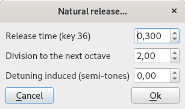

界面上三个参数的含义分别是：

Release time (key
36)，定义了基准音符（音符编号36，即C2）的释音时长。比如你输入0.300，那么所有映射到C2附近的分区就会被赋予大约0.3秒的释音时间。

Division to the next octave，控制释音时间随音高变化的倍率。输入 2.00
意味着每升高一个八度，释音时间就乘以2；输入0.5则意味着每升高一个八度，释音时间减半。对于钢琴这类音色，高音区的衰减通常比低音区快得多，所以这个倍率通常设为小于
1 的值，比如0.5或0.7，让高音的释音更短、更干脆。

Detuning induced
(semi-tones)，音高偏移量，单位是半音。它通常用于补偿因释音时间变化而可能产生的音高感知偏差，实际使用中一般保持为0.00。

这个工具和之前讲的Cross-fade
loop或者自动循环属于完全不同的类别。那些工具作用于采样波形本身，而自然释音纯粹作用于乐器的参数层，不修改任何采样数据。

有一个很直接的用途，比如，当你有一个已经映射好的乐器，但每个分区的释音参数还是默认值或空白时，用这个工具可以一键根据音高分布填上一套合理的释音时间，免去手动逐个调整的麻烦。

最后两个工具我们一并介绍。

Override a default
modulator用于覆盖或禁用SF2规范中为每个乐器自动设置的默认调制器（Default
Modulators）。默认调制器是合成器在加载任何SoundFont时都会自动启用的参数映射规则，比如Note-On
Velocity控制初始衰减、Note-On Velocity控制滤波器截止频率、CC1
控制颤音深度等。

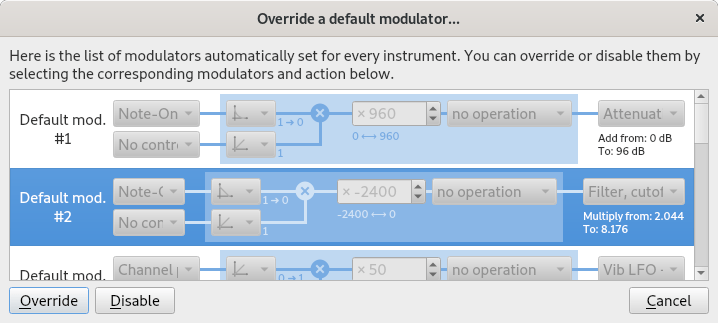

作用是，在乐器编辑器中选中一个乐器，打开该工具后，会看到一份默认调制器的列表。选择其中一项，点击Override按钮，该默认调制器就会被复制到乐器下方的Modulator区域中，你可以在那里修改它的曲线、强度和目标参数，从而改变默认行为。如果点击Disable，则直接禁用该默认调制器，使其不再生效。

需要区分的是，在预设（Preset）层面添加一个与默认调制器完全相同的调制器，并不会真正覆盖或禁用默认行为。只有乐器（Instrument）层面的调制器才能覆盖或禁用默认调制器，预设层面的调制器是独立叠加在乐器层面之上的。

移除调制器（Remove
modulators）作用是删除选中乐器中所有非默认的调制器。也就是说，它只清除你手动添加或修改过的调制器，对SF2规范自带的默认调制器没有影响。

官方文档明确说明：默认调制器始终会生效，唯一禁用它们的方法是使用Override
a default
modulator工具进行覆盖。因此，如果你希望让某个乐器完全不受任何调制器影响，正确的操作步骤是先使用移除调制器清除所有自定义调制器，再针对每一个需要禁用的默认调制器使用Override
a default modulator进行逐一处理。

现在乐器部分的工具栏我们就介绍完了，来到预设部分，选中某个预设然后点击工具栏图标
，你会看到这些：

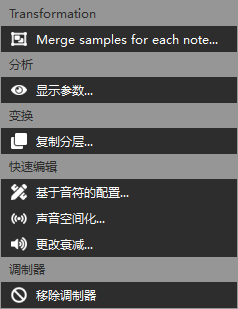

**其实要说或者说值得说的也只有Merge samples for each
note。其他参数显示参数和复制分层其实在刚才已经介绍过了，和乐器的操作方法以及实现效果大同小异，这里就不重复说了。**

Merge samples for each
note（为每个音符合并采样）是为了解决一个问题：当一个预设同时调用了多个乐器，按下某个琴键时会同时触发多个采样。这个工具会把每个琴键上同时发声的所有采样，合并录制为一个单一的采样文件。

用官方文档的例子来说，如果某个预设同时调用多个乐器，按下一个键会听到好几个采样叠加的声音，这个工具就会把每个音符上叠加的这些声音，录制并合并成一个独立的采样。合并后的结果是：新的预设中每个琴键只播放一个采样，而不是同时播放多个。这样做的直接好处是大幅降低回放时的CPU占用，对于大型管风琴音色或混合音栓这类预设尤其有用。

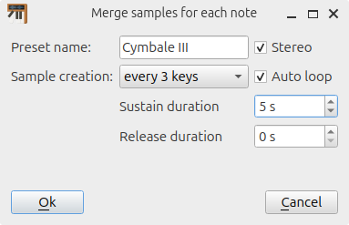

工具的具体操作逻辑是：它会自动模拟按键、录制音频、生成新采样，并用这些新采样构建一个新乐器。官方示例中，设置每隔3个键进行一次模拟按键，每次按住5秒，立体声录制，不录制释音部分。生成的新乐器会自动命名为Cymbale
III，然后可以使用自动循环工具为这些采样添加循环。

需要注意一个副作用：如果勾选了自动循环选项，生成的采样会移除释音部分，并且持续音部分的时长也会略微缩短。这是因为工具专注于捕捉持续音，释音尾音不会被纳入合并后的采样中。

**至此我们介绍完了工具箱，下面来看如何编辑音色库，编辑界面，开始。**

### 6.3.4 采样、乐器、预设编辑器

Polyphone的编辑界面，或者说，编辑器界面，不是固定的一块区域，而是根据你在左侧树状结构中选中的元素动态切换的。整个编辑器区域位于树状结构的右侧，你选中什么，它就显示什么。树状结构有四个层级，对应四种不同的编辑界面。

选中General（通用）时，右侧显示的是通用信息编辑器。这个界面用来填写音色库的元数据，比如标题、作者、版权信息、创建日期、软件版本等。这些信息不参与声音的生成，但会被写入SF2文件，方便日后管理和识别。

选中一个或多个采样（Samples）时，右侧显示的是采样编辑器。这是波形编辑的区域，可以用来查看波形、调整循环点、设置根音、修改采样率、执行增益、滤波、裁剪等操作。如果选中了多个采样，这个编辑器会同时显示多个波形，方便批量对比和处理。

选中乐器（Instruments）或乐器下的分区（Divisions）时，右侧显示的是乐器编辑器。这个界面用来配置音高映射、力度范围、包络参数、滤波器、调制器、声像等。前面讲的显示参数、复制分层、基于音符的配置这些工具，都是从这个界面触发的。

选中预设（Presets）或预设下的分区（Divisions）时，右侧显示的是预设编辑器。这个界面用来配置库号、音色号、名称，以及该预设包含了哪些乐器。前面提到的Merge
samples for each note等预设工具，就是在这个界面下使用的。

四种编辑界面共享同一个右侧区域，切换时不会丢失任何未保存的数据。你可以在树状结构里来回点击，随时在采样、乐器、预设之间跳转，对应的编辑界面会立即刷新。

**首先说通用，General。这个页面在树状结构中选中General标题时显示。页面由三类元素组成。**

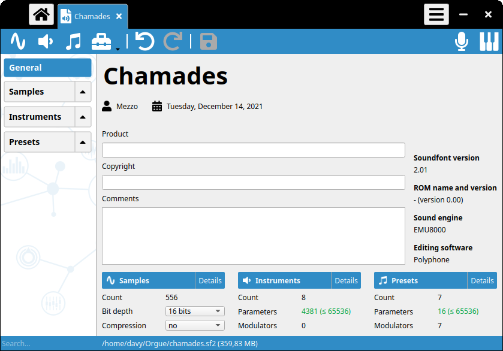

可编辑字段：标题（SoundFont内部名称，不一定与文件名相关）、作者、日期（文件创建日期）、产品（SoundFont设计的目标产品）、版权、注释、位深度（16-bit或24-bit，24-bit样本可能不被某些合成器支持）、压缩（启用样本压缩，位深度会被设为16-bit，这是sf3格式的功能，可能不被所有合成器支持。启用或禁用此选项将决定保存时的文件格式，Polyphone会相应更改.sf2/.sf3扩展名）。

不可编辑的通用信息：SoundFont版本（文件使用的sf2格式版本）、ROM名称和版本（如果使用了样本ROM）、声音引擎名称、编辑软件（用于创建SoundFont的编辑软件）、文件名（文件的地址和名称）、文件大小（保存后的SoundFont大小）。

统计信息：样本数量及未使用样本数、乐器数量及未使用乐器数、预设数量、为乐器编辑的参数和调制器数量、为预设编辑的参数和调制器数量。未使用的样本和乐器可以用“移除未使用元素”工具轻松删除。

接下来是采样编辑器。采样编辑器在树状结构中点击一个或多个采样文件后显示。页面主要分为波形图、信息区、频率分析、均衡器和播放器几个部分。

波形图用于可视化音频波形。按住鼠标右键拖动可以缩放：向右拖动拉伸横轴，向左拖动压缩横轴，向上拖动拉伸纵轴，向下拖动压缩纵轴。横轴被拉伸之后，按住鼠标左键可以水平移动波形，查看不同时间点的细节。

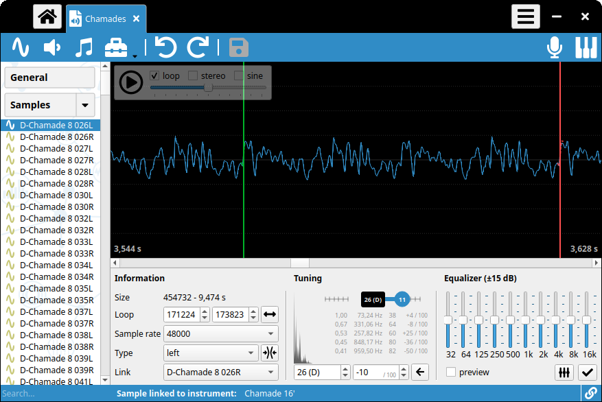

波形图上绿色竖线表示循环起始点，左键点击移动；红色竖线表示循环结束点，右键点击移动。每条竖线旁边都有一条虚线，显示该位置的波形片段，用于判断循环起点和终点的波形是否匹配、能否平滑衔接。播放时，一条白色竖线会实时扫过波形图，指示当前的回放位置。

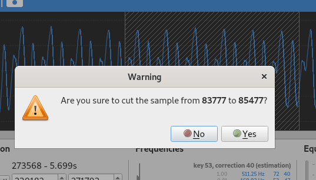

如果需要切除采样中的某一段，按住Alt键，左键在波形上按下定义区域起点，松开定义区域终点，之后会弹出对话框确认是否执行切除。对话框会显示待切除区域的起止采样点编号，确认后执行切除。波形图的颜色可以在软件偏好设置中自定义。

信息区用于查看和编辑采样的各项属性。采样大小显示数据点的数量及对应时长。循环起始点和结束点可以在这里精确修改，也有按钮将循环范围自动扩展至整个采样。校音功能用于调整采样的根音和音分修正量，使其符合十二平均律，还有一个按钮可以根据估算频率自动匹配根音和修正值。采样率显示当前值，修改采样率会触发重采样，同时自动调整播放速度以保证音高不变。声音类型可设为单声道、左声道、右声道或已链接；如果当前类型为左、右或链接，可以选择单声道来取消立体声；从单声道恢复到立体声状态时，需要选择一个采样进行链接。

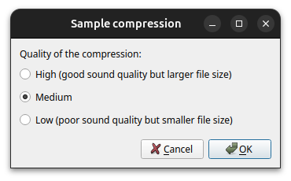

如果启用了压缩（对应sf3格式），所有未压缩采样旁边会显示压缩按钮，点击后可在对话框中选择压缩质量，选项有高（音质好但文件大）、中、低（音质差但文件小）三档；对采样进行任何编辑操作时，解压缩会自动执行。已链接采样用于选择要链接的采样以形成立体声，选择后类型自动切换为已链接。如果在偏好设置中勾选了立体声编辑选项，对立体声采样一侧的任何修改都可以自动应用到另一侧。在树状结构中进行多重选择后，可以同时编辑多个采样。

频率分析包含一个傅里叶变换图，显示信号中包含的频率强度。图右侧列出主导峰值的信息，包括峰值强度与最大峰值强度的比值、频率、最接近的对应键位以及修正量（与最接近键位的距离）。根据这些数据可以估算出声音的音高，这个估算结果可用于校音。

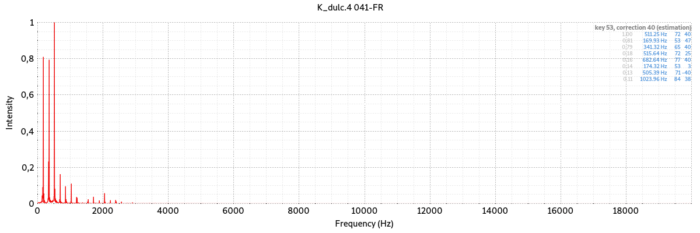

在图上右键点击会打开上下文菜单，可以导出图形为png图片，显示所有峰值的列表，以及将列表导出为csv文件。峰值列表会显示每个采样的峰值编号、强度、频率、对应键位和修正值，便于精确分析。

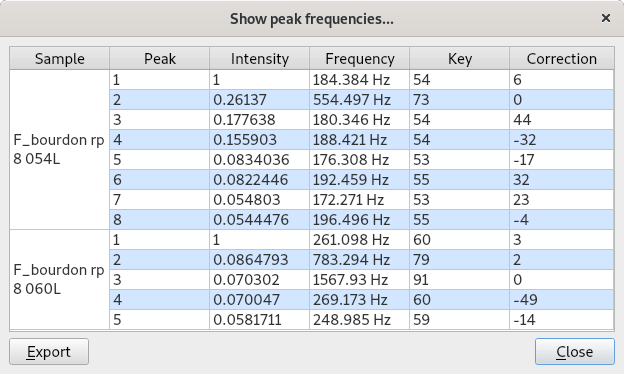

均衡器可以将某些频率提升或衰减，范围从-15到15分贝。启用预览选项后可以试听效果，确认后点击应用按钮将效果永久写入采样。点击重置按钮会将所有频段恢复为0分贝，但不会从声音中移除已应用的效果，要撤销效果需要使用工具栏中的撤销按钮。对立体声采样的任何修改，如果偏好设置中的选项已勾选，可以自动应用到链接的采样上。

播放器用于播放声音。播放期间，一条白色光标会扫过波形图指示播放位置。播放选项包括：循环，如果循环的起点和终点已经设置完整，则循环播放声音；立体声，与链接的采样一起立体声播放，如果同时需要循环，则使用各自对应的循环点，两个循环点可以不同；正弦，在声音中加入一个正弦校准信号，用于将采样校音到最近百分之一音分。使用正弦校准前必须先填写根音。此时如果正弦波的频率与声音的基频略有差异，就能听到拍音。通过微调修正值使拍音尽可能慢，就能将采样调到最佳音准。如果播放正在进行时通过树状结构切换到另一个采样，播放会自动重新开始。在树状结构中导航时，按空格键可以启用或禁用播放。

**接下来是乐器编辑器（Instrument editor）。**

乐器编辑器在树状结构中点击一个或多个乐器后显示。页面主要分为表格、范围编辑器、包络编辑器和调制器四个部分。

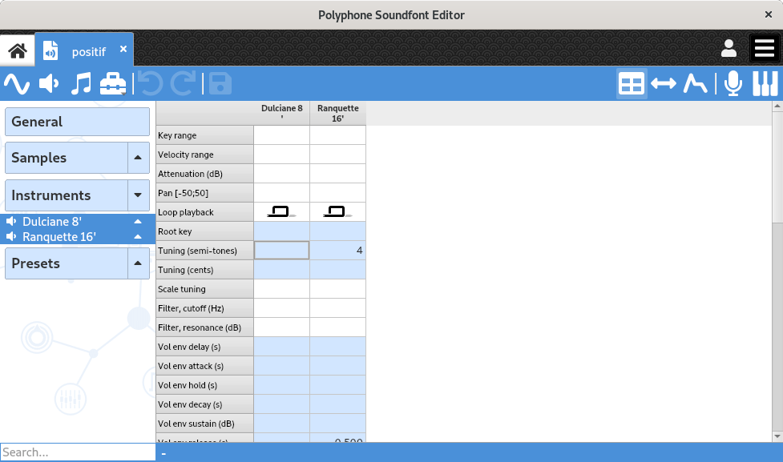

如果只选中一个乐器，可以编辑该乐器的全局参数以及它所有分区的参数；如果选中了多个乐器，则只能编辑每个乐器的全局参数。

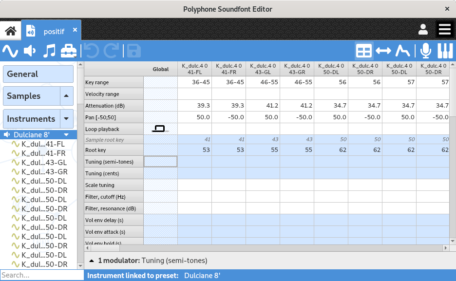

表格是乐器编辑器的核心，用于全局查看和编辑乐器配置。在全局（Global）列中修改某个参数会应用到所有分区，除非某个分区已经单独指定了该参数的值，这种情况下会以分区自己的值为准，不再继承全局值。

表格中可编辑的参数有很多，这里逐个介绍。

键位范围，决定该采样在哪些琴键上发声；

力度范围，决定该采样在哪些力度区间内发声，通过设置不同的力度范围，可以让同一个琴键在不同力度下触发不同的采样，例如钢琴的不同力度层；

衰减，以分贝为单位应用于采样，需要注意的是sf2格式不允许该值为负数，因此无法实现放大；

声像，将声音偏向左侧或右侧，实现立体声定位；

采样回放模式，有无循环、连续循环、释放时触发、循环加释放四种模式，其中“释放时触发”会在松开琴键时播放采样，音量包络仍然生效，并加入一个极短的起音来平滑释放的开始，但该模式没有被sf2格式正式记录，某些播放器可能不支持，另一种实现方式是为每个采样增加一个包含短暂静音循环的采样，然后用“循环加释放”模式播放；

根音，用于改变采样原本的根音，例如一个根音为50的采样在键位49到51上播放时，原本会分别移调-1、0、+1个半音，如果将根音改为51，则同样的采样在49、50、51键上会分别移调-2、-1、0个半音；

校音，以半音和音分为单位调整音高，这个移调会叠加在由触发音符产生的初始移调之上；

音阶调整，修改连续两个音符之间的音程，从而影响由触发音符产生的初始移调，值为100表示十二平均律，即每个键之间移调100音分，值为0则禁用初始移调，采样在所有键上以相同音高播放；

滤波器，通过指定截止频率和共振来应用低通滤波；音量包络，修改音量包络以及它随音符变化的方式；

调制，设置调制包络的延迟、频率、随音符变化的方式，以及它对音调、滤波器和音量的影响；

颤音，设置颤音的延迟、频率及其对音调的影响；

独占类，通过为一组分区分配同一个非零的独占类值来定义，当一个独占类被定义后，触发其中任意一个分区都会终止同一类中其他所有正在发声的音符，作用范围限定在定义该类的预设内，可以用于镲片等打击乐器，实现按下一个音符自动终止同组其他音符的效果；合唱和混响，指示效果的强度，效果本身在软件设置中配置；

固定键位和力度，在整个分区范围内强制使用固定的键位值和力度值；

偏移量，改变播放时声音的起始和结束位置，以及循环的起始和结束位置，单位是采样点数量。

表格中提供了一些便于快速编辑的功能：鼠标滚轮可以改变数值，但需要先进入单元格的编辑模式；外部键盘可以用来设置根音、键位范围和力度范围，同样需要先进入编辑模式；多选后编辑最后一个单元格可以同时编辑所有选中的单元格；按Del或Backspace键可以清除所有选中单元格的内容；如果在软件偏好设置中启用了立体声编辑选项，可以同时编辑立体声分区；键名可以显示为数字或文本形式，取决于偏好设置中是以C3、C4还是C5作为中央C；通过Ctrl+C、Ctrl+V、Ctrl+X可以复制、粘贴、剪切一组单元格，这些单元格不一定是相邻的。另外，不要忘记工具栏中提供的工具，特别是“基于音符的配置”这个工具。

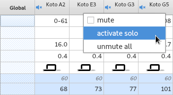

为了方便测试，表格还提供了静音功能。右键点击某个分区的标题，或者右键点击树状结构中的分区，可以在上下文菜单中找到一个分区或只保留一个分区而静音其他所有分区的选项。

范围编辑器允许以图形方式根据键位和力度范围快速排列采样。每个采样用一个半透明矩形表示，矩形叠加时可以看到相互覆盖的情况。这种视图能直观地暴露出配置问题，例如某些键位范围没有采样覆盖，或者多个采样出现了非预期的重叠。

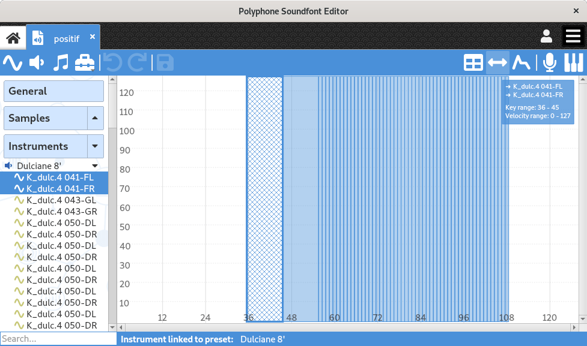

单击一个矩形可以选中它并取消其他选择；如果多个矩形叠加在一起，连续单击可以循环切换鼠标下方的选择对象。按住Ctrl键再单击矩形可以逐个多选，按住Shift键则可以选择从第一个点击的矩形到下一个点击的矩形之间的所有矩形。选中一个或多个矩形后，用左键拖动矩形的边缘可以改变大小，拖动矩形的中心可以改变位置。如果同时选中了多个矩形，所有修改会同步进行。按住右键拖动可以围绕选中点缩放视图，按住左键拖动则可以在起始点不在矩形上时移动整个图形。

接着来看包络编辑器。

包络编辑器以图形方式展示定义音量包络的8个参数和定义调制包络的8个参数。图形上方的按钮可以在音量包络和调制包络之间切换，音量包络显示为绿色，调制包络显示为红色，在编辑调制包络时，音量包络会以细线显示作为参考。

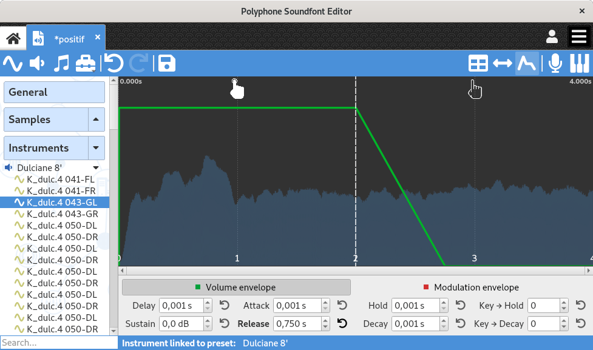

图形左侧表示按键触发后包络的演变过程，涉及8个参数中的7个：

延迟（Delay），按键触发后包络保持为0的持续时间，大多数情况下希望按键后立即听到声音，所以这个值保持为0，但延迟可以用来创建由多层构成的丰富铺底音色，例如在按键后0.5秒引入第二层声音，延迟并不会暂停采样的播放，只是静音音频，如果延迟设为0.5秒，采样实际上已经开始播放，但0.5秒之后才能听到声音；

起音（Attack），延迟之后包络从0增长到最大值的持续时间，例如小提琴的起音相当长，而吉他的起音非常短，即使希望起音尽可能短，也建议至少设为0.001秒，否则按键后可能听到咔嗒声；

保持（Sustain），起音之后包络保持最大值的持续时间；衰减，保持之后包络从最大值逐渐降到延音值的持续时间，当延音值设为最大值或未设置时，衰减期间音量会一直保持最大值，无论衰减参数是多少；

延音（Release），衰减之后一直保持到琴键释放的音量值，和衰减一样，延音值表示分贝衰减量，如果希望在衰减时间后将音量减半，延音应设为6，如果希望完全静音可以设为144；

Key→Hold，根据键位改变保持时间；而Key→Decay根据键位改变衰减时间。

Key→XXX参数为正数时，越往高音区持续时间越短，负数则相反，例如100表示中央C以上每升高一个八度持续时间减半，中央C以下每降低一个八度持续时间加倍，-100则相反。

这些参数在设计吉他或带延音踏板的钢琴时很有用，音调越低，声音持续到完全消失的时间越长。图形右侧表示按键释放后包络的演变，只涉及释音持续时间，包络在这段时间内逐渐回到0。小提琴或合成铺底音的释音时间相对较长，而管风琴等音色的释音时间非常短，实际使用中即使希望释音很短，也至少要设为0.2秒，因为过短的释音听起来不自然，当然这也取决于想要构建的乐器类型。当在树状结构中只选中一个乐器分区时，对应的声音采样会显示在背景中，这样可以更直观地看到包络相对于正在播放的采样的演变过程。

调制器位于乐器编辑页面的下部，用于为整个乐器或某个特定分区创建调制器。

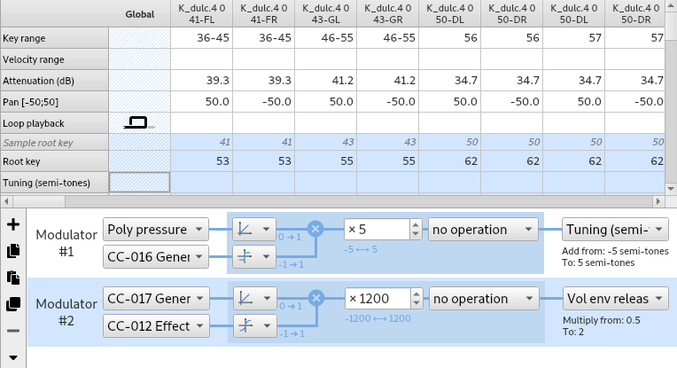

当演奏乐器时，调制器监听一个或两个MIDI信号，根据配置的数学规则修改表格中的某个参数。一个调制器的输出也可以作为另一个调制器的输入，这个功能出现在sf2格式2.04版本中，可能不被某些合成器支持。调制器区域左侧的按钮用于展开或折叠调制器区域、添加或删除调制器、复制或粘贴一个或多个调制器。当添加一个调制器后，表格中对应单元格的边框会变粗，以标识该参数已被调制器控制。

**最后是预设编辑器，其实要讲的内容不多不过还是简单提一下比较好。**

预设编辑器在树状结构中点击一个或多个预设后显示。预设是一个或多个乐器的组合，也是音色库对外可见的元素。与乐器编辑器类似，预设编辑器也包含表格、范围编辑器和调制器区域。如果只选中一个预设，页面允许编辑该预设的全局参数以及它所有分区的参数；如果选中了多个预设，则只能编辑每个预设的全局参数。

预设编辑器的表格与乐器编辑器的表格在结构上相似，但参数含义有一个本质区别。这里编辑的参数是相对参数，而乐器层面的参数除特殊情况外是绝对参数。预设参数的值会以加法或乘法的方式叠加到构成它的乐器参数之上。也就是说，如果乐器层面已经设置了某个衰减值，预设层面再设置一个衰减值，最终听到的结果是两者叠加后的效果，而不是用预设值去替换乐器值。

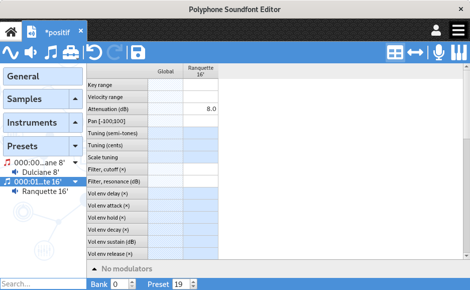

有一些参数不能在预设层面编辑，包括循环回放模式、根音、独占类、固定键位、固定力度以及四个偏移量。这些参数与采样数据本身紧密相关，在预设层面修改它们没有意义。

范围编辑器在点击工具栏中的“编辑范围”按钮后显示，其操作逻辑与乐器编辑器中的范围编辑器一致。每个采样或乐器分区用半透明矩形表示，可以直观地看到键位和力度范围的覆盖情况，以及是否存在空白区域或非预期重叠。支持单击选择、Ctrl多选、Shift范围选择，选中后可以拖动边缘改变大小、拖动中心改变位置，多个矩形选中时可以同步修改。按住右键拖动可以缩放视图，按住左键拖动可以在起始点不在矩形上时移动整个图形。

调制器区域位于预设编辑页面的下部，用于为预设创建调制器。其操作方式和乐器编辑器中的调制器区域相同，可以展开或折叠、添加或删除调制器、复制或粘贴调制器。调制器监听一个或两个MIDI信号，根据配置的数学规则修改表格中的某个参数，一个调制器的输出也可以作为另一个调制器的输入。当添加一个调制器后，表格中对应单元格的边框会变粗，以标识该参数已被调制器控制。

每个预设由预设号和库号共同标识，这个组合是唯一的，并且可以在表格下方进行调整。每个库包含127个预设。最后一个库，也就是第128库，通常用于打击乐组。

### 6.3.5 配置摘要

配置摘要用于总览音色库中包含的所有元素。它可以通过树状结构中的“Samples”“Instruments”和“Presets”三个标题访问，点击后右侧会显示对应的摘要页面。在大型音色库中，这些摘要页面能够帮助制作者快速检查各类元素的配置情况，发现潜在的问题。

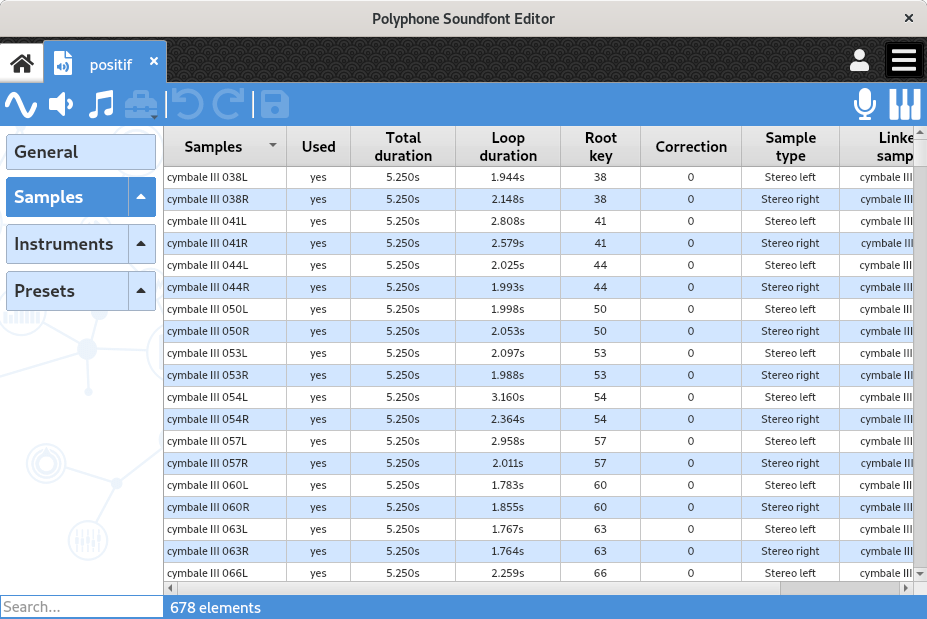

点击“Samples”标题后，页面会列出音色库中的所有采样文件。每一行显示一个采样的关键信息，包括文件名、是否被使用、总时长、循环时长、根音、修正值、采样类型以及链接的采样名称。

通过这个列表，可以检查多个项目：该采样是否被任何乐器引用；总时长和循环时长是否足够长；校音是否已经完成；立体声左右声道是否正确链接；采样率是否足够高以保证音质；以及是否已经启用了压缩。如果某个采样未被使用，可以考虑将其删除以减小文件体积；如果循环时长过短，则可能需要重新设置循环点。

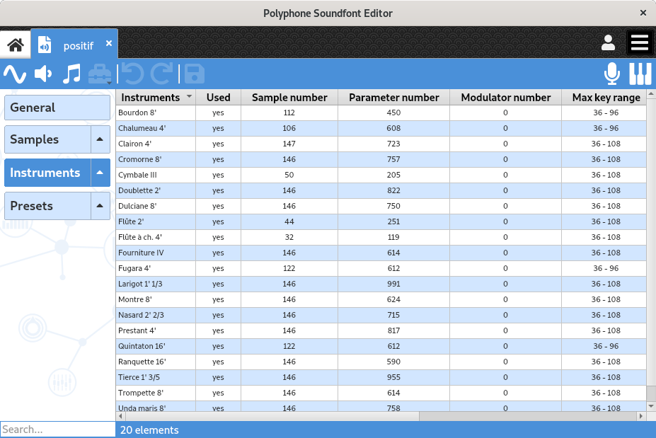

点击“Instruments”标题后，页面会列出所有乐器。每一行显示一个乐器的名称、是否被使用、链接的采样数量、参数数量、调制器数量以及最大键位范围。通过这个列表，可以检查：该乐器是否被任何预设引用；链接的采样数、参数数和调制器数是否一致；键位范围和力度范围是否正确；采样衰减是否设置合理；循环回放模式是否已开启；以及合唱和混响设置是否被遗漏。如果某个乐器的键位范围异常，或者参数数量与预期不符，就需要回到乐器编辑器中进行修正。

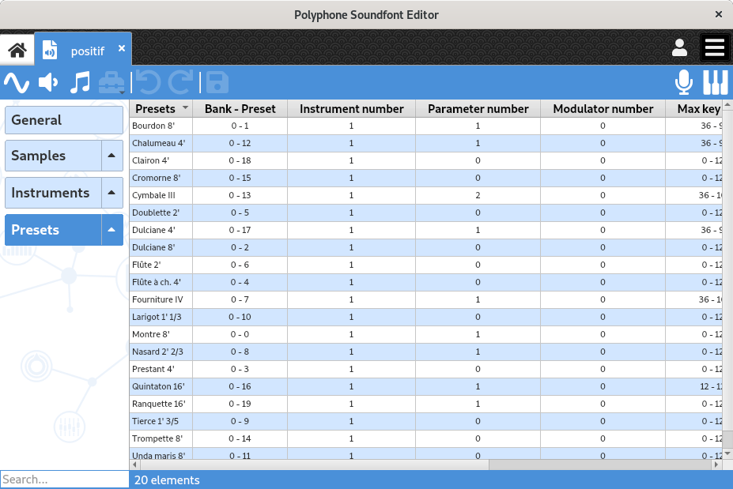

点击“Presets”标题后，页面会列出所有预设。每一行显示一个预设的库号、预设号、名称、是否被使用、链接的乐器数量、参数数量、调制器数量以及键位和力度范围。通过这个列表，可以检查：库号和预设号是否已正确填写；链接的乐器数、参数数和调制器数是否一致；键位范围和力度范围是否正确；乐器的衰减设置是否准确；以及合唱和混响的偏移量设置是否遗漏。预设的库号和预设号组合必须是唯一的，如果出现重复，播放器在调用音色时就会产生冲突。

**三个配置摘要共同构成了一个系统性的检查工具。在完成音色库制作后、导出之前，逐一浏览这些摘要页面，能够快速定位那些容易被忽略的配置问题。尤其是当音色库包含数百个采样和乐器时，这种总览式的检查比逐个打开编辑器查看要高效得多。**

### 6.3.6 软件设置

Polyphone的设置界面可以从主页或菜单中打开，分为五个部分，分别管理音频、界面、合成器、虚拟键盘和在线音色库相关的选项。

通用设置部分管理音频输入输出和采样导入行为。音频后端用于选择播放采样时使用的音频后端，JACK和ASIO驱动都可以选，其中ASIO仅适用于Windows。缓冲区大小用于设置JACK和ASIO驱动的缓冲区，较小的缓冲区带来更低的延迟，但声音可能变得粗糙或出现爆音。MIDI输入用于指定控制虚拟键盘的MIDI输入设备。

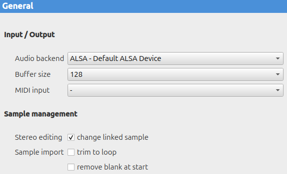

下方有三个可以勾选的选项：立体声编辑开启后，编辑立体声采样的一侧时另一侧会自动同步修改，编辑立体声乐器分区时，对应另一声道的分区也会同步编辑，前提是两者具有相同的音符和力度范围；导入时裁剪至循环终点开启后，导入采样时循环结束点之后的数据会被自动删除，效果等同于采样工具中的裁剪至循环终点；导入时移除开头空白开启后，导入采样时起振之前的所有空白区域会被自动移除，效果等同于采样工具中的移除开头空白。

界面设置部分管理软件界面的外观和交互方式。

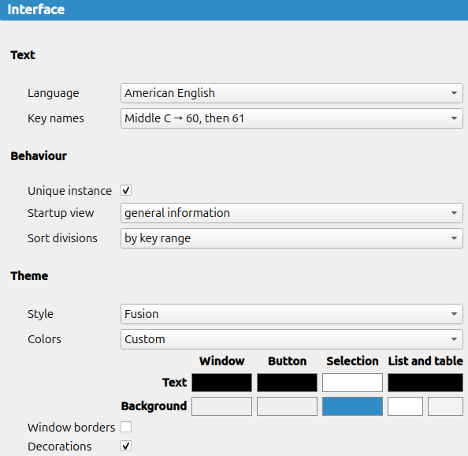

语言用于切换界面语言，修改后需要重启软件才能生效。键名设置决定键名的显示方式，可以按照MIDI规范显示为数字，也可以按照中央C的名称显示为C3、C4或C5，键名中可以包含升号或降号。唯一实例开启后，所有文件都在同一个窗口中打开。启动视图选择打开音色库时默认显示的视图，可选通用信息、采样列表、第一个采样、乐器列表、第一个乐器、预设列表或第一个预设，默认是通用信息。分区排序用于设置乐器或预设内部分区的排序方式。主题提供多种预定义的颜色方案，也可以手动选择颜色来定制Polyphone的外观。窗口边框控制窗口边框的显示或隐藏，隐藏边框可以节省屏幕空间。装饰控制一些列表中的背景装饰是否可以关闭，关闭后有助于提高可读性。

声音设置部分用于修改合成器的合唱和混响效果，以及全局音量。全局音量也可以通过外部键盘连接时用音量MIDI控制器来调整。

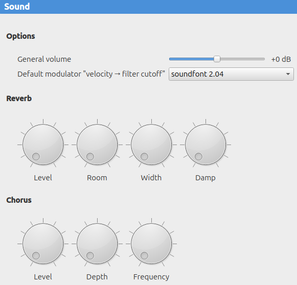

由于默认调制器中修改滤波器频率的规则在sf2规范的2.01版和2.04版之间发生了变化，这里可以定义使用哪个版本。选择SoundFont
2.01时，使用“在力度小于64时根据力度降低滤波器频率”的规则，在力度63和64之间可以听到明显的断层。选择SoundFont
2.04时，使用“根据力度降低滤波器频率”的规则，不再有断层。选择disabled时，该默认调制器不生效。

虚拟键盘设置部分定义控制虚拟键盘的计算机键盘按键，可以逐八度升高或降低音高。对于更进阶的使用者，还可以在这里修改调音和律制。

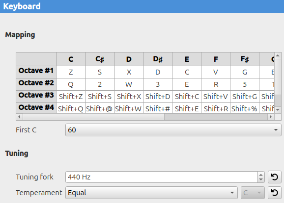

在线音色库设置部分用于输入账户标识符，将Polyphone与账户关联，Premium账户可以解锁在线音色库功能。从在线音色库下载音色库时使用的目录也可以在这里修改。

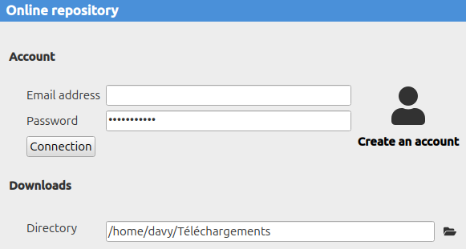

以上是设置界面的五个部分。这些选项大多属于软件层面的偏好设置，不直接影响音色库的数据内容，但会影响操作体验和导入采样时的自动化行为。在开始制作音色库之前，建议先根据个人习惯配置好这些选项，尤其是通用设置部分中的采样导入选项，开启后可以省去很多手动处理空白段和循环点后面冗余数据的步骤。

### 6.3.7 完整制作流程：从零到导出一个钢琴音色库

前面各节分别介绍了 Polyphone
的树状结构、工具栏、采样编辑器、乐器编辑器、预设编辑器、配置摘要和软件设置。这些内容是按功能模块组织的，读者可以了解每个按钮和参数的含义，但未必清楚如何将它们串联成一个完整的音色库制作流程。

本节用一个具体的案例，从零开始制作一个钢琴音色库并导出为SF2文件，来把前面所有知识点按实际操作顺序走一遍。

假设你已经按照6.2节的方法准备好了一套钢琴采样文件，每个文件以音高和力度层命名，格式为
48kHz / 24-bit
WAV。以下操作假设采样文件已经过批处理检查，电平统一、无削波、开头和结尾无多余静音段。

我们现在开始。

**第一步：新建音色库工程。**

启动Polyphone后，在主页界面点击“新建
SoundFont”按钮。界面会自动切换到编辑器标签页，树状结构中显示四个空的主标题：通用信息、采样、乐器、预设。此时没有任何内容，一切从零开始。

建议立即执行一次保存操作，指定文件名和保存路径。虽然此时音色库还是空的，但养成随时保存的习惯可以避免后续操作中因意外崩溃导致进度丢失。

**第二步：导入采样文件。**

在树状结构中点击“采样”标题，选中采样层级。然后在工具栏中点击“导入采样”按钮，在文件浏览器中定位到准备好的钢琴采样文件，可以一次性全选导入。

导入完成后，树状结构的“采样”标题下会列出所有导入的文件。如果采样文件的命名包含了音高信息（例如C4、F#3等），Polyphone会自动识别并分配根音。如果命名不包含音高信息，或者自动识别有误，需要手动设置根音和音分校音。手动设置的方法是：在树状结构中点击某个采样，右侧显示采样编辑器，在信息面板中找到“校音”区域，填入正确的根音值，必要时调整音分修正量。

导入后，建议逐一检查每个采样的循环点是否已经设置。如果采样文件本身不包含循环点信息，需要使用采样工具中的“自动循环”功能为每个采样生成循环点。操作方式是：在树状结构中选中所有需要循环的采样，然后在菜单栏中选择“工具”→“样本”→“自动循环”。

**第三步：创建乐器并分配采样。**

在树状结构中点击“乐器”标题，选中乐器层级。然后在工具栏中点击“新建乐器”按钮，创建一个空白乐器。

创建后，树状结构的“乐器”标题下会出现一个新的乐器条目，可以双击重命名，例如命名为“Grand
Piano”。

接下来把采样分配到乐器中。在树状结构中展开“采样”标题，选中所有需要分配到该乐器的采样文件，然后将它们拖拽到“乐器”标题下刚创建的乐器条目上。Polyphone会自动将这些采样作为新的分区添加到该乐器中。

拖拽完成后，点击树状结构中的乐器条目，右侧显示乐器编辑器，表格中列出了所有分区。此时需要逐一检查并调整以下参数：

键位范围：每个采样覆盖哪些琴键。如果采样是按半音阶逐一录制的，键位范围通常是一个键对应一个采样。如果采样是每隔几个键录制一个，则每个采样需要覆盖一段键位范围，中间的音高由Polyphone通过变调生成。

力度范围：每个采样在哪个力度区间内触发。如果有多个力度层，需要为每个力度层分配对应的力度范围。

根音：采样本身的原始音高。如果导入时已经自动识别，这里只需确认是否正确。

循环回放模式：对于钢琴音色，如果需要在按键期间持续发声，选择“连续循环”；如果采样足够长，希望自然衰减，选择“无循环”。

**第四步：调整包络与滤波器。**

在乐器编辑器中，点击工具栏的“编辑包络”按钮，切换到包络编辑器视图。为钢琴音色设置合适的音量包络参数：

起音：钢琴的起音非常短，建议设为 0.001 秒，避免出现按键后的咔嗒声。

衰减：钢琴声音从最大值衰减到延音值的时间。根据采样特性调整，通常设定在 1
到 3 秒之间。

延音：按键持续期间保持的音量电平。如果希望钢琴声音在按键后继续衰减，可以适当降低延音值。

释音：松开琴键后声音消失的时间。钢琴的释音较短，但建议至少设为 0.2
秒，避免听起来不自然。

如果需要对采样进行频率层面的处理，可以在乐器表格中找到“滤波器”行，设置低通滤波的截止频率和共振值。对于钢琴音色，通常不需要额外的滤波处理，保持默认即可。

**第五步：创建预设。**

在树状结构中点击“预设”标题，选中预设层级。然后在工具栏中点击“新建预设”按钮，创建一个空白预设。

创建后，将“乐器”标题下的钢琴乐器拖拽到“预设”标题下刚创建的预设条目上。Polyphone会自动将该乐器作为预设的一个分区添加进去。

在预设编辑器的表格下方，设置库号和预设号。库号决定音色在MIDI设备中的分组，预设号决定音色在同一库中的编号。例如，库号设为0，预设号设为0，对应的就是MIDI标准中的“Grand
Piano”。最后一个库（第128库）通常保留给打击乐组。

**第六步：填写通用信息。**

在树状结构中点击“通用信息”标题，右侧显示通用信息编辑页面。在这里填写音色库的元数据，包括标题（音色库的内部名称）、作者、版权信息、注释等。这些信息不参与声音生成，但会被写入SF2文件，方便日后管理和识别。

**第七步：检查配置摘要。**

在导出之前，建议利用配置摘要做一次系统性的检查。在树状结构中分别点击“采样”“乐器”“预设”三个标题，查看对应的摘要页面：

采样摘要：确认所有采样都被使用，没有未使用的文件；检查采样时长和循环时长是否足够；确认立体声链接是否正确。

乐器摘要：确认乐器的键位范围和力度范围正确，衰减设置合理，循环回放模式已开启。

预设摘要：确认库号和预设号已填写，键位和力度范围正确。

如果发现任何配置问题，返回对应的编辑器进行修正。

**第八步：导出SF2文件。**

确认所有配置无误后，在菜单栏中选择“文件”→“导出SoundFonts”，或使用快捷键
Ctrl+E。在弹出的导出窗口中，选择需要导出的预设（可以全选或只导出特定预设），设置输出格式为SF2，选择保存路径和文件名，点击导出。

导出完成后，建议用VirtualMIDISynth或KMC加载生成的SF2或者SFZ文件，播放一段MIDI测试曲目，确认音色库在实际使用中表现正常：所有琴键均有声音、力度响应正确、循环点无爆音、整体音准准确。如果发现问题，回到Polyphone中修正后重新导出。

至此，一个从零开始的钢琴音色库制作流程就完成了。这个流程涵盖了新建工程、导入采样、创建乐器、分配键位、调整包络、创建预设、填写信息、检查摘要和导出文件全部环节。掌握了这个流程之后，制作其他类型的音色库（弦乐、管风琴、打击乐等）的操作逻辑也是相通的，区别主要在于采样数量、键位分配方式和包络参数的调整策略。

### 6.3.8 常见问题，格式设置，MIDI标准以及命令行的使用（选读）

在制作音色库的过程中，遇到各种疑难杂症是正常的。大部分缺陷都有明确的成因和对应的修复方法，关键在于知道从哪里入手排查。

常见问题大体可以归为四类：采样本身的质量与准备问题、调音不准确、ADSR包络设置不当、以及循环点缺失或不准确。以下逐一说明。

**首先，也是最常见的，采样质量与准备问题。**如果音色库听起来不对劲，而根源在于采样本身质量差，那么唯一的解决办法就是更换采样。通常情况下我们会回到DAW中重新对单个键位的单个力度采样进行诊断并重新导出。

如果采样本身没有问题但是听起来不对劲，我们先说一个老生常谈的问题：**单个采样不足以构建一个高质量乐器。**因为一个采样有它固定的音高，在很宽的音域上使用会导致声音失真，高音区尤其明显。解决方法是使用多个采样覆盖不同音域。如果手上的采样不够，不能逐键位依次分配单独采样，可以复制它，用变调工具把副本轻微移调，然后把这两个采样分别映射到回放时不会明显改变原始音色的音域范围内。这样可以在一定程度上缓解失真。

**另外就是，采样中包含规律的咔嗒声，通常是因为循环点设置不当。**循环点处的波形如果不匹配，每次循环播放时就会产生一次可闻的冲击声。需要回到采样编辑器中检查循环起始点和结束点的波形是否对齐，必要时使用交叉淡化工具或手动调整循环点位置。

此外**采样修剪不当**也会导致问题。很多采样实际上只被使用了其中一部分，删除多余的数据可以减小文件体积。有效声音有时位于最终循环点之前，循环结束点之后的部分可以直接删除。采样开头常常包含一段静音，删除它可以减少触发音符时的延迟感。还有一些采样可能完全未被任何乐器引用，配置摘要会把这些未使用的采样列出来，可以用工具自动删除。

**第二就是调音不准确。**调音虚拟乐器涉及多个步骤，必须按顺序完成，不能跳步。采样层面的调音是最重要的一步，决定了采样本身的音高是否正确。采样层面完成之后，乐器层面还有四个参数影响采样播放时的移调：根音、校音（半音）、校音（音分）和音阶调整。这些值在乐器回放时还可能被调制器修改，因此需要逐一检查。如果某个乐器分区没有定义任何参数或调制器，要检查乐器的全局分区中是否定义了参数或调制器，全局分区为所有其他分区提供默认配置，它的设置同样会影响最终音高。预设层面也有三个参数会影响采样移调：校音（半音）、校音（音分）和音阶调整。这些值会叠加到预设分区中所用乐器的配置上，不是替换关系。预设同样可以包含调制器，它的全局分区作为默认配置也不应忽视。调音不准确往往是因为只检查了其中一个层面，而忽略了其他层面的叠加影响。

**第三是ADSR包络不当。**ADSR包络描述的是音符播放时以及释放后音量的变化方式。音量包络实际上包含六个阶段：延迟、起音、保持、衰减、延音、释音。每一个阶段设置不当，都会产生对应的听感问题。

声音开始太突然，是因为起音时长太短。可以在乐器或预设层面增加起音时长，让音符的开头变得柔和。反过来，声音开始太柔和，是因为起音时长太长，减少或直接去掉起音时长即可。

声音在开始之前有延迟感，有三种互补的解决方法：先检查乐器或预设层面是否指定了延迟时长，如果有就移除；再检查音频采样开头是否包含静音段，如果有就删除；最后考虑可能是电脑使用的音频服务器本身存在延迟，这时需要更改音频输出设置。

声音突然停止，如果是在应该持续的时候停止，检查循环设置是否正确；如果是在音符释放时突然停止，说明释音时长太短，需要在乐器或预设层面指定或增加释音时长。有工具可以自动配置释音时长，使其在整个音高范围内听起来自然。

**第四个是循环缺失或不准确。**循环的作用是让固定长度的采样能够产生无限持续的声音，而耳朵不会察觉重复。循环对某些乐器至关重要，比如长笛、弦乐等需要长音的音色；对打击乐则通常不需要。循环也可以用在钢琴采样中，用较短的采样来模拟延音踏板的效果。

声音在音符释放之前就停止了，最可能的原因是采样没有定义循环，需要回到采样编辑器中设置循环起始点和结束点。另一个可能的原因是循环回放模式没有启用，需要在乐器表格中把回放模式改为循环模式。循环结束点离起始点太远，也可能导致释放样本在按下时就被提前播放，需要调整循环范围。

**除了上述四类问题，还有一些常见故障值得留意。这里我们也说一下。**

采样导入后没有声音，或者波形显示为一条直线：先检查采样文件本身是否有效，可以尝试用工具中的规格化功能处理一下，例如规格化到80%到98%之间。

采样预览时有声音，但乐器或预设没有声音：通常是因为采样没有正确绑定到乐器，或者乐器没有绑定到预设。正确的操作顺序是：右键采样，绑定到乐器；然后在乐器中为采样设置根音，注意不要设在全局列；再右键乐器，绑定到预设。如果所有采样在所有键上同时发声，说明采样没有设置键位范围，可以尝试选中采样后拖拽创建乐器，或者使用样本自动定位工具；如果无效，就需要手动为每个采样设置根音和键位范围。

特定音符不发声：检查该音符对应的采样是否还在采样文件夹中，有可能需要重新导入并绑定。如果MIDI的CC7或CC11为0，也会导致无声，需要检查它们的值。

WAV文件无法导入：检查文件路径或文件名是否包含非拉丁字符，比如日文、带斜杠的字母等，把它们移动到纯英文路径下再试。

释音音符不触发或者触发时机不对：确认音量包络的释音参数设置了足够长的值，建议几秒；同时检查循环结束点是否离起始点太远，导致释放样本在按下时就被提前播放。

在线音色库无法连接或报错：可能是网站服务器临时故障，可以尝试更新到最新版软件或稍后重试。如果配置错误导致无声，可以尝试清除配置文件，在软件安装目录的终端中运行
polyphone.exe -r，然后重启软件测试。

以上这些问题和解决方法基本覆盖了 Polyphone
使用中最常见的故障场景。排查时建议按照从采样到乐器再到预设的顺序逐层检查，因为很多问题的根源在更底层，却在上层表现出症状。

**接下来我们再来说一次格式，由于你真的在动手编辑这些格式的文件，所以对你来说，格式很重要。**

制作音色库时，格式的选择并不是一个可以随意忽略的问题。不同的SoundFont格式在文件结构、压缩方式、编辑能力和兼容性上都有明显差异，这些差异会直接影响音色库的体积、音质、后期可修改程度以及能否被目标播放器正常加载。Polyphone支持多种格式的导入和导出，但每种格式都有各自的适用范围和限制。

SF2是Polyphone编辑的主要文件格式。一个SF2文件包含一个或多个虚拟乐器，每个乐器由音频采样和大量参数构成，这些参数定义了采样在整个键盘上的播放方式，并且可以由调制器进一步调制。SF2文件采用三级结构：采样、乐器、预设。除此之外，它还包含通用信息，例如作者、版权、编辑时间等。SF2文件被软件合成器使用，由MIDI信号驱动，也可以用于TiMidity、WildMIDI、QuickTime和MuseScore等软件。由于结构成熟、兼容性广，SF2通常是制作完成后最通用的交付格式。

SF3由MuseScore开发，与SF2格式基本相同，区别在于SF3的采样可以以OGG格式存储，而不是原始PCM数据。这使得SF3的文件体积大约只有SF2的十分之一。但压缩采样不适合后续继续编辑，因为反复压缩会持续降低音质。因此SF3应视为最终产品格式，适合终端用户使用，而不适合作为制作过程中的中间格式。如果需要修改，应当从SF2或SFZ源文件出发，重新导出SF3。

SFZ的目标与SF2相同，都是通过在键盘上配置采样来创建乐器。两者的主要区别在于文件组织方式：SF2是一个包含所有内容的单一文件，而SFZ是一个文本文件，附带一组独立的WAV采样文件。由于SFZ被设计为人类可编辑的格式，它的主要优势是不需要复杂的编辑器就能直接修改，用文本编辑器就能调整映射和参数。但对于大型乐器，仍然强烈推荐使用编辑器来管理，否则手工维护会非常繁琐。SFZ格式的定义不如SF2严格，不同编辑器和播放器对同一份SFZ文件的理解可能存在差异，但SFZ乐器的能力相比SF2标准有所增加，支持一些SF2没有的特性。

**在Polyphone中导入SFZ时存在一些限制。**只有与表格中参数有对应关系的操作码才会被导入，其余操作码会被忽略。音高和滤波器在SF2中由同一个包络控制，因此无法导入不同的音高包络和滤波器包络。音量和滤波器在SF2中由同一个LFO控制，因此无法导入不同的音量LFO和滤波器LFO。只能导入二阶低通滤波器，更高阶的滤波器无法完整保留。group和off_by操作码在同一组内必须包含相同的值，才能正确导入，否则分组和互斥行为可能出错。

导出SFZ时同样有限制。调制器目前不会被导出，这意味着在Polyphone中配置的调制器不会写入SFZ文件。SFZ格式只允许一个音高调制，因此Vib
LFO到pitch和Mod LFO到pitch不能同时导出，必须取舍。loop
0-1可以导出，但被大多数SFZ播放器忽略，实际效果有限。24位采样可能不被某些合成器支持，如果目标播放器只接受16位采样，导出后可能无法正常播放。

在SFZ和SF2之间转换时还需要注意音量和参数匹配问题。音量匹配已经在Sforzando软件中测试过，但不同播放器之间仍可能存在差异。更关键的是，参数随键位变化的方式没有精确匹配：SF2格式使用指数规律定义衰减和保持时长，而SFZ格式使用线性规律。这意味着同一个参数值在两种格式中可能产生不同的实际时长，转换后需要实际试听和调整。

**接着我们来说两个不太常见的格式。**

SFArk与SF3类似，也是一种压缩格式，音质会略有降低，但通常难以察觉。该格式趋于过时，Polyphone只允许导入SFArk归档文件，不支持导出。因此如果手头有SFArk文件，可以将其导入后另存为SF2，但不能再生成新的SFArk文件。

GrandOrgue配置是一种特殊格式，GrandOrgue是一个主要用于模拟管风琴等乐器的程序。管风琴由一系列包含音管声音的WAV文件和一个.organ文件定义，该文件包含基于所有WAV文件创建管风琴所需的所有参数。Polyphone能够基于这种映射创建SoundFont，也就是说可以从GrandOrgue的配置生成一个SF2音色库，但不支持将SoundFont转换为GrandOrgue格式。导入时的限制是当前不支持移调，因此依赖移调的管风琴配置可能无法完整还原。

理解这些格式差异之后，才能在实际制作中做出合理选择。如果目标是最大兼容性，选择SF2；如果目标是尽量小的文件体积且不需要再编辑，选择SF3；如果希望保留手动编辑能力或与支持SFZ的采样器配合，选择SFZ；如果遇到旧资源，可能碰到SFArk，但只能导入不能导出；如果要从管风琴配置创建音色库，可以使用GrandOrgue导入，但不能反向转换。格式转换从来不是完全无损的，尤其是SFZ与SF2之间，参数规律和可用特性的差异会导致部分信息丢失或行为变化，因此转换后必须进行实际试听和检查。

接下来先插一句有关MIDI标准的事情。虽然这一部分出现在这里非常突兀，但是既然Polyphone的官方文档里有些这一部分，我一点不说也不好，简单讲一下吧。

MIDI标准在Polyphone的语境里更像是一份参考背景，而不是需要动手操作的内容。原因很简单：Polyphone本身并不修改或定义MIDI标准，它只是帮助你创建符合这些标准的音色库。因此，这部分内容可以了解，但不必深究，更不必在制作过程中反复翻阅。

MIDI标准定义了电子设备与软件之间交换音乐数据的规则，目的是保证不同设备之间能够互相兼容。对于SoundFont来说，这些标准主要规定了一件事：哪个库号加哪个预设号，对应的是什么乐器。当你在Polyphone中制作音色库时，只要预设的库号和预设号符合目标MIDI标准的约定，播放器就能按预期调用你的音色。

最常用的标准是通用MIDI，简称GM，1991年推出。它把128个旋律乐器分配到了预设号0到127，库号通常为0。打击乐器则统一放在库128，预设号为0，具体音符从35到81，分别对应不同的鼓和镲。除了GM，还有一些厂商扩展的标准，比如Roland
MT-32、Roland GS和Yamaha
XG，它们在不同程度上增加了音色数量、扩展了控制器行为，但基础框架都建立在GM之上。Polyphone的附录里列出了GM标准的完整乐器列表和打击乐音符分配，需要时可以直接查阅。

在实际制作中，你不需要去记忆这些标准的具体内容。真正要做的只是：确定你的音色库面向哪种标准，然后在预设编辑器里把库号和预设号填成对应的值。比如想做GM兼容的钢琴，就把库号设为0，预设号设为0；想做鼓组，就把库号设为128，预设号设为0。至于其他更细的映射关系，交给附录列表就行。Polyphone不负责定义标准，只负责帮你生成符合标准的文件，所以这部分内容点到为止，知道有这么回事、需要时能查到就够了。

**最后，我们以命令行结束我们的Polyphone之旅。**

当音色库制作完成、配置摘要检查无误、sf2文件顺利导出之后，Polyphone的图形界面工作就算告一段落了。但Polyphone还提供了一个不太起眼却非常实用的功能，可以作为整个制作流程的延伸和收尾，那就是命令行界面。

命令行的价值在于自动化和批量处理。当你手头有一批音色库需要统一转换格式，或者想把某个音色库快速导出成另一种格式进行测试，图形界面里反复点选导入导出会显得很繁琐。命令行允许你直接写一条指令，让Polyphone在后台完成格式转换，不需要打开窗口，也不需要手动操作。

Polyphone的命令行支持在SF2、SF3、SFZ和CSV之间互相转换，也可以直接调用合成器模式来试听音色库。基本的使用方式是：在终端或命令提示符中输入\`polyphone\`，后面跟上模式和参数。模式用一个短横线加数字表示，\`-1\`代表转换为SF2，\`-2\`代表转换为SF3，\`-3\`代表转换为SFZ，\`-4\`代表转换为CSV，\`-s\`代表以合成器模式打开。

如果要转换为SF2，最基本的命令是\`polyphone -1 -i
输入文件\`。\`-i\`后面跟源文件路径。输出目录可以用\`-d\`指定，默认是输入文件所在的目录；输出名称可以用\`-o\`指定，默认与输入文件同名。例如把某个sfArk文件转换为sf2，只需要输入\`polyphone
-1 -i /path/to/file.sfArk\`，Polyphone就会自动完成导入和转换。

转换为SF3时，多了一个压缩质量的选项。命令格式为\`polyphone -2 -i
输入文件 -c
压缩质量\`。压缩质量的取值为0、1、2，分别对应低、中、高，默认是中等。质量越高，文件体积越大，音质保留越好；质量越低，文件越小，但压缩损失越明显。例如\`polyphone
-2 -i /path/to/file.sf2 -c 2\`表示将sf2转换为高质量压缩的sf3文件。

转换为SFZ时，有一个配置参数来控制输出结构。命令格式为\`polyphone -3 -i
输入文件 -c
配置\`。配置由三个用竖线分隔的值组成，默认是\`0\|0\|0\`。第一个值如果设为1，每个预设名称前会加上预设号；第二个值如果设为1，每个库会创建一个独立的目录；第三个值如果设为1，会按GM标准对预设进行分类排序。例如\`polyphone
-3 -i /path/to/file.sf3 -c
'0\|1\|1'\`表示转换为SFZ时按库分目录，并按GM分类排序。

转换为CSV主要用于导出参数列表，方便在表格软件中查看或编辑音色库的内部数据。命令格式为\`polyphone
-4 -i 输入文件 -c
配置\`，配置中可以使用\`raw\`选项，表示导出原始数值而不是带物理单位的值。例如\`polyphone
-4 -i /path/to/file.sf2 -c 'raw'\`会把sf2中的所有参数导出为一份CSV表格。

合成器模式让Polyphone直接扮演一个MIDI播放器的角色。命令格式为\`polyphone
-s -i 输入文件 -c
配置\`。配置同样是三个用竖线分隔的值。第一个值指定监听的MIDI通道，可以填1到16中的某个数字，填0或\`all\`表示把所有通道合并处理，填-1或\`each\`表示分别监听每个通道。第二个值控制是否启用多个预设的选择，可选\`off\`或\`on\`。第三个值控制是否启用通过按键选择预设，可选\`off\`、\`on\`或\`toggle\`。例如\`polyphone
-s -i /path/to/file.sf2 -c
'1\|on\|toggle'\`表示监听通道1，启用多预设选择，并允许用按键切换预设。

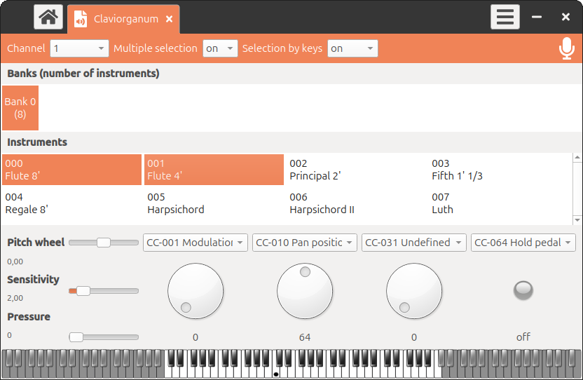

在Windows系统上使用命令行时，需要把Polyphone的完整路径写出来，例如\`C:/Program
files/Polyphone/polyphone.exe\`，否则系统可能找不到程序。在Linux和macOS上，如果Polyphone已经加入环境变量，直接输入\`polyphone\`即可。

命令行是Polyphone的最后一个功能模块，也是整个音色库制作流程的最后一个可选环节。它不是为了替代图形界面，而是为了在图形界面完成制作之后，提供一种更高效、更可重复的方式来处理批量任务。

**至此，我们从认识Polyphone的界面开始，走过了树状结构、工具栏、采样编辑器、乐器编辑器、预设编辑器、配置摘要、软件设置，最后到命令行，整个Polyphone之旅就完整地画上了句号。剩下的，就是把你亲手制作的音色库放进音乐里，让它真正发出声音。**

**不过我们好像还有一位朋友没有出场...有请Viena...？**

## 6.4 如何Viena

### 6.4.1 规划中

### 6.4.2 规划中

### 6.4.3 规划中

### 6.4.4 sf2到dls的转换

# 7 混音与母带

## 7.1 混音

### 7.1.1 你需要什么，做什么

### 7.1.2 为什么要这样呢

### 7.1.3 大体思路

### 7.1.4 其他注意事项

## 7.2 母带

### 7.2.1 混完了，然后呢？

### 7.2.2 硬性的技术层面要求

### 7.2.3 注意事项

# 8 乐理基础与编曲实战

## 8.1 网格和量化

### 8.1.1 节拍，BPM，时间轴

### 8.1.2 拍号，时值

## 8.2 律动与节奏，速度与变速

### 8.2.1 量化是把双刃剑

### 8.2.2 切分音，反拍，不规则节奏

### 8.2.3 速度曲线

### 8.2.4 无节拍，散板处理

## 8.3 音高，音阶，十二平均律

### 8.3.1 音名，音符序号

### 8.3.2 半音，全音，音程，协和音，不协和音

### 8.3.3 音阶的构建和主要类型

### 8.3.4 升降号，大调和小调

## 8.4 搭建和弦

### 8.4.1 三和弦

### 8.4.2 和弦的转位

### 8.4.3 七和弦、延伸音、挂留和弦

### 8.4.4 调式内的和弦级数

### 8.4.5 功能和声

### 8.4.6 经典和弦套路

### 8.4.7 和弦替代和转调技巧

## 8.5 音色与配器基础

### 8.5.1 频段分布与乐器音域

### 8.5.2 声部与音区

### 8.5.3 音色的叠加和八度重复

## 8.6 和声的编排

### 8.6.1 柱式和弦和分解和弦

### 8.6.2 琶音的写法

### 8.6.3 声部连接的基本原则

### 8.6.4 低音线条的设计

## 8.7 旋律写作

### 8.7.1 动机与发展

### 8.7.2 旋律音与和弦音

### 8.7.3 级进与跳进

### 8.7.4 效果器塑形

## 8.8 曲式与结构

### 8.8.1 流行歌曲结构

### 8.8.2 电子音乐结构

### 8.8.3 情绪与段落的划分

## 8.9 听觉训练与混音视角乐理

### 8.9.1 DAW中听力练习和随机音符识别

### 8.9.2 通过频谱分析仪辅助看声音

### 8.9.3 人声调音与调性感

### 8.9.4 采样素材的调性检测与匹配

### 8.9.5 无调性素材与调性音乐的融合

### 8.9.6 和弦密集度与频段拥挤的关系

### 8.9.7 通过EQ为不同和声乐器让出空间

### 8.9.8 预延迟与调性的关系

# 9 基于REAPER的黑乐谱制作及其他音乐风格的扩展

## 9.1 Why REAPER?

### 9.1.1 REAPER的前期设置

### 9.1.2 工程模板

# 10 延伸与拓展

## 10.1 音色设计

### 10.1.1 规划中

### 10.1.2 规划中

### 10.1.3 规划中

### 10.1.4 规划中

## 10.2 音符画设计

### 10.2.1 规划中

### 10.2.2 规划中

### 10.2.3 规划中

### 10.2.4 规划中

## 10.3 调律与微分音

### 10.3.1 规划中

### 10.3.2 规划中

### 10.3.3 规划中

## 10.4 MIDI CC扩展内容

### 10.4.1 规划中

### 10.4.2 规划中

### 10.4.3 规划中

### 10.4.4 规划中

# 11 附加内容

这部分收录了不在正文内的附加内容。有需要的话可以自行查阅并使用。

### 11.0.1 11.-1.0 附录1-可用函数，预定义变量，函数表

本附录收录了自定义曲线当中函数的具体用法以及一些可用的函数预设。

函数表中的函数会以公式和图片的方式呈现具体的形状。

**可用函数：**

·abs(值)　返回绝对值

·sin(弧度)　参数单位为弧度

·cos(弧度)

·tan(弧度)

·log(值)

·exp(值)

·sqrt(值)　平方根

·squ(值)　方波

·tri(值)　三角波

·saw(值)　锯齿波

注：log和exp默认以e为底，squ, tri, saw 函数的周期为1，值域为 -1 ~ +1

**预定义变量：**

·pi: π

·rnd: 0～1的随机值（纯小数）

·xf: x 轴的相对位置，值域为 0.0 ~ 1.0

·x: 当前 x 值

·x1: 起点 x (tick)

·x2: 终点 x (tick)

·y1: 起点 y

·y2: 终点 y

·oy: 当前数据值（仅限 Control Change）

·res: 解析度（曲线间隔）

·ymin: y 值可采用的最小值

·ymax: y 值可采用的最大值

·tempo: 当前的速度值

示例：

直线的等式如下：y1 + xf \* (y2 - y1)

随着 xf 的值从0逐渐变为1，y 的值从 y1 变为 y2

**函数表：**

1.  y1 + (y2 - y1) \* 0.5 \* (1 + (sin(2\*pi\*xf) +
    (1/3)\*sin(6\*pi\*xf) + (1/5)\*sin(10\*pi\*xf) +
    (1/7)\*sin(14\*pi\*xf)) / 1.676)

2.  待补充

3.  待补充

4.  待补充

5.  待补充

6.  待补充

7.  待补充

8.  待补充

9.  待补充

10. 待补充

11. 待补充

12. 待补充

13. 待补充

14. 待补充

15. 待补充

    Formula事件的可用函数与预定义变量如下：

    **可用函数：**

    ·abs(值)　返回绝对值

    ·sin(弧度)　参数单位为弧度

    ·cos(弧度)

    ·tan(弧度)

    **预定义变量：**

    ·pi: π

    ·rnd: 0～1的随机值（纯小数）

### 11.0.2 11.-1.1 附录2-常用软件的下载链接

### 11.0.3 11.-1.2 附录3-MIDI Control Change技术定义

**<span class="mark">MIDI Control
Change的完整技术定义遵循以下核心标准：</span>**

**<span class="mark"><u>MIDI 1.0 Detailed
Specification（1985年发布，多次修订）</u></span>**

**<span class="mark"><u>MMA (MIDI Manufacturers Association)
RP-021/RP-036 - Control Change编号分配标准</u></span>**

**<span class="mark"><u>General MIDI (GM) System Level 1 -
定义了部分CC的标准用途</u></span>**

**这里，给出上述技术定义的（!!超级!!）详细说明：**

\*\*第一部分：数据结构\*\*

消息格式：0xBn 0xCC 0xVV

完整示例：B0 0A 40

├─ B : 状态字标识（二进制 1011）

│ - 1011 表示这是Control Change消息

│ - 区别于其他消息：1001=音符开，1000=音符关

│

├─ 0 : 通道编号（二进制 0000）

│ - 0-15对应通道1-16（实际显示+1）

│ - 0000 = 通道1，1111 = 通道16

│ - 这个设计让硬件可以用简单的位掩码操作

│

├─ 0A : 控制器编号（十六进制 0x0A，十进制 10）

│ - 标准分配：10 = 声像控制

│ - 这个值定义了要调节哪个"旋钮"

│

└─ 40 : 控制器数值（十六进制 0x40，十进制 64）

\- 0-127的7位值

\- 64是中间值（声像居中）

\- 每个数值约等于0.8%的变化量

技术含义：这个三元组结构是MIDI协议高效性的核心。三个字节就可以完整表达一个控制指令，在当时（1983年）的硬件限制下（3125字节/秒的带宽），这种紧凑设计是必须的。

\*\*第二部分：编号空间划分的详细解释\*\*

0-31：连续控制器（MSB - Most Significant Byte）

CC#7 (Volume)：B0 07 7F

│ │ └─ 值 = 127（最大音量）

│ └─── 控制器#7

└─────── 通道1的CC消息

技术特点：

\- 这些是主要控制器，有标准语义

\- 响应速度快，所有设备必须识别

\- 例如CC#1（Modulation Wheel）通常连接到LFO强度

32-63：连续控制器（LSB - Least Significant Byte）

配对示例（14位音量控制）：

B0 07 03 (MSB) - 高7位 = 3

B0 27 7F (LSB) - 低7位 = 127

计算14位值：

(3 \<\< 7) \| 127 = (384) \| 127 = 511

范围从0-16383（2^14-1）

技术含义：

\- 与0-31的控制器一一对应（32对应0，33对应1...）

\- 提供更精细的控制分辨率

\- 实践中很少使用，因为7位（128级）对大多数应用已足够

64-95：开关控制器

CC#64 (Sustain Pedal)：B0 40 7F

│ │ └─ 值 ≥ 64 = 踏板踩下

│ └─── 控制器#64

└─────── 通道1

逻辑定义：

\- 0-63 = 关（Off）

\- 64-127 = 开（On）

\- 这是硬件开关的自然映射

常见开关控制器：

\- CC#64：延音踏板（最常用）

\- CC#66：弱音踏板

\- CC#67：保持踏板2

96-121：特殊控制器

CC#96 (数据增量)：B0 60 01

│ │ └─ 增量值（通常为1）

│ └─── 数据增量+

└─────── 通道1

CC#97 (数据减量)：B0 61 01

技术用途：

\- 用于没有直接数值输入界面时（如旋钮编码器）

\- 每收到一个消息，目标参数增加或减少固定量

\- 也用于RPN/NRPN的数据输入

122-127：通道模式消息

CC#121 (重置所有控制器)：B0 79 00

│ │ └─ 值必须为0（MMA规范定义）

│ └─── 控制器#121

└─────── 通道1

重置序列：

B0 79 00 ← 重置所有控制器

B0 07 64 ← 音量回到中间值

B0 0A 40 ← 声像回到中心

...等等

CC#123 (所有音符关)：B0 7B 00

\- 紧急停止功能

\- 立即停止该通道所有发音的音符

\- 防止音符"卡住"（Note-Off丢失时）

\*\*第三部分：强制标准控制器的技术细节\*\*

1\. CC#7（通道音量）与CC#11（表情）的区别

实际应用场景：

1\. 音色预设设置：B0 07 50 ← 预设音量为80

2\. 演奏中的渐强：B0 0B 7F ← 表情增强到最大

3\. 渐弱：B0 0B 00 ← 表情减弱到最小

技术逻辑：

\- CC#7：设定"最大可用音量"上限

\- CC#11：在当前上限内进行动态变化

\- 最终音量 = CC#7 \* CC#11 / 127（大致计算）

这种分离允许：

\- 统一的多轨音量平衡（通过CC#7）

\- 独立的演奏表现力（通过CC#11）

2\. CC#10（声像）的技术实现

标准声像曲线（根据GM规范）：

值 \| 左输出 \| 右输出 \| 听觉位置

-----\|--------\|--------\|----------

0 \| 100% \| 0% \| 极左

64 \| 71% \| 71% \| 中心（-3dB每边）

127 \| 0% \| 100% \| 极右

数学公式（余弦/正弦曲线）：

左声道增益 = cos(π \* value / 254)

右声道增益 = sin(π \* value / 254)

这样设计保证了：

\- 中心位置的总能量不变（避免中心变响）

\- 平滑的声像移动

\*\*第四部分：RPN/NRPN机制的深度解释\*\*

001\. RPN（注册参数编号）标准流程

设置弯音范围为例：

1\. 选择RPN编号：B0 65 00 (RPN MSB = 0)

B0 64 00 (RPN LSB = 0) ← 弯音范围

2\. 设置数据值：B0 06 02 (数据MSB = 2，表示±2半音)

B0 26 00 (数据LSB = 0，无微调)

标准RPN编号（部分）：

0x0000：弯音敏感度

0x0001：微调（Fine Tuning）

0x0002：粗调（Coarse Tuning）

0x7F7F：RPN无效（取消当前RPN选择）

002\. NRPN（非注册参数编号）厂商扩展

Roland GS的NRPN示例（滤波器截止频率）：

1\. 选择NRPN：B0 63 01 (NRPN MSB = 1)

B0 62 20 (NRPN LSB = 0x20)

2\. 设置值： B0 06 7F (值 = 127，最大亮度)

技术优势：

\- 128\*128 = 16384个参数地址空间

\- 厂商可以自由定义参数语义

\- 不需要标准化组织审批

003\. 14位数据的发送协议

完整的数据发送必须按顺序：

1\. NRPN MSB (CC#99)

2\. NRPN LSB (CC#98)

3\. 数据 MSB (CC#6)

4\. 数据 LSB (CC#38) \[可选\]

为了防止冲突：

\- 发送新的RPN/NRPN选择会自动取消之前的

\- 数据MSB/LSB必须成对发送

\- 许多设备只监听MSB而忽略LSB

\*\*第五部分：协议层级的技术演进\*\*

层级1：基础MIDI 1.0的限制

带宽限制：31,250 位/秒

= 3,125 字节/秒 ≈ 1,041 条三字节消息/秒

实际限制：

\- 16通道共享这个带宽

\- 音符消息优先，控制消息可能延迟

\- 当控制器快速变化时（如弯音轮），可能阻塞通道

解决方法：

\- 避免在同一时间发送过多CC消息

\- 使用稀疏更新策略

\- 硬件使用缓冲区和优先级队列

层级2：扩展控制的实际应用

14位弯音轮实际数据流（Yamaha标准）：

B0 E0 00 20 ← 弯音消息本身（已经是14位）

对比CC的14位需要：

B0 06 value_msb

B0 26 value_lsb

技术差异：

\- 弯音轮有专用消息状态字（0xE0）

\- CC的14位需要两个消息，增加带宽占用

\- 这解释了为什么弯音轮响应更平滑

\*\*第六部分：兼容性要求\*\*

1\. 控制器复位序列的严格定义

标准复位序列（GM规范规定）：

1\. B0 79 00 ← CC#121 所有控制器复位

2\. B0 40 00 ← 延音踏板关

3\. B0 7B 00 ← 所有音符关（可选但推荐）

4\. B0 07 64 ← 音量默认值（100）

5\. B0 0A 40 ← 声像居中

6\. B0 5B 28 ← 混响效果默认值（40）

7\. B0 5D 00 ← 合唱效果关

设备制造商必须：

\- 在接收到CC#121时执行完整复位

\- 确保所有控制器回到已知状态

\- 这对于MIDI文件播放和现场切换音色至关重要

2\. 通道模式消息的响应时间要求

MMA规范建议的响应时间：

\- 音符消息：\< 10ms

\- 系统消息：\< 100ms

实际硬件实现：

使用中断驱动的处理：

1\. MIDI输入中断触发

2\. 解析状态字（识别消息类型）

3\. 根据优先级处理：

1\) 所有音符关（最高优先级）

2\) 音符开/关

3\) 控制改变

4\) 系统消息

\*\*第七部分：MIDI 2.0对Control Change的革命性增强\*\*

1\. 属性交换协议

MIDI 1.0的问题：

\- 只能发送，不能查询

\- 不知道设备当前状态

\- 无法验证设置是否成功

MIDI 2.0解决方案：

查询：F0 7E 7F 09 01 F7 ← "你有什么功能？"

回应：F0 7E 7F 09 02 ... F7 ← 返回能力列表

具体到CC控制：

\- 可以查询当前CC值

\- 可以订阅CC变化通知

\- 支持带时间戳的CC消息

2\. 32位高分辨率CC

MIDI 2.0的CC消息结构：

1\. 状态字：0xBn (不变)

2\. 索引：0xCC (不变)

3\. 数据：32位值（0-FFFFFFFF）

分辨率提升：

MIDI 1.0：128级（7位）

MIDI 2.0：4,294,967,296级（32位）

应用示例：

滤波器截止频率可以平滑地从20Hz扫到20kHz

没有台阶感，真正连续控制

3\. 统一配置文件

标准控制映射示例（钢琴配置文件）：

CC#7 → Main Volume (同1.0)

CC#10 → Pan (同1.0)

CC#11 → Expression (同1.0)

CC#71 → Harmonic Content (新标准)

CC#74 → Brightness (新标准)

优势：

\- 不同厂商的同一类设备控制方式统一

\- 音序器可以预设控制映射

\- 即插即用，无需手动映射

总之，希望能帮到你哦！

### 11.0.4 11.-1.3 标准MIDI CC序号对照表

**下面我将按照技术分类，给出标准的MIDI CC序号对照表。**

> \*\*第一类：0-31：连续控制器（MSB - 高7位）\*\*
>
> CC# 十六进制 标准名称 GM/GS标准 值域 说明
>
> 0 0x00 Bank Select MSB 是 0-127 音色库选择（高字节）
>
> 1 0x01 Modulation Wheel 必须 0-127 调制轮（颤音/LFO强度）
>
> 2 0x02 Breath Controller 是 0-127 呼吸控制器
>
> 3 0x03 未定义 - 0-127 传统用于滑音时间
>
> 4 0x04 Foot Controller 是 0-127 脚踏控制器
>
> 5 0x05 Portamento Time 是 0-127 滑音时间
>
> 6 0x06 Data Entry MSB 必须 0-127 RPN/NRPN数据输入（高字节）
>
> 7 0x07 Channel Volume 必须 0-127 主音量（原为Velocity）
>
> 8 0x08 Balance 是 0-127 立体声平衡（与声像不同）
>
> 9 0x09 未定义 - 0-127 保留
>
> 10 0x0A Pan 必须 0-127 声像（左0-中64-右127）
>
> 11 0x0B Expression 必须 0-127 表情控制器
>
> 12 0x0C Effect Control 1 是 0-127 效果控制1
>
> 13 0x0D Effect Control 2 是 0-127 效果控制2
>
> 14 0x0E 未定义 - 0-127 保留
>
> 15 0x0F 未定义 - 0-127 保留
>
> 16-19 0x10-0x13 General Purpose 1-4 是 0-127 通用控制器1-4
>
> 20-31 0x14-0x1F 未定义 - 0-127 保留（部分设备自定义）
>
> \*\*第二类：32-63：连续控制器（LSB - 低7位）\*\*
>
> CC# 对应MSB 标准名称 用途说明
>
> 32 0 Bank Select LSB 音色库选择低字节
>
> 33 1 Modulation LSB 调制轮低字节
>
> 34 2 Breath LSB 呼吸控制器低字节
>
> 35 3 未定义 -
>
> 36 4 Foot Controller LSB 脚踏控制器低字节
>
> 37 5 Portamento Time LSB 滑音时间低字节
>
> 38 6 Data Entry LSB RPN/NRPN数据输入低字节
>
> 39 7 Channel Volume LSB 主音量低字节
>
> 40 8 Balance LSB 平衡低字节
>
> 41 9 未定义 -
>
> 42 10 Pan LSB 声像低字节
>
> 43 11 Expression LSB 表情控制器低字节
>
> 44 12 Effect Control 1 LSB 效果控制1低字节
>
> 45 13 Effect Control 2 LSB 效果控制2低字节
>
> 46-63 14-31 未定义/保留 配对低字节
>
> \*\*第三类：64-95：开关控制器（0-63=关，64-127=开）\*\*
>
> CC# 十六进制 标准名称 GM标准 类型 说明
>
> 64 0x40 Sustain Pedal 必须 开关 延音踏板（最常用）
>
> 65 0x41 Portamento 是 开关 滑音开关
>
> 66 0x42 Sostenuto 是 开关 持续音踏板
>
> 67 0x43 Soft Pedal 是 开关 弱音踏板
>
> 68 0x44 Legato Footswitch 是 开关 连音踏板
>
> 69 0x45 Hold 2 是 开关 保持踏板2
>
> 70 0x46 Sound Variation 是 连续 音色变化（如滤波器谐振）
>
> 71 0x47 Resonance GS标准 连续 谐波/共振（GS常用）
>
> 72 0x48 Release Time GS标准 连续 释音时间
>
> 73 0x49 Attack Time GS标准 连续 起音时间
>
> 74 0x4A Brightness GS标准 连续 亮度/截止频率
>
> 75 0x4B Decay Time GS标准 连续 衰减时间
>
> 76 0x4C Vibrato Rate GS标准 连续 颤音速率
>
> 77 0x4D Vibrato Depth GS标准 连续 颤音深度
>
> 78 0x4E Vibrato Delay GS标准 连续 颤音延迟
>
> 79 0x4F 未定义 - - 保留
>
> 80 0x50 General Purpose 5 是 开关 通用控制器5
>
> 81 0x51 General Purpose 6 是 开关 通用控制器6
>
> 82 0x52 General Purpose 7 是 开关 通用控制器7
>
> 83 0x53 General Purpose 8 是 开关 通用控制器8
>
> 84 0x54 Portamento Control 是 连续 滑音控制
>
> 85-90 0x55-0x5A 未定义 - - 保留
>
> 91 0x5B Effects 1 Depth 必须 连续 效果1深度（通常混响）
>
> 92 0x5C Effects 2 Depth 是 连续 效果2深度（通常颤音）
>
> 93 0x5D Effects 3 Depth 必须 连续 效果3深度（通常合唱）
>
> 94 0x5E Effects 4 Depth 是 连续 效果4深度
>
> 95 0x5F Effects 5 Depth 是 连续 效果5深度
>
> \*\*第四类：96-121：特殊控制器\*\*
>
> CC# 十六进制 标准名称 用途说明
>
> 96 0x60 Data Increment (+1) 数据值增加1
>
> 97 0x61 Data Decrement (-1) 数据值减少1
>
> 98 0x62 NRPN LSB 非注册参数编号低字节
>
> 99 0x63 NRPN MSB 非注册参数编号高字节
>
> 100 0x64 RPN LSB 注册参数编号低字节
>
> 101 0x65 RPN MSB 注册参数编号高字节
>
> 102-119 0x66-0x77 未定义 保留
>
> 120 0x78 All Sound Off 关闭所有声音
>
> 121 0x79 Reset All Controllers 重置所有控制器
>
> \*\*第五类：122-127：通道模式消息\*\*
>
> CC# 十六进制 标准名称 响应要求 说明
>
> 122 0x7A Local Control 必须 0=关闭本地控制，127=开启
>
> 123 0x7B All Notes Off 必须 停止所有发音
>
> 124 0x7C Omni Mode Off 必须 关闭全模式
>
> 125 0x7D Omni Mode On 必须 开启全模式
>
> 126 0x7E Mono Mode On 必须 单音模式（值=通道数）
>
> 127 0x7F Poly Mode On 必须 复音模式
>
> \*\*不同标准CC差异\*\*
>
> CC# GM GS XG 说明
>
> 71-78 未定义 定义 部分定义 GS标准音色控制
>
> 91 混响 混响 混响 基本一致
>
> 93 合唱 合唱 合唱 基本一致
>
> 94 未定义 延迟 变化 GS延迟，XG变化
>
> \*\*关键CC功能摘要\*\*
>
> 1\. 演奏控制核心（必须掌握）
>
> CC# 名称 默认值 音乐功能 典型用途
>
> 1 Modulation 0 颤音/效果调制 弦乐颤音、LFO效果
>
> 7 Volume 100 通道基准音量 混音平衡、整体音量
>
> 10 Pan 64 立体声声像 乐器定位、声场宽度
>
> 11 Expression 127 演奏表情 渐强渐弱、动态变化
>
> 64 Sustain 0 延音踏板 钢琴延音、音符保持
>
> 91 Reverb 40 混响深度 空间感、环境效果
>
> 93 Chorus 0 合唱深度 厚度、温暖感
>
> 2\. GS标准音色控制扩展
>
> CC# 名称 范围 功能 音色影响
>
> 71 Resonance 0-127 滤波器谐振 增加"尖锐"感
>
> 72 Release 0-127 释音时间 音符尾音长短
>
> 73 Attack 0-127 起音时间 音头软硬
>
> 74 Brightness 0-127 亮度/滤波 明暗度变化
>
> 75 Decay 0-127 衰减时间 持续段长短
>
> 76 Vibrato Rate 0-127 颤音速度 颤音快慢
>
> 77 Vibrato Depth 0-127 颤音深度 颤音幅度
>
> 78 Vibrato Delay 0-127 颤音延迟 颤音开始时间
>
> 3\. RPN标准参数表（通过CC#101/100选择）
>
> RPN编号 功能 数据范围 说明
>
> 0x0000 Pitch Bend Sensitivity 0-127 (半音) 弯音范围（通常±2到±12半音）
>
> 0x0001 Fine Tuning 0-16383 微调（100=8192，±100音分）
>
> 0x0002 Coarse Tuning 0-127 粗调（64=正常，每1=±1半音）
>
> 0x0003 Tuning Program Select 0-127 调音程序选择
>
> 0x0004 Tuning Bank Select 0-127 调音库选择
>
> 0x7F7F RPN Null - 取消当前RPN选择

总之，希望能帮到你哦！

### 11.0.5 11.-1.4 规划中

### 11.0.6 11.-1.5 规划中

### 11.0.7 11.-1.6 规划中

### 11.0.8 11.-1.7 规划中

### 11.0.9 11.-1.8 规划中

### 11.0.10 11.-1.9 规划中

### 11.0.11 11.-1.10 鸣谢

感谢以下作者为本教程做出的贡献。衷心感谢所有人的支持。

IMT11D

benwata

Kerbinator

TheAtomicBomb

RhNO3-lx
